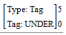

# Set Occurrence (Complex Concordance)

*Using Tools › Texts & Words tools › Complex Concordance*

When you [specify](Specify_Complex_Concordance_criteria.md) criteria, you can specify a range of occurrences so that results must occur between (and including) the minimum and maximum numbers you choose.

1.  Right-click the criteria for which you will set a range

2.  **Maximum**: Select a number or **\<infinite\>**.

3.  **Minimum**: Select a number between **0** and **9**.

4.  Make sure the **Minimum** value is less than or equal to the **Maximum** value, and then click **OK**.

    - The values you set appear as a superscript and subscript on the side of the tall square brackets that surround the criteria. Example:\
      

5.  Continue to [specify complex concordance criteria](Specify_Complex_Concordance_criteria.md).

## Related topics
[Complex Concordance overview](Complex_Concordance_overview.md)
