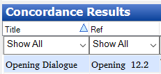

# Manually specify concordance criteria

*Using Tools › Texts & Words tools › Concordance*

You [specify concordance criteria](specify_concordance_criteria.md) with **Show** commands on [context-sensitive menus](../../../Basic_Tasks/Show_data/Context_sens_menus.md) when working outside of the **Concordance** tool (or with the [Find Wordform](../../../User_Interface/Menus/Edit/Find_wordform.md) feature). **See also:** [Show data overview](../../../Basic_Tasks/Show_data/Show_data_overview.md).

In contrast, you can *manually* specify criteria, but manually-entered criteria can yield results that are *less specific*. To enter criteria manually, do the following steps:

1.  In the **Navigation Pane**, click **Texts & Words**, and then click [Concordance](Concordance_overview.md).

2.  In the **Search** **in the line** box, select **Baseline**, **Tagging** or a [word focus box](../Interlinear_Texts/Word_Focus_Box_examples.md) line (**Word**, **Morphemes**, **Word Cat**, and so on).

    Lines and the writing systems they display are controlled by the [Configure Interlinear lines](../../../User_Interface/Menus/Tools/Configure_interlinear_lines_dialog_box.md) dialog box, except for **Baseline**.\
    See  **Important** below.

3.  In the **Writing System** box, select the writing system in which you want to search, *if* the desired writing system is not *already* selected.

    The writing systems available for selection are limited to those used by the selected line. The *default* vernacular or *default* analysis [writing system](../../../Advanced_Tasks/Writing_Systems/Add_a_new_writing_system/About_Writing_Systems.md) is automatically selected.

4.  If you see a **For the text** box, enter the text content (word, characters, diacritics, and so on) that you want to find, and then select the following as necessary:

    - **Match Case**, *if* you want text to match *only if* it has the same capitalization as the search text (for writing systems that have case distinctions)

    - **Match diacritics**, *if* you want text to match *only if* it has the same diacritics as the search text (for writing systems that have diacritics)

    - **Anywhere**, *if* you want text to match *anywhere* in words used in a text

    - **At end**, *if* you want text to match only at the *end* of words used in the texts (such as for suffixes). Not available with **Baseline**.

    - **At start**, *if* you want text to match only at the beginning of words used in the texts (such as prefixes). Not available with **Baseline**.

    - **Whole item**, *if* you want text to match only entire words (or morphemes, lex entries and so on), but not parts of words (or morphemes, lex entries and so on). Not available with **Baseline**.

    - **Use Regular Expressions**, *if* you will construct a [regular expression](../../../Basic_Tasks/Filtering_data/About_Regular_Expressions.md). Click  to access regular expression [metacharacters](../../../Basic_Tasks/Filtering_data/Regular_Expression_Metacharacters_table.md) and [operators](../../../Basic_Tasks/Filtering_data/Regular_Expression_Operators_table.md) you can use as you [construct](../../../Basic_Tasks/Filtering_data/Using_regular_expressions_assistance.md) your regular expression.

5.  If you see a **For the category** box, select the category (which was used in the **Lex Gram Info line** or in the **Word Cat** line).

6.  If you see a **For the tag** box, select the tag (which was used in the [Tagging](../Interlinear_Texts/Tagging_a_text.md) tab).

7.  Click **Search**.

    The match (results of the search) appear in the **Concordance Results** pane. The **Title** and **Ref** [columns](../Word_list_columns.md) shows the text (title or abbreviation [metadata](../Interlinear_Texts/Enter_text_metadata.md)) and numerical reference to the *paragraph* and *sentence* that contains the match.

    **Example:**

    

    In the example, the **Ref** columns shows matches in the `Opening` text, in paragraph 12, sentence 2.

    The **Occurrence** column shows the match in the context of the sentences where it was found.

    You can [configure columns](../../../Basic_Tasks/Configure_Columns/Configure_Columns_overview.md), [sort](../../../Basic_Tasks/Sorting_data/Sorting_data_overview.md) and [filter](../../../Basic_Tasks/Filtering_data/filtering_data_overview.md) the results to further refine the results in this pane. For example, you can filter on the **Title** column to limit the results to particular texts.

8.  Click a row in the **Concordance Results** to display that occurrence of the match in the **Full Context** pane.

    The **Full Context** pane features match those of the [Interlinear Texts](../Interlinear_Texts/texts_edit_overview.md).

> [!IMPORTANT]
>
> - About **Baseline**:
>
> - - Use **Baseline** to search for *punctuation*, because no punctuation is included in [word focus boxes](../Interlinear_Texts/Word_Focus_Box_examples.md). You may also prefer to use **Baseline** to search for phrases ([linked words](../Interlinear_Texts/Link_words_in_phrase.md)).
>
>     **Baseline** uses only the search criteria **Anywhere** or **Use Regular Expressions**, as it searches paragraphs *not* particular items as seen in word focus boxes.
>
>   - Correspondingly, if you search with **Baseline** and then [filter](../../../Basic_Tasks/Filtering_data/filtering_data_overview.md) the results in the **Occurrence** column, the filter criteria **Whole item**, **At end** and **At start** will usually filter out *all* the results. This is because with **Baseline**, these will search the paragraph, not individual items in word focus boxes. So, for example, **At start** now means the start of the paragraph, *not* the start of words, morphemes, and so on.

## Related topics
[Concordance overview](Concordance_overview.md)

[Display text in an interlinear view](../Interlinear_Texts/Display_text_in_an_interlinear_view.md)

[Find word](../../../User_Interface/Menus/Edit/Find_wordform.md)

[Show in Concordance from interlinearized text](../../../Basic_Tasks/Show_data/Show_Concordance_of_from_Interlinear_view.md)
