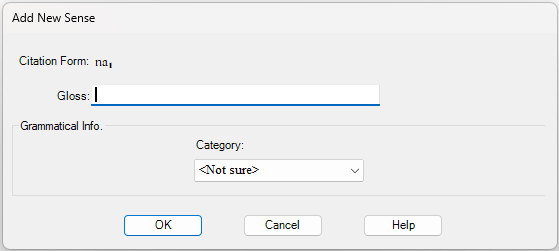
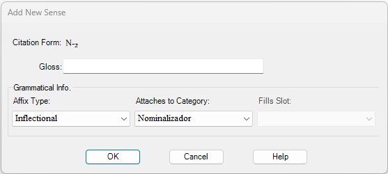

# Add New Sense dialog box graphic

*Using Tools › Texts & Words tools › Interlinear Texts*

While you manually [analyze a word in a text](Analyze_Text_overview.md), you can [add a new sense](add_a_new_sense.md) to an *existing* lexical entry and link it to the current word. When you do this, you use the **Add New Sense** dialog box. It can contain different features depending on the current word or morpheme.

### Example - Stem or Root

### Example - Affix

- The **Fills Slot** box is unavailable when no slots have been specified for the selected category. The `Tab` key will *not* put the focus in the unavailable box. To activate the box, [insert an affix slot](../../Grammar_tools/Category_Edit/Insert_an_Affix_Slot.md) for the selected category.

## Related topics
[Add a new sense](add_a_new_sense.md)

[Insert a sense or subsense in an entry](../../Lexicon_tools/Lexicon_Edit/Insert_a_sense_or_subsense_in_an_entry.md)

[Interlinear Texts overview](texts_edit_overview.md)
