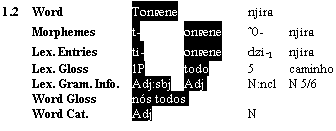

# Copy and paste interlinear

*Using Tools › Texts & Words tools › Interlinear Texts*

You can select and copy an interlinearized sentence or a portion of a sentence and then paste it into a word processor. The pasted data will appear in a tab-delimited format.

1.  In **Texts & Words**, select the text that has the words you want to copy.

2.  Click the **Print View** tab.

3.  [Configure the interlinear lines](../../../User_Interface/Menus/Tools/Configure_interlinear_lines_dialog_box.md) to show those lines you want to copy using the desired writing systems.

4.  Select the word or words you want to copy, and then do one of the following:

<!-- -->

1.  - On the **Edit** menu, click **Copy**.

    - Press the [shortcut keys](../../../User_Interface/Shortcuts/shortcut_keys_Texts_Words_tools.md) `Ctrl+C`.

<!-- -->

5.  In the word processor, paste the content from the clipboard. You can then use features in the word processor to make the data appear in a table.

### Example

In this example, the first word is selected.

> [!NOTE]
>
> - You can select content in other tabs, besides the **Print View** tab, but the results can be less consistent as the selection is not as easy.
>
> - You can select entire sentences, including the **Free**, **Lit** or **Note** lines, but this may prove to be more difficult to work with in the word processor.

## Related topics
[Interlinear Texts overview](texts_edit_overview.md)
