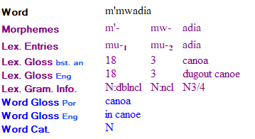

# Create new lexical entry from interlinear view

*Using Tools › Texts & Words tools › Interlinear Texts*

While you manually [analyze a word in a text](Analyze_Text_overview.md), you can create a new entry in the [Lexicon](../../Lexicon_tools/Lexicon_overview.md).

** **Caution**

- Review the important information in [Baseline Text writing systems](baseline_text_writing_systems.md) *before* you create new lexical entries. If you are not careful with the writing systems settings, you can cause the lexeme forms to appear in the wrong line of the lexical entry or other complications.

1.  [Display the text in an interlinear view](Display_text_in_an_interlinear_view.md).

2.  For the first word in a sentence or for other situations such as proper names, use the down arrow  to [specify the case](Specify_case.md).

If you use a form with the wrong case or you edit the morpheme in this line, you may create an unwanted allomorph in the entry.

3.  In the **Lex Entries** line, click the down arrow , and select **Create New Entry**.

    The **New Entry** dialog box appears. The **Note** below describes some functionality you should know.

    For help with this dialog box, see [Create a lexical entry](../../Lexicon_tools/Lexicon_Edit/Create_a_lexical_entry.md) or [Shortcut keys for use with dialog boxes](../../../User_Interface/Shortcuts/shortcut_keys_for_use_with_dialog_boxes.md).

4.  When you have specified the various items in the dialog box, do *one* of the following:

    - Click **Create**.

    - Select an existing entry in the **Similar Entries** pane, and then click the **Add allomorph to similar entry** link.

    An entry or allomorph is added to the Lexicon. The gloss and grammatical properties that you specified in the dialog box appear in the applicable lines in the [word focus box](Word_Focus_Box_examples.md).

    - For a *complex form*, the **Choose Lexical Entry or Sense** dialog box appears so you can choose the first entry or sense that is a [component](../../Lexicon_tools/Lexicon_Edit/Choose_components_for_Components_field.md) of the complex form. In this case, choose an entry or sense, and then click **OK**.

> [!NOTE]
>
> - If the word has only one morpheme, or if there are multiple morphemes but the current one is the first stem, then any existing **Word Gloss** line content is copied into the **Gloss** box in the **New Entry** dialog box as a proposed lexical gloss. It appears in the line for the writing system used in the **Word Gloss** line. If the existing word gloss came from a program [suggestion](interlinear_views_colors.md), whatever you type over that proposed lexical gloss appears as the **Word Gloss**, but the previous content remains available for selection in the **Word Gloss** field list.
>
> - If there are multiple morphemes and the current one is not a stem, then there is no proposal in the **Gloss** box, nor any replacement of an existing word gloss.
>
> <!-- -->
>
> - If your project has multiple vernacular or multiple analysis writing systems, you may want to [configure interlinear lines](../../../User_Interface/Menus/Tools/Configure_interlinear_lines_dialog_box.md) so that each writing system appears in each line, as appropriate. This helps you know the writing systems each line uses. For example, the picture below shows the writing systems used with the **Lex Gloss** and **Word Gloss** lines.
>
> 

## Related topics
[Analyzing Text overview](Analyze_Text_overview.md)

[Interlinear Texts overview](texts_edit_overview.md)

[Select the lexical sense for a morpheme](Select_the_lexical_sense_for_a_morpheme.md)

[Shortcut keys: Texts & Words tools](../../../User_Interface/Shortcuts/shortcut_keys_Texts_Words_tools.md)
