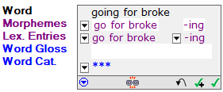

# Insert or remove morpheme breaks

*Using Tools › Texts & Words tools › Interlinear Texts*

## Word Analyses tool

In [Word Analyses](../Word_Analyses/Word_Analyses_overview.md), you can use the **Insert Morpheme Breaks** dialog box to add a new analysis to the selected word. It will appear under **User Approved (Analyses)**.

- [Add the new approved analysis](../Word_Analyses/create_new_approved_analysis.md).

## Other Texts & Words tools

1.  [Display the text in an interlinear view](Display_text_in_an_interlinear_view.md).

2.  Select the word you will edit.

    The word appears in a [word focus box](Word_Focus_Box_examples.md).

3.  In the **Morphemes** line, click the down arrow , and then select **Edit Morph Breaks**.

    The **Insert Morpheme Breaks** dialog box appears.

    The **Break Characters** area of the dialog box lists and describes the use of break characters. For additional help with a circumfix or infix, see [Morpheme Break examples](Morpheme_Break_examples.md).

4.  In the **Word** box, do one of the following:

    - Type a space to separate the morphemes, and then type an appropriate *break character* (also referred to as *token*) to indicate the morpheme type.

    - For a lexical phrase, such as an [idiom](../../../User_Interface/Field_Descriptions/Lists/Complex_Form_Types_flds/Idiom_entry_type.md), you may need to enter *two* spaces or edit the phrase in the **Word** box. See **Note 1** below.

    - To insert a break between diacritics or between a diacritic and its base character, see **Note 2** below.

    - Remove an existing space and *break character*.

5.  Click **OK**.

    The focus box for the selected word changes to show one column for each morpheme.

6.  When you are finished, [move to another word](../../../User_Interface/Menus/Data/Data_overview.md).

###  Note 1

- To insert a morpheme break between stems or roots in a *phrase*, click where you want the break to occur and then press the spacebar two times.

- When you [analyze a lexical phrase](Analyzing_a_phrase.md) with one or more affixes, you may need to manually edit the phrase to isolate the affixes from the other words or morphemes.\
  For example, consider the English idiom `go for broke`*.* If `going for broke` also appeared in a text, you may want to analyze it as two morphemes; "`go for broke`" and "**-ing**." In this case, you can do this in the **Word** box:

  - Select and cut (`Ctrl+X`) the `ing` suffix from the word **going**. Click after the word `broke`. Press the space bar, and then type a **-** (dash) as the *break character*. Paste (**Ctrl+V**) the `ing` after the dash, so it appears like this in the **Word** box:\
    \
    Click **OK** to close the dialog box. Then, it will then appear like this in the **Analyze** tab:\
    

In this case, Language Explorer adds a *second* space between the morphemes. So if you want to change the morpheme breaks, remember that you may have *two* spaces to delete.

###  Note 2

- The shortcut keys ("Function" keys) **F7** and **F8** can help you move a split insertion point (split between diacritics and base characters). [About Font Features](../../../Advanced_Tasks/Writing_Systems/Modifying_a_Writing_System/about_font_features.md) has more information.

> [!TIP]
>
> - You can also insert or remove morpheme breaks directly in the **Morphemes** line—*without opening the dialog box*. However, you may want to use the dialog box for phrases that have affixes.
>
>   For example, to insert a morpheme break, click (or use the `Tab` key and arrow keys) to put the insertion point at the desired position in the word. Type a space to separate the morphemes, and then type an appropriate *break character* (*token*) to indicate the morpheme type.
>
> - The topic [Change the tokens for morpheme types](../../Lists_tools/Change_the_tokens_for_morpheme_types.md) gives steps to change the tokens used as break characters. The changes are reflected in the **Break Characters** area.

## Related topics
[Analyze Text overview](Analyze_Text_overview.md)

[Interlinear Texts overview](texts_edit_overview.md)

[Texts & Words overview](../Texts_and_Words_overview.md)
