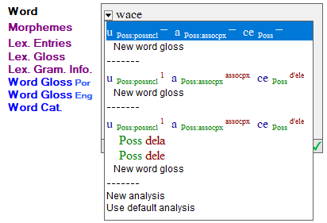
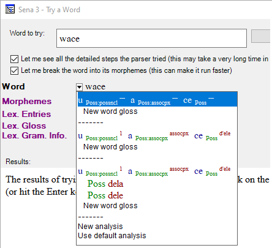
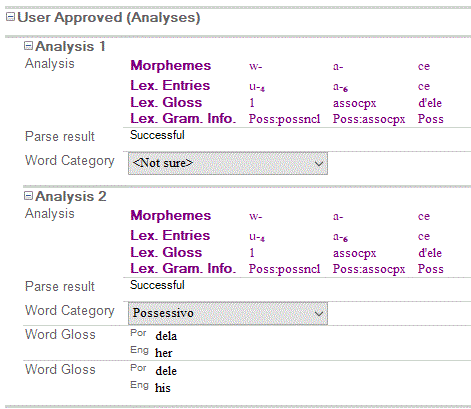

# Select existing analysis

*Using Tools › Texts & Words tools › Interlinear Texts*

While you work with a text in the **Analyze** tab or in the **Try a Word** dialog box, you can select an existing analysis for a word or morpheme. You can select the particular analysis, *with or without* also selecting a particular word gloss.

1.  Do one of the following:

    - [Display the text in an interlinear view](Display_text_in_an_interlinear_view.md).

    - [Open](../../../User_Interface/Menus/Parser/Parser_menu_overview.md) the [Try a Word](../../../User_Interface/Menus/Parser/Try_a_word.md) dialog box, and then select the **Let me break the word into its morphemes** check box.

2.  Do one of the following:

    - If the desired word is not already in a [word focus box](Word_Focus_Box_examples.md), click that word.

    - Type it in the **Word to try** box.

3.  In the **Word** line, click the down arrow  to display a drop-down list (see **Example** below).

4.  Consider the following, and then click an existing analysis:

    - If you click a row that is indented under a particular analysis (such as **Poss** **dela** in the example below), then you have selected that analysis *and* that word gloss.

    - If you click the row that shows *only* the morphemes (or word), lexical glosses and grammatical info (at the top of *each* section), then you need to [specify a word gloss](specify_the_word_gloss.md) as a subsequent task.

      **Note:** In the **Try a Word** dialog box, **New word gloss** does not enable you to add a new word gloss.

## Examples

The three pictures below all show the Sena word `wace`.

It has two analyses which are separated by a dashed line (**------**). The analyses appear for selection in the **Word** line:

- [Word focus box](Word_Focus_Box_examples.md) **Word** line list:

- [Try a Word](../../../User_Interface/Menus/Parser/Try_a_word.md) **Word** line list:

- **Word Analyses** view of these analyses:

## Related topics
[Parsing words overview](../../../User_Interface/Menus/Parser/Parsing_words_overview.md)

[Move to another word](../../../User_Interface/Menus/Data/Data_overview.md)

[Texts & Words overview](../Texts_and_Words_overview.md)
