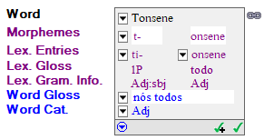
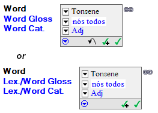
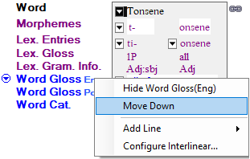
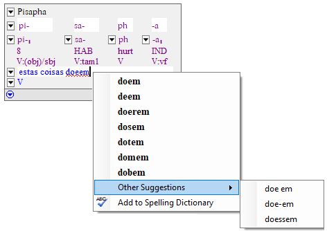
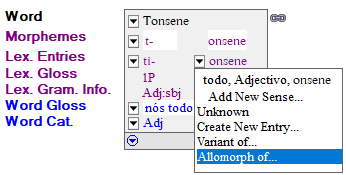

# Word focus box examples

*Using Tools › Texts & Words tools › Interlinear Texts*

In [Texts & Words](../Texts_and_Words_overview.md), when you [display](Display_text_in_an_interlinear_view.md) words in a **Gloss** or **Analyze** tab, the selected word appears in a box, referred to as the *word focus box* or simply *focus box*.

[Configure Interlinear Lines](../../../User_Interface/Menus/Tools/Configure_interlinear_lines_dialog_box.md) to specify which lines to display and their order in the word focus box.

## Examples

- **Analyze** tab: Focus box with default lines displayed

- **Gloss** tab: Focus box with default lines displayed

[Add Words to Lexicon](About_Add_Words_to_Lexicon.md) adds **Lex./** to the line labels in the **Gloss** tab.

### Right-click:

- Lines to use [Show](../../../Basic_Tasks/Show_data/Show_data_overview.md) commands in a [context-sensitive menu](../../../Basic_Tasks/Show_data/Context_sens_menus.md):

- Words that have [spell checking flags](../../../Basic_Tasks/Spell_Checking/Spell_checking_overview.md), such as this example:

## Click:

-  on a line to see a list of items for that line, such as this example:

The **Word** line  appears *only* when the word has *one or more* analysis.

The **Word Gloss** line  appears *only* after the analysis has at least one word gloss. Type the first word gloss directly into the box. After that,  appears so you can select **New word gloss** or a word gloss (if two or more exist).

-  to [link words in a phrase](Link_words_in_phrase.md) *or*  to [break a phrase](Break_a_phrase.md) into words.

-  to undo *manual* changes.

-  to approve the analysis for this occurrence plus all other occurrences of same word in the current text. Focus moves to next word or phrase.

-  to approve the analysis for this occurrence, and then move forward.

-  to display a menu and submenus (similar to some [Data](../../../User_Interface/Menus/Data/Data_overview.md) menu commands).

**Related Topics**

[About Gloss and Analyze tabs](About_Gloss_Analyze_tabs.md)

[Analyze Text overview](Analyze_Text_overview.md)

[Create new lexical entry from an interlinear view](Create_new_lex_entry_interlinear_view.md)

[FieldWorks Project Properties, Writing Systems tab](../../../Advanced_Tasks/Writing_Systems/Add_a_new_writing_system/About_Writing_Systems.md)

[Insert or remove morpheme breaks](Insert_or_remove_morpheme_breaks.md)

[Interlinear Texts overview](texts_edit_overview.md)

[Interlinear view background colors](interlinear_views_colors.md)

[Show data overview](../../../Basic_Tasks/Show_data/Show_data_overview.md)

[Shortcut keys: Texts & Words tools](../../../User_Interface/Shortcuts/shortcut_keys_Texts_Words_tools.md)
