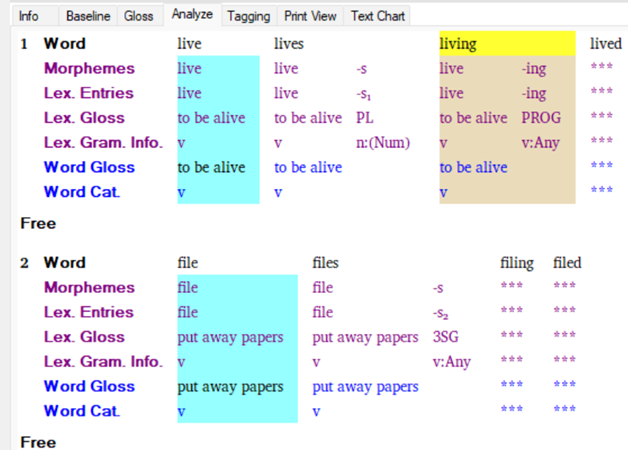
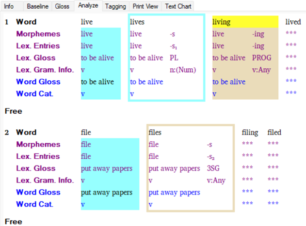

# Interlinear views colors

*Using Tools › Texts & Words tools › Interlinear Texts*

In a **Gloss**, `Analyze` or **Text Chart** tab, you will see different background colors or outline (border) colors. You may also see these colors in **Word Analyses**. [About Interlinear Modes](../../../User_Interface/Menus/Parser/About_Parser_Modes.md) describes the **Text Glossing** and **Parsing Development** modes.

<table width="100%">
<tbody>
<tr>
<th style="width: 84%">Text Glossing mode</th>
</tr>
&#10;<tr>
<td style="width: 84%">
A white background indicates a user has approved the analysis in the current instance.

A blue or tan background means there is a possible analysis that has <em>not been approved</em> by the user in the current instance. Possible analyses can come from a previous user approval, a parser approval, or an entry from the lexicon. Tan is used to indicate a successful multi-morphemic analysis by the <a href="../../../User_Interface/Menus/Parser/Parsing_words_overview.md">parser</a>.

<ul>
<li>
If the user has <em>not </em>approved this occurrence of this word, there are three options:
</li>
<li>
blue (the user approved this word somewhere else, or the whole word is in the lexicon),
</li>
<li>
tan (the <a href="../../../User_Interface/Menus/Parser/Parsing_words_overview.md">parser</a> has an analysis, and the user has not approved this word anywhere else, and the whole word is not in the lexicon), or
</li>
<li>
white with asterisks (no suggestions). 
</li>
<li>
If the user has approved this specific occurrence of this word, the background is white.
</li>
</ul></td>
</tr>
</tbody>
</table>

|                          |
|--------------------------|
| Parsing Development mode |

<table width="100%">
<tbody>
<tr>
<td style="width: 84%"><ol>
<li>
If the user has <em>not </em>approved this specific word, the whole bundle might have shaded background of tan or blue, or white (with asterisks***).
</li>
</ol>
<ul>
<li>
 A tan background means the <a href="../../../User_Interface/Menus/Parser/Parsing_words_overview.md">parser</a> was able to parse it successfully (regardless of the user's opinion).
</li>
<li>
A blue background means either that the user has approved this word somewhere else, or that the entire word exists in the lexicon.
</li>
<li>
A white background with asterisks means there is no suggestion from either the parser or the user or the lexicon.
</li>
</ul>
<ol start="2">
<li>
If the user has approved this instance of the word, then there will be a rectangular outline (border) around the bundle.
</li>
</ol>
<ul>
<li>
Light blue means the parser failed to parse it, and the user approved it.
</li>
<li>
Tan means the parser was able to parse it successfully.
</li>
</ul></td>
</tr>
</tbody>
</table>

## Examples

- **Text Glossing** mode is selected:

- **Parsing Development** mode is selected:

## Check marks and Xs

Colors: Yellow on the **Word** line means there are more than one analyses of the word, so you can choose which analysis to use. Blue informs you that the results are from a user. Tan informs you that the results are from a parser.

A check mark indicates an approval and a red X indicates a disapproval. (In [Word Analyses](../Word_Analyses/Word_Analyses_overview.md), the [Parse result](../../../User_Interface/Field_Descriptions/Texts_&_Words/Parse_result_field.md) field would show **Successful** or **Failure**). Neither a check mark or X indicates that the analysis has not been tested yet by a parser, and the user opinion is **Unknown**.

> [!TIP]
>
> - As noted above, the tan color indicates what the parser offered *the last time it ran*. The light blue indicates the user's opinion.
>
> - Here is another way to understand the difference between *manually* [analyzing](Analyze_Text_overview.md) words and using a computational [parser](../../../User_Interface/Menus/Parser/Parsing_words_overview.md) in the **Text Glossing** [mode](../../../User_Interface/Menus/Parser/About_Parser_Modes.md):
>
> <!-- -->
>
> - - Manual (user) analyses: You make all the morpheme breaks yourself and the Language Explorer program suggests analyses you have made before when the very same word recurs.
>
>   - Computational parser: The parser suggests possible analyses for words that are brand new, if the lexicon has entries for each morpheme.
>
> - Example: Suppose *plays* and *walked* were analyzed (parsed) and that all four morphemes exist as lexical entries.
>
> - Without a parser running, Language Explorer will propose suggestions for future occurrences of *plays* and *walked* (light blue background color).
>
> - With a parser running, when you subsequently encounter *played* and *walks*, the parser will produce analysis suggestions (tan background color) for these *new words*.
>
> <!-- -->
>
> - When both kinds of suggestions are available for a word, the program will suggest a user analysis (manual) in preference to a *parser-*produced analysis.
>
> - When more than one user analyses are available for a word, the program will suggest the one that is most frequently used.
>
> - Your colors may appear slightly differently due to different screens or screen settings.

## Related topics
[Analyze Text overview](Analyze_Text_overview.md)

[Assign analysis usage](../Word_Analyses/Assign_analysis_usage.md)

[Gloss a text](specify_the_word_gloss.md)

[Interlinear Texts overview](texts_edit_overview.md)
