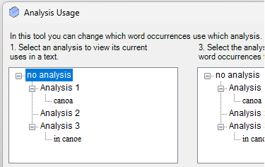
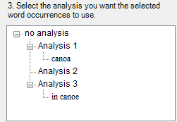

# Analysis Usage box details

*Using Tools › Texts & Words tools › Word Analyses*

Here is a simple example of sample content in boxes *1* and **3** of the **Analysis Usage** dialog box. Of course, you will see fewer or more analyses and word glosses for wordforms (words) in your texts. The effects of selecting the various items found at different *hierarchical levels* are described below. Notice that the contents of box **1** and box **3** are always identical.

### Example:

### Box 1 content

Since box **2** shows a concordance of whatever is selected in box **1**, selecting different items in box **1** *displays* *different* *content* in box **2**:

- Selecting **no analysis** displays, in box `2`, occurrences of the current word that have no analysis.

- Selecting **Analysis 1**, **Analysis 2** or **Analysis 3** displays occurrences of the current word that have the selected analysis but do *not* also have the associated word gloss.

- Selecting the word gloss **canoa** displays occurrences of the current word that have **Analysis 2** assigned *and* that have **canoa** as a word gloss. Similarly, selecting **in canoe** displays occurrences with **Analysis 3** assigned *and* the word gloss **in canoe**.

### **Box** **3** **content**

Box **3** is where you choose the analysis you want to assign to the [occurrences selected](Assign_analysis_usage.md) in box **2**. So, selecting different items results in different changes to your data when you click the **Assign** button (**4.**). The results of your choice will appear in box **2**, *but typically not until you have closed this dialog and opened it again*.

Selecting different items in box **3** *yields* *different* *results* in the occurrences you selected in box **2**, after you click **Assign**:

- Selecting **no analysis** removes the analysis from selected occurrences.

  When you view those occurrences in the **Gloss** or **Analyze** [tabs](../Interlinear_Texts/Analyze_Text_overview.md), an analysis will often appear with either a blue or tan [background color](../Interlinear_Texts/interlinear_views_colors.md) (program- or parser-proposed analyses).

- Selecting **Analysis 1**, **Analysis 2** or **Analysis 3** replaces the selected occurrences with the analysis selected in box **3**, but *without* any word gloss. So in this example, if you selected **Analysis 2**, that analysis is assigned, but **canoa** would *not* appear in the **Word Gloss** field for those occurrences.

- Selecting **canoa** replaces the selected occurrences with **Analysis 2** *including* the word gloss **canoa**.

> [!TIP]
>
> - The status bar at the bottom of this dialog box displays the following:
>
> - - A progress indicator appears when loading box 2 (the concordance of selected analysis) and after you click **Assign**.
>
>   - **Filtered** appears with a yellow background if you have a filter in a box 2 column.
>
>   - The current/total number of occurrences listed in box 2.

## Related topics
[Word Analyses overview](Word_Analyses_overview.md)
