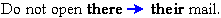

# Change occurrences of a spelling

*Using Tools › Texts & Words tools › Word Analyses › Change Spelling*

You use the **Change Spelling** dialog box to change the spelling of a wordform (word). A spelling change may *correct* words that were spelled incorrectly or it may *merge* (or exchange) wordforms as described in the **Tip** below.

1.  [Display the word](Open_Change_Spelling_dialog_box.md) in the **Change Spelling** dialog box.

2.  Review the concorded occurrences.

    - If necessary, [configure the columns](../../../../Basic_Tasks/Configure_Columns/Using_Configure_Columns_dialog_box.md) in the change spelling concordance to show **Info** tab [metadata](../../Interlinear_Texts/Enter_text_metadata.md).

3.  In the left column, select the check boxes for occurrences you want to change. Clear the check boxes for those you want to leave unchanged. You can click the  button to help you make these [selections](../../Bulk_Edit_Wordforms/Bulk_Edit_Change_Spellings_selections.md).

4.  In the **New Spelling** box, type or paste a new spelling, or select an existing spelling.

5.  If you want the case of the content in the **New Spelling** box to *replace* the existing cases (capitalizations) in the **Baseline** text and [tabs](../../Interlinear_Texts/texts_edit_overview.md), clear the **Maintain existing case in the Baseline of texts** check box. Otherwise, leave it selected.

6.  Click **More** to display the [Options pane](change_spelling_overview.md), and then make selections as appropriate.

7.  For mono-morphemic words, if you do not want the lexical entry updated automatically, clear the **Update lexical entries of mono-morphemic words** check box. Otherwise, leave it selected.

8.  For multi-morphemic words, select either **Keep multi-morphemic analyses** or **Delete multi-morphemic analyses** (described in [Change Spelling overview](change_spelling_overview.md)).

9.  If there are occurrences (rows) without a check mark, the **Copy any approved analyses to the new spelling** check box is available. In this case, if you do not want to copy approved analyses to the new spelling, clear this check box. Otherwise, leave it selected.

10. Click **Preview**.

    - Review the pending changes as displayed in the change spelling concordance, and make any desired changes to the row selections there.

11. Click **Apply**.

    - The [Spelling Status field](../../../../User_Interface/Field_Descriptions/Texts_&_Words/spelling_status_field.md) updates to **Correct** for the new spelling. You should verify the spelling status that is [specified](../Specify_spelling_status.md) for the original spelling: If all occurrences were changed, the **Incorrect** is specified. If some occurrences were changed, the previous status is retained.

12. If there were occurrences without a check mark, click  in the dialog box to refresh the change spelling concordance. Then only occurrences that were not changed are displayed. These are selected automatically so you can do any of the steps above again for those occurrences.

13. Review and change lexical entries or word [analyses](../../Interlinear_Texts/Analyze_Text_overview.md) as necessary. If the previous spelling of the word shows [Number in Corpus](../../Word_list_columns.md) is now **0** (zero), you may want to [delete it](../Delete_a_wordform.md).

> [!TIP]
>
> Consider the following example regarding how the **Change Spelling** dialog box can merge or exchange spellings.
>
> **Example:** In some texts (English), suppose that occasionally the word "there" was errantly used instead of "their."
>
> - Display the word "there" in the **Change Spelling** dialog box to see a concordance of all occurrences of that spelling.
>
> - Select only occurrences that you need to change from "there" to "their".
>
> - Enter "their" in the **New Spelling** box. The preview may appear like this:
>
> 
>
> - After you click **Apply**, those occurrences are changed in the **Baseline** and subsequent tabs (**Gloss**, **Analyze** and so on).
>
> You may need to carefully consider which **Options** criteria are appropriate in each case.

## Related topics
[Analyze Text overview](../../Interlinear_Texts/Analyze_Text_overview.md)

[Change spelling overview](change_spelling_overview.md)

[Find and Replace Text](../../../../User_Interface/Menus/Edit/Find_and_Replace_Text.md)

[Specify spelling status](../Specify_spelling_status.md)

[Texts & Words overview](../../Texts_and_Words_overview.md)
