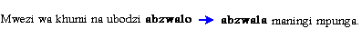

# Change spelling overview

*Using Tools › Texts & Words tools › Word Analyses › Change Spelling*

Use the **Change Spelling** dialog box to [change occurrences of a spelling](change_occurrences_of_a_spelling.md) for words that appear in the [word list](../../Word_list_overview.md). A spelling change may *correct* a misspelled word or *merge* (or *exchange*) existing words.

## About the Change Spelling dialog box

- The main pane is a concordance of all occurrences of the word displayed in the **Wordform Analyses** pane when you opened this dialog box. This pane is referred to as the *change spelling concordance* or just *concordance.*

  - This concordance is *empty* if the **Number in Corpus** [column](../../Word_list_columns.md) shows **0** (zero) for the word.

  - The **Occurrence** column shows occurrences of the word in a **bold** font.

  - Selected rows () are changed; cleared rows () are not. Click , and then click a command to [select](../../Bulk_Edit_Wordforms/Bulk_Edit_Change_Spellings_selections.md) or clear all rows (optional). You can select or clear rows at any time before you click **Apply**, including after you click **Preview**.

  - Click  to [configure columns](../../../../Basic_Tasks/Configure_Columns/Configure_Columns_overview.md) in the concordance. You can display **Info** tab [metadata](../../Interlinear_Texts/Enter_text_metadata.md), such as Genres.

- The **New Spelling** box allows you to *type* or *paste* the new spelling or to *select* an existing spelling.

- **Previe****w** displays the pending changes in the **Occurrence** column. A colored arrow separates the original and new spelling, as shown in these examples:

\

(The first example is a spelling correction; the second is a merge or exchange.)

The **Preview** button then changes to **Clear** so you can remove the preview, if necessary.

- The **Maintain existing case in the Baseline of texts** check box allows you to retain all existing cases (capitalizations) used in the **Baseline** text and subsequent [tabs](../../Interlinear_Texts/texts_edit_overview.md) (**Gloss**, **Analyze** and so on). If the check box is cleared, the case of the content in the **New Spelling** box is used.

- **Apply** commits the pending changes. The change spelling concordance then displays both changed and unchanged occurrences.

  - After you click **Apply**, the refresh button  in the dialog box removes the changed occurrences from the concordance. This leaves only any unchanged occurrences displayed. All of them are automatically selected so you can more easily see unchanged occurrences and apply a different spelling if necessary.

- **Close** closes this dialog box.

- **More** displays the **Options** pane with additional criteria you can use.

  - For *mono*-morphemic words that are in the dictionary (**Lexicon**), select or clear **Update lexical entries of mono-morphemic changes**.

    If selected, the lexical entry for the mono-morphemic word is changed to reflect the new spelling.

    If cleared, you will need to manually edit the lexical entry.

    (For multi-morphemic words, this feature is ignored as it is typically unclear which morpheme should change.)

  - For *multi-*morphemic words, select **Keep multi-morphemic analyses** *or* **Delete multi-morphemic analyses**. In either case, the [analyses](../../Interlinear_Texts/Analyze_Text_overview.md) of multi-morphemic words will need changes.

    If you *keep* them, you can see the previous analyses and make changes as needed, using the convenient [Show in](../../../../Basic_Tasks/Show_data/Show_data_overview.md) right-click menu commands.

    If you *delete* them, you need to completely analyze the new spelling.

  - **Co****py any app****roved analyses to the new spelling** is available only when there are occurrences in the change spelling concordance that do not have a check mark.

    If selected, copies of existing analyses are included with the new spellings (available for you to change).

    If cleared, you need to completely analyze the new spelling.

> [!TIP]
>
> - You should [back up](../../../../User_Interface/Menus/File/Backup_and_Restore/Back_up_this_Project.md) the language project *before* you use the **Change Spelling** dialog box. Then, if necessary, you can [restore](../../../../User_Interface/Menus/File/Backup_and_Restore/Restore_a_project.md) the language project.

## Related topics
[Change occurrences of a spelling](change_occurrences_of_a_spelling.md)

[Find and Replace text](../../../../User_Interface/Menus/Edit/Find_and_Replace_Text.md)

[Open the Change Spelling dialog box](Open_Change_Spelling_dialog_box.md)

[Specify spelling status](../Specify_spelling_status.md)

[Texts and Words overview](../../Texts_and_Words_overview.md)

[Word Analyses overview](../Word_Analyses_overview.md)
