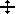

# Word List Concordance overview

*Using Tools › Texts & Words tools › Word List Concordance*

**Word List Concordance** is in the [Navigation Pane](../../../User_Interface/Toolbars/Navigation/Navigation_Pane_graphic.md) when [Texts & Words](../Texts_and_Words_overview.md) is selected. The window normally has two panes:

- The **Wordforms** (center) pane is a view of the [word list](../Word_list_overview.md), like [Word Analyses](../Word_Analyses/Word_Analyses_overview.md).

- The **Concordance** (right) pane has a top and a bottom portion.

  - The top portion shows the concordance of the current word. Each row is one occurrence of that word. The **Occurrence** [column](../Word_list_columns.md) displays the current word in a bold font; words surrounding it are shown in the normal font.

  - The bottom portion displays [tabs](../Interlinear_Texts/texts_edit_overview.md), like **Interlinear Texts**, to show each occurrence in a larger context. You can work with the words in the text in these tabs.

### Using **Word List Concordance**

- You can [configure columns](../../../Basic_Tasks/Configure_Columns/Configure_Columns_overview.md), [sort](../../../Basic_Tasks/Sorting_data/Sort_Texts_Words.md), [filter](../../../Basic_Tasks/Filtering_data/filtering_data_overview.md), and [restrict values](../../../Basic_Tasks/Filtering_data/Using_Restrict_dialog_box.md) to customize the display of words, glosses, numerical values, references, genres and so on in both the **Wordforms** pane and *top* portion of the **Concordance** pane.

- In the **Wordforms** pane, click a word to see all of its *occurrences* in the **Concordance** pane.

- In the **Concordance** pane, do any of the following as needed:

  - Click the area immediately above the tabs to see the drag  symbol, and then drag it up or down to change the relative sizes of the top and bottom portions of the pane.

  - Select a [tab](../Interlinear_Texts/texts_edit_overview.md).

  - Click an occurrence in the top of the pane to display it in the tab.

  - In the selected tab, do whatever [task](../Interlinear_Texts/texts_edit_overview.md) you need to do.

> [!TIP]
>
> - The [Concordance](../Concordance/Concordance_overview.md) tool is different from the **Concordance** pane. Use the tool to search for occurrences of other interlinearized content, such as words used in notes, translations, glosses, and so on.

## Related topics
[Concordance in Texts & Words](../Concordance_in_Texts_Words.md)

[Configure Interlinear Lines dialog box](../../../User_Interface/Menus/Tools/Configure_interlinear_lines_dialog_box.md)

[Configure Interlinear Lines right-click](../Interlinear_Texts/Configure_Interlinear_lines_right_click.md)

[Delete a wordform](../Word_Analyses/Delete_a_wordform.md)

[Display text in an interlinear view](../Interlinear_Texts/Display_text_in_an_interlinear_view.md)

[Find in Dictionary overview](../../../User_Interface/Menus/Tools/Find_in_Dictionary_overview.md)

[Show data overview](../../../Basic_Tasks/Show_data/Show_data_overview.md)
