# FieldWorks Writing Systems

## FieldWorks

### Writing Systems

Copyright © 2004 SIL International 

Add a Writing System to a FieldWorks project 

2 

#### Add a Writing System to a FieldWorks project

1. Click the **File** menu. 

2. Point to **Properties** . 

3. Click **Project Properties** . 

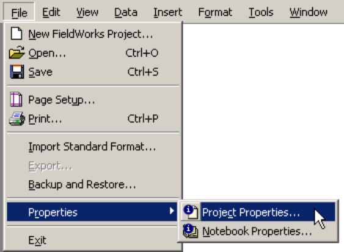

4. The **Project Properties** dialog box appears. 

5. Click the **Writing Systems** tab. 

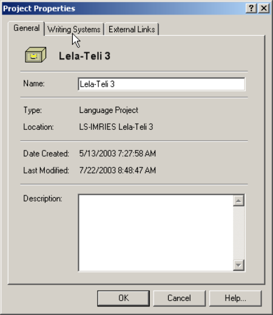

Add a Writing System to a FieldWorks project 

3 

6. The **Writings Systems** tab displays the **Vernacular** and **Analysis Writing Systems** available in the current FieldWorks project. 

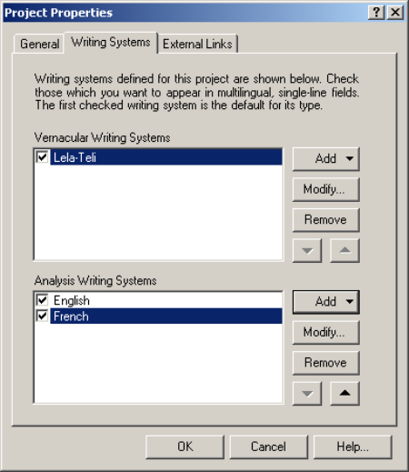

7. To add a new **Vernacular Writing System** , click **Add** . 

If you want to add a new **Analysis Writing System** , click **Add** to the right of that section of the dialog box. 

Vernacular writing systems are for different writing systems for the same language (for example, Spanish and Spanish IPA, or Chinese and Chinese PINYIN). Analysis writing systems can be any writing system used for analysis purposes. 

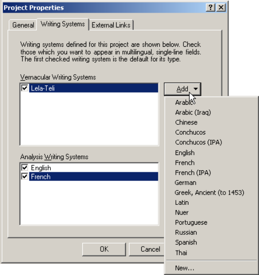

8. If the Writing System you need is in the list, select it. 

If it is _not_ in the list, you will need to use the **Writing System Wizard** to add it to a FieldWorks project. Click **New** to open the **Writing System Wizard** . 

9. If you have selected an existing Writing System from the list, click **OK** . 

#### Add a new Writing System using the Writing System Wizard

##### Language ID: Find the relevant language in the Ethnologue

You need to uniquely identify the relevant language by finding its Ethnologue code. You can either search for a language name (or part of one), a country, or an Ethnologue code in the Ethnologue database that is stored in FieldWorks. 

1. In the **Search For** box, enter the name of the language associated with the new writing system. (That is, the language you wish to type in.) 

2. Click **Search** . 

3. FieldWorks displays the matches for the name that you entered. 

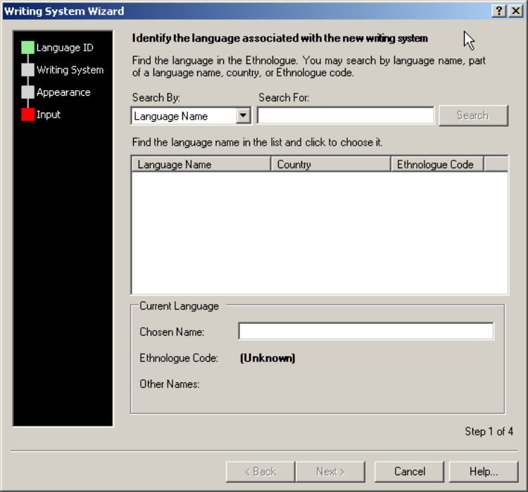

4. You see _one of several results_ based on what you typed. Find the result that matches what you see (the index on page one lists 6 possible results). If you searched by country, go to the instructions on page 10. 

###### Result: one match

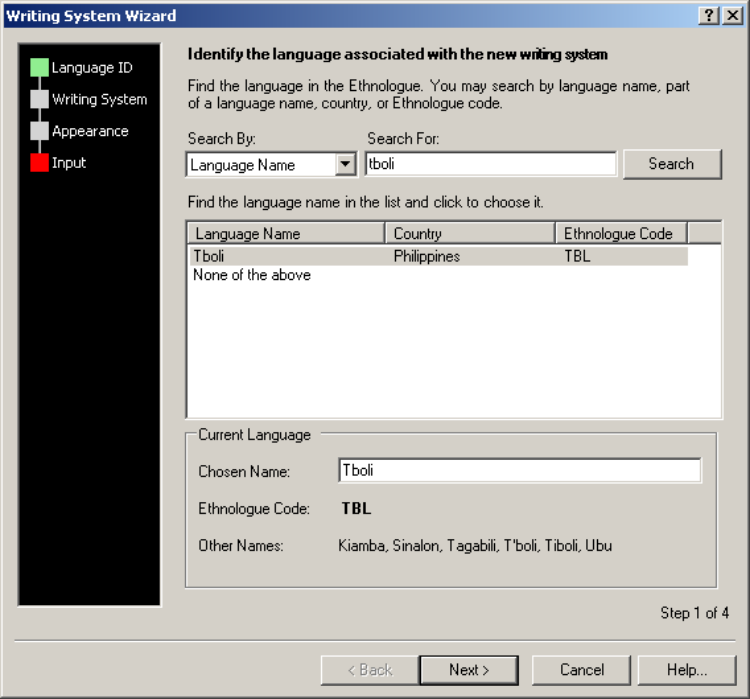

1. FieldWorks copies the information into the **Current Language** area. The name in the **Chosen Name** box is editable. 

2. Double-check that this is the right language. If it is wrong, try again but type less text in the **Search For** box. 

3. Select the language. 

4. Click **Next** . 

5. Go to **Writing System - Distinguish the Writing System** on page 12. 

###### Result: duplicate language names

The search returns more than one match for the language name, if the language name is not unique. It is important that the FieldWorks project uses the correct Ethnologue code for the language. FieldWorks lists the country where the language is spoken, and any alternate names or dialect names to help you identify the correct Ethnologue code. 

FieldWorks selects either the first exact match or the most similar match. Scroll down (if necessary) to see what other matches there are for this language name. It does not matter if you are working with a group of people not located in that very country. 

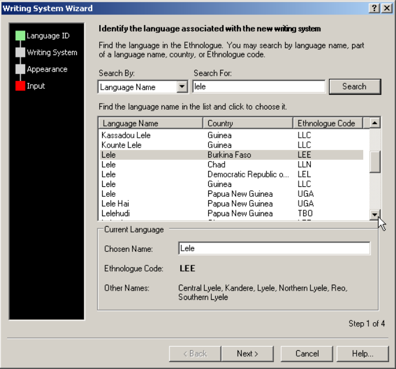

1. If Lele of Burkino Faso were the language you were making a writing system for, you would select the appropriate **Lele** in the results pane. 

2. The **Other Names** field lists the alternate names of the selected language that are recorded in the Ethnologue.  (For example, for Lele in Burkina Faso, alternate names are Central Lyele, Kandere, Lyele, Northern Lyele, Reo, and Southern Lyele.) If you know some alternate names for the language you are working with, look at the **Other Names** field to confirm that you have selected the correct language, and thus the correct Ethnologue code. (Note that there is only enough space in the dialog box to fit two lines of **Other Names** .  There may be more in the Ethnologue.) 

3. When you have selected the correct language, click **Next** . 

4. Go to **Writing System - Distinguish the Writing System** on page 12. 

###### Result: many matches

If there are many matches, you may need to scroll down. Each Ethnologue code can have multiple names for the language. It does not matter to FieldWorks which language name you choose as long as you choose the correct Ethnologue code. You choose the name that you prefer to use for the language. The country is only listed as a guide. You do not need to find the right country as long as the Ethnologue code is correct. 

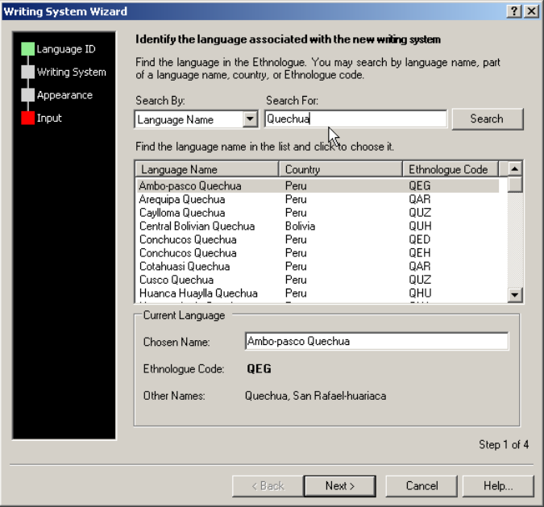

1. You can reorder the results by clicking on a column heading. Click on the **Ethnologue Code** column heading to order by the Ethnologue codes. This is helpful if you already know the code for the language. 

2. The language names are now grouped by Ethnologue code. 

3. Select **Language Name** and **Ethnologue Code** . In the example the correct code is **QED** and the name that you prefer is **Conchucos Quechua** . 

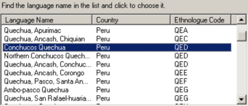

Further information about **Conchucos** Quechua is displayed in the **Current Language** area. The language name in the **Chosen Name** box is used as the writing system name. You can edit the name, if you prefer an alternate name. 

4. To edit the name in the **Chosen Name** box, click in the box and make your changes. In the example, **Quechua** is deleted, so that the **Chosen Name** is **Conchucos** . 

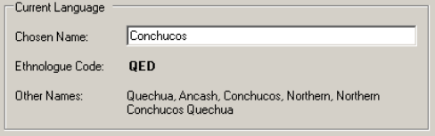

The name of language in the **Chosen Name** box is now the name you want to use for the language **QED** . 

**Note:** Do _not_ change the **Chosen Name** to a totally different language after choosing a language in the list. If the language you need is not shown, search again after changing your **Search For** criteria. If additional searches do not show the language you need then go to the instructions on page 11. 

5. When you have selected the correct language and updated the **Chosen Name** , click **Next** . 

6. Go to **Writing System - Distinguish the Writing System** on page 12. 

###### Result: apparent duplicate matches

Searching for **Conchucos** results in fewer matches than searching for **Quechua** .  This also results in an apparent duplication of the same language name, but for which there are two distinct Ethnologue codes. 

Normally the **Country** column provides some help in distinguishing the language. In this example it does not. When you select a **Language Name** , details about the language are displayed in the **Current Language** area. The **Other Names** help you identify which language is the right one. You will need to click **Conchucos Quechua QED** and **QEH** and decide which one you intend to associate with the new writing system. 

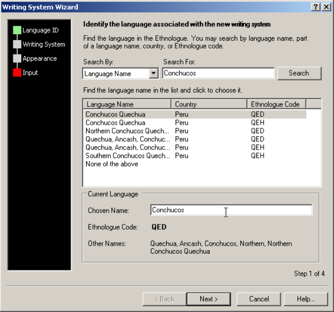

Once you have made your final language selection, you can edit the language name to another alternate name. 

1. To edit the name displayed in the **Chosen Name** box, click in the box and make your changes. 

The name of language recorded in **Chosen Name** is now the name you want to use for the language **QED** . 

2. When you have selected the correct language and updated the **Chosen Name** , click **Next** . 

3. Go to **Writing System - Distinguish the Writing System** on page 12. 

###### Result: search by country name

When you search for a country name, it must be the full name of the country. It must also be the exact name that the Ethnologue database uses (for example, United Kingdom rather than Great Britain). If the country you wish to search for has more than one name or has recently changed its name, you may need to search a few times to see the list of languages. 

The results list contains all the languages that are in that country (according to the Ethnologue). 

1. To search by country, select **Country Name** in the **Search By** drop-down list. 

2. Type the country name in the drop-down **Search For** box. 

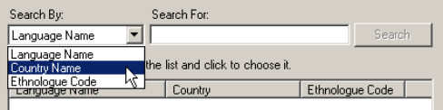

3. Click **Search** . 

4. Scroll down to find the language in the list of results. 

5. Click the language to select it. 

6. Double-check the details in the **Current Language** area. 

7. When you have selected the correct language and updated the **Chosen Name** , click **Next** . 

8. Go to **Writing System - Distinguish the Writing System** on page 12. 

###### Result: no matches

If your search returns no matches, a **Search Failed** dialog box appears. 

1. Click **OK** . 

2. Try searching again. Here are some suggestions: 

   - _Part_ of the language name, rather than the whole name. 

   - An _alternate name_ for the language, if you know one. 

   - A _country_ where the language is spoken (see instructions on page 10). 

   - A _different name_ for the country. 

   - If you know the _Ethnologue code_ , change the **Search By** selection to **Ethnologue Code** and do a **Search For** . 

3. If you still cannot find the language and the **Search Failed** dialog box appears, skip to step 10. 

4. If FieldWorks displays a list of matches, none of which is the language you are looking for, and you have exhausted your searching possibilities, click **None of the above** . 

5. FieldWorks inserts the last search string into the **Chosen Name** field. 

6. Edit the **Chosen Name** to the one you want to use as the name of the language. 

7. The **Ethnologue Code** is **(Unknown)** . The **Other Names** are **(none)** . 

8. Click **Next** . 

9. Go to **Writing System - Distinguish the Writing System** on page 12. 

10. From step 3, click **OK** on the **Search Failed** dialog. The string you searched for is displayed in the **Chosen Name** box. 

11. Edit the **Chosen Name** to the one you want to use as the name of the language. 

12. The **Ethnologue Code** is **(Unknown)** . The **Other Names** are **(none)** . If this is _not_ the case, you need to select **None of the above** and go back to step 5. 

13. Click **Next** . 

14. Go to **Writing System - Distinguish the Writing System** on page 12. 

##### Writing System: Distinguish the Writing System

The first three letters of the **Chosen Name** are automatically inserted into the **Short writing system name** box. This abbreviation identifies the writing system in places where an abbreviated name is required by FieldWorks for data display fields. 

1. Edit the abbreviation if desired. In the example, the abbreviation is changed from **Con** to **ConQIPA** . 

2. If you do _not_ need the Advanced features of the Wizard click **Next** , and then go to the instructions on page 15. If you do not add advanced information (region or variant) and there is _already_ a writing system for that language (that is, the writing system code is identical) you will be prompted to add region or variant information by the following message. 

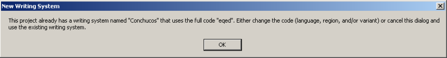

3. If this message appears, click **OK** , and then click **Advanced** . 

4. If the writing system you are creating will use the International Phonetic Alphabet exclusively1 , select the **This writing system uses the International Phonetic Alphabet (IPA)** check box. FieldWorks sets some things up for you, such as providing the **Variant** information needed, and selecting the Doulos SIL font for IPA. 

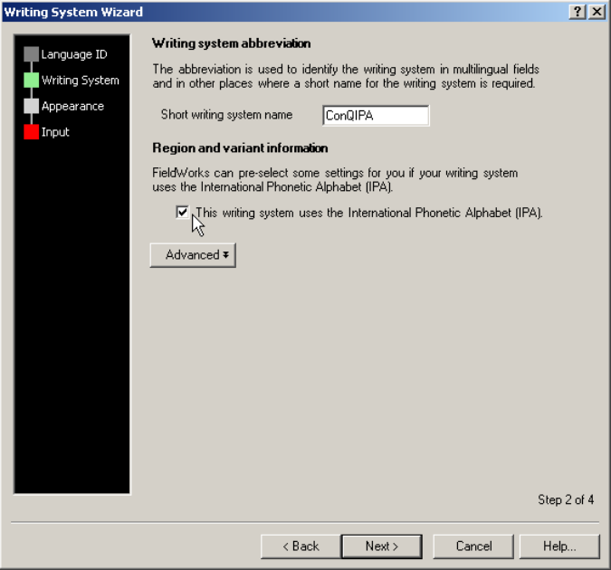

5. If you need to distinguish a new writing system from another one for the _same_ language, click **Advanced** (if you have not already done so). 

> 1 Create two writing systems: one for IPA and one for writing in the normal alphabet for the language. 

The **Advanced** section contains boxes for **region** and **variant** information. The boxes are initially blank unless the **This writing system uses the International Phonetic Alphabet (IPA)** check box is selected. 

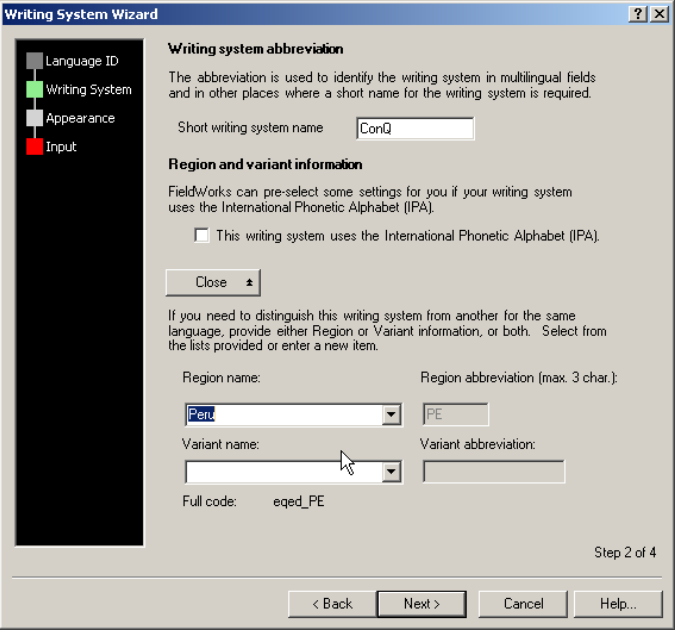

6. The **Region name** is typically used to distinguish between multiple dialects of a language. One might use the name of the dialect or the name of the town or region where the dialect is spoken. Example: If you were to already have a writing system for the Conchucos language and were now adding a writing system for a specifically Peruvian variety of Conchucos, you would enter **Peru** into the **Region name** box to distinguish it from other varieties of Conchucos. 

**Note:** Currently, FieldWorks does not enforce a unique abbreviation for each writing system. _Use a unique abbreviation._ Example: you already have a Lela-Teli writing system, and you create a Lela-Teli (IPA) writing system for writing Lela-Teli words in IPA. The abbreviation for **Lela-Teli** is **LT** and **Lela-Teli (IPA)** is **LT-IPA** . 

7. Click **Next** if you do _not_ need to provide **Variant name** . You do _not_ need to provide **Variant name** unless you already have a writing system for the same language and region. The **Variant name** identifies different _types_ of writing systems (for example, IPA or PINYIN) or different _versions_ of the same writing system (for example, **version 2** ). 

**Note:** The full writing system code consists of Language code, **Region abbreviation** (if present), and **Variant abbreviation** (if present). Underscore characters separate the three parts. Examples: **en** , **en_GB** , **en__IPA** , **en_GB_IPA** . 

The full code is used in the name of the .xml file that contains the specification of the writing system. It needs to be unique, hence the need for Region or Variant names to distinguish writing systems for the same language. 

The language code is usually a 2 or 3-letter ISO code. If a unique ISO code is not available, then it is usually the Ethnologue code prefixed with **e** . If there is not an Ethnologue code, then it is the first 3 letters of the language name prefixed with **x** . The language code is 2, 3 or 4 characters long. 

##### Appearance: Default fonts

If you create an IPA writing system and select the **This writing system uses the International Phonetic Alphabet (IPA)** check box, the fonts default to Doulos SIL.2 

1. Select a **Similar Writing System** , if a similar one is available. For example, **Spanish (Mexico)** . Other writing systems you have created appear in the list. The advantage of selecting a similar writing system is that the keyboard and sort order are based on the **Similar Writing System** . 

2. Select the font(s) you wish to use as a default in most styles for this writing system. You may specify the same font or a different one for headings (for example, a sans serif font). All installed fonts are displayed in the drop-down lists for the two font choices. Any new fonts you need for your writing system need to be installed into the Fonts folder. 

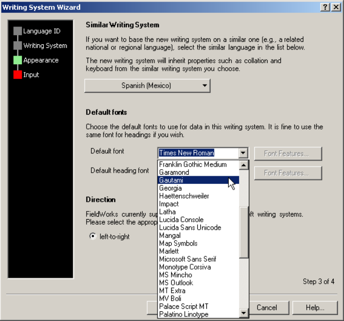

If you need a font to be developed, contact your local computer support personnel. 

If no one is available, contact sil_fonts@sil.org, or graphite_nrsi@sil.org for more information on Graphite font development. 

For more information on Graphite see http://graphite.sil.org 

3. Click the **right-to-left** option, if your new writing system needs it. Writing systems that are mainly right-to-left often include small pieces of left-to-right text, such as numbers. These writing systems should be designated as **right-to-left** . 

4. Click **Next** . 

> 2 The IPA font Doulos SIL is installed with FieldWorks. It is also copied into the Fonts folder in the FieldWorks subfolder (for example, C:\Program Files\FieldWorks\Fonts). If Doulos SIL is not selected as the font and you have selected the IPA check box in the Writing System step, you may need to install it manually using the copy in the FieldWorks\Fonts folder. 

##### Input: Keyboard

Look at the **System Language for keyboard input** drop-down list. 

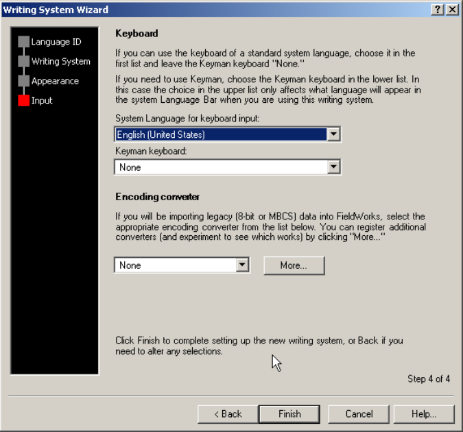

If the entry says **-- Uninstalled** after the system language name, this is because the similar language you chose in **Appearance** identified this system language as having a suitable keyboard for 

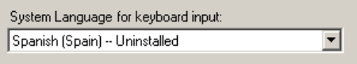

your language, but it is not yet installed on your operating system. There are no keyboards for just a language identifier.  You need a language and country identifier. 

You can either install the required additional system language or, using the drop-down list, you can select a different system language for keyboard input (which may perhaps be installed already). Each Windows operating system is slightly different. The example is for Windows XP. 

1. Open Windows **Control Panel** , open **Regional and Language Options** , click the **Languages** tab and click **Details** . OR, right-click the Windows **Language Bar** , and then click **Settings** . 

2. The **Text Services and Input Languages** dialog box appears. The actual languages and keyboards displayed depends on what is installed on your computer. 

3. Click **Add** , and then choose the language you want to add along with an appropriate keyboard layout or IME. (for example, Chinese (PRC) and Chinese (Simplified) – Microsoft Pinyin IME 3.0) 

4. Click **OK** . 

5. Switch to the **Writing System Wizard** . 

6. Select the appropriate language in the **System Language for keyboard input** list. If you have just installed a new input language that was not shown as **-- Uninstalled** , you _may_ need to refresh your screen by going back to the **Appearance** or **Writing System** step of the wizard and then forward again to the **Input** step, to see the language displayed in the list. 

7. _If_ you need to use a **Keyman keyboard** for your writing system, you need to specify a **System language for keyboard input** _in addition_ to selecting the **Keyman keyboard** you wish to use with this writing system. You may need to install an additional **System language for keyboard input** if the one you want to use is not yet available on your system. Do this now (steps 1-4 above). In choosing a System language for Keyman, pick a language that is not used for anything else in your data. When choosing a keyboard for that language, choose **US** (this assumes you are using a Keyman keyboard that is designed for a **US** keyboard). 

8. _If_ your writing system is for a language that is not shown in the drop-down list under **Default input language** (in the **Text Services and Input Languages** dialog box), then associate the new FieldWorks writing system with your default system input language. The System Language is the language name that will be shown in your Windows Language Bar whenever you are using this writing system. 

9. To add the Keyboard to the **Keyman keyboard** drop-down list, you need to start Keyman, if it is not already running. If the **Keyman keyboard** list only shows **None** , it means that Keyman either isn't running, or there are no keyboards installed in Keyman. If there are any keyboards in the list, Keyman is already running. If the list does not contain the desired keyboard, you need to first install the keyboard using the **Keyman Configuration** program. (Click **Start** , **All Programs** , **Tavultesoft Keyman** , **Keyman** ). 

10. You _may_ need to refresh your screen by going back to the **Appearance** or **Writing System** step of the wizard and then forward again to the **Input** step, in order to see the language displayed in the list, **or** you may need to cancel the **Writing System Wizard** and start over. _Alternatively_ , add the Keyman keyboard in the **Writing System Properties** dialog after you have created the writing system. 

11. Select the **Keyman keyboard** for the writing system. 

12. _If_ you need to import legacy data (either not Unicode or Unicode 8-bit) into FieldWorks, you may need to select an **Encoding converter** . _Most users will require technical assistance with encoding conversion._ For more details see **Additional Information** , **Information about keyboards and Keyman** on page 19. 

   - Select it from the drop-down list. 

   - _If_ you already have an appropriate encoding converter available on your computer, but it is not in the list, click **More** to add the converter. The **Encoding Converters** dialog box appears. Click the **Help** button for basic instructions on adding an encoding converter. When you close the encoding converters dialog, any new encoding converters that you have added to FieldWorks now appear in the list. 

   - You can specify this later. 

13. Click **Finish** . 

14. The **Project Properties** dialog box appears. The new writing system is added to the bottom of the list of either **Vernacular** or **Analysis Writing Systems** , depending on which **Add** button you clicked. 

15. It is checked as a default. _If_ this is to be the new default writing system in the current FieldWorks project, move it to the top of the list by clicking the up arrow. 

**Warning:** If you have already done extensive work in your project, you may obtain some surprising results if you change the default writing system, especially in the List Reference fields in Data Notebook and in topics lists. See **Help** for more information. 

16. If you do not need the new writing system to appear in any Topics Lists or other multilingual text fields, you can clear the check box for the writing system. This means that the writing system is only available within free text fields (for example **Description** ). See the _DN Student Manual_ , _Module DM_ for instructions on how to apply different writing systems to words and phrases within a paragraph. 

##### Additional information

###### Modifying properties of a Writing System

All writing systems properties specified in the **Writing System Wizard** can be changed subsequently in the **Writing System Properties** dialog. On the **File** menu, point to **Properties** , and then click **Project Properties** . The **Project Properties** dialog box appears. Click the **Writing systems** tab. Select a writing system, and then click **Modify** . 

###### Full name of a Writing System

The full name is: **Language** followed by the **Region** or **Variant** . 

The **Language** is the **Chosen name** in the **Language ID** step in the **Writing System Wizard** (see instruction on page 8). You can have two or more writing systems with the same language name. 

The **Region** or **Variant** is specified in the **Writing System** step in the **Writing System Wizard** . It is required if there are multiple writing systems for a language. Examples of how you distinguish the writing systems are **Conchucos (IPA)** vs. **Conchudos** or **Tagalog (Guam)** vs. **Tagalog** . 

###### Information about keyboards and Keyman

Visit the NRSI keyboard web page: 

http://scripts.sil.org/cms/scripts/page.php?site_id=nrsi&cat_id=Input 

Alternatively, contact your local computer support personnel, or email nrsi@sil.org. 

The Keyman driver program is available for installation on the software disk from which you installed FieldWorks. 

You need to specify an encoding converter any time your Standard Format data is not in the system locale. For example, if you are working with a US system and you are importing standard European languages with no special fonts (for example, the code page is cp1252 or ISO-8859-1), you won't need to specify an encoding converter.  Although these are non-Unicode fonts, their conversion will happen automatically by the system using the cp1252 code page. 

A Keyman keyboard for typing IPA characters is provided with FieldWorks. Here are brief guidelines on how to install it. Your system may be slightly different. 

1. To start **Keyman Configuration** , click **Start** , **All Programs** , **Tavultesoft Keyman** , **Keyman Configuration** . 

2.  Click **Install Keyboard** . Browse to the FieldWorks folder, and then to the Keyman subfolder (for example, C:\Program Files\FieldWorks\Keyman). 

3. Select **ipaUni10.kmx** . 

4. Click **Install** . 

5. Close **Keyman Configuration** .