# Publishing FLEx Dictionaries Using Microsoft Word

August 13, 2026 

## 1 Introduction

Microsoft Word is not the ideal publishing software, but it does provide enough capability to provide a reasonably good publication of a dictionary from FLEx. In Word you can add dictionary introductory sections, reversal indexes, and appendices. It also allows the user to make changes to the FLEx dictionary that might not be possible to do with the FLEx configuration options. Once a dictionary is in Microsoft Word, it can easily be exported to PDF. For more sophisticated publications, one possibility is importing the Word document into Adobe InDesign which provides more powerful publication capabilities. 

As of FLEx 9.2, FLEx provides a direct export to Microsoft Word, including the dictionary body in one file, and all reversal indexes that have at least one entry in additional files. This document describes some useful features in Word for working on dictionaries. It also describes special features related to bidirectional dictionaries in Word. This document is based on Microsoft Word which comes with Microsoft Office 2019. There may be minor changes for other versions. 

The Word document exported from FLEx will be double-column with letter headings spanning both columns, and page headers with guidewords. Adjustments to this default layout can be made using Word document features after export. 

The exported files are .docx files that will open in current versions of Word as well as older versions, at least back to Office 2010. If a Word export is being made to import into InDesign, you will need to use File > Save As in Word to resave the file. Something about this process allows InDesign to import the file. 

If you have a large FLEx project with a lot of pictures, the process may use multiple Gb of memory. A well-developed dictionary with 29,000 entries took 8 minutes to export and used 4Gb of RAM during the export. With a lot of pictures it may double that. For these dictionaries, you should have at least 16Gb of RAM in your computer to avoid running out of memory. 

The Microsoft Word export uses OpenXml data structure. LibreOffice also supports OpenXml, so a Word export from FLEx can also be opened in LibreOffice. There are differences between the two programs, so all features may not work as well in LibreOffice. But if you want to use LibreOffice, see if it handles your dictionary adequately via the FLEx Word export. 

There are conceptual differences in the way FLEx formats data via styles, and the way Word formats data via styles. The FLEx export attempts to provide output in Word that closely follows how it looks in the FLEx dictionary layout. There are some situations where this cannot be handled automatically. So, you may need to make some adjustments after export to get the desired results. 

## 2 Exporting a dictionary to Word

### 2.1 Preparation in FLEx prior to export

Prior to exporting a dictionary from FLEx, you need to set everything up so that the Dictionary layout in FLEx shows the entries the way you want them to appear in Word. This involves the following steps. 

Page 3 

- Select the entries, pronunciations, senses, examples, and pictures to include in the published dictionary. If needed, you can set up a unique publication for this purpose by adding a new publication to the Publications list in the Lists area. The default publication that comes with FLEx is “Main Dictionary”. FLEx provides the following fields used to determine if these elements will be included in a particular publication. 

Publish Entry In Publish Pronunciation In Publish Sense In Publish Example In Publish Picture In 

If a publication is listed in these fields, it means the element will be included in that publication. These fields can be changed via Bulk Edit Entries. 

- The appearance of variants, complex forms (often subentries), and minor entries can also be configured on each entry using these fields Show As Headword In Show Subentry under Show Minor Entry Subentries 

Referenced Complex Forms 

- It’s possible to set up Filters on one or more columns to limit the entries that occur in the publication. For testing purposes, it’s often helpful to set a filter to just a few entries to save time in making test exports to Word. Normally you will want to disable all filters prior to the final export so that you will get all of the desired entries in the dictionary. 

- Normally you will want to sort on the Headword field for publications. If the sort order is not correct, use Format > Set up Vernacular Writing Systems > Sorting to adjust the collation rules. Also, the collation rules determine which letter headings will be included in the printed dictionary. Letter headings will only be included if you are sorting on a lexeme form or citation form field. 

- Use Tools > Configure > Dictionary to configure the dictionary to format the dictionary as desired for the publication. This includes selecting the fields you want to display, the order of the fields, the style of the fields, the writing systems for the field, any special text before or after the field, or between elements in a sequence field. There are also options for formatting homograph numbers, sense numbers, whether some elements are in separate paragraphs or not. This may also require settings in Format > Styles, including creating custom styles as needed. All of the formatting, except styles can also be set for a unique publication by creating a custom layout using the Manage Layouts button in the Configure Dictionary dialog. 

**Note on pictures:** If anything, including a space, is present in the After field of the Pictures nodes, Word will have an additional paragraph under pictures with that content. This is probably undesirable. 

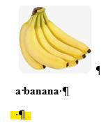

Page 4 

To avoid this, make sure the After box is empty. Older FLEx projects had a space in this location by default. Current versions do not have the space, but for earlier projects you’ll need to delete it in configuration. For further vertical spacing issues with pictures in Word, you can modify the paragraph settings for the Pictures paragraph style in Word. 

• All reversals with at least one reversal index entry will be exported based on the filtering and sorting set for each reversal language in Bulk Edit Reversal Entries, and configurations for each reversal language set in Tools > Configure > Reversal Index. Collation and letter headings for reversal entries are determined by the Sorting tab of the reversal language in Format > Set up Analysis Writing Systems. Make sure these are all set to what you want to export to Word. Each reversal will be in a separate .docx file. 

- Make sure the correct layout is chosen at the top of the Configure Dictionary dialog. 

See section 4.4 for special considerations for bidirectional dictionaries 

#### Saving list reference names in the Word document

**Note** : This section only applies to versions of FLEx prior to FW9.2.9. In FW9.2.9, list references automatically use the property name as part of the style (e.g., Semantic DomainsName[lang=en]) without specifying a special style in FLEx configuration. 

The default export to Word does not identify list references by name of list (e.g., Semantic Domains, Usages, etc.). All list items use the Name or Abbreviation style, regardless of which list is being referenced. For simple printing, this is normally adequate. However, there are situations where being able to identify references by the list name may be very import. Here are a few situations like this. 

- You may want to be able to search for list items from a particular list in the Word document. 

- • You may need to do some customization of the Word output for information from certain lists. For example, you may want to format the semantic domain names some unique way. 

- The Word file may be used for input to some other program, such as InDesign, where having the additional information would be very helpful. 

- It’s possible after an extended period of time, that a Word export is all that remains, and the original FLEx file is no longer available. In this case, the Word document may be all that is left to reconstruct the FLEx project, or for some other purpose where it’s very helpful to have the list names or abbreviations identified by the referring field. 

With appropriate setup prior to exporting to Word, the list names can be saved in the Word document, which could be invaluable later on. All that is needed to preserve this information is to create a character style for each list reference field, and then in Dictionary Configuration, assign that style to the list reference field. For example, this demonstrates assigning a “Semantic Domains” character style to the “Semantic Domains” field. 

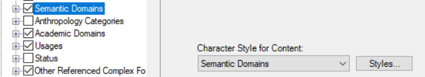

Page 5 

If you do this, when you click a semantic domain in the exported Word document, you will see that the style is “Semantic Domains : Name” instead of just Name, or “Semantic Domains : Abbreviation” if you click on the semantic domain number. 

### 2.2 Exporting a dictionary from FLEx to Word

The actual export to Word is very simple in FW9.2.0 or later. Once you have the dictionary looking the way you want in the Dictionary and Reversal Index layouts, choose File > Export > Dictionary, Reversal Index  Word (DOCX). Specify the file name and directory. FLEx will create a .docx file for the dictionary body, and one for each reversal index with at least one reversal entry in the specified directory. If the file already exists, you will be asked if you want to overwrite it. It only asks once for the set of exported files. Reversal files use the name you specify, appending “-reversal-en” to the file name, with an appropriate language code for each reversal. 

Pictures are embedded in the docx file, so copying the file to some other machine will still include the pictures. 

### 2.3 Preparing a Word dictionary for publication

As you begin making changes to the .docx file in Word, keep in mind that these steps will all need to be repeated if you need to change things in FLEx and do another export. So before making extensive changes outside of FLEx, try to make sure you will not need to make any further changes in FLEx that would require a new export. The best way to do this is to set a filter in FLEx for a small set of entries that demonstrate all of the features in the dictionary, export those entries, and see whether you can solve any remaining issues in Word. Take good notes in all of the steps you are making after exporting from Word in case you need to start over with a new export. Once you feel confident you can handle your small sample, then you can do a full export and go through the remaining steps to produce the final Word document. 

The person producing the Word publication will likely need to experiment to determine how to address any problem areas. Some issues can be handled using the powerful Find and Replace function in Word that can insert text before and after styled data. Word can find any occurrence of a style, and can change that style to some other style if needed. The exported entries have styles for each field. These styles can be changed in Word to alter appearance of specific fields (see section 3.3). 

The FLEx export will produce two columns with letter headings spanning both columns, and page header guidewords with the first entry headword on the left (verso) page and the last entry headword on the right (recto) page, which switches for right-to-left publications. Inside of Word, it’s easy to change the page size and number of columns. It’s relatively easy to alter the default page headers with guidewords (see section 2.3.3). However, it may not be possible to have guidewords show the current partial entry headword. It’s also fairly easy to alter the default letter headings if needed (see section 2.3.5). As in any program, placement of pictures, and dealing with location of letter headings that occur at the bottom of a page requires manual work. 

There may be rare cases where it would be helpful to make changes internally in the .docx file. Changes in a .docx file requires knowledge of XML and the way word uses XML in their internal files. For information on this format, look for OpenXml documentation on the Internet. 

Page 6 

Word also provides a powerful programming macro language that can be useful to those who understand that. 

#### Page layout

FLEx does not provide a way to specify page layout information. It just contains the dictionary entries and letter headings. The Word export provides a default double-column page layout including size (Letter 8.5” x 11”), page headers with guidewords, and letter headers spanning both columns. After exporting, you will need to make any adjustments to the default settings as needed. Adjustments to page size, orientation, margins, and any other page or book type settings can be made from the Layout tab. If you need a different number of columns, use Ctrl+A to highlight the entire document, then select the desired number of columns and column settings in Layout > Columns. 

**Note** when changing the page size, be sure to highlight all of the text using Ctrl+A before changing the size. 

**Note** with double-columns, it’s possible to set up paragraph hanging indents that will cause clipping in the second column because the paragraph indent is too wide for the inter-column space. If you encounter this situation, you can adjust column widths and indents in Layout > Columns > More Columns where you can specify size of columns and spacing between columns, or you can decrease the paragraph hanging indent to avoid the problem. 

#### Exported styles in Word

This section documents processing styles in Word starting with FieldWorks 9.2.8 which provided improved support for styles. 

The FLEx Word export assigns character and paragraph styles to the exported data to provide formatting that will look similar in Word to the appearance in the FLEx Dictionary layout. Styles in FLEx and Word do not work exactly the same. The export goes through a complex process to pick up all of the style features in the FLEx style hierarchy, then writes similar styles to Word, merging any styles that have the same features, and removing any styles that are unused. If a definition field is formatted the same way in multiple places in the FLEx configuration, a single “Definition” style will be used. However, if definitions are formatted differently in different contexts, then additional Definition styles will be created to maintain that distinction. The additional styles will have numbers appended to the name (e.g., “Definition2”). The numbers may not be contiguous. 

Usually there is only one writing system for a given field. In FLEx dictionary configuration, the field will have “Default Analysis” or “Default Vernacular” checked for the field. For these cases, the dictionary layout will only show the first analysis or first vernacular writing system content. When exported to Word, the style name will normally not specify the writing system (e.g., Definition). 

If the user wants to show multiple writing systems for a field, they will uncheck the default option in dictionary configuration and check the desired writing systems. Word does not have any concept of vernacular and analysis writing systems. In order to maintain the font and other features of a style associated with a given writing system, the Word export creates additional styles by appending [lang=xx] where xx is the writing system code. FLEx has an initial concept of a Normal writing system style. If the field writing system features match the normal style, 

Page 7 

then the lang tag is omitted. If there are any differences, then a lang tag is added. As a result, most styles will not have a lang tag, but some may have a tag, and understanding why may be a mystery. Even with default styles in FLEx, if the main analysis and vernacular writing systems use a different font, the Headword field will normally have a lang tag added because the font is different from the Normal style. If FLEx is configured to show English, French, and Spanish analysis languages for a definition with English being the default. In Word there would normally be three styles: Definition for English, Definition[lang=fr] for French, and Definition[lang=es] for Spanish. 

The styles for each writing system in the Normal > Fonts tab in FLEx will go into a “Normal Font” style in Word; a separate one for each writing system. 

By altering the styles in a Word export, you can change the appearance of data in those styles throughout the dictionary. Word provides good support for styles. See section 3.1 for basic information on working with styles in Word. See section 3.3.1 for ways to search for styles in Word, section 3.3.2 for replacing styles, and section 3.3.5 for adding text before or after styles. 

Here is a diagram that shows how styles work for a case where default styles were used in FLEx. 

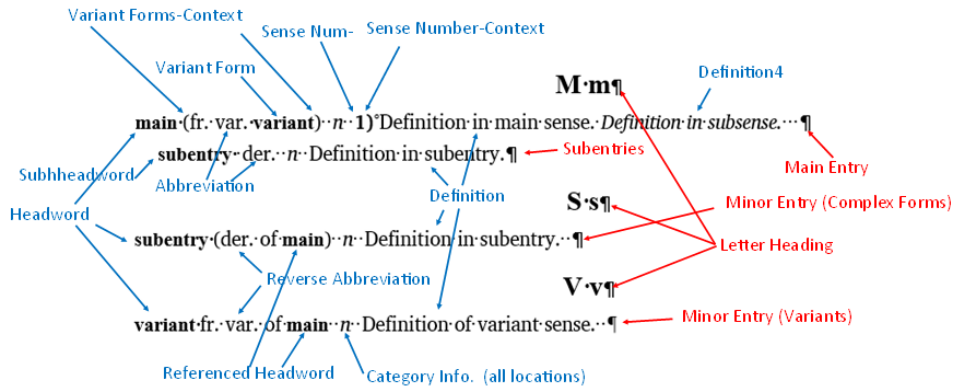

Paragraph styles are shown in red, while character styles are shown in blue. Note the Headword style is used for main entries and minor entries. However, for subentries, a Subentries style is used in the export to prevent subentry headwords from being included in the page header guidewords. The same Grammatical Info style is used for all categories1 . There are different paragraph styles for main entries, subentries, and minor entries. Definition is the same in all cases except ‘Definition in subsense’, which had a numbered style name since it was formatted to a different style in FLEx. The styles for field context are described in the next section. 

If you need to export again from FieldWorks, the style names could change in new exports if you’ve made changes to style names in FLEx or dictionary configuration that would cause new collisions with existing names. So, if you have a process that depends on certain style names and you do another export, there is a chance of having different style names. 

> 1 Actually, FLEx defaulted to using Dictionary-Contrasting style for Grammatical Info on the sense of a subentry, while all other locations used Dictionary-POS. As a result, it created a separate style in Word export until this discrepancy was corrected. 

Page 8 

#### 2.3.2.1 Context styles for Before, Between, and After text

In FLEx dictionary configuration, you can add text to appear before a field, between multiple occurrences of an element within a field, and after a field. The Dictionary-Context style in FLEx is used for these texts regardless of where they occur. However, if the context is for a single text field that is using a style, FLEx will use the style of the field for the before/after text. This generally gives better results than always using a single style regardless of the field. For example, if a Lexeme Form field in an IPA writing system is used, and that field is assigned the Dictionary-Pronunciation style which is set to red, and the field has square brackets in the before/after content, the result will be [a:rwa:h] where the square brackets take on the style of the pronunciation. 

When fields are exported to Word, the field content is assigned a style; Lexeme Form[lang=trwfonipa], in the above case. The before/between/after text for this field will use a separate style with “-Context” appended to the style name, thus Lexeme Form-Context[lang=trw-fonipa]. This Context style is based on the style for the field, Lexeme-Form[lang=trw-fonipa], thus it merges properties of both styles. The same style is used for all three contexts. The context style is set to match the style that was used in FLEx. So, in the above example, it would be set to red. Each field that has context assigned in FLEx, will have a different style in Word for that context. This provides more flexibility than FLEx provides. The styles can be redefined in Word if you need something different. You can also search for these context styles when needed. 

Consider the following example demonstrating styles for fields with embedding, and context on some fields. In FLEx, the configuration settings are as follows 

Headword After: space Senses Before: space Senses After: space space Grammatical Info. After space space Examples Before: space space Example Sentence Between: space Translations Before: space Translation Before: space space 

The styles when exported to Word are shown here. 

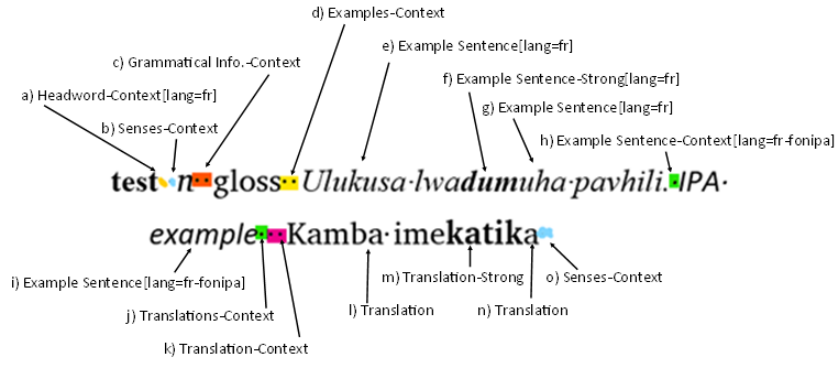

a) After text (space) on Headword 

Page 9 

- b) Before text (space) on Senses 

- c) After text (2 spaces) on Grammatical Info. 

- d) Begin text (2 spaces) on Examples 

- e) Text from Example Sentence in French 

- f) Text using embedded Strong style in Example Sentence in French 

- g) Text from Example Sentence in French 

- h) Between text (space) on Example Sentence (inserted between two different writing systems) 

- i) Text from Example Sentence in French IPA 

- j) Before text (space) on Translations 

- k) Before text (2 spaces) on Translation in Swahili 

- l) Text from Translation in Swahili 

- m) Text using embedded Strong style in Translation in Swahili 

- n) Text from Translation in Swahili 

- o) After text (2 spaces) on Senses 

Note how text between fields may come from multiple places as in j) and k) above. The Word context styles can be quite helpful in identifying where the context text is specified. 

#### Add page headers with guidewords

It’s fairly easy to set up page headers and footers in Word to handle various needs. To edit headers, choose Insert > Header > Edit Header. (A short-cut is to right-click the header area and choose Edit Header.) This opens a header section with a Design tab where you can add guidewords, page numbers, text, etc., and format the sections as desired. The first tab is a centered tab and the next tab is a right tab. When done editing the header, use Design > Close Header and Footer. Note when in the Edit Header mode, there are two Design tabs in the Word menus. 

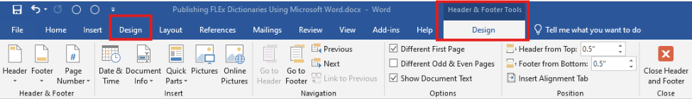

The Design menu described in this section is the Design menu under Headers and Footer Tools. In the header tab you can select whether to use a different header for the first page, and whether you want different even and odd page headers. 

To insert a page number, use Design > Page Number > Current Position > Plain Number, or whatever option you desire. 

Word provides an easy way to insert text from the first style on a page and/or the last style on a page. This provides a way to show dictionary headwords for the current page. There are some considerations in doing this. First, as noted in section 2.3.2, the default style for headwords provided by FLEx export is Headword[lang=xxx] for main entries. You can only include one style for guidewords. If you have formatted minor entries with a different style in Flex, this will be a problem. If you want to allow minor entries in the guidewords, you’ll need to change those styles to Headword. The other issue is what to do when a page begins with a continuation of a longer entry from the previous page. Typically, it would be nice to include the last headword 

Page 10 

from the previous page. Unfortunately, Word cannot handle this in the normal page header settings. The only easy option is to include headwords from the current page. Using a Visual Basic For Applications macro, it might be possible to do something better. 

Note that the default FLEx configuration uses Dictionary-Headword for the Headword style for subentries, which is identical to default settings for main and minor entry headwords. It is not desirable for subentry headwords to be in guidewords since they often do not follow the normal alphabetical order of main headwords. The FLEx Word export automatically switches subentry headwords to use a Subheadword style to avoid these undesirable guidewords. If you happen to change the subentry headword style in FLEx, it will still get changed to Subheadword during the export and keep your style’s properties. 

To add a headword in the header, use Design > Quick Parts > Field. In the Field names, choose StyleRef, and in the Field properties, choose the headword character style (e.g., Headword). Word will default to showing the first occurrence of the style. If you want the last headword on the page, check the “Search from bottom of page to top” option. 

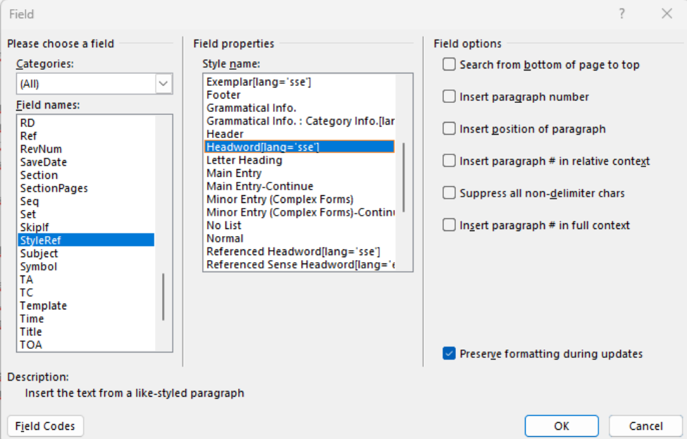

It is possible to insert multiple fields in a page heading, if that would ever be helpful. You might discover that after setting letter headings, if the heading comes at the top of a page, the first headword is not displayed. Here is an example 

Page 11 

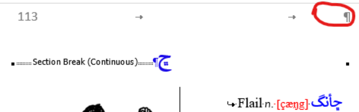

This is normally because the Section Break (Continuous) is set to the Headword style, so it has no text, and it’s the first occurrence of the style on the page, so it doesn’t show anything. If you follow the steps in section 2.3.42.3.4 for setting the letter headings to be full page, this will not happen. The FLEx Word export automatically handles this. 

When using guidewords, it’s often best to not show them on the first page. To do this, in the page header Design tab, check “Different First Page”. This will remove the header on the first page, or you can configure it in some other way if you’d like. 

#### 2.3.3.1 Changing Headers and Footers

By default, page headers and footers only apply to the current section. In Word dictionaries, letter headings are separate sections, and an additional section is used for all of the entries beginning with that letter. After a FLEx export, if you need to change guidewords in the headers (or footers), the changes need to be made to each alphabetical section. There doesn’t seem to be a way to fix guidewords so that they flow through the entire document without first removing all section breaks. This can be done in the advanced Find and Replace dialog by searching for ^b and leaving “replace with” blank. Then set the desired guidewords on left and right pages which will cover the whole document. Finally, set the letter headings back to single column using the instructions in section 2.3.5. Note, there is a “Link to Previous” toggle in the header design dialog, but it only links to the letter header paragraph, which doesn’t pass it on up to the previous letter section. There doesn’t seem to be a way to link to the whole document without going back to a single section. 

#### How to fix incorrect guidewords on some pages

After you have made all of the changes to your document, if you find a few page headers where the guidewords were incorrect, there is a way you can correct this. It would not be wise to make these changes until all other editing is done because you are forcing new page breaks that would be incorrect if you make changes to previous pages that would alter the location of the default page breaks. Follow these steps to alter one page header without affecting other headers. 

1. Place your curser after the last character on the last line of the page before the page header you want to change. 

2. In the Layout tab, choose Breaks > Next Page. This will force a page break at this point.. 

3. Right-click the pager header you want to change and choose Edit Header. 

4. In the Options section of the Design tab under Header & Footer Tools, check the “Different First Page” option. This will remove the content of the header you want to change. 

5. Add the correct guidewords, page header, etc. for this page header. 

6. Click “Close Header and Footer” from the Close section of the toolbar. 

Page 12 

##### 7. The remaining pages should continue with the normal page headers.

If you need to remove an inserted page break, place the curser at the end of the text on the previous page, then press Delete. Then assuming you started out without “Different First Page” checked, go to Edit Header and uncheck “Different First Page”. 

#### Convert letter headings to single column

The FLEx export automatically sets letter headings to single-column using the procedure described here, but knowing how to do it manually may be useful at times. When using two columns for your dictionary text, it’s usually desirable to have the letter headings span both columns. Word does not provide a style for doing this as InDesign provides, but there is a solution that works reasonably well that just requires making a couple changes for each letter heading. FLEx normally uses the Letter Heading style for letter headings. By searching for this style in the Advanced Find dialog (see 3.3.13.3.1), you can quickly find the next letter heading using Shift+F4. 

When the letter heading paragraph is highlighted, choose Layout > Columns > One, which will make a single column section break around the letter heading so that it will span both columns. At this point the inserted Section Break will be set to the Headword style. This will cause a problem with guidewords in page headers when at the top of a page. To avoid this, click to the right of the Letter Heading paragraph marker (or left if RTL) and use Ctrl+Space to clear the Headword style, leaving it set to Main Entry. 

If a letter heading occurs at the bottom of a page, you can insert Shift+Returns to push the letter heading to the top of the next page. Word does pretty well at repositioning letter headings when you make changes earlier in the document. If things get too bad, it may be easiest to remove the letter heading section breaks and then go through the process of resetting the letter headings again. To remove the section break, click to the right of the Letter Heading paragraph marker and press Delete. Someone who does this a lot may benefit in setting up a Word macro to do it in one step. 

#### Pictures in Word

This section documents processing pictures in Word starting with FieldWorks 9.2.7 which provided improved support for printing pictures. 

The Pictures nodes under FLEx Dictionary Configuration now provide options to specify picture location (left, center, right) with the caption always centered under it, and maximum width and height for pictures. The defaults are right aligned with 1” maximum width and height. Any Pictures node will affect all pictures in the dictionary for this layout. Pictures will not be enlarged beyond their resolution, but if they are too big, they will be reduced, maintaining aspect ratio, until they do not exceed the two maximum values. These settings will be applied to all of the pictures in the dictionary. In Word, you can make individual adjustments to location and size, if needed. 

Pictures or illustrations in a Word document exported from FLEx normally have two paragraphs. The picture is in a paragraph with a “Picture And Caption” paragraph style. 

Page 13 

The picture is inside a textbox, with the caption occurring as a second paragraph, also with a “Picture And Caption” paragraph style. The parts of the caption have character styles for Caption, Creator, Copyright & License, etc. that can be specified in FLEx, and altered in Word. When you click the caption, the textbox border will appear around the picture and caption. 

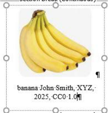

If you want to move a picture, when the textbox is highlighted, you can click the border and drag the textbox to a new location. The picture and caption will move together inside the textbox. 

The textbox has a “Pictureframe Textbox” paragraph style. In Word you can modify Frame property in various ways, such as Position, Text wrapping, etc. Changes to this style will affect all of the pictures in your dictionary. If you need to position some pictures left and others right, it should be possible to create a “Pictureframe Textbox2” style and format it differently. 

In a double-column section, Word will wrap the paragraphs to roughly equalize the text in both columns within the section. As a result, if a picture is in a single entry in a letter section, the picture will go to the right column instead of staying in the left column. If you want to force the picture to be under the entry paragraph, you can drag the textbox to position it in the first column. 

You can increase or decrease the size of an individual picture by clicking the picture so that it displays the frame around the picture, then drag one of the frame circles to change the size. If you drag a corner circle, the picture will maintain the aspect ratio of the picture. If you drag a circle in the middle of the line, you can change the aspect ratio. After changing the size of a picture, you may also need to change the size of the textbox. This is especially important if you try to expand the picture beyond the current textbox size. 

In order to get a pleasing page layout with pictures, you may need to change the size, or drag the picture to a new location, or force an entry to a new column, etc. 

#### Editing the internal Word docx file

If all else fails in unusual cases, it is possible to edit the internal Word file. See section 3.6 for basic information on modifying the internal Word document. Dictionary reversal indices 

FLEx exports one reversal index file for each reversal that has at least one reversal entry. You may want to include these in the main dictionary document, or keep them in separate documents. 

Page 14 

It’s usually good to clean up indices before publication. To do this, go to Lexicon > Bulk Edit Reversal Entries. In older versions of FLEx it was possible in various editing operations on reversals, to have unused reversal entries, either with missing reversal forms or missing referenced senses. These should be deleted using the Delete tab. Check for missing reversal forms by filtering the Reversal Form column for Blanks. If there are any blank entries, select Reversal Entries (Rows) as the Item to delete, make sure they are all checked, then click the Delete button. Clear the Reversal Form filter and filter the Referenced Senses column for Blanks. Again, if any show up, make sure they are all checked, then click the Delete button. **Note** , however, if you are using subentry reversal items, it’s common to have the main items without references. These should not be deleted! When done, clear the filter. This process needs to be done for each reversal language. 

In Bulk Edit Reversal Entries you can set a filter to limit the reversal entries to export, and you can also make sure the reversal index is sorted correctly. If there are problems with the sorting or letter headings in the reversal, you need to adjust the Sorting tab of the reversal writing system in Format > Set up Analysis Writing Systems. Normally you’ll want to sort on Reversal Form and not have any filter active. Whatever is set in Bulk Edit Reversal Entries will determine what shows in the reversal index for that language. 

If you have reversal subentries, these will not be sorted by the default dictionary sort. To sort the reversal subentries, use Tools > Utilities > Sort Reversal Subentries. 

#### Dictionary front matter and back matter

Use Word’s normal editing capabilities to add any front matter (title pages, table of contents, grammar sketches, description of dictionary, etc.) or back matter (appendices, etc.) 

## 3 Useful features in Word

### 3.1 Basics of Styles in Word

There are two common types of styles in Word: Character, and Paragraph. Paragraph styles let you control paragraph indents, spacing between lines, alignment, bullets, numbering, and line and page break properties of paragraphs. Character styles let you choose the font, font face, font size, color, background color, subscript, superscript, underlines, etc. The advantage of using styles is consistency and ease of use. By modifying a style, you will affect all of the places that style is used. It’s generally much better making changes to styles than doing hard formatting in your document. 

When working on the dictionary in Word, it’s very helpful to have the stylesheet open beside the document. If you don’t have the stylesheet open, you can open it with Alt+Ctrl+Shift+S, or by clicking the button in the lower right of the Styles pane in the Home tab. Once open, when you click in a word in the dictionary, the associated style is selected in the style sheet. 

Word offers a Reveal Formatting pane by using Shift+F1. In addition to showing the style sheet with names, this shows details of the formatting of the selected style. 

If you are interested in Paragraph styles instead of character styles, it works best to have paragraph marks displayed in your document. This is controlled in File > Options > Display. 

Page 15 

With paragraph marks showing, you can select just the paragraph mark, and then the stylesheet will select that paragraph style. 

A style is applied by selecting the target text, then clicking the style in the style sheet. Paragraph styles can be applied by clicking the style from anywhere in the paragraph. Paragraph styles also contain character formatting that will be applied to any text in the paragraph that is not controlled by some other character style. 

To modify a style, from the stylesheet, right-click the style and choose Modify. Alternately, you can move the mouse to the right of the style in the stylesheet and click the triangle menu button. This brings up the Modify Style dialog where you can change the name and basic characteristics of the style. For more complete control, you can click the Format menu in the lower left, then choose Font, Paragraph, Tabs, etc., to view and modify more specific features in the style. When you click OK to the Modify Style dialog, all text using that style will update to the new style. 

To Find out how many places a style is used in your document, right-click the style in the style sheet The menu will have a Select all … Instances line that shows the number of places the style is used in the document. If you click that option, it will highlight all of the locations where the style is used. If the style is unused, the menu will show: Select all: Not Currently Used. 

### 3.2 Preventing styles from changing: dynamic updating

Word provides dynamic update of many styles. When enabled, Word will change the definition of a style when you apply explicit formatting to something in the document. Especially when multiple people are working on the same document, this can cause styles to unexpectedly change, which is typically undesirable. To avoid this, make sure “Automatically update” is unchecked in the Modify Style dialog. To disable this in all styles, you can use this macro:i See section 3.5 for information on using macros. 

Sub RemoveAutoUpdate() Dim s As Style For Each s In ActiveDocument.Styles If s.Type = wdStyleTypeParagraph Then s.AutomaticallyUpdate = False End If Next s End Sub 

### 3.3 Advanced Find and Replace

Word provides powerful find and replace capabilities. It doesn’t provide regular expression searching, but it does provide wildcards for some options. There are three ways to get to the Advanced Find and Replace dialog, 

- Home > Find > Advanced Find. 

- In the Navigation section, click the chooser at the right of the Search edit box, and choose Advanced Find 

- Ctrl+H opens the Advanced Find and Replace dialog in the Replace tab. Click the Find tab if not interested in replacing. 

Page 16 

Once in the Advanced Find and Replace dialog, there are 3 tabs: Find, Replace, and Go To. The default view shows minimal capabilities, but a More button opens up many more features. The rest of this discussion assumes the full features are available. 

#### 3.3.1Finding styles

One very useful feature is finding styles in a document. To do this, leave the Find edit box empty, but at the bottom of the dialog choose Format > Style, and then select the target style and click OK. This adds a Format label under the Find box that tells which style is selected. When you click Find Next, it will find and highlight the next text in the target style. This can be very useful in finding the data represented by styles that FLEx created during the export. You can remove the style from the Find or Replace box by choosing Format > Style > (no style), or you can click the “No Formatting” button at the bottom of the dialog. 

#### Replacing styles

You may find it useful to merge styles provided by FLEx to make them more consistent. For example, if your file has minor entry headwords set to a style other than Headword, and you want to use Headword as the style for page header guidewords, you will probably want to change the current style to Headword. 

To change a style using the Find tab of the Find and Replace dialog (Ctrl+H), make sure the Find and Replace edit boxes are empty, click the Find edit box, and use Format > Style to select the source style, then click the Replace edit box and use Format > Style to select the destination style. Then click Replace All to change every occurrence of the source style to the destination style. 

To turn off styles in the Find and Replace boxes, you need to use Format > Style and select (no style) at the top of the list, or click the “No Formatting” button at the bottom of the Find and Replace dialog. 

#### Special codes

Word provides a set of special codes starting with a caret (circumflex) that can be very useful. If you select an item from the Special menu at the bottom of the Find and Replace dialog, it will add the specified code at the cursor in the Find or Replace edit box. You can also type the codes directly. Here is a list of the special codes: 

| ^p  | Paragraph Character |                                            |
|-----|---------------------|--------------------------------------------|
| ^t  | Tab Character       |                                            |
| ^?  | Any Character       |                                            |
| ^#  | Any Digit           |                                            |
| ^\$ | Any Letter          |                                            |
| ^^  | Caret Character     | Find caret or circumflex (^) code point    |
| ^n  | Column Break        |                                            |
| ^+  | Em Dash             |                                            |
| ^=  | En Dash             |                                            |
| ^e  | Endnote Mark        |                                            |
| ^d  | Field               | ‘View Fields Codes’ must be on. See below. |
| ^f  | Footnote Mark       |                                            |

Page 17 

| ^g | Graphic | Any picture or graphic. |
|----|----|----|
| ^l | Manual Line Break | Equivalent to typing Shift + Enter |
| ^m | Manual Page Break | Equivalent to typing Ctrl + Enter |
| ^~ | Nonbreaking Hyphen |  |
| ^s | Nonbreaking Space |  |
| ^- | Optional Hyphen |  |
| ^b | Section Break |  |
| ^w | White Space | Space, tabs, etc. |
| ^% | Section Character | The § symbol. Only used in Replace box. |
| ^v | Paragraph Character | The ⁋ symbol. Only used in Replace box. |
| ^r | Right-to-left Mark |  |
| ^h | Left-to-right Mark |  |
| ^y | Zero Width Joiner |  |
| ^o | Zero Width Non-Joiner |  |
| ^uN | Unicode character | N is a decimal number (only in Find box) e.g. to find Unicode line separator U+2028, ^u8232 |
| ^& | Insert Find text | This only works in the Replace field and inserts the target of the find operation. |

To show field codes on a page, use Alt+F9. To show field codes for a single field, click in the field and use Shift+F9. To show field codes in all documents, use File > Options > Advanced > Show document content > Show field codes instead of their values. When you want to stop showing field codes in all documents, you need to uncheck the Show field codes option. 

#### Wild cards

Although Word does not provide regular expression search and replace, they do provide some of this capability when the “Use wildcards” option is checked. When checked, the Special button at the bottom of the Find and Replace dialog offers a limited set of options. 

In the Find box: 

| ? | Any Character |  |
|----|----|----|
| \[-\] | Character in a Range | \[abc\] a, b, or c; \[a-z\] letters a through z |
| \< | Beginning of word |  |
| \> | End of word |  |
| () | Expression | Allows nesting and used in replacement |
| \[!\] | Not | \[!aeiou\] not a vowel |
| {,} | Num occurrences | ^p{3} finds 3 paragraph marks; a following comma means at least that number. ^p{3,} finds 3 or more paragraph marks; {n,n} min and max ^p{2,3} finds 2 or 3 paragraph marks |
| @ | Previous one or more | ^p@^t finds one or more paragraph marks before tab |
| \* | Zero or more |  |
| ^t | Tab character |  |
| ^^ | Caret character |  |
| ^n | Column Break |  |

Page 18 

| ^+ | Em Dash |  |
|----|----|----|
| ^= | En Dash |  |
| ^g | Graphic |  |
| ^l | Manual Line Break |  |
| ^m | Manual Page / Section Break |  |
| ^~ | Nonbreaking Hyphen |  |
| ^s | Nonbreaking Space |  |
| ^- | Optional Hyphen |  |
| \wildcard | Wildcard character in text | \\ for \*, \\ for \>, etc. |
| ^N | ASCI code | ^013 or ^13 is ASCII decimal code 13 which is the same as ^p when not in wildcard mode. It doesn’t extend to Unicode values (only 1-127) |

In the Replace box: 

| \n | Find what expression | Group number in find expressions. See below |
|----|----|----|
| ^p | Paragraph mark |  |
| ^t | Tab character |  |
| ^^ | Caret character |  |
| ^% | Section Character |  |
| ^v | Paragraph Character |  |
| ^c | Clipboard contents |  |
| ^n | Column Break |  |
| ^+ | Em Dash |  |
| ^= | En Dash |  |
| ^& | Find what text | Insert the target text from the find operation |
| ^l | Manual Line Break |  |
| ^m | Manual Page Break |  |
| ^~ | Nonbreaking Hyphen |  |
| ^s | Nonbreaking Space |  |
| ^- | Optional Hyphen |  |
| ^N | ASCI code | ^013 or ^13 is ASCII decimal code 13 which is the same as ^p when not in wildcard mode. It doesn’t extend to Unicode values (only 1-127) |

Here is an example demonstrating the “Find what expression”. Suppose we have a list of names 

John Doe Sally Smith 

And we want to change this to 

Doe, John Smith, Sally 

In the Find box, type 

([A-z]@) ([A-z]@)^13 

This starts with an expression in parentheses with a sequence of one or more upper or lower case letters ([A-z]@) followed by a space then a second expression of one or more upper or lowercase 

Page 19 

letters ([A-z]@) . When in the “Use wildcards” mode, we can’t use ^p for a paragraph mark, so we use the ASCII code syntax instead, which is ^13 since the code for Carriage Return (CR) is decimal 13. 

In the Replace box, type 

\2, \1^p 

The replacement is the content from the second expression in the find string \2 , then a comma and a space, then the first expression in the find string \1 , then a CR ^p . Note that ^p is valid in the Replace box and also maintains the style/formatting information of the original paragraph, while using ^13 would have lost the paragraph formatting. The result after clicking “Replace All” are the original names in reverse order. 

#### Adding text before or after a style

Using a combination of the Advanced Find features, we can easily add text before or after a style throughout a document. Suppose the import missed putting a Return before an example sentence. To do this, set up the Find and Replace boxes with the Example Sentence character style. Leave the Find box empty, and put ^l^& in the replace box. Then Replace All. 

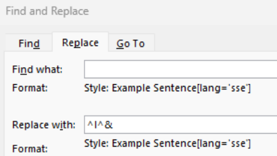

With an empty Find box, and Example Sentence[] as the style, the Find operation will find and highlight the next example sentence text (everything in the Example Sentence[] style). The Replace operation will keep the Example Sentence[] style for the output. The content will be a forced line break (Shift+Enter) from ^l , and then the content of the find operation ^& which would be the original example text. 

One side-effect of this operation is that the line break character is also part of the Example Sentence[] style. If that becomes a problem, it’s challenging getting rid of that. If you highlight the Shift+Return character and use Ctrl+Space, Word removes the style as desired. When you check the style after that, it will be the entry paragraph style. You could search for the ^l with the Example Sentence[] style, and replace it with ^l in some other style. But unfortunately, using (no style) should do the trick, but Word doesn’t change the style in this case. Also, using the entry style for the replacement should work, but again, Word doesn’t change the style. It will only change the style if you change it to some other character style. One option would be to create an “Main Entry” character style and assign it to that. The only other option may be to remove the character style in the internal XML as described in section 2.3.6. 

### 3.4 Removing unused styles in Word

The FLEx Word export does not add new styles unless they are used somewhere in the data. But if you ever want to get rid of unused styles, there is a macro available that will do this. However, 

Page 20 

before doing this, you should be careful that you no longer need the unused styles. Of course, you can always add new styles if needed. See section 3.5 for information on using macros. Here is the script for doing this.ii 

Sub DeleteUnusedStyles() Dim oStyle As Style For Each oStyle In ActiveDocument.Styles 'Only check out non-built-in styles If oStyle.BuiltIn = False Then With ActiveDocument.Content.Find .ClearFormatting .Style = oStyle.NameLocal .Execute FindText:="", Format:=True If .Found = False Then oStyle.Delete End With End If Next oStyle End Sub 

### 3.5 Word macros

Word provides a very powerful Visual Basic programming language to write macros, or scripts, that can be run automatically through the document. You can record sequences of commands as a macro, and then run that later to repeat those steps. After recording a sequence of commands, you can edit the script it produced to make changes to the process. Useful macros can often be found on the Internet. 

If you have a macro script, the first thing you need to do is store that script in Word. One way to do this is to press Alt+F11 to open the VB window. Paste the macro VB code in the window. If you want to run it immediately, with the curser at the beginning of the macro code, press F5 to run the script. Use File > “Close and return to Microsoft Word” to close the VB window and go back to your document. Word macros can be saved in the current document, or in a global location (Normal.docm) to make them available in all documents. 

Once a macro script is stored in Word, it can be run in the future by using View > Macros > View Macros, click the macro name and click Run to run it. 

#### Example recording a macro and running it through your document

You may find something that needs to be fixed throughout your document that can’t be fixed using advanced find. If you can find a sequence of steps to accomplish what you want to do in one location, it is possible to record these steps in a macro, and then make a simple edit to the macro to allow it to be repeated throughout the document. Take this text for an example 

This is a story with [ _italicized_ ] words in the document. The [ _words_ ] also have square brackets around the [ _italicized words_ ], but the [ _brackets_ ] are not part of the Emphasis style. 

The italicized words are using the Emphasis style. What we would like to do is go through the text and add the square brackets to the Emphasis style so that they look better. The Advanced Find dialog in Word allows us to search for a style, and you can make changes within the style, but you can’t work with characters surrounding the style. However, it’s not hard to find a sequence of commands that will make this change in one instance. This can be recorded as a 

Page 21 

macro, and then with a couple edits, it can be modified to go through the file repeating those changes. 

The first step is to set up the Advanced Find dialog to find an instance of the Emphasis style. See section 3.3.1 for instructions on finding styles. The dialog in this case would be: 

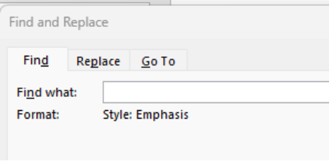

After this is set up and executed once as a test, we are ready to record a macro to make the changes we need. At this point Shift+F4 will find the next occurrence of the Emphasis style. Close the find dialog, and have the style sheet open. Start at the top of the document and follow these steps. 

1. Use View > Macros > Record Macro, give it a name, “AddBracketsToStyle”, then press OK to start recording the macro. (This will store the macro in your Normal.dotm file that will be available to all documents.) 

2. Shift+F4 to find the first use of the style, which highlights the text in the style. 

3. Left Arrow will move the cursor to the left side of the style. 

4. Shift+Left Arrow will highlight the open square bracket. 

5. Click the Emphasis style in the stylesheet to add it to the style. 

6. Shift+F4 to highlight the style text again. 

7. Right Arrow will move the cursor to the right side of the style. 

8. Shift+Right Arrow will highlight the close square bracket. 

9. Click the Emphasis style in the stylesheet to add it to the style. 

10. Macro > Stop recording to end the macro. 

We now have a macro that can be run to find the next occurrence and fix the brackets. What we need next is a way to run the macro repeatedly through the entire document. To do this, we need to edit the macro. You can open the macro in a Word macro editor by choosing View > Macros > View Macros, then select the AddBracketsToStyle macro and click Edit. The macro body should look similar to this: 

Selection.Find.Execute Selection.MoveLeft Unit:=wdCharacter, Count:=1 Selection.MoveLeft Unit:=wdCharacter, Count:=1, Extend:=wdExtend Selection.Style = ActiveDocument.Styles("Emphasis") Selection.Find.Execute Selection.MoveRight Unit:=wdCharacter, Count:=1 Selection.MoveRight Unit:=wdCharacter, Count:=1, Extend:=wdExtend Selection.Style = ActiveDocument.Styles("Emphasis") 

Edit this code by adding the yellow text: 

<mark>Do While</mark> Selection.Find.Execute <mark>= True</mark> Selection.MoveLeft Unit:=wdCharacter, Count:=1 Selection.MoveLeft Unit:=wdCharacter, Count:=1, Extend:=wdExtend 

Page 22 

Selection.Style = ActiveDocument.Styles("Emphasis") Selection.Find.Execute Selection.MoveRight Unit:=wdCharacter, Count:=1 Selection.MoveRight Unit:=wdCharacter, Count:=1, Extend:=wdExtend Selection.Style = ActiveDocument.Styles("Emphasis") <mark>Loop</mark> 

Use Ctrl+S to save the macro and close the VB window. 

**Caution** : this macro is very basic and does not provide protections for running it without setting up the Advanced Find dialog and positioning the cursor to a correct location to start, and does not protect you from running it more than once, causing undesirable results. 

Before executing this macro, make sure the Advanced Find dialog is set to search for the Emphasis style. Assuming your file still has the first occurrence changed from recording the macro, place your cursor after that occurrence, then use View > Macros > View Macros, and click AddBracketsToStyle, then click Run. This will execute the macro on all Emphasis styles after the first one. You should only run this once on your file. If you run it again, each time it will add the character before and after the extended style to the style. 

### 3.6 Editing the internal Word docx file

A Word .docx file is actually a renamed zip file that has several folders and files internally. With the free 7-Zip program (https://7-zip.org/) you can right-click a .docx file and choose 7-Zip > Open archive. You can also right-click the file and choose 7-Zip > Extract to  >  which will unzip the file to a directory with the name of the .docx file. In this directory you can explore the various files. The file that contains the text in the document is word\document.xml. This file contains word OpenXml data structure. You can search for this on the Internet to get some information on it. If you know what you are doing, you can modify this file. To get it back in the .docx file, zipping the directory will probably not work. But you can open the .docx file again in 7-Zip and then drag the modified document.xml file into the word directory. 7-Zip will save the file. You can then close 7-Zip and open the file in Word. Of course, you should always do this on a copy of the original file in case you mess up the file in a way it can no longer be opened. 

## 4 Bidirectional dictionaries in Word

Bidirectional (bidi) dictionaries have data in both left-to-right (LTR) and right-to-left (RTL) scripts. A standard bidirectional algorithm (see 4.3) is used to lay out a paragraph with mixed directions. Entries can be laid out in a LTR or RTL page layout. The direction chosen is typically based on the primary reading orientation of the intended audience. If the language of headwords is RTL and the page layout is LTR, its harder to locate headwords since the part of the headword at the margin is the end of the RTL word. A RTL page layout is easier to read in this respect. In a RTL publication, text is laid out as shown in this sample: 

Page 23 

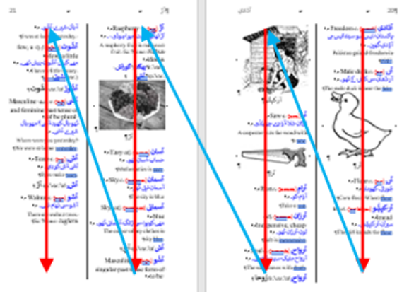

Text is read from right-to-left within a line, and reading continues down the right side of the page to the next column, and continues across a page spread from right to left. Page numbers increase from right to left. RTL (e.g., Arabic) books are opened from the opposite side as they are for a LTR (e.g., English) book. 

### 4.1 Enabling right-to-left publications in Word

Word does a reasonably good job of handling right-to-left publications with page numbers, headers, and columns all flowing RTL instead of LTR. However, it’s not at all obvious how you can get Word to work this way. It turns out, that Word provides some extra options if you have a right-to-left language installed in Office. 

These instructions are for Office 2019 on Windows 11, so may vary somewhat with other versions. To install the language, before opening Word, use the Windows start icon to find Microsoft Office Tools, and under that, open Office Language Preferences. In this program, you need to have at least one RTL language installed as an Editing Language. If you do not have one, and you do not have a preference for which RTL language to install, in the “Add additional editing languages” chooser, select Arabic (Saudi Arabia) and then click Add. At this point it won’t be enabled, so click the “Not enabled” link. This will take you to the Windows Language & region dialog where you will need to click “Add a language”. After selecting the language in the list, click Next, and select the Language pack option. Be careful not to check “Set as my Windows display language”. Click Install to install the language pack. You do not need to install the other options such as speech recognition and proofing options. You can then click OK to close the Office Language Preferences dialog. Now Word will have options to produce RTL books. 

For RTL book layout, go to File > Options > Advanced, there are some new features under Editing Options, and Show Document Content. Under Show Document Content, Set Document View to Right-to-left. At this point Word will properly lay out books in RTL mode. Unfortunately, this is a global Word setting, so if you have a mix of LTR and RTL documents, you’ll have to change this each time you switch to another direction. 

Page 24 

### 4.2 Basic RTL layout in FLEx and Word

When the primary language in a publication is right-to-left, here are some hints on how to set up the language and configuration to handle this. 

#### Settings in FLEx

These are the basic settings you need in FLEx for an RTL publication. 

- In Format > Set up Vernacular Writing System, make sure “Right-to-left” is checked in the General tab. 

- In Format > Styles > Normal > Paragraph, set Direction to Right-To-Left, and set Alignment to Leading. Note, right alignment will not work well when exporting to Word. 

#### Settings in Word

These are the basic settings you need in Word for an RTL publication that is imported from FLEx. 

- In File > Options > Advanced > Show Document Content, set Document View to Right-toleft. If this option isn’t available, see section 4.1. This is critical for RTL books to lay out correctly. 

- In the Layout tab, click the icon at the lower right of the Page Setup section, and in the dialog that comes up, in the Layout tab, set Section direction to Right-to-left. This is critical for RTL documents so that the first column on the page is on the right side. FLEx sets this automatically during export of RTL documents, so this step is not necessary for Word exports. 

- In Word, most RTL fonts are considered Complex Scripts, and use the Complex Scripts settings in the Font dialog. FLEx sets these settings for fonts that are used in the import, but if you assign other fonts in Word, be sure to use the Complex Scripts settings. 

### 4.3 Bidirectional algorithm

Unicode provides guidelines on how bidirectional (mixture of left-to-right and right-to-left) text should be displayed in a paragraph2 . For a simple example, take this simple dictionary entry with a headword, a definition, an example sentence, and a translation of the example. 

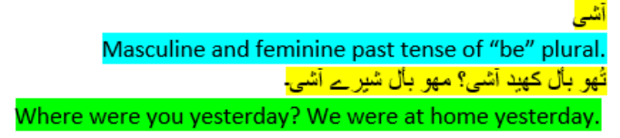

It’s pretty easy to read when each field is on a line by itself. But when it is put together in a paragraph, things get a little more complicated. 

> 2 Unicode Bidirectional Algorithm https://unicode.org/reports/tr9/ 

Page 25 

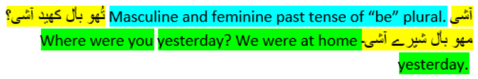

The algorithm lays out text RTL and puts what it can in each line. In the top line after the definition, the example only partly fits on the line, so the rest of the example goes on the next line, starting at the right. The translation fills out the rest of the second line, but the final part overflows to the third line. Now if this gets printed in double-column, it gets more interesting. 

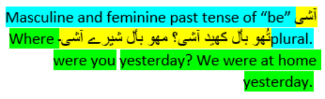

In this case the definition flows on to the second line. The example fits on the second line. But the translation starts on the second line, fills up the third line, and finishes on the fourth line. If this were printed in three columns, the result is this. 

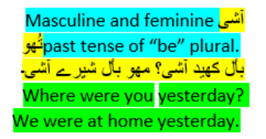

The definition fits on the first and second lines. The example starts on the second line and ends on the third line. The translation goes on the third and fourth lines. 

There are times the default algorithm needs to be overridden to produce desirable results. Unicode provides several code points to assist in handling special cases. These code points are summarized in this table. 

| Abbr. | Code | Name | Description |
|----|----|----|----|
| LRM | 200E | Left-to-Right Mark | Left-to-right zero-width character |
| RLM | 200F | Right-to-Left Mark | Right-to-left zero-width non-Arabic character |
| ALM | 061C | Arabic Letter Mark | Right-to-left zero-width Arabic character |
| LRE | 202A | Left-to-Right Embedding | Treat the following text as embedded left-to-right. |

Page 26 

| RLE | 202B | Right-to-Left Embedding | Treat the following text as embedded right-to-left. |
|----|----|----|----|
| LRO | 202D | Left-to-Right Override | Force following characters to be treated as strong left-to- right characters. |
| RLO | 202E | Right-to-Left Override | Force following characters to be treated as strong right-to- left characters. |
| PDF | 202C | Pop Directional Formatting | End the scope of the last LRE, RLE, RLO, or LRO. |
| LRI | 2066 | Left-to-Right Isolate | Treat the following text as isolated and left-to-right. (LRI will not work in Word.) |
| RLI | 2067 | Right-to-Left Isolate | Treat the following text as isolated and right-to-left. (RLI will not work in Word.) |
| FSI | 2068 | First Strong Isolate | Treat the following text as isolated and in the direction of its first strong directional character that is not inside a nested isolate. (FSI will not work in Word.) |
| PDI | 2069 | Pop Directional Isolate | End the scope of the last LRI, RLI, or FSI. (PDI will not work in Word.) |
| NBSP | 00A0 | No-Break Space | A space that will not allow a line break. (This is not a bidi code point, but is useful in various places.) |

### 4.4 Formatting bidirectional entries in FLEx

Bidirectional dictionaries provide numerous challenges in getting a reasonable result. Some of these issues will be explored in this section. FLEx supports all of the special codes summarized in the table in section 4.3. These codes could be inserted in the middle of fields, but most fields are a single writing system so they are not needed. However, when Before and After text is added in dictionary configuration, this text does not have a writing system. When mixed with bidirectional fields, getting the right results can be challenging. It’s further challenging because programs do not always treat the bidi code points the same. One obvious case is that Word does not support LRI, RLI, FSI, and PDI, so even though FLEx can use these, if you plan to export to Word, they cannot be used. Even though you can get a perfect display in FLEx, when it gets exported to Word, you may find that Word doesn’t follow the same rules. It may take a lot of trial and error to get the desired formatting in FLEx that also looks the same in Word. What works best is to pick a small set of entries that demonstrate all of the field and paragraph possibilities and then export these to Word. In places that Word doesn’t work, by trying some different bidi commands, it’s usually possible to come up with a set that will work in both places. 

In dictionary configuration in FLEx, the code points in the bidi chart in section 4.3 can be entered in Before, Between, and After configuration for each field. To enter the codes, enclose 

Page 27 

the abbreviation from the chart in square brackets. For example, the RLE code would be entered in the configuration as [RLE]. In the underlying Word file, this would be Unicode character U+202B. 

Suppose we have a simple entry that includes a headword, a pronunciation, a part of speech, and a definition. The goal is to have it print like this in Word 

To put a period and space after the category and square brackets around the pronunciation, we would normally use this, where the middle dot is really a space in configuration. Gram Info (Abbr):  After: .∙ 

Lexeme Form (IPA): Before: [  After: ]∙ 

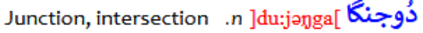

Two problems are obvious immediately in FLEx. The period is on the wrong side of the category, and the square brackets are backwards. The basic problem is that Before and After text does not have a writing system. So, when FLEx lays out the pieces going right-to-left, we have the headword, then the open square bracket, the pronunciation, the closing square bracket, the category, the period, and then the definition. We could get the desired output by putting the period in Before text and putting in backward square brackets in the Before and After. But this is technically not correct, and will cause other problems along the way. 

One option is to use left-to-right isolates around the grammar info and the lexeme form. Gram Info (Abbr):  Before: [LRI]  After: .[PDI]∙ Lexeme Form (IPA): Before: [LRI][  After: ][PDI]∙ 

This works perfectly in FLEx. Unfortunately, Word does not support the isolates. It’s closer to what we want, but it displays the isolate codes with undesirable glyphs that can’t be removed. It looks like this: 

We can test the embedding codes to see how that works. Gram Info (Abbr):  Before: [LRE]  After: .[PDF]∙ Lexeme Form (IPA): Before: [LRE][  After: ][PDF]∙ 

This gets the square brackets and period working correctly in FLEx, but now there is a positioning problem. The pronunciation is an entry field and should follow the headword. But in this case the category is following the headword. The bidi algorithm sees the headword and category as one LTR string, which ends up with the wrong order. 

The way to solve this is to use the Arabic Letter Mark which prevents the bidi algorithm from putting the pronunciation and category together. Gram Info (Abbr):  Before: [LRE]  After: .[PDF]∙ Lexeme Form (IPA): Before: [LRE][  After: ][PDF][ALM]∙ 

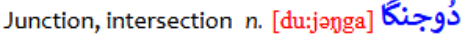

FLEx: 

Page 28 

##### Word:

Now FLEx and Word are showing what we want, except the square brackets around the pronunciation are using the wrong font and style. This is because before, between, and after text in Word uses the same style for all fields. If you run into a problem like this, Word does not have a built-in capability in the Advanced Find dialog to make changes outside a single style. However, using macros as described in section 3.5.1, it’s fairly easy to make this kind of change. In this case we want to add the square brackets to the “Lexeme Form[lang='trw-fonipa']” If you recorded a macro for doing this, the arrow keys would be in the opposite direction of what’s described in section 3.5.1 because of the RTL data, and the style is different as well. But the underlying macro code is the same as AddBracketsToStyle described in that section other than the style. After running the macro, the results are good. 

The discussion above illustrates some of the kinds of challenges that will likely be encountered when configuring Bidi dictionaries in FLEx, and some specific challenges when using Word. Any time you add Before and After fields, there is a good possibility you will need to use some of the Bidi code points to get the desired result. It’s also important to test all of these after importing into Word to make sure they work the same way as they do in FLEx. Here are some examples of bidi code points added to FLEx configuration. 

- For sense number: Before: [RLO]  After: )[PDF][NBSP] to keep together and to get correct RTL ) glyph. 

- One way to reduce the bidi complexities is to start some fields on a new line: Before: \A 

- For scientific name: Before: \A[LRE]Sc.[NBSP]Name:∙  After: [PDF]  to keep together and start a new line. 

- For Dialect Labels Before: [RLO][   After: ][PDF]∙ 

i Macro from https://wordribbon.tips.net/T000997_Preventing_Styles_from_Changing.html ii Macro from https://word.tips.net/T001337_Removing_Unused_Styles.html