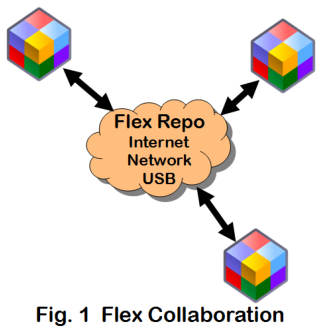
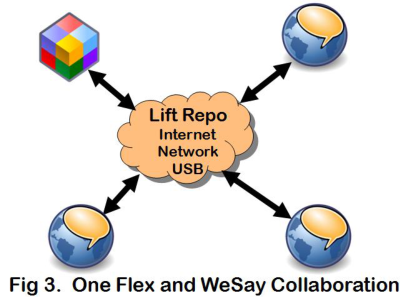
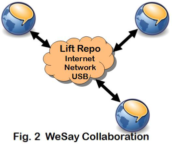
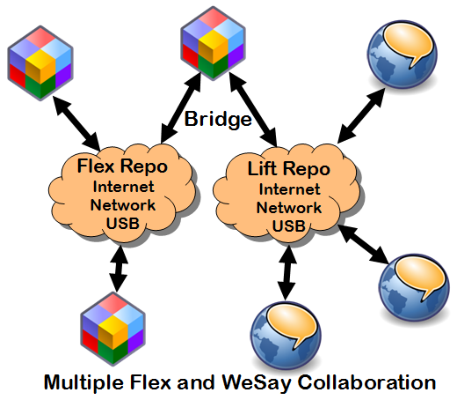
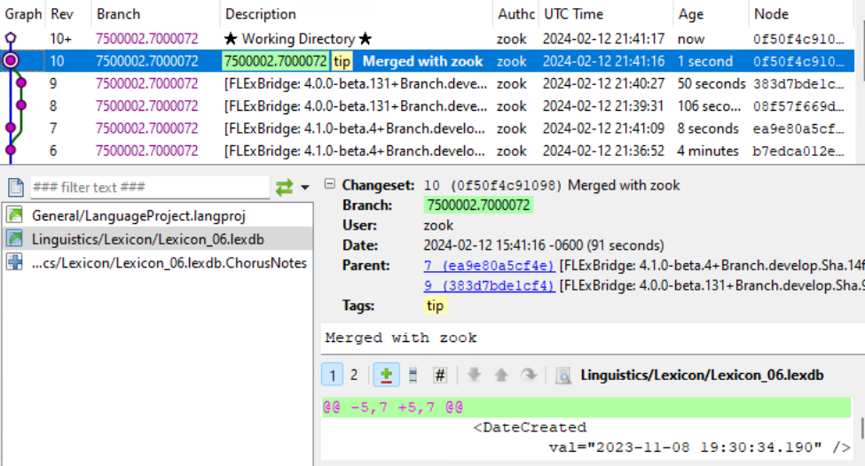
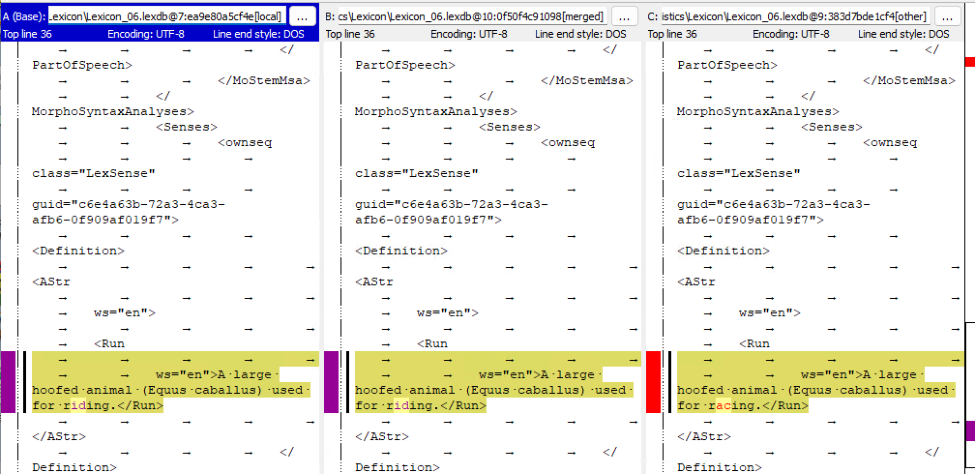
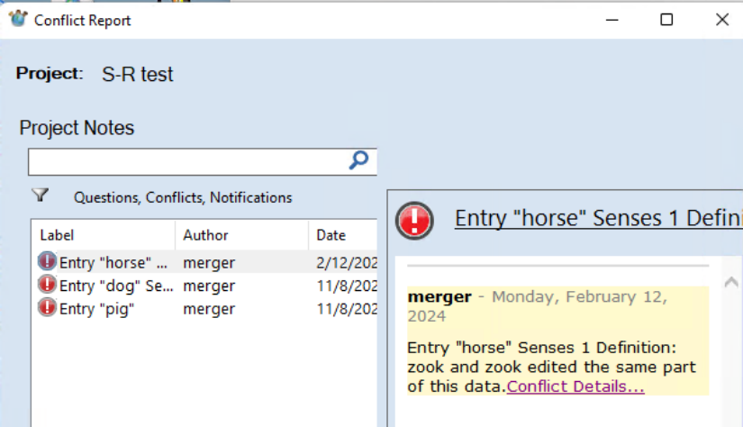
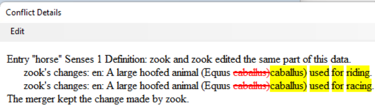
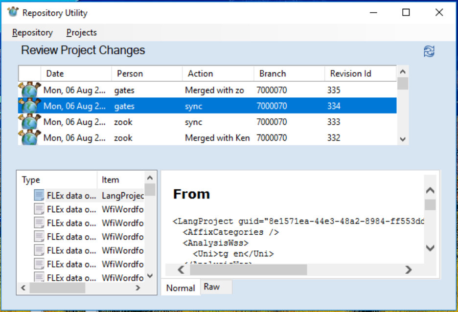
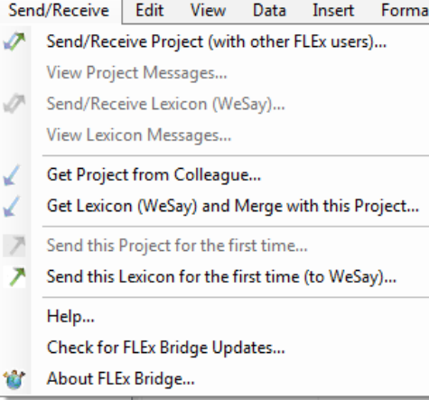

# Technical Notes on Fieldworks Send/Receive

1 Send/Receive Introduction 

1 

August 13, 2026 


## 1 Send/Receive Introduction

FieldWorks Language Explorer (FLEx) provides two ways to collaborate with colleagues working on the same project. The first approach (starting in FieldWorks 7.3) includes the entire FieldWorks project: the full lexicon, grammar, interlinear texts, data notebook, scripture, lists, pictures, sound files, writing systems, and some configuration information. This is the approach that should be used whenever you are collaborating with other FLEx users. The second approach is via the Lexicon Interchange Format (LIFT). This approach should only be used if you are 

1 Send/Receive Introduction 

2 

collaborating with WeSay or later users or some future program that can only use LIFT. LIFT only includes the lexicon, parts of grammar, writing systems, pictures, and sound files. The LIFT format does not cover as much detail in the lexicon as the FLEx project format, so the results are less satisfactory when using features of FLEx that WeSay does not use. There are a number of complications when using LIFT (see 3.4 WeSay/LIFT collaboration). 

The interface, websites, and procedures have changed over the years. This documentation is for FW9.2.8 or later with FlexBridge 4.2.0 and WeSay 2.0 or later. 

With either approach, collaboration can be through any combination of the following 

1. Internet server (e.g., https://hg-public.languageforge.org/) which requires some initial setup on the server. 

2. USB drive (no setup needed) that is passed around to users. 

3. Local Network using Chorus Hub (requires setting up an instance of Chorus Hub on a single machine on a network). 

If you are just collaborating between FLEx users, you would only use a FLEx repository (repo). 





If you are just collaborating between WeSay users and one optional FLEx user, you would only use a LIFT repo. 







1 Send/Receive Introduction 

3 

If you are collaborating with multiple FLEx users and one or more WeSay users, then you will need a separate FLEx repo for collaboration between FLEx users, and a LIFT repo for collaborating between WeSay users and a FLEx user. It’s critical (explained below) that only one FLEx user act as a ‘bridge’ between the two repos. This user would periodically sync with the LIFT repo and the FLEx repo. Other FLEx users would just sync with the FLEx repo, and WeSay users can only sync with the LIFT repo. 





The FLEx Send/Receive menu has changed in different versions since FW7.3. This document was written for FLEx 9.1.24. Here is a brief summary of how the Send/Receive process works between two or more FLEx users. 

One user starts the collaboration process from a master copy of the project. This user does an initial Send/Receive > Send this Project for the first time to store a copy of their project in a Mercurial repository (repo). Each colleague then gets a copy of the project from the repo using Send/Receive > Get Project from Colleague. After that, all colleagues periodically do Send/Receive > Send/Receive Project (with other FLEx users) (S/R) to keep their projects synchronized with their colleagues. 

If colleagues are working in different parts of the project, the S/R will merge their changes without any conflicts or loss of data. If colleagues change the same piece of data (e.g., the definition of the same sense), during the S/R process the program will merge the changes the best it can (e.g., picking one of the two definitions), then add a conflict report warning the users about a change that was made that would be wise to review. If an undesirable change was made in a merge, the user will need to fix the appropriate data manually. 

The current S/R process does not support different privileges for different users. Any user doing S/R can modify any part of the data. There is no Read-Only access to prevent a user from accidentally making changes. However, a user can emulate a Read-Only process by never doing Send/Receive > Send/Receive Project. Instead, to get the latest from the server, delete your project folder, then do Send/Receive > Get Project from Colleague. This will never make any changes to the repo. Another option is to use Language Forge (https://languageforge.org/) where you can restrict users to certain parts of the data including Read-Only. 

When you delete a project folder and do Get Project from Colleague, you will lose various settings including columns, filters, fonts, keyboards, etc. After getting a new project from 

2 Getting started 

4 

Lexbox, you will need to adjust window sizes, columns, etc. If you are not using the default Root-based dictionary configuration, you will need to select your desired layout. You also need to check to make sure that all writing systems are set to the desired font and keyboard. There is a way you can avoid losing all of this except your dictionary layout, by saving a few files prior to deleting your project (or move your project folder to some location other than the Projects folder), then copying these files back into the original project directories while FLEx is stopped. The three files are SharedSettings\*.ulsx (for font and keyboard settings) ConfigurationSettings\Settings.xml ConfigurationSettings\db$local$Settings.xml 

These files, and your default dictionary layout are not included in S/R because they are just local to your machine. 

With each S/R operation, changes and new information are appended to the repo with a timestamp. Merges use a 3-way process that can generally tell whether the change was an addition by one user, a deletion by one user, or a modification by both users. Each user has a local (hidden) copy of the repo as it was the last time they did a S/R, so this helps the program to know what changed since their last S/R. FLEx does not provide a way to see what changed during a S/R—it only shows merge conflicts that occurred. Some special programs outside of FLEx (e.g., https://tortoisehg.bitbucket.io/) let you see the history of changes in the repo, and it is possible to go back in time to an earlier version of the project, but this takes more advanced skills. 

When using S/R with a project, you can still back up your project using FieldWorks backup, but you need to be very careful about using a FieldWorks restore, as this will likely cause all colleagues to lose their work since the backup was made. To avoid this problem, FLEx will not allow you to restore over a project that is using S/R. 

## 2 Getting started

### 2.1 Starting up a Project (FLEx) Send/Receive

Before your first S/R you should make sure that you have a single project that can be considered your master project. If two users created their own FieldWorks project and added entries independently, the merge collaboration will not work. Also, if two users started with the same FieldWorks project, but have made independent changes, the merge collaboration will not work. This is discussed in more detail later. If you have multiple projects, you should find some way to merge these before doing your first S/R. Once you do the initial S/R of your project, all other collaborators need to delete or move (not just rename) any copies of the old project from their FieldWorks Projects directory (usually C:\ProgramData\SIL\FieldWorks\Projects) and then start over by getting the master project from the external repo. 

If you plan to use the Internet, or Chorus Hub options, you first need to set these up. For details, see 2.5 Lexbox Internet , or 2.4 Chorus Hub startup. 

The first step is for one user to do an initial S/R from their master FLEx project. To do this, follow these steps. 

1. Go to Send/Receive > Send this Project for the first time. 

2 Getting started 

   2. FLEx brings up a Send/Receive dialog with some instructions. Click “OK (I have the master project)” to continue. 

   3. Optionally type a label in the Send/Receive Project dialog 

   4. a) Click USB Flash Drive or Chorus Hub if you are not using the Internet button. This will start the Send/Receive process to the specified device. b) For Internet 

      1. Click the blue Settings… button in the lower right to bring up the Send/Receive Settings dialog. 

      2. In the Login field type your Lexbox login, which is usually your email address. 

      3. Type your Lexbox password, which is case-sensitive 

      4. Click the Log in button to connect to the Lexbox server (the URL will contain public.languageforge.org). 

      5. Select the Bandwidth. The default is “High Bandwidth” which sends the full information in one transaction. This is usually the best choice, however, there is a Cloudflare firewall on the server that limits a single transaction to 200 Mb, so if your project is too large, you will need to use “Low bandwidth” for the initial upload which sends data in multiple transactions. 

      6. Type (or select) the Lexbox Project ID. 

      7. Click OK to close the Send/Receive Settings dialog. 

      8. Now the Internet button should be enabled. Click Internet to start the Send/Receive process. 

9. When completed, click the Close button to close the Send/Receive Project dialog. 

Every other user that wants to collaborate with this project then needs to do a one-time setup to get the project on their machine. To do this, follow these steps. 

   1. It’s best to have the same version of FieldWorks installed on your machine that was used for the master project. There are some exceptions. For example, FW9.0.17 and FW9.1.24 are still able to Send/Receive. 

   2. If this is your first time to get a Fieldworks project, skip this step 

      - If you already have some version(s) of this project on your machine, it is best to delete these projects from your Projects folder to avoid possible confusion in working on the wrong project. This can be done in FLEx using File > Project Management > Delete Project if you can do this from another open project. Otherwise, delete the project folder(s) in C:\ProgramData\SIL\FieldWorks\Projects. The default settings for Windows File Explorer will not show the ProgramData directory. You can still get to it by typing “c:\ProgramData” into the edit box at the top of Windows File Explorer. When you press Enter, you will see the SIL directory and you can navigate to the Projects folder. 

      - If you have previously worked on this project using Send/Receive, and the Lexbox repository (repo) has not been reset, and you have not deleted the project folders from the Projects directory, the next step will fail. This is because a unique ID is assigned to a repo, and it stays with that repo on all machines. When a Lexbox repo is reset, it gets a new unique ID. If you try the next step, after downloading the project, FLEx looks for any other project directory, regardless of the directory name, and if it finds one using this ID, it will abort saying you already have the project and you should use Send/Receive > Project to update the data. If you don’t want to do a normal S/R, which will merge any changes from your current project directory with other users, 

2 Getting started 

then you either need to delete the project directory, or move the project directory outside of the Projects directory before going to the next step. 

3. Start FLEx. If the startup screen comes up, choose “Get project from a colleague”. Otherwise, go to Send/Receive…Get project from colleague. Either option will bring up a “Receive project” dialog. 

4. Choose the location of the repo holding your project 

   - a) Click USB Flash Drive or Chorus Hub, or 

   - b) Click Internet. 

   1. Enter your Lexbox login name (typically an email). 

   2. Enter your Lexbox password, which is case sensitive. 

   3. Click “Log in”. As long as your user name and password are correct, it will open up several more steps. 

   4. Select the Bandwidth. The default is “High Bandwidth” which sends the full information in one transaction, which is faster. This is usually the best choice. But if it fails for some reason, you could try again with Low bandwidth which sends the data in chunks. 

   5. Your Project ID will likely be filled in at this point. If not, or if it is the wrong project, either type the correct ID, or click the chooser on the right to select the right project. 

   6. Type the project folder name you want to use on your computer (usually the language name without the full path). The project folder will be created in your FieldWorks Projects directory. 

   7. Click Download to start the download. 

This process will create a new project folder in your FieldWorks Projects directory 

(C:\ProgramData\SIL\FieldWorks\Projects by default) which will contain a copy of what was in the repo at that point, and then open the project in FLEx. 

Another way colleagues can get started after the first user did the initial S/R is to copy the entire FieldWorks project directory from the first machine to the other machines. If you do this, the first time each user does a S/R, they should click the Settings link in the Send/Receive Project dialog and change the “Name to show in change history:” to the current user. 

Once each user has a current copy of the project on their computer, they can periodically do Send/Receive > Send/Receive Project (with other FLEx users) and click the desired location for synchronization. You can do another S/R to a different location if you want to keep several repos in sync. 

### 2.2 Starting up a Lexicon (LIFT) Send/Receive in FLEx.

WeSay 2.0 or greater is required to do S/R with current versions of FLEx. The master project for starting S/R can be either a FLEx or a WeSay project. Note there are a few compatibility issues between FLEx and WeSay. See 4.7 FieldWorks and WeSay compatibility issues for more details. 

If a FLEx user is setting up the initial LIFT repo, use Send/Receive…Send this Lexicon for the first time (to WeSay) and then select the desired destination. 

If a LIFT repo has already been set up by WeSay, and there is no FLEx project for this language, then the FLEx user needs to connect to the existing repo using Send/Receive…Get Project from Colleague. FLEx will realize that the project is a LIFT repo, so it will create a new FLEx project based on the LIFT repo. 

2 Getting started 

7 

It’s possible that you have been collaborating between FLEx and WeSay in the past, but the connection may get broken. For example, if your FLEx project directory gets deleted and you restore from a current FLEx backup. (Note restoring a backup when using Send/Receive is usually dangerous. See Section 4.3 for more details.) To get reconnected to an existing LIFT repo, you need to use Send/Receive > Get Lexicon (WeSay) and Merge with this Project. This will do the initial sync to the LIFT repo without losing other information in your FLEx project, such as interlinear texts. Before doing this command, inside your FLEx language project folder, look for an OtherRepositories folder. If there is anything inside this folder, delete it first. 

Once the initial connection has been established, then use Send/Receive…Lexicon (WeSay) whenever you want to sync with the LIFT repo. 

### 2.3 Starting up Send/Receive in WeSay.

WeSay 2.0 or greater is required to do S/R with current versions of FLEx. The master project for starting S/R can be either a FLEx or a WeSay project. Note there are a few compatibility issues between FLEx and WeSay. See 4.7 FieldWorks and WeSay compatibility issues for more details. 

If a WeSay user is setting up the initial LIFT repo, In the WeSay Home tab, click the Send/Receive button, and then choose the destination for the repo. 

If a LIFT repo has already been set up by FLEx or another WeSay user, and there is no WeSay project for this language on your machine, then you need to use the WeSay Configuration tool to get connected. In the WeSay Configuration Tool opening dialog, choose one of the three “Get…” commands; USB drive, Internet, or Chorus Hub. choose the desired repo, then click Copy To Computer. This will create a WeSay project on your machine that will be in sync with the repo. 

Once the initial connection has been established, then use Send/Receive in the WeSay Home tab whenever you want to sync with the LIFT repo. 

### 2.4 Chorus Hub startup

Chorus Hub uses a “Chorus Hub Sharing Service” service on the server computer so that it is always available if the server computer is on. FieldWorks and/or WeSay software is not required on the Chorus Hub server. Chorus Hub can be installed on any computer on a network. Only one computer on a network can be running Chorus Hub. When a FLEx or WeSay user uses Send/Receive and they are connected to a network, as long as there is a Chorus Hub server running, the Chorus Hub options are available. The project repositories are stored in folders under c:\ChorusHub on the Chorus Hub server machine. The latest Chorus Hub should support older versions of FLEx Bridge. It should be possible to use a mixture of versions of FLEx Bridge and Chorus Hub without causing problems. But it is recommended that collaborators use current versions of software. 

You can download the latest version of Chorus Hub from https://software.sil.org/chorushub/. To install, download the installer, and then run it. Since Chorus Hub is installed as a service, it can’t easily warn you about another Chorus Hub already running on the network since services do not use dialogs. In the S/R dialogs Chorus Hub identifies the machine on which it is running. If for some reason you want to have Chorus Hub server installed on more than one machine on a network, you should stop all services except the one you want to use. During installation, the 

2 Getting started 

8 

service will be set to Automatic which means it starts whenever the machine is booted. To start or stop the service, you can type Services in the Start dialog, then click Services at the top of the menu. In this dialog, find Chorus Hub Sharing Service in the right pane. You can right-click this and choose to Start or Stop the service. With more than one installation, you should go to the Properties on this service and set the Startup type to Manual on all but your primary machine which should be set to Automatic so it will start up automatically when you reboot. 

If you need to delete a project in c:\ChorusHub, it’s best to stop the Chorus Hub service while deleting the directory, then start it again when done. 

When you uninstall Chorus Hub through Programs and Features, it will automatically stop and uninstall the Chorus Hub service. 

The Chorus Hub service will send messages to the Event Viewer when there are problems. To see these, type Event Viewer in the Start dialog, then click Event Viewer at the top of the menu to open the event dialog. In the left of this dialog, open the Windows Logs node and click the Application node. Any messages from Chorus Hub will show up in the right pane. 

If you install Chorus Hub service on a machine when another machine on the network is already running Chorus Hub, the installation takes place, but when it tries to start the service, it fails and gives a red error icon in the Application log. When you click this you’ll see a message, “Only one Chorus Hub can be run on a network but there is already one running on …” The message will list the machine that is currently running Chorus Hub. The service will remain installed and set to Automatic. Thus, when the computer is restarted it will try to start again and will succeed if the other Chorus Hub is no longer running. Otherwise it remains off. 

See 4.1 Chorus Hub issues for further information on how to solve problems you might encounter with Chorus Hub. 

### 2.5 Lexbox Internet setup

Lexbox (formerly Language Depot) is an Internet server that hosts repositories for various programs including FieldWorks and WeSay. Projects are managed at https://lexbox.org/. In order to use Send/Receive in FLEx, you first need to have a project on Lexbox. You also need to have a user account on Lexbox assigned to the project. 

**Create user account:** To create a user account, go to https://lexbox.org/register. Fill in your name, a valid email, and a password (case sensitive). Then click Register. An email will be sent to your email address and you must click the verify button to complete your registration. If someone adds you to an existing project, the next time you log in, the project will show up in your My Projects page and you can see further details by clicking the project. If you haven’t opened this project yet in FLEx, the “Set up project” button will tell you what steps to take. It’s also possible to “Sign in with Google”. When you do this, you have to sign in to your Google account, and Lexbox will skip sending an email for a confirmation. 

**Create project:** To create your first project, from your My Projects page, click the “Create Project” button. In the page that comes up, fill in the requested information: 

- Name: Enter the name of the project; typically, the language name. 

- Project type: FieldWorks 

2 Getting started 

9 

- Organization: Pick an option or leave “No organization”. 

- Members: Leave None for now. 

- Purpose: Choose the appropriate option. 

- Language code: Type a code that identifies the language. Normally this should come from https://www.ethnologue.com. 

- Custom Code: Normally leave this unchecked. 

- Code: Lexbox will normally construct a code from the options you’ve entered. If that code is already used, it gives a red “Project code already used”. In that case, click Custom Code, and alter the code manually to get a valid code. Codes should be lowercase a-z and may include digits and hyphens. This code is the Project ID used in the FLEx Send/Receive dialogs to access the project. 

- Description: Write an optional description giving some useful information on the purpose of this project. 

- Confidential. Check this box if this project is sensitive in some way. When it is checked, only project members and administrators will be able to see it. 

- After filling in the project information, click Create Project. If it won’t activate, check above for a red option that needs to be corrected. 

After the project is created, it will open the project. At this point there are no members in the project. In order to use the project, you need to add your email to the Members list. Click the Add/Invite Member button, enter your email, and select Manager, so that you will be able to add or remove other users to the project, if desirable. Once you are a member of the new project, then in FLEx you should have access to this project in the Send/Receive dialogs. 

**Add/Invite Member:** As a project manager, you are able to add other Lexbox users as members to your project to give them access. To add a user from the project page, click the “Add/Invite Member” button, type in the email address of the user, and select an appropriate role (Editor or Manager) for that user, then click “Add Member”. If you add an email that hasn’t been registered as a user, it will have a red comment, “No user was found with this Login”. If you want to invite this person to join Lexbox, click the Invite checkbox. Then when click “Add Member”, an email will be sent to that address, and if the recipient clicks the “Verify email” button in the email within 3 days, Lexbox they will add the user to the project. Lexbox automatically sends an email to anyone you add to let them know that they have been added to the project, The email will have a “View Project” button that will open the project in Lexbox. 

**Remove member:** As a project manager, you are able to remove members from your project. To remove a member from the project page, click the 3-dot menu to the right of the member button and choose “Remove”, then as a confirmation, click “Remove Member”. 

**Change member role:** As a project manager, you are able to change the role of a member in your project. To change the role from the project page, click the 3-dot menu to the right of the member button and choose “Change Role”, then select the desired role and click “Change Role”. Editors can access and modify the project, but cannot add or delete members to the project. 

2 Getting started 

10 

**Create additional projects:** If you are assigned as a manager on a project, then you can create a new project directly. From your My Projects page, click “Create Project”. In the page that comes up, fill in the details as described above. When you go back to My Projects, you may need to refresh the page to get it to show. 

**Delete Project:** As a project manager, you can delete the project if you no longer need it. To do this, from your My Projects page, click the project. When you are in the project page, click “More settings” at the bottom, and it will provide a “Delete Project” button. Click that button and type “DELETE PROJECT”, then click “Delete Project” a second time. Note after deleting a project, colleagues that were using this account will need to delete their project folder in FLEx. Until this is done, the project will still have a copy of the deleted project repo in the .hg directory. 

**Change user account:** From the home page, your user account name is in the upper-right corner of the page. Click that and go to “Account Settings”. In this page you can change the display name or email address. You can also reset the password. Click “Update account info” when done. If you change the email address, click “Update User”. This will send an email to the new address that will require a response from the email before the change is made. 

**Delete user account:** If you no longer need a Lexbox user account, you can delete the account. From the home page, your user account name is in the upper-right corner of the page. Click that and go to “Account Settings”. Click “More settings” at the bottom, then click “Delete Account”, type “DELETE ACCOUNT” as a confirmation, then click “Delete Account”. This will take you back to the login page, and your access to all projects on Lexbox will be removed. 

Lexbox administrators can access some other features that are not available to normal users. This includes access to all projects through an Admin Dashboard that allows searches in project and user names, and an option on a user to filter projects to ones this user can access. A More Settings option allows an administrator to delete any project, verify a repository, and reset a repo. When resetting, they can optionally download a current zipped copy of the repo, which can then be processed on the local machine, they can reset the repo, and optionally upload the zipped repo or leave it blank so a user can send to a blank repo. 

**Bulk Add/Create Members:** This button, only available to Lexbox administrators, allows the administrator to add multiple users to a project with a shared password. The primary purpose is to allow an administrator to set up projects for less skilled users. Verification emails will not be sent for these users. You can enter multiple emails or Login names, one per line. If there is not a Lexbox account with the email or login, it will automatically add a Lexbox user to the system with this email or login. When done, click Add/Create Members. The listed people are added as Editors for this project. For people you add, when they log into FLEx S/R they would use the email or login, plus the shared password. The shared password is only available until the user sets their password to something else. Users created like this are marked as such internally and have some limitations: 1) they're the only users that can be members of any project without having a verified email address, and 2) they can't be made managers of a project until they have a verified email address, since it’s important for Lexbox administrators to be able to contact project managers. 

3 How it works, or why it doesn’t 

11 

## 3 How it works, or why it doesn’t

For the most part, changes from all colleagues will be merged successfully. However, remember the program has definite limitations when merging results between users. If you don’t consider these limitations, you may get results that are baffling and disappointing. 

When users change different things in the project, the changes will merge without problems. However, when users modify the same thing, this results in a conflict that needs to be resolved. To keep the S/R process functioning quickly, FLEx will not stop and ask the user about each conflict before finishing the S/R. Instead, the process picks one of the two conflicting changes and then adds a merge conflict report describing the conflict and what the program did to resolve it. Most common conflict descriptions will be clear to the user. However, there are some things that can change that are internal to the FieldWorks model, and there isn’t a simple way to explain this to the user, so it may just show some underlying XML in the conflict report in these cases. When a S/R completes and the project is reopened, if new merge conflicts have occurred, the Conflict Report dialog will come up to show conflict history. At any time, the user can investigate the conflict reports and decide whether the program’s guess was good or not, and fix any that were incorrect. To open the Conflict Report dialog, use Send/Receive > View Project Messages (for a FLEx repo) or Send/Receive > View Lexicon Messages (for a LIFT repo). At this point it requires a manual edit to fix any conflicts that were resolved incorrectly. The conflict report has a link that will try to take you to the spot that changed in FLEx. Technically, if there is a conflict, the person doing the merge will win (except for deletions described later), but because it’s not easy to determine which user will actually initiates the merge for a given object, it’s best to assume that the winner is random. 

Conflict information is stored in special XML files (*.ChorusNotes) that are merged along with the data. The user can mark conflicts as resolved so they don’t normally show in the conflict dialog, but there isn’t any way in the program to actually delete the conflicts. So if you get a large number of conflicts, these conflict files can get very large. They can be deleted as long as another user does not modify them during the same S/R cycle. Also, from time to time it’s usually best to reset the Lexbox repo to reduce its size, and typically ChorusNotes files are removed in this process, except for the one in the root project directory which holds messages rather than merge conflicts. 

### 3.1 Lexicon examples

Merging entries is not based on the headword, but on an internal unique identifier (id) that is assigned to an entry when it is created. The reason for this id is that headwords do not uniquely define entries since you can have homographs, and homographs are not unique because they can be renumbered or adjusted when switching to a different writing system, etc. Entries can also have the same headword but have a different morpheme type (prefix, suffix, root). Headwords can also be misspelled, but when corrected, we don’t want the entry to be considered a different entry, especially when lexical relations and interlinear text depend on it. The computer needs something that is created once when an entry is created and it will never change for the life of the entry. The technical name for this is a Globally Unique Identifier (guid). Anything inside FLEx that references this entry uses that id. 

If I create an entry for ‘house’, and my colleague also creates an entry for ‘house’, each one will have a different id, so when we merge our projects using S/R, the result will have two entries for 

3 How it works, or why it doesn’t 

12 

‘house’. Duplicate entries can be merged one at a time using the Tools > Merge with entry option, but it doesn’t happen automatically. If two users take a list of words and both add them to the lexicon, after they are merged, as far as humans are concerned, there will be duplicates of every word. The computer knows they have different ids, so it thinks it did a great job of merging the entries. On the other hand, if one user adds words from A-M and another adds words from N-Z, and they merge their projects, everything will be great since the human and computer agree that these are different entries. 

Likewise, the computer assigns a unique id for every sense that is created within an entry. Again, there isn’t any other unique way a computer can identify a sense because some senses may have the same or missing gloss, definition, part of speech, etc. If I added a new sense for ‘house’ with a gloss ‘political body’, and my colleague did the same on his machine on the same entry, when we merge the projects, ‘house’ is going to have two identical senses from a human perspective, but the computer considers them different because they have different ids. These duplicate senses can be merged one at a time using the Merge Sense into menu option on a sense, but it is not automatic. 

During the Send/Receive merge process, once the computer realizes two people changed the same entry or sense based on the id, then it will do the best it can at merging the changes within that ‘object’. At least it knows it is working with the same entry or sense. If I add example sentences to senses, and my colleague adds semantic domains to senses, when we merge, the result will be exactly what we want. Likewise if I add Spanish glosses and my colleague adds French glosses, the merge will again be flawless. 

If I change a gloss on a sense and my colleague doesn’t do anything with that gloss, then when we merge, my change will be made in both projects. However, if I change a gloss for a sense, and my colleague changes the same gloss to something else, now when we merge we have a conflict, so the program will pick one change and reject the other, then display a merge conflict report after the merge. 

### 3.2 General concepts

In FLEx, every ‘object’ has a unique id. Objects are defined in the underlying model of the data. Some examples of objects are lexical entries, senses, example sentences, example sentence translations, etymology, pronunciations, allomorphs, grammatical info, lexical relations, reversal entries, interlinear texts, wordforms, wordform analyses, word glosses, parts of speech, notebook records, list items, etc. In WeSay only entries and senses have unique ids. The merge process basically adds any new objects, and merges the contents of existing objects with identical ids. 

Now suppose I delete an entry or sense. As long as the other user does not modify this entry or sense, when we merge, the deletion I made will remain deleted. However, if my colleague changed something on that same entry or sense, the merge process doesn’t want to potentially lose some important work, so the object I deleted will remain after the merge with the change my colleague made, and a merge conflict report will be added. So, after the merge I may think the S/R messed up because the thing I deleted came back again. 

When two or more people are working on a project, the longer the interval between S/R, the bigger the chance of having many merge conflicts. Naturally, if multiple users make a lot of changes to the same fields of the same entries or senses, a lot of merge conflicts will also result. If you are working in the same areas, more frequent Send/Receives will be helpful. 

3 How it works, or why it doesn’t 

13 

An S/R cycle is the time it takes for all colleagues to do a S/R. After a full cycle, all colleagues have the same content on their machines. Consider colleagues A, B, and C. If A wants to make extensive changes with a minimum of merge conflicts involving losses, before making the changes, B should do an S/R which merges his changes with what's in the repo and then stops working. C then does S/R to merge his changes with what's in the repo and stops working. A then does S/R to get all changes from B and C. A then makes the extensive changes, then does S/R to send them out to the repo. B and C both do S/R to get the accumulated changes and then continue their work. 

A full cycle is rather disruptive for work, especially if colleagues are scattered around the world. A less rigorous S/R cycle doesn't require stopping work, but it basically involves each user doing two S/R operations. If A and B are both working, when A does the S/R his changes are now on the repo. The next time B does S/R, he'll pick up A's changes and put the merged changes out to the repo. Then the next time A does a S/R, he'll pick up the changes that B made and again merge his ongoing work to the repo. When these S/R cycles are done fairly frequently, newly created items from one user become available to the other user without the other user creating new objects that then cause duplications that need to be cleaned up. 

### 3.3 Interlinear examples

Interlinearization in FLEx is complex internally because the baseline text paragraph has pointers to wordforms in the word analyses section and analyses in these wordforms have pointers to lexical entries, categories, and senses. (See 

<u>https://downloads.languagetechnology.org/fieldworks/Documentation/Interlinear%20text%20in %20Flex.pdf</u> for more information on interlinear text structure.) All of these objects in the project have unique IDs (guids) that are assigned when the object is first created. During Send/Receive (S/R), if any of these objects are added or changed, FLEx attempts to merge the changes the best it can. When two or more colleagues do interlinearization or text charting, especially on the same text, and use Send/Receive (S/R) to merge their work, the results may be disappointing. 

Here are some guidelines to avoid, or reduce the problems. 

- Editing baseline text, adding/removing final punctuation, and changing paragraph breaks should only be done by one user during an S/R cycle. Colleagues should sync as quickly as possible following these changes. Otherwise merging can produce very poor results with duplicated paragraphs, etc. 

- Avoid more than one person adding new entries for the same word in a S/R cycle. Otherwise you'll get homograph entries where there should be one. You'll need to use Merge Entry and Merge Sense menu options to remove the duplicates. 

- Avoid more than one user adding a new analysis to the same wordform in the same S/R cycle. Otherwise you'll get duplicate analyses where there should be one. Tools > Utilities > Merge Duplicate Analyses may eliminate these duplicates. 

- Avoid more than one person working on the same text chart in the same S/R cycle, otherwise one user's work will likely be lost. 

- It's safest for only one user to modify a specific interlinear text in a S/R cycle. 

3 How it works, or why it doesn’t 

14 

- In general use S/R frequently so all colleagues receive new data created by others, thus avoiding undesirable duplicates and merge conflicts resulting in lost data. 

When the baseline is modified, FLEx attempts to update existing links to keep from losing data. With small changes in the baseline, it can usually keep up. But with large changes, it may not be possible to keep existing links, so the interlinearization linkages may be lost. Even if linkages are lost, the wordforms, analyses, and lexical entries are still present, so fixing any losses is much faster than starting from scratch. 

Suppose two users simultaneously (e.g., in one S/R cycle) interlinearize the same word in the same text location for the first time. Both users create a new lexical entry with different guids. Both users add a new analysis with different guids to the wordform. When FLEx merges the results, both lexical entries remain, so they now have homographs. The original wordform will now have two analyses, one going to the one homograph, and the other going to the other homograph. The paragraph in the text has segments for each sentence (typically), and this segment has a pointer for every word in the sentence either to a wordform, if unanalyzed, or an analysis, or a word gloss when it is fully analyzed. But since each user created a new word gloss during the analysis, and the segment pointer can only point to one, the merge picks one and then adds a merge conflict stating that two users edited the same part of the data (related objects in Analyses), and the program had to pick one. 

The result is a lot messier than we would like, but it would be difficult for the program to do any better considering the complexity of the objects being merged. To clean up the lexicon, you would need to go to one homograph and choose Merge Entry and merge with the other homograph. Then since that results in two senses in the merged entry, you need to go to one of those and choose Merge Sense Into and choose the other sense. Merging the entry and senses will remove the linkage from one of the wordform analyses, so the other one can be deleted. The simplest way is to choose Tools > Utilities > and run Merge Duplicate Analyses. This will merge any duplicates in all wordforms and the result in this case is that the unused analysis is deleted. The merge conflict can be ignored since there are no longer two analyses anyway. So now the data is as clean as if only one user had analyzed this new word. 

If the same word was processed in different texts simultaneously, it would still produce homograph lexical entries and duplicate word analyses, but there would be no merge conflict in this case because the changes were in different paragraph segments. But the manual cleanup work remains the same. However, if one user did the analysis, and did S/R, and the other user did S/R to get the results, then did the analysis, all they would have to do is pick the analysis that is already there from the first user and there would be no problems to deal with. 

If two users simultaneously add a new paragraph to the same text and type the same sentence and interlinearize it, there are additional problems when merged. If all of the words were new words, as soon as they are typed, new wordforms will be created with different ids but the same form. So, in addition to lexical homographs, the merge will find two wordforms with the same form. Since FLEx attempts to avoid having more than one wordform with the same form, the merge will merge these two wordforms together, but keep the original analyses, so we'll basically have the same result as described above. But each new paragraph created by the users will have a different guid, and rather than attempting any merge of paragraph data, the merged result will now have two paragraphs with the same data. There will also be a merge conflict report because two users added a new paragraph at the same place, but FLEx didn't know which one should be 

3 How it works, or why it doesn’t 

15 

first. So, to clean up this situation, you would need to delete the duplicate paragraph from the text in addition to cleaning up lexical homographs and duplicate word analyses. 

An interlinear paragraph contains the baseline text. FLEx automatically breaks the baseline text into segments based on final punctuation (period, question mark, exclamation point, section sign). Each segment contains an offset into the baseline, and has pointers for every word in the segment that initially points to wordforms. During analysis these pointers are changed to analyses or word glosses within the wordform. The segment also holds the free or literal translation and any notes. As you edit the text in a paragraph, FLEx has to make adjustments to these offsets and pointers. 

When final punctuation marks are edited in an interlinear paragraph, FLEx attempts to maintain the interlinear work you've done, which means pointer segments have to be readjusted, and segments may have to be split or merged. If they are split or merged, free translations will need to be edited to clean up the results. 

When interlinear paragraphs are merged or split, FLEx adjusts segment information in an attempt to not lose any interlinearization. Merging paragraphs will end up with the original paragraph object being deleted after merging the data. Splitting a paragraph creates a new paragraph with a new guid. 

When baseline text is edited in a paragraph, after a S/R that involves a merge, FLEx sets a flag in the paragraph indicating that the next time the text is opened, or the next time you go to Word Analyses or Concordance, then any paragraphs that have this flag set will be reparsed. Typically this process will not alter anything because the parse is already correct. However, if there were changes to the baseline, the merged data may have a mismatch between the baseline and the segment pointers. So, the reparse in this case will need to make some adjustments to the pointers. This means the paragraph changes without you doing any editing. In S/R, if one person edits an object and another one deletes it, the deletion will be ignored in favor of the edit. In one case where a user merged multiple paragraphs together, and then later did S/R, the result was that all of the deleted paragraphs reappeared in the baseline without the original interlinearization because new segments were created. Merge conflicts were generated for each paragraph that had been modified warning that deletions were ignored. This was because the one user inadvertently modified the paragraphs while the other one deleted them as part of the merge. The solution in this case was to delete the paragraphs that reappeared in the merge. 

Merges and deletions of analyses or word glosses in Word Analyses affect all interlinear texts that use the modified wordform. If another user makes use of the modified analysis or word gloss in the same S/R cycle, their analyses involving the modified wordform will likely be lost. 

Because of all of these possibilities for conflicts when baselines are changed or paragraph breaks are changed, it's wise for only one user to work in a given text during any S/R cycle. It's also best to establish your paragraphs and ending punctuation (period, question mark, exclamation point, section sign) early on before doing interlinearization. 

### 3.4 WeSay/LIFT collaboration

When collaborating between multiple FLEx users and one or more WeSay users, it’s critical that only one FLEx user sync with the LIFT repo. This is because the logic for merging gets fuzzy when dealing with lexical relations, variants, complex forms, example sentences, etc. since these 

3 How it works, or why it doesn’t 

16 

are not simple strings, but objects similar to entries or senses. In FLEx these each have unique ids, but the LIFT file used by WeSay does not record the unique id for these. Every time a S/R happens between a LIFT repo and FLEx, for any new objects other than entries and senses, FLEx will give them a unique id. If multiple FLEx users sync with the same LIFT repo, each FLEx will have different ids for the same object, which would result in duplicate objects when the FLEx users merge via the FLEx repo. 

As a result of these ambiguities, if you modify a vernacular example sentence in WeSay, when that comes into FLEx, it will come in as a new example sentence rather than modifying the original example sentence. Likewise, if you modify an existing pronunciation in WeSay, when it comes back into FLEx it will be a new pronunciation. Some lexical relations can also get somewhat corrupted with merges between FLEx and WeSay. 

Another bug (LT-21023) can duplicate reversals. WeSay does not use reversal entries, but when doing a S/R with FLEx, reversals will get into the file. Once there, and WeSay does a merge to an entry with reversals, the reversals will all be duplicated even though they are not seen in WeSay. 

Any program that uses LIFT files is supposed to read and modify what it understands, and leave the rest of the information intact for other programs that need it. FLEx uses a hidden LiftResidue field on several objects in the lexicon to store information that isn’t in the FLEx model, so that it can be exported back to the LIFT file without being lost. Any time you import a LIFT file, every entry and sense will have a LiftResidue field added to hold this information. If you are only using FLEx to FLEx collaboration, the LiftResidue fields are excess clutter that can be deleted. 

### 3.5 FieldWorks/Paratext collaboration

FLEx and Paratext projects can be associated, which allows Paratext to show FLEx entries for words in scripture or find related words. You can add new entries from Paratext for words in your scripture. In FLEx Texts and Words you can show scripture from Paratext and allow interlinearization in FLEx. 

To set up an association, the top vernacular writing system code in FLEx must be exactly the same as the writing system code used in Paratext. The Paratext owner can then use Project Settings > Project Properties to open the Project properties dialog. In the Associations tab, for Associated Lexical Project, click the Choose button and click OK to select an existing project from FLEx. When successful, the FLEx project folder name is stored in the Settings.xml file in the project directory in “My Paratext 9 Projects”. The name is stored in the AssociatedLexicalProject element. This file is sent to Paratext colleagues during Send/Receive. 

If colleagues also want to share data between Paratext and FLEx, their FLEx project file name must match the AssociatedLexicalProject name used by the Paratext owner. If the file names do not match, there is no sharing between the FLEx and Paratext projects. When getting a FLEx project from Lexbox, a project folder name must be specified. This project folder name must be the same as specified in the Paratext Project Properties > Associations tab, in order to allow sharing of data between FLEx and Paratext. The FLEx project name can also be changed at any time using File > Project Management > Fieldworks Project Properties. In the dialog you can change the Project Name to match or not match the associated project name depending on whether you want to share or not share data between the two programs. 

3 How it works, or why it doesn’t 

17 

If a Paratext (PT) project is associated with a FLEx project, and you are collaborating with other users via PT Send/Receive (S/R), and the other users also have FLEx installed and are collaborating using FLEx S/R Project, and FLEx users are doing anything with Paratext scripture data in the Texts & Words area, there are some cautions that need to be taken to avoid corrupting FLEx data. 

**Important!** When you are using S/R with FLEx and PT, one user should load all of the data from PT, then go to Word Analyses. After doing this, he should S/R Project in FLEx. Then all other FLEx collaborators should do S/R Project to get all of this new data before they open the Choose Texts dialog in Texts & Words > Interlinear Texts. After this initial S/R cycle, it will work best if collaborators sync FLEx and PT projects at the same time. When new books are added to PT or significant changes are made, again, you should go through this same process with a single FLEx user initially getting the changes and then passing them around via S/R. 

As with any interlinear text in FLEx where users are collaborating with S/R, you should avoid more than one user making changes in a given book during a single S/R cycle. For Scripture books, each section and footnote is treated as an interlinear text, so this caution would apply to each section in a scripture book. A ‘section’ is a section head and following paragraphs, or chapters if there are no section heads. 

Here is some technical detail to understand what is happening and what can go wrong. 

When scripture is first loaded from PT by opening the Choose Texts dialog in FLEx and selecting scripture, for the books that are checked, it creates ScrBooks, ScrSections, ScrFootnotes, StText (for titles and headings), ScrTxtParas with ParseIsCurrent set to False, and Segments without Analyses. As part of the import, a checksum is made of the PT file and stored in ImportedCheckSum of ScrBook. Once loaded, when a user opens the Choose Texts dialog, if the stored checksum matches the current PT checksum, then FLEx will not reimport that book. If the book is modified in PT, and a portion of that book is included in the current Text & Words area, when the user goes to the Choose Texts dialog, FLEx will recognize that the PT book has changed, so it reimports the book, trying to maintain any interlinearization that has been done on that book. These checksums are included in FLEx S/R. 

When you click a scripture text in the Texts pane (actually a ScrSection, ScrFootnote, or StText for titles and headings) that text is parsed creating WfiWordforms and PunctuationForms as needed, setting default Analyses on Segments, and setting ParseIsCurrent on ScrTxtParas to True. 

If you go to the Word Analyses (or Concordance) tool, it will parse all texts and scripture that is currently imported, creating WfiWordforms and PunctuationForms as needed, setting default Analyses on all Segments used in those texts, and setting ParseIsCurrent on all ScrTxtParas to True. 

All of the objects above, except Analyses which are initially pointers to WfiWordforms or PunctuationForms, have unique IDs. So if two FLEx users import the same books in the same S/R cycle, there will be a lot of duplications that would be hard to clean up after a S/R merge. FLEx does not provide a way to delete duplicate scripture books or sections that get imported in this way. Although wordforms have unique IDs, they will actually merge during S/R if the form is the same, so that helps some. 

3 How it works, or why it doesn’t 

18 

The duplicated portions can result in the load process failing. This will continue until the book is cleaned up enough for the import process to work. 

If something is messed up too badly, it may be necessary to delete a book entirely. This is best done using LCMBrowser. This is a low-level utility program that is in c:\Program Files\SIL\FieldWorks 9 directory. You should not have FLEx or TE open when using this program. To delete a book of scripture, you can type LCMBrowser at the Windows start command and it should find the program. 

Once LCMBrowser is open, go to File > Open Language Project. In the open dialog, you’ll have to navigate to your project *.fwdata file. Project directories are normally under c:\ProgramData\SIL\FieldWorks\Projects\. After the project is open, you’ll see two other tabs. Click the LangProj tab then scroll down to TranslatedScriptureOA and click the + to the left to expand the node. Under the TranslatedScriptureOA node, open the ScriptureBooksOS node. You’ll see a node for each book that has been imported from PT. To delete a book, right-click the book and choose Delete. When done, do File…Save Current Language Project and then close LCMBrowser. LCMBrowser does autosaves the same as FLEx. 

Various things can go wrong when users sync FLEx and PT at different times and the user goes to the Choose Texts dialog. For example, if user A imports scripture and then does FLEx S/R, his import and checksum will go to user B. But if PT is not in sync with users A and B and user B does FLEx S/R and opens the Choose Texts dialog, they will reimport the scripture from B's version of PT data, and conflicts will likely happen the next time they do FLEx S/R with user A. Currently, the FLEx merge conflicts for scripture typically give information that is difficult even for technical people to understand. Also, the merge conflict hotlinks into FLEx do not work for scripture at this point. So it's best if colleagues work in a way that reduces or eliminates scripture merge conflicts. 

By following the Important paragraph above, most conflicts will be avoided. If one user imports books from PT and then does FLEx S/R and PT S/R, and another colleague does FLEx S/R and PT S/R, their FLEx and PT projects will normally be in sync so that nothing will be reloaded by going to the Choose Texts dialog. However, if multiple users are importing scripture in one S/R cycle, the FLEx S/R merging capability may have trouble sorting everything out. 

FLEx Interlinearization on Scripture is stored with each paragraph in a section. The entire section is loaded into FLEx as an interlinear text. When FLEx imports from PT, it will update the baseline text and then try to maintain the interlinearization of the revised text. If you make a lot of changes to paragraphs, and add and remove sections heads in PT, there is a good possibility that FLEx will not be able to keep up with the changes which means interlinearization may be lost. Also, if you delete a scripture book as described above to get past a blocked book import, you’ll lose all interlinearization in that book. 

When we talk about interlinearization being lost, it doesn’t mean everything is lost. There are 3 places that are affected by interlinearization. First, you may create a wordform in the wordform inventory and add analyses to the wordform. Second, these analyses are connected to entries and senses in the lexicon, which may involve creating entries or senses in the lexicon. Third, in the interlinear text itself, for each wordform in a paragraph you are linking to one of the analyses in the wordform inventory. When we talk about losing interlinearization, what we are actually losing is the pointers to specific analysis in wordforms which means it will default to the wordform. So the actual work in creating wordforms, analyses, entries, and senses are not lost 

3 How it works, or why it doesn’t 

19 

and are still available when doing future interlinearization. So, although you do lose work by deleting a scripture book (or interlinear text), recovering should be much faster because everything you previously created in the lexicon and wordform inventory is still there and you simply have to link the wordforms again. FLEx will propose analyses for the entire text, so the proposals can either be approved immediately, or adjusted to get the correct analysis. In Interlinear Text Analyses tab, there is an “Approve All” toolbar button that will approve all of the default analyses provided by text. This can be helpful restoring missing analyses. 

The process of associating a PT project with a FLEx project was designed for one FLEx project being associated with one PT project. If you happen to have multiple PT projects for a single FLEx project, you should stick to associating a single PT project to the FLEx project. If you switch the associations around between different PT projects, it will likely confuse the process resulting in corrupted Scripture and loss of interlinearization. 

### 3.6 Linked files

Pictures, sound files, and other linked files are included in the S/R process as long as they are stored under the default LinkedFiles directory inside the FieldWorks project directory. FLEx allows you to use an external directory for linked files which is advantageous if you have multiple projects that refer to a master set of pictures and sound files. But if you have chosen this approach, they will not be included in S/R. Also, because repo size and time for S/R, especially to the Internet, can become too great if you use high resolution pictures, sound files, movies, etc., the S/R process currently limits files to 10 Mb, and only accepts certain file extensions. For images, it accepts these extensions: bmp, jpg, jpeg, gif, png, tif, tiff, ico, wmf, pcx, and cgm. For audio, it accepts these extensions: wav, snd, au, aif, aifc, aiff, wma, mp3, and webm. Anything that doesn’t meet these requirements is skipped during S/R. A warning message will be given in the S/R log if files are greater than 10 Mb. Files with doc and txt extensions are included, but mp4 files are not. For larger files, such as .wav, my recommendation is to keep the .wav files outside of FLEx if sound analysis is desired, but convert the files to .mp3 for linking to FLEx and including in S/R. Note that when you convert files from one form to another, both forms remain in the S/R repo until you reset the repo and do S/R for the first time using the new format. 

### 3.7 FieldWorks and FLEx Bridge versions

Each version of FLEx works with a single underlying data model. Any version of FLEx can share projects from other versions of FLEx as long as the data model is the same. When a user upgrades FLEx to a version that uses a different data model, in any project they open, data will be migrated to the new model. At this point users with older versions of FLEx will no longer be able to open the project until they upgrade to a FLEx version that supports that data model. 

When using S/R for a FLEx project, all collaborators should use the same version of FLEx, or at least versions that use the same data model. You can see the model version in a FieldWorks project directory involved in S/R by opening the file, FLExProject.ModelVersion in a text editor. It contains a version, such as 7000072). For any project, the data model can also be seen in the second line of the fwdata XML file. 

FLEx currently installs a separate program for doing Send/Receive. This is FLEx Bridge (FB) which actually handles the S/R process. Newer versions of FLEx Bridge should also work with older versions of FLEx as long as the data model is the same. So, if desirable, a user can get the 

3 How it works, or why it doesn’t 

20 

latest version of FLEx Bridge from https://software.sil.org/fieldworks/support/using- <u>sendreceive/flex-bridge/.</u> 

During S/R, the revisions that are written with changes from each user are written using a branch in mercurial. A repo can have different branches, and support users in each branch, but data will not be merged or made available between branches until the last colleague upgrades to the most recent version. The branch currently consists of the FLEx Bridge model version, period, and the FLEx model version (e.g., 7500002.7000072). As of this writing, these are some recent stable versions: 

FLEx ver.: 9.1.24.1383, FB ver.: 4.1.0-beta.4, mercurial branch: 7500002. 7000072 FLEx ver.: 9.0.17.455, FB ver.: 3.1.9-flexbridge-3-1.324, mercurial branch: 7500002. 7000072 FLEx ver.: 8.3.12, FB ver.: 2.6.2.783, mercurial branch: 7000070 

Although still classified Beta, this version is very close to stable: FLEx ver.: 9.2.7.1758, FB ver.: 4.2.0-beta.41 mercurial branch: 7500002. 7000072 

Since the branch is the same for FW9.1.24 and 9.0.17, S/R will work between these two versions. Also, a user can upgrade to a later FLEx Bridge as long as it uses the same branch. Note that FW8.3.12 uses an older branch number without the FLEx Bridge data model. So data cannot be merged between a FW8.3.12 user and a FW9.1.24 user. 

To see the mercurial branch you can open a Cmd window in the project folder and give this command: 

"c:\Program Files (x86)\SIL\FLExBridge4\mercurial\hg" tip This returns the tip revision with the second line showing the branch: branch:      7500002.7000072 

If you have Tortoise Hg installed, you can right click the project directory and choose Hg Workbench. This gives detail about the repo including a column for Branch that shows the branch name for each sync. 

If users A, B, C, and D are collaborating in version FW8.3.12 everything works fine. If user A upgrades to FW9.1.24 and does a S/R the repo now has two branches. If user B also upgrades to FW9.1.24 and does S/R, A and B can now collaborate with each other, and C and D can collaborate with each other, but they can’t see any work done by the other two users. If C upgrades, his work as well as the work merged with user D will merge with A and B so that all three of them can collaborate. Once D upgrades and does S/R, the two branches will be merged so that everyone will again be working on a single branch. 

For this reason, it is best for collaborators to upgrade about the same time so that they can continue to see each other’s work. 

#### 3.7.1 FLEx Bridge mercurial compatibility

FLEx Bridge (FB) uses a mercurial repository for storing S/R revisions and merging data. A significant change took place between FB4.1 and FB4.2. The version of mercurial changed from 5.0.2 to 6.5.1. For the most part, this transition is seamless. But there are a few complications that can happen, especially if you downgrade from FB4.2 to FB4.1. 

Each FLEx project involved in S/R has a local mercurial repository in the .hg directory under your project folder. When you do “Send this Project for the first time”, or “Get Project from Colleague” FB will create a .hg mercurial repository based on the installed version of FB. Most 

3 How it works, or why it doesn’t 

21 

mercurial processes will work seamlessly between the two versions. But there are some mercurial commands that fail, especially if you go back to an older version of mercurial. 

If your FieldWorks\Projects directory has some older and newer repos, if you try to do Get Project from Colleague, FLEx will fail with a “Cannot get project” dialog that starts with “You can’t get a project from a colleague at present, because some required information about the projects you already have is unavailable.” The problem is that FB4.1 or older cannot read the information it needs from the older projects. The workaround is to move existing 4.2 S/R projects outside the Projects directory, or delete the 4.2 project(s) and do Get Project From Colleague to get an older version of the repo that matches FB4.1. The actual data is unaffected, but some mercurial commands can’t access it. 

It's possible to tell whether a repo is a FB4.1 or older repo, or whether it's a FB4.2 or newer repo. Inside the project .hg directory, there is a "requires" file. If it is an old repo, it will contain dotencode 

fncache revlogv1 

store 

If it is a newer repo, it will contain 

share-safe 

If you try to run mercurial commands from a CMD window, you may also experience some of these problems. The Repository Utility program currently does not work when using FB4.2 repos. We expect to solve this with the next version of FB. Also, ChorusHub 2.6.26 will not work when you try to use a FB4.2 repo. This should also get fixed with the next version of ChorusHub. 

### 3.8 FieldWorks project name

Repos also have a unique id that is assigned when it is first used. The id stays with the repo when you do a S/R to different locations, or copy the repo. This is used to ensure that you are really working with the correct repo. During a S/R the program uses this repo id to find the project in the FieldWorks Projects directory. If one user changes the name of their FieldWorks project, they can still S/R with the same repo because the repo id hasn’t changed. For this reason, if you want to receive a new version of the repo, you can’t just rename the old folder or give it a different name in the Receive dialog. In order to do this, you need to actually move the old project folder outside the Projects folder, or move it inside a subfolder inside the Projects folder so that it won’t cause a conflict. This also means that different colleagues can specify their own name to a project when it is received the first time, although this could be rather confusing. When sharing data between FLEx and Paratext, the project names much match the project name of the Paratext user that associated the two programs. 

4 Technical details 

22 

## 4 Technical details

### 4.1 Chorus Hub issues

Chorus Hub uses TCP port 5913 to communicate with applications. The installer normally opens this port in the firewall, but if you are having trouble getting Chorus Hub to work, you might check to make sure the firewall is not blocking it. 

This URL can be used in a browser on any machine on the network to list the projects currently in Chorus Hub. 

http://chorushub@172.21.81.113:5913 

The IP address is the IPv4 Address for the CH server which can be found using ipconfig in a Cmd window. The projects in the list have hot links. If you click one, it will list the revisions in that project. You can go directly to the project information by appending the project name to the URL following a forward slash. 

If the server machine has more than one Ethernet adapter, FLEx will work fine with Chorus Hub when it is run on the server machine, but FLEx running on other machines will not find Chorus Hub. Using ipconfig in a Cmd window will list the Ethernet adapters on the machine. VirtualBox is one program that can cause this problem. 

If the problem is due to a virtual machine, and you really need to use Chorus Hub on the virtual machine or on the machine that is running a virtual machine, there are ways to make this possible. Here are some notes for using Oracle VM VirtualBox on Windows. There are probably similar things that can be done with other virtual machines. 

Virtual Box defaults to creating an IP address for the virtual machine. The default attachment is NAT which is a separate IP address that is not available outside the virtual machine. If you need to run Chorus Hub in the virtual machine, you can change this setting to Bridged Adapter. In this mode it uses the same IP as your main machine. So, when you run Chorus Hub inside the virtual machine, users outside the virtual machine will be able to use it. 

If you want to run Chorus Hub on a machine that is using a virtual machine, you’ll need to disable the IP address for the virtual machine. You can do this in Win11 Settings > Network & Internet > Advanced network settings. This lists the network adapters and allows you to disable additional Ethernet adapters. With only one Ethernet adapter, Chorus Hub will be accessible to other network machines and also from within a virtual machine on the server machine. 

In some cases, Chorus Hub may not be accessible from other machines on the network because of a problem in one of the folders in c:\ChorusHub, such as a file name with ^. One way to determine if this is the cause is to stop the Chorus Hub server, then rename or delete the ChorusHub directory and let Chorus Hub create a new directory. Renaming the directory may be challenging because C:\Program Files (x86)\SIL\Chorus Hub\mercurial\hg.exe may still have it locked. 

If you actually get two machines running Chorus Hub Server at the same time, FLEx may crash when you try to access Chorus Hub from a machine on the network with this error: 

Msg: There was an error on the Chorus Hub Server, which was transmitted to the client. 

**Inner Exception: 

4 Technical details 

23 

Msg: Could not connect to net.tcp://192.168.196.1:5912/. The connection attempt lasted for a time span of 00:00:20.9952009. TCP error code 10060: A connection attempt failed because the connected party did not properly respond after a period of time, or established connection failed because connected host has failed to respond 192.168.196.1:5912 

### 4.2 Using FieldWorks backups and Send/Receive

Making FieldWorks backups is not as critical when using Send/Receive Project because the S/R process is storing a type of backup on the remote server. If your machine should fail or something happens that makes your version of FLEx unusable, you can delete your FLEx project directory and start over again by using Get Project from colleague. This will restore your project to the current state of the repo. 

If you are only using S/R Lexicon, then the repo only stores the lexical data, but none of the other data that may be in your FLEx project. So, in this case, you should definitely do regular FieldWorks backups to prevent data loss in case of some emergency. 

While making FieldWorks backups is perfectly safe when using S/R, you normally should not do a restore from a backup when using S/R. For one thing, if you restore your project from a backup and then do S/R, it will basically set all other users back to your restored state, thus cancelling all work they have done since the state of the project when the backup was made. 

Also, a FieldWorks backup does not include the LIFT or FLEx repo that is normally inside your project directory. So, if your project directory gets deleted, when you restore from a backup, you are now disconnected with both the LIFT and FLEx repos. 

If you are using S/R Project, instead of restoring from a FieldWorks backup, you should delete your directory and use Get Project from colleague to restore your project. Then it would be in sync with the repo. If you have made a FLEx backup since your last S/R, the next section describes how you can restore from this. 

If you are using S/R Lexicon, and you need to restore your project from a FieldWorks backup, then you should use Get Lexicon (WeSay) and Merge with this Project. But keep in mind that this will probably cause a loss of the WeSay work since the time the FieldWorks backup was made. 

### 4.3 FLEx backups and Send/Receive

Prior to FW9.3.10 FLEx backups never included S/R data. FW9.3.10 introduced an option to include S/R data. Disabling this option in FW9.3.10 or later will produce backups without the S/R data. These two options are discussed in the following sections. 

#### 4.3.1 Using FLEx Backup with Send/Receive data

FieldWorks 9.3.10 added a new possibility in the FieldWorks Backup and Restore dialogs. The backup dialog now provides a check box for including the Send/Receive data (repository history) in the backup. This includes the .hg directory in your backup. When the backup contains the S/R data, a check box is available to restore the history with the project, or to exclude the history when restoring. Before using these options, it would be helpful to understand what it can and cannot do. 

4 Technical details 

24 

When using Send/Receive, your project folder contains a local mercurial .hg directory that provides a connection to a unique external mercurial repository (repo) that keeps a history of your S/R data and allows sharing your data with other users. The .hg directory, and the current state of your FieldWorks files in your project directory are a matched pair that need to be maintained as long as you are connected to an external repo. If the .hg directory is deleted, you lose the ability to Send/Receive without deleting your project and doing Get Project from Colleague to get started again. When you do a Send/Receive, the local .hg repo is updated with any changes you've made in FLEx since the last S/R, it gets any new changes from a remote repo, merges them into your local repo, and then sends any new changes to the remote repo. Each repo has a unique ID that is established when you Send/Receive for the first time. There can be many copies of the repo in different places (e.g., Lexbox, USB, ChorusHub, and FLEx backup files), but a repo can only be shared with other repos with the same ID. The repo ID is stored in the .hg directory. 

The first thing to realize about including S/R data in a FLEx backup, is that it can only be used with other repos with the same ID. Second, whenever you do a S/R, any changes from your project are being sent to the remote repo. Restoring a backup cannot undo any changes already sent to the remote repo. You can add new changes, but to remove changes, you will need technical help. Making S/R backups prior to a S/R will not provide a way to fix an external repo once you've done the S/R, other than deleting or resetting the remote repo and starting over with your backup. 

Why make a Flex backup with S/R data? 

- It provides a way for you to back up your data, experiment with your data without doing S/R, and then restoring the backup to continue normal work. 

- It provides a way to keep your data complete with S/R history in case you ever wanted to get back to that state again. 

- It allows you to have more than one project directory on your computer and do S/R from each directory to update them similar to using multiple machines. 

- It allows you to restore a FLEx backup and not lose your Send/Receive connection. But there are considerations in doing this described below. 

If you make a FLEx backup with S/R data, you can restore it with S/R data to a folder with a new name. This works just like a user doing Get Project from Colleague on a different machine, except it maintains all of the same settings that are normally lost when doing Get Project from Colleague. You can make changes in the original project, and make changes in the new project, and when you do S/R from ether one, it syncs through the same Lexbox project, just like working on two machines. The name of a project on a local machine can be anything. The connection to Lexbox is only through the Lexbox ID, which is stored in the .hg folder. If you do this, be sure to change the history name for each directory in Send/Receive Settings. 

Restoring with S/R data moves the restored project back in time to when the backup was made, including the connection to Lexbox. But it does not remove anything from Lexbox. Anything that was already sent to Lexbox will be there and when you S/R from the restored project, it will merge with whatever is currently on Lexbox. If you restore an old project and do S/R, it is similar to a user who has not synced for a long time doing S/R. If work is done prior to doing 

4 Technical details 

S/R, this can greatly increase the chances of merge conflicts which may make undesirable changes to the current data. 

Using a backup with S/R data to fork a project not under S/R is fine, although you should uncheck the S/R data when doing the restore. Then it's like any other restore operation. You should only include the S/R data if you intend to continue S/R with the same repo used in creating the backup. (Or after doing a restore with S/R, you can always delete the .hg directory in the restored project to disconnect it from any S/R repo.) 

You should not make a backup with S/R data, then do some work and S/R, then restore the backup with S/R and try to repeat the previous changes with some alterations. This process will likely cause some confusing merge conflicts with the data that was sent during the previous S/R since that data is still in the remote repository and must be merged. The user names will be the same, so it’s difficult to understand the merge conflicts. 

#### 4.3.2 Using FLEx Backup without Send/Receive data

Restoring from a backup prior to FW9.3.10 (or unchecking the “Send/Receive data” option in this version or later) is usually not a good thing when using S/R, so to prevent accidentally losing a lot of data, FLEx refuses to let you restore this kind of backup to a S/R project, and forces you to restore to a different name. Say your original project is QQQ and you restore to QQQ-01. There isn’t a direct way to get QQQ-01 hooked back up to S/R. The only way you can get back to S/R with the restored data is to copy the QQQ-01.fwdata file from the QQQ-01 project to the QQQ project and rename it QQQ.fwdata, replacing the bad QQQ.fwdata and then continue S/R from the QQQ project. This will be safe to do IF the backup from which you restored was made since your last S/R. Otherwise this would likely cause loss of data for everyone on the project. The normal way to recover if you mess up the project in a way that you don’t want to pass on is to delete your QQQ project and then do Get Project from Colleague to get back to a normal S/R project. 

If you are going to do something potentially dangerous to a project that is connected with S/R, it’s best to check the “Send/Receive data” option when making a backup, and then restore it with S/R data when done. Another approach is to first make a copy of the project directory using Windows File Explorer. If you need to restore, with FLEx closed, just delete the damaged directory and rename the copied directory back to the original name. If you are satisfied with the change, then delete the copied directory so it doesn’t cause confusion. 

### 4.4 Viewing Send/Receive history

FieldWorks provides a very limited view of history when doing S/R. If there is a merge conflict, a conflict report is generated and displayed after S/R completes. These conflict messages will continue to be displayed on succeeding S/R operations until the conflict is Resolved. Even after they are resolved, you can see them by going to Send/Receive > View Project Messages, and clicking the filter icon under Project Notes and turning on Show Resolved Items. These conflict reports attempt to show the data for both users and say which change the merge accepted. The FieldWorks model is very complex in some areas such as interlinear text, and the merge conflicts are difficult if not impossible to understand in some cases. But this is the best we have at this point. 

4 Technical details 

Send/Receive uses Mercurial repositories which maintain consecutive revisions for each S/R. When a merge is performed, there are actually two revisions. The first is what the user submitted prior to the merge, and the second one is the result after the merge. With appropriate tools outside of FieldWorks, you can see full details of what happened during each S/R operation, and who was responsible for each change. However, this usually gets very technical, and you’ll need to understand the underlying data model to be able to interpret the results. 

<u>https://software.sil.org/fieldworks/support/technical-documents/</u> contains several files that are helpful for understanding the model. “Conceptual model overview” is out of date at this point, but gives useful background information. “FieldWorks model diagrams” provides model diagrams that make things a little easier to understand, but it was last updated for FW7.2. “Current classes and fields” gives current detail on all classes and fields (properties). 

Most of the data in a FieldWorks project is stored in a single .fwdata file directly under the project directory with the same file name as the project directory. The data is actually XML data, but in a form that is made for ease in loading and saving the project. It has a separate rt element for every object in the project that identifies the class of the object, an identifying guid, and the data that it contains. You can learn more about this file by reading 

<u>https://downloads.languagetechnology.org/fieldworks/Documentation/FieldWorks_7_XML_mod el.pdf. Here’s a short example showing how a simple entry is stored in fwdata for this entry:</u> **maison** _n_ house _Ils ont construit une maison en bois._ They built a wooden house. 

```
<rt class="LexEntry" guid="41be6cd4-4d51-4137-9f2d-d0a66f84467d">
<DateCreated val="2018-10-19 16:41:42.916" />
<DateModified val="2018-10-19 16:42:22.635" />
<DoNotUseForParsing val="False" />
<HomographNumber val="0" />
<LexemeForm>
<objsur guid="93d68a3c-c31a-473f-917f-e539b93a8710" t="o" />
</LexemeForm>
<MorphoSyntaxAnalyses>
<objsur guid="c7208b5d-dbd1-4f13-a405-a660d50fd6ab" t="o" />
</MorphoSyntaxAnalyses>
<Senses>
<objsur guid="1f3d34f7-85d6-4cbf-af75-43405d0fb242" t="o" />
</Senses>
</rt>
<rt class="MoStemAllomorph" guid="93d68a3c-c31a-473f-917f-e539b93a8710"
ownerguid="41be6cd4-4d51-4137-9f2d-d0a66f84467d">
<Form>
<AUni ws="fr">maison</AUni>
</Form>
<IsAbstract val="False" />
<MorphType>
<objsur guid="d7f713e8-e8cf-11d3-9764-00c04f186933" t="r" />
</MorphType>
</rt>
<rt class="MoStemMsa" guid="c7208b5d-dbd1-4f13-a405-a660d50fd6ab" ownerguid="41be6cd4-
4d51-4137-9f2d-d0a66f84467d">
<PartOfSpeech>
<objsur guid="a8e41fd3-e343-4c7c-aa05-01ea3dd5cfb5" t="r" />
</PartOfSpeech>
</rt>
<rt class="LexSense" guid="1f3d34f7-85d6-4cbf-af75-43405d0fb242" ownerguid="41be6cd4-
4d51-4137-9f2d-d0a66f84467d">
<Examples>
<objsur guid="b0432314-b417-4f51-a6c3-8064b34d3978" t="o" />
</Examples>
<Gloss>
<AUni ws="en">house</AUni>
```

4 Technical details 

27 

```
</Gloss>
<MorphoSyntaxAnalysis>
<objsur guid="c7208b5d-dbd1-4f13-a405-a660d50fd6ab" t="r" />
</MorphoSyntaxAnalysis>
</rt>
<rt class="LexExampleSentence" guid="b0432314-b417-4f51-a6c3-8064b34d3978"
ownerguid="1f3d34f7-85d6-4cbf-af75-43405d0fb242">
<Example>
<AStr ws="fr">
<Run ws="fr">Ils ont construit une maison en bois.</Run>
</AStr>
</Example>
<Translations>
<objsur guid="df53c7a6-47f3-4e8d-aee6-3aca2e50bd9a" t="o" />
</Translations>
</rt>
<rt class="CmTranslation" guid="df53c7a6-47f3-4e8d-aee6-3aca2e50bd9a"
ownerguid="b0432314-b417-4f51-a6c3-8064b34d3978">
<Translation>
<AStr ws="en">
<Run ws="en">They built a wooden house.</Run>
</AStr>
</Translation>
<Type>
<objsur guid="d7f7164a-e8cf-11d3-9764-00c04f186933" t="r" />
</Type>
</rt>
```

Note that there are individual elements (class instances) for the main entry, the lexeme form, the grammatical category, the sense, the example sentence, and the example translation. The individual classes are connected using guids. The defining objects for the morph type, the part of speech, and the translation type are not shown here. 

The .fwdata file is much too large and complex to process efficiently in S/R. To keep it smaller and more manageable in merging, the fwdata file is split into 70 or more individual files. In these files, the data is stored in a hierarchical form of XML that keeps objects together rather than breaking it down into individual class elements. Some parts, such as the lexicon and wordform inventory, are broken into 10 separate files to keep them smaller. This is how the lexical entry shown above would be represented in one of the 10 lexdb files. 

```
  <LexEntry
    guid="41be6cd4-4d51-4137-9f2d-d0a66f84467d">
    <DateCreated
      val="2018-10-19 16:41:42.916" />
    <DateModified
      val="2018-10-19 16:42:22.635" />
    <DoNotUseForParsing
      val="False" />
    <HomographNumber
      val="0" />
    <LexemeForm>
      <MoStemAllomorph
        guid="93d68a3c-c31a-473f-917f-e539b93a8710">
        <Form>
          <AUni
            ws="fr">maison</AUni>
        </Form>
        <IsAbstract
          val="False" />
        <MorphType>
          <objsur
            guid="d7f713e8-e8cf-11d3-9764-00c04f186933"
            t="r" />
        </MorphType>
      </MoStemAllomorph>
```

4 Technical details 

28 

```
    </LexemeForm>
    <MorphoSyntaxAnalyses>
      <MoStemMsa
        guid="c7208b5d-dbd1-4f13-a405-a660d50fd6ab">
        <PartOfSpeech>
          <objsur
            guid="a8e41fd3-e343-4c7c-aa05-01ea3dd5cfb5"
            t="r" />
        </PartOfSpeech>
      </MoStemMsa>
    </MorphoSyntaxAnalyses>
    <Senses>
      <ownseq
        class="LexSense"
        guid="1f3d34f7-85d6-4cbf-af75-43405d0fb242">
        <Examples>
          <ownseq
            class="LexExampleSentence"
            guid="b0432314-b417-4f51-a6c3-8064b34d3978">
            <Example>
              <AStr
                ws="fr">
                <Run
                  ws="fr">Ils ont construit une maison en bois.</Run>
              </AStr>
            </Example>
            <Translations>
              <CmTranslation
                guid="df53c7a6-47f3-4e8d-aee6-3aca2e50bd9a">
                <Translation>
                  <AStr
                    ws="en">
                    <Run
                      ws="en">They built a wooden house.</Run>
                  </AStr>
                </Translation>
                <Type>
                  <objsur
                    guid="d7f7164a-e8cf-11d3-9764-00c04f186933"
                    t="r" />
                </Type>
              </CmTranslation>
            </Translations>
          </ownseq>
        </Examples>
        <Gloss>
          <AUni
            ws="en">house</AUni>
        </Gloss>
        <MorphoSyntaxAnalysis>
          <objsur
            guid="c7208b5d-dbd1-4f13-a405-a660d50fd6ab"
            t="r" />
        </MorphoSyntaxAnalysis>
      </ownseq>
    </Senses>
  </LexEntry>
```

When we do S/R, we use a process similar to this. 

1. Split the single file into many smaller files with different extensions. These files are stored in Anthropology, General, Linguistics, and Other directories under the project directory. CachedSettings is another folder that has a copy of ConfigurationSettings, SharedSettings, and WritingSystemStore. S/R merges are made to the CachedSettings directory instead of the original directories to protect loss of data in unusual circumstances. 

4 Technical details 

29 

2. Commit any files that have changed in these directories to the local repository (.hg directory under your project folder) 

3. Get outstanding changes from Lexbox (LB), Chorus Hub (CH), or USB, depending on the user’s choice. 

4. If the same file is changed by both users, we call a special merge process that understands the XML data in that type of file and merges the incoming results with the current changes. 

5. Merge all of the individual files back into a single .fwdata file. 

6. Run validation code to fix any resulting problems. (repeat split and merge if changes are made) 

7. Commit changes to the local repo. 

8. Send the two revisions from the local commits with the merged data back to the remote repo. 

9. Reopen FLEx with the new data. 

Note: In very rare cases, if something in the S/R process goes seriously wrong so that it cannot complete the process, FLEx rolls back the data to the last successful sync, and informs the user that they need to get technical help. This only happens with something beyond broken or bad Internet connections. When this happens, it appears that the user has lost all of their work since the last sync. In reality, the work is not lost. It’s still in the local repo from step 2 above, but a support person will need to have a zipped copy of the project folder to remove the rollback to restore their data and make sure that the problem that caused the failure is fixed. The rollback commit typically gives some detail on what went wrong. 

This process is controlled by FLEx Bridge (FB) and Chorus that are designed for our specific version of mercurial, and our special XML data. The mercurial program we use is installed with FLEx Bridge in c:\Program Files (x86)\SIL\FLExBridge4\mercurial. You should never use standard mercurial merge programs for modifying a FieldWorks repository as it will likely cause serious data corruption or loss. 

While it is not safe to modify a FieldWorks repository with other mercurial tools, it is fine to use other tools to look at the data in the repository. One of the best programs that is freely available for doing this is TortoiseHg which you can download from https://tortoisehg.bitbucket.io/. When comparing file versions, an excellent program is KDiff3, freely available from 

<u>http://kdiff3.sourceforge.net/. In TortoiseHg you can set kdiff3 as the comparison program, then</u> they work nicely together. You can also set the default editor to use to open a file. Notepad++ is an excellent program that is freely available from https://notepad-plus-plus.org/, although it can take a long time to open some of the larger FieldWorks files. 

TortoiseHg is a Windows shell that allows you to explore a FW repository. To open a repository, from Windows File Explorer, go to C:\ProgramData\SIL\FieldWorks\Projects and then rightclick your project folder and choose Hg Workbench. Here’s an example window from Hg Workbench. 

4 Technical details 

30 





A revision contains all of the changes made in this particular S/R. Keep in mind that the Rev column gives consecutive numbers for a given instance of the repo. When revisions are merged with other repos the result may have different rev numbers. Each rev has a unique number that is shown in the Node column. This number will always be the same for each set of changes regardless of which repo you are observing. This is important when comparing several repos of the same project. Rev 10 in this case is the second half of a sync that merges. In this case, rev 7 is the commit with changes made since the last sync, and rev 10 is the result of merging this with rev 9 which came from another user. The common ancestor for this merge is rev 6. 

The files on the lower left are individual files that were modified in this revision. There are various options in the right click menu for a selected file. If you want to see the file in an editor, you can choose View at Revision. This will open the file in the specified editor. Note the file opened in the editor is actually a copy in the %Temp% directory.  If you choose Save at Revision, it saves the file with a revision number appended. If you want to see what changed, you can right-click the file and choose Diff to Parent. 

Here’s an example using KDiff3 that shows a merge between rev 7 (left) and rev 9 (right) resulting in the merge in rev 10 (center). The two users both modified the same definition. In this case, the merge chose the change from rev 7, and generates a merge conflict. 

4 Technical details 

31 





Mercurial uses a 3-way merge. It keeps track of the common ancestor between two revs being merged so that it can determine who actually made a change since the common ancestor, and it tries to maintain that change in the merged results. If both users modify the same string, FLEx chooses one of the changes and adds a merge conflict report to notify the user what it did. If one user makes a change to an object while another user deletes that object, FLEx will always ignore the deletion, and it will add a merge conflict. Usually you can see the common ancestor from the Graph column in Hg Workbench, but a guaranteed way to find it is to use the following mercurial command from a Cmd window on the project folder. 

“c:\Program Files (x86)\SIL\FLExBridge4\mercurial\hg” debugancestor 7 9 

where the two numbers are the revision numbers being merged, and the result in this case would be rev 6. 

As you can see, this is not a very user-friendly way to see changes that were made and who made them, but it’s the best that is currently available. Here’s the merge conflict shown from the above example. 

4 Technical details 

32 





If you click the ‘Entry “horse”… link, FLEx will jump to show the reported entry. If you click “Conflict Details” it gives this additional information: 





This is a case where the conflict details are useful. That’s not always the case because of the complexity of the data being changed. 

### 4.5 Recovering lost data from S/R

The previous section summarizes the strategy FLEx uses in S/R, describing how you can see historical changes made to a project via the S/R mercurial repository. Suppose you would like to undo or roll back some of those changes. FLEx does not provide a built-in capability for doing this at this point, but with care, and using third party software, it is possible to roll back to an earlier version. At this point you should normally contact flex_errors@sil.org for help. However, if you have highly skilled personnel that have familiarity with FLEx data and mercurial, the following information will give some tips for them. 

For a single user, rolling back is fairly easy. However, when you have multiple colleagues with outstanding work you don’t want to lose, it becomes much more complex, especially if it involves interlinear text which touches multiple parts of the project. The first step is to understand how many colleagues are involved, whether they are just trying to keep up with current changes, or whether they are making modifications to the data that have not yet been merged via S/R. 

4 Technical details 

33 

With mercurial, all colleagues have a complete local copy of the repo (.hg in their project folder) at the state it was in after their last S/R. There are also remote copies of the repo on Lexbox (LB), Chorus Hub (CH), and/or one or more USB drives. With USB drives, it’s easy to delete a repo directory to start over. With CH it’s also fairly easy to delete a repo to start over as it only involves deleting the repo directory on the one machine on the network that is hosting CH. However, when deleting or changing a folder name under c:\ChorusHub, you should go to Start…Services and stop the Chorus Hub Sharing Service, then after making the change, start the service again. With LB, in order to reset the repo, you need to contact flex_erros@sil.org and ask an LB administrator to do this for you. 

If S/R is done frequently, there will be minimal changes that would be lost if everyone had to go back to some earlier point. At most, they would lose the work they all did during one day. Suppose there are three colleagues, all syncing on a daily basis. Suppose one colleague does an S/R and discovers that data has been trashed in some way that would be hard to undo. If the other two colleagues have not synced since then, the damage at this point is limited to the first user’s project and the remote repo. The safest and quickest way to recover in this case is to reset the remote repo and have a remaining colleague sync to the reset repo. Then the one that had the problem can delete their FieldWorks project directory and do Get from Colleague. This way only the one user would lose their work for the day. Trying to recover by rolling back a repo and getting everyone back in sync will probably involve more than a day with potential for getting things more messed up in the process. So most often it’s quickest to take the hit on one user’s work than to try to keep all work without causing further damage. Of course, no one wants to lose work, but once a bad merge has happened, the local and remote repos are both damaged as well as the user’s FieldWorks data. Trying to pull out of a bad situation like this to save the one user’s work will probably be more disruptive to the overall project. 

Another fairly simple approach to resolving problems is to take one FLEx project as the new master copy and start everyone over at this point. To do this, the shared remote repo must be reset as mentioned above. Once the remote repo is reset, clear out the local repo in the master FLEx project. To do this, delete the .hg directory, and the Anthropology, CachedSettings, General, Linguistics, and Other folders. (If you want to maintain merge conflict reports, only delete the .hg directory.) Now you can do Send Project for the first time, then have all colleagues delete their project directories and do S/R Get Project from Colleague to get started again. 

Merge conflicts are stored in *.ChorusNotes files. There is one file, 

Lexicon.fwstub.ChorusNotes, that is directly under the project folder. This holds notes the users have entered via the Messages field in entries. All other ChorusNotes files in other directories under the project including ConfigurationSettings and WritingSystemStore directories hold merge conflict reports. You can delete these files at any time if you want to get rid of conflict history. 

#### 4.5.1 Repairing lost or damaged local repo

After a user does an S/R sync, their local repo will match the remote repo at that point in time. As the user works in FieldWorks, changes are being stored in the fwdata file and related files, but nothing is happening to the repo including its associated split files until they do the next S/R. If the local repo (.hg directory) gets deleted or corrupted in some way, there are basically two choices. First, if changes since the last sync were insignificant, the safest thing is to delete the project directory and do Get Project From Colleague to get back to a healthy working copy. 

4 Technical details 

34 

However, if they have done a lot of work that would cause a significant loss, then they need to get a new .hg directory at the state of their last sync. With the new local repo, they can then do a normal S/R which will merge their work as usual. 

One way to get a new repo at a certain point is to start with a clone of the remote repo. One way to do this is temporarily move any projects that are based off this project to some directory outside of their Projects directory, then do Get Project from Colleague and save it to some temporary name. Right-click this project folder and choose Hg Workbench to open the repo. Find the last sync/merge revision from the affected user. This point in the repo is what the user had before they lost their repo. The goal is to remove everything from the repo after this revision. Say their last revision is 35. Now move your damaged project back under projects, replace the current .hg directory (if present) and copy the .hg directory from the temporary project, then open a Cmd window and execute these two commands. 

“C:\Program Files (x86)\SIL\FLExBridge4\mercurial\hg” strip 36 

“C:\Program Files (x86)\SIL\FLExBridge4\mercurial\hg” update -C -r 35 The first command removes all revs from 36 and above. You may need to strip other revs so that no revs are left that are higher than 35. The second command restores the split files in your project folder to their state at that revision level. At this point, your local repo has been restored to the state it was in after your last sync, so it should be safe to do a normal S/R which will include everything you’ve changed since that point in time. Note, before mercurial will accept the strip command, you’ll need to edit c:\users\<computerLoginName>\mercurial.ini and add these 2 lines: [extensions] 

mq = 

A similar approach can be used to roll back a project to a certain revision. If you strip everything from the repo as described in this section and use the update command, you can then copy this stripped repo (.hg directory) to an appropriately named empty directory on CH or USB and then delete your current project folder and do Get From Colleague from the stripped repo. This will build a new Flex project from that point in history. Unlike the rollback described below using RepositoryUtility, this approach will not clutter the repo with extra revisions undoing the damage. 

If you want to remove merge conflicts in this process before getting the project into Flex, you could delete all of the ChorusNotes files in subdirectories under the project folder, then execute these two commands to remove them from the repo 

“c:\Program Files (x86)\SIL\FLEx Bridge\mercurial\hg” addremove 

“c:\Program Files (x86)\SIL\FLEx Bridge\mercurial\hg” commit -m “comment” -u username Then when you Get from Colleague, it will not bring back the old ChorusNotes files. 

Any time you strip data from a repo, all colleagues must then delete their project directory and do Get Project from Colleague to get started again. 

#### 4.5.2 Using Repository Utility

Any time you are going to attempt changes in a repository, you should provide an easy way to restore things to the starting point in case the results are not what you want. This way you can make sure things will work the way you want before messing up repos that affect multiple users. A FieldWorks backup cannot be used for this because it does not include the S/R information 

4 Technical details 

(e.g., .hg folder). One simple approach is to make a copy of the project directory in Windows File Explorer (Ctrl+C and Ctrl+V). If anything goes wrong, you can rename or copy the folder back to the original name. 

Many times, when you S/R, you will be modifying your current project directory as well as the remote repo directory (LB, CH, USB). Having a zipped copy of both directories allows you to get back to the same starting point if you need to try something different. 

When dealing with multiple users and trying to get everything merged, it’s usually best to get zipped copies of project folders from each user with outstanding work, and make a zipped copy of the project as downloaded from Lexbox (LB). You can then restore these on your machine and perform tests using a USB or CH. If the results are undesirable, you can use the zipped files to restore all repos back to their original state. LB is more difficult to restore as it requires help from a Language Depo administrator to reset a repo. With Chorus Hub (on your machine) or USB you can easily make copies and restore them as needed. When everything is fixed as desired, then you can S/R with LB to get your changes online. 

As mentioned in the previous section, you should only use the version of Mercurial installed with FLEx Bridge when making changes to a repo. The normal way to do this is to use a Cmd window and execute hg commands. But there is one program built with FLEx Bridge that provides some very useful functions, but it is not included in the FLEx Bridge installer because it is not a user-friendly program, but has a rather crude interface It provides some useful features for knowledgeable FieldWorks support personnel. To get the program, you should contact <u>flex_errors@sil.org, letting them know which version of FLEx Bridge you are using. The</u> RepositoryUtility.exe program should be copied to your FLEx Bridge program directory and run from there. It is also only available for Microsoft Windows. Here’s how it looks with a file open. 




4 Technical details 

Keep in mind that making changes in the repo outside of FLEx only changes the split version of the project files. You still need some way to rebuild the fwdata file from these split files. The RepositoryUtility program provides these options via the Repository menu. 

- Clone – Get a FieldWorks repo from Lexbox, Chorus Hub, or USB. 

- Open local repository - Open a current project on your machine. Once open, you can see the revision history, and you can click different revisions to see what changed. This operation can take quite a bit of time without showing anything. 

- Update to revision – This temporarily reverts to some other revision you have selected. It updates the split files to the selected revision, and then builds the fwdata file at that level. This can be very helpful for going back to earlier revisions to see the data in FLEx at that revision. If you use this option, before closing RepositoryUtility, make sure you use “Update to revision” at the top revision if you want to continue using the project. This option can be useful in getting a version of the fwdata file or any of the split files at an earlier revision level, which can be useful in certain situations. 

- Reset Repo to revision (cannot be undone) – This rolls a repo back to the selected revision and rebuilds the fwdata file at that point. The way it does this is it adds a couple new revisions that undo the changes made since the selected revision. If you use this option and you send it back to an external repo, you should have all users delete their project folder and do Get Project from Colleague to get the rolled back version. Using a normal S/R operation would likely cause undesirable merges that you may regret. 

- Send Back to Source – This pushes the current repo back to a remote location. For instance, you can clone from LB, make a change, then send the changes back to LB. 

- Pull file from revision range – This allows you to specify a starting revision and an ending revision, a file name, and a destination folder for the extracted files. This will save a copy of the specified file at each revision in the range, appending revision numbers to the file names. You can then compare versions in KDiff3 or some other tool to see what changes were made in each revision. This is similar to “Save at revision” in Hg Workbench, but saves multiple files in one step. 

- Prepare to debug a merge – This option can be useful for developers who want to debug a merge to see what is happening. If you open a repository and pick a commit you can choose this option. It will show the parent commits on a merge commit and let you pick one of them as the 'ours' branch. This uses the Node number rather than rev, so you have to use Hg Workbench or mercurial commands to see this information. It will then strip the merge commit (and all that followed it), update to the commit you picked and execute a merge. It doesn't commit after the merge it just leaves data at that point in the split file directory so you can check to see what happened during the merge. 

#### 4.5.3 Using S/R to repair or change data

Suppose a significant amount of work has been done interlinearizing a given text, then through various S/R operations, something happens that loses this work. How can you recover the work? 

One option that might work is to use RepositoryUtility to temporarily roll back the project to the revision that had good data (e.g., Update to revision), then export the text to flextext. Then in a 

4 Technical details 

37 

current project, import that flextext file, choosing the option to overwrite the existing text. This would restore the baseline and segment annotations, while trying to keep the current analyses. If you import a flextext file without overwriting an existing text, it will import the baseline with segment annotations, but it will not include any morph analyses. 

Another option that may restore the original interlinearization is to replace the current split text file with an older version. This technique also provides a way to restore a possibility list (e.g., Semantic Domains) to an earlier state, or any other file that may need fixing. Since each text and each list is stored as a single file in the repo, if you replace the current file using an earlier version of the file, or a file that has been modified in some way, you can use mercurial commands and then pick up these changes via S/R. When doing this, however, keep in mind that all guid references to other split files, which is especially true of texts, will only work properly if the guids in the current project match the guids in the earlier version. This may or may not be the case. These are the steps to doing this kind of repair. 

1. In your current project, do an S/R to USB or CH where the remote location does not have the current project. 

2. Open a Cmd window on the remote repo directory. Give this CMD to get the tip revision/changeset 

   - "c:\Program Files (x86)\SIL\FLExBridge4\mercurial\hg" tip 

3. Give this command to update the working directory where # is the changeset number from the above command (before the colon) 

   - "c:\Program Files (x86)\SIL\FLExBridge4\mercurial\hg" update -r # 

4. Now modify/replace the file(s) you want to change in the split files (e.g., “Linguistics\TextCorpus\Text_73d2051c-9800-4eec-a333-2b2a6c6ad7aa.textincorpus” for an interlinear text) 

5. Add the modified file(s) to the current commit. Note hg addremove adds or removes any files that changed. If you want to limit it to one file you can use hg add <filename> where filename could be Linguistics\TextCorpus\Text_73d2051c-9800-4eec-a3332b2a6c6ad7aa.textincorpus. 

   - “C:\Program Files (x86)\SIL\FLExBridge4\mercurial\hg” addremove 

6. Commit the changes to the remote repo. 

   - “C:\Program Files (x86)\SIL\FLExBridge4\mercurial\hg” commit -m “comment” -u username 

7. Now do S/R from your current project with the modified remote repo. This will pick up the file(s) you committed to the remote repo and you should see those changes in FLEx. 

8. You can then delete the remote repo directory since this was just a temporary repo. 

#### 4.5.4 Dealing with defective repos

Occasionally something might happen that leaves a repo in a broken state that will not allow S/R. Using a Cmd window in the directory above the .hg directory, you can use this command to verify that the repo is OK. 

- “C:\Program Files (x86)\SIL\FLExBridge4\mercurial\hg” verify 

If something interrupts a S/R, it may occasionally leave the repo with an abandoned transaction. If so, the verify operation will note an abandoned transaction was found. You can usually correct this using this command from the Cmd window. 

- “C:\Program Files (x86)\SIL\FLExBridge4\mercurial\hg” recover 

4 Technical details 

38 

Beyond a recover fixing the problem, it’s not likely you’ll be able to fix a broken repo. The solution is to replace the repo from a good copy. Note, if this is a local repo, you must have it set to the state it was in during your last S/R from this project. The process for doing this is described in 4.5.1 Repairing lost or damaged local repo. 

#### 4.5.5 Recovering data in difficult situations

Whenever you need to make serious repairs to data and there are multiple colleagues involved with outstanding changes, it’s quite possible that after you have repaired one repo, when other users sync their projects, there will be undesirable merges between the projects that may undo some of your changes or damage the fixed data in some way. The safest way to deal with this is to have all colleagues delete their projects and do Get from Colleague to get started from the repaired repo. This guarantees that the changes you made will remain unaltered, but it also means that any outstanding work the colleagues had done will be lost. If you don’t do this, and things go awry when colleagues sync, then you have yet another mess to try to fix which often involves needing to have someone reset the LB repo, etc. 

Any colleague who is not making intentional changes should never do a normal S/R to get the latest project data since they may inadvertently make undesirable changes they did not realize they were making. The safe way to get the latest is to always delete their project directory and do S/R Get Project from Colleague to avoid any problems. When you are dealing with multiple colleagues in trying to resolve problems, you can ignore those colleagues who are not actually making changes. Those colleagues can just get the latest copy after things are fixed using their normal delete project and Get Project from Colleague. 

There are two approaches to fixing serious issues, depending on the nature of the problem. 

1. Have all users S/R and then stop working. Then you can do S/R to pick up all changes. Make whatever changes are needed, then send the results to the remote repo. Then have all colleagues delete their projects and do Get Project from Colleague to get the changes and then continue working. 

2. If having all colleagues do an S/R is not possible for some reason, the best approach is to get a zipped copy of project directories from all colleagues with outstanding work and they stop working. Get a clone of the LB repo copied to CH or a USB that you can use as a temporary LB repo. Make a zipped copy of the remote repo and your project directory. Analyze the project directories of each colleague, especially checking on the status of their local repos. Using techniques described above, and any other techniques you might find useful, merge all of the projects from your colleagues into the temporary repo on CH or USB. If the results are bad, start over with the original zip files. When you have merged the data as best as possible to CH or USB, then do a S/R to LB. Now have all colleagues delete their directories and do Get Project from Colleague and then get back to work. This way they should have their data merged as well as possible without damaging the LB repo in the process. 

If you have both FLEx and WeSay colleagues, it adds another level of difficulty to repairing data. You now need to consider two repos in the FieldWorks project that is hosting the WeSay bridge since you have two different repos to deal with: the .hg directory under your project folder for the local FLEx repo, and .hg directory under OtherRepositories\projectname_LIFT\ for the local LIFT/WeSay repo. 

4 Technical details 

39 

Another consideration is when there are a mixture of FieldWorks versions doing S/R to a repo. If the FieldWorks and FLEx Bridge model versions are different, the new FW users have their changes stored in a different branch in the repo, and the two branches will not merge until the last user upgrades to the new program. 

### 4.6 To switch a WeSay bridge user to another FLEx user

Remember that only one FLEx user should provide a S/R bridge between FLEx and WeSay users. Assume FLEx users A and B are using S/R Project to keep in sync, while user A is also doing S/R Lexicon to sync with WeSay users. Now they would like to switch the WeSay bridge operation to user B instead of A. If this process is not done correctly, you can duplicate senses, examples, etc. To avoid these problems, use the following process. 

1. All WeSay users do S/R and stop work. 

2. All FLEx users do S/R Project and stop work. 

3. User A does S/R Lexicon to get the latest changes from WeSay users. 

4. User A does S/R Project to send these merged changes to the FLEx repo. 

5. User B does S/R Project to get the latest from the FLEx repo. 

6. User B does Send/Receive > Get Lexicon and merge with this project to get started as the bridge. 

7. User B does S/R Project to push any changes to the FLEx repo. 

8. At this point all users can do S/R and then continue working. 

At this point user B would be the only one that does S/R Lexicon to function as the bridge between WeSay and FLEx users. 

When done, user A should delete the *_LIFT directory inside their FieldWorks project folder under the OtherRepositories folder to make sure they don't accidentally do S/R Lexicon. 

The reason for needing these steps is that S/R Get Lexicon and merge this project uses the 3<sup>rd</sup> LIFT import option that keeps objects from both users when there is a conflict rather than one user overwriting the other. The above process makes sure there will be no merge conflicts during the process of switching the bridge. 

### 4.7 FieldWorks and WeSay compatibility issues

There are some compatibility problems with writing systems between WeSay and FLEx for nonstandard ISO codes. Lists are maintained in different ways between the two systems and are not included in S/R. Custom fields are also stored in different ways. 

WeSay is heavily biased toward lexeme forms and definitions, and this bias cannot be removed in configuration. In WeSay 1.5.38 you can check Gloss in the dictionary configuration, but it doesn't show the field in the editing mode unless it currently has data. So, when adding a new entry or editing an existing entry without gloss, you have to first click "Show Uncommon Fields" in the lower right to open the Gloss field. When adding a new sense in WeSay, you must enter a Meaning (definition) before you can add a gloss. But in the Semantic Domains tab, it does not give any option other than Meaning, which is definition. 

4 Technical details 

40 

If I create an entry in FLEx with only a gloss, and Glosses are enabled in WeSay Configuration, it shows my gloss in both the Meaning (definition) and Gloss fields. If I edit the gloss in WeSay, only the gloss is changed. Likewise if I edit the definition in WeSay, only the definition is changed. If I add an example in WeSay, the definition will now contain the same content as the gloss even though I didn't touch either one. If you don't edit anything in the entry, WeSay doesn't add the definition to the data even though it shows the gloss in the Meaning field. 

If Gloss is not checked in WeSay Configuration, if an entry comes from FLEx with only a gloss, it shows the gloss content in the Meaning field in WeSay and if you edit it, the edited field becomes the Definition and the Gloss is unchanged. If you don't edit the meaning, but make some other change in the entry (e.g., add an example) the definition becomes real and is a copy of the gloss. 

WeSay stores lexeme forms in the Word field. It is possible to configure WeSay to show Citation Forms, but this is limited. It is possible to click "Show Uncommon Fields" to add a Citation Form without filling in the Word (lexeme form) field. But in the list of entries, it shows a blank instead of showing the Citation Form. And in the Semantic Domains tab you can only add a Word (lexeme form). 

If you plan to use FLEx and WeSay with Send/Receive during a rapid word collection process, you need to use lexeme form and definition in both programs. If you want to do anything else, then you should only use FLEx during the process and configure it for a simple layout that only shows what you want. 

### 4.8 Modifying FLEx lists outside of FLEx

FLEx does not provide an option for importing list data. However, with some work using Send/Receive, it’s possible to modify or load new items into a list in Flex. If you want to add a new list, first add the list in Flex with at least one item. Make a backup of your project before starting in case you mess things up. Here's the basic format for a custom list item. 

<ownseq 

class="CmCustomItem" guid="5d543e4f-50d7-41fe-93a7-cf851c1d2210"> 

<Name> 

<AUni 

ws="en">Ken Zook</AUni> 

</Name> 

<Abbreviation> 

<AUni 

ws="en">Ken Zook</AUni> 

</Abbreviation> 

</ownseq> 

These are steps will allow you to modify list items using an XML format used in Send/Receive. You can use Chorus Hub (CH) or USB in this process. 

1. Send your project to CH or USB. 

2. Open a CMD window in the CH or USB project folder 

3. Give this CMD to get the tip revision/changeset 

   - "c:\Program Files (x86)\SIL\FLExBridge4\mercurial\hg" tip 

4 Technical details 

41 

4. Give this command to update the working directory where # is the changeset number from the above command (before the colon) 

   - "c:\Program Files (x86)\SIL\FLExBridge4\mercurial\hg" update -r # 

5. Find the list(s) you want to modify in the Chorus Hub project folder. The list will have a .list extension. Common lists are in Linguistics\Lexicon or Anthropology. If you created a custom list it will be in General\UserDefinedLists. Add or delete items, or make changes as desired. If creating new items, the only important fields are class, guid, and Name and/or Abbreviation. The guid must be a valid guid unique in the project. If you are creating these without a guid generator, you can usually take a guid from the file and modify the final character(s) to make them unique (e.g., ending in a1, a2, a3, etc.) Each list item is in an ownseq element. The XML structure must follow the pattern in lists. Save the file(s) when done. 

6. Give the following command to commit your changes to the repo, where "my comment" and "ken" represent the comment for the commit, and a user name. 

   - "c:\Program Files (x86)\SIL\FLExBridge4\mercurial\hg" commit -m "my comment" -u ken 

7. In Flex, do S/R with CH or USB to get your changes. You should see your changes in Flex at this point. 

8. In Flex, do Tools > Utilities > Write Everything and click "Run Checked Utilities Now", then click OK when done. This makes sure that any missing required attributes in your new items will be added to the fwdata file. 

4 Technical details 

42 

- *********** 

UNDER CONSTRUCTION! 

- ************ 

Describe how to reset S/R for FLEx or WeSay 

Describe how to make sure everyone gets the same data with multiple FLEx/WeSay users. Describe how to connect an existing FLEx to a WeSay project, if not already covered. 

- ************ 

> Please e-mail this to flex_errors@sil.org Message (not an exception): 

- Syncing > 

- Executing: recover 

- standerr: *** failed to import extension fixutf8 from C:\Program Files 

- (x86)\SIL\FLEx Bridge\MercurialExtensions\fixutf8\fixutf8.py: [Errno 

- 2] No such file or directory no interrupted transaction available 

Problem and solution: 

Each repo has a hgrc file inside the .hg hidden directory. This file contains a string like this: fixutf8 = C:\Program Files (x86)\SIL\FLEx Bridge\MercurialExtensions\fixutf8\fixutf8.py 

The path has to be a valid path to fixutf8.py on your computer. 

When a repo is cloned (e.g., Get project from colleague), this line is initialized in the hgrc file to the correct path to this file. Once set, this line normally isn't changed. 

I assume you either copied your project folder from your Windows machine, or you might be using the same folder you used on Windows in Linux? 

In either case, the repos were cloned while in Windows, so this line is set to the Windows path in this file. However, that path is different on your Linux machine. So the solution is to edit these two files: 

/home/andrewcarson/.local/share/fieldworks/Projects/Tampuan/.hg/hgrc 

/home/andrewcarson/.local/share/fieldworks/Projects/Tampuan/OtherRepositories/Tampuan_LIF T/.hg/hgrc 

Replace the line with this (make sure this path and file exist on your machine) 

fixutf8 = /usr/lib/flexbridge/MercurialExtensions/fixutf8/fixutf8.py 

Need to describe what happens when users have different versions of FLEx and use S/R. They can still do S/R, but their changes stay in a different track until the older person upgrades to the same version, then the dual tracks will be merged. When a user makes a change and that change 

4 Technical details 

43 

gets to the other user, the log will have a blue message warning of the different versions. The warning will not happen again unless the other user makes a change. 

We do not support sharing a common FLEx project directory in Windows and Linux if using S/R. 

(************ Finish updating the menu commands below. Also mention that FLEx-WeSay can be done on one machine, but FLEx to FLEx must be on separate machines. Also explain how to choose writing systems when doing FLEx/WeSay collaboration************) 

8.0.5 S/R menu: 





#### 4.? Unfinished notes

There is another unique id when a repository (repo) is created. Send/Receive will only allow merges to take place when two repos have identical ids. This is why when two users start with the Send/Receive process, only one user must initialize a repo, and then additional users connect to that existing repo. Instead, if I initialize a Send/Receive repo on my computer, and another user with a copy of my project creates a Send/Receive repo on his computer and we try to merge via Send/Receive, the process will refuse to merge because the repo ids are not the same. 

FieldWorks backup and restore are very important since you could lose all your work if some catastrophic problem occurs in the program, or power fails at the wrong time, or if the computer fails in some way. When this happens, you can restore the project to the last backed up version and lose a minimum of work. A FLEx S/R includes the entire FieldWorks project. Since a LIFT S/R only uses the lexicon, it will not provide backups for anything other than the lexicon. Be very cautious about restoring a FieldWorks backup when you are using Send/Receive with colleagues. If you restore an older FieldWorks backup and then do Send/Receive, all of the changes since that backup will likely be made on your colleague’s machines during their next Send/Receive. 

In FieldWorks 7.2, once a Send/Receive has been initialized, either by starting a new repo or connecting to an existing repo, each computer stores a mapping between a unique FieldWorks 

4 Technical details 

44 

project id and a repo id. Even if the FieldWorks project is renamed, the internal id is unaffected, so the mapping of the renamed project will still be to the original repo. Special measures must be taken outside of FieldWorks to break this mapping, if needed. 

There is also a unique id for a FieldWorks project. If I create a FieldWorks project for Spanish and create some entries, and my colleague also creates a FieldWorks project for Spanish and adds some entries, these cannot be merged via Send/Receive because the projects have different unique ids. 

Repositories used with Send/Receive also have unique ids that are assigned when they are created. So even if my colleague has a backup of my FieldWorks project, if we independently create a repository using Send/Receive, we will not be able to use Send/Receive to merge our data. To avoid this problem, when two users start with the Send/Receive process, only one user must create a project and initialize a repo, and then additional users connect to that existing repo. In this way the project and the repo used by both users will have the same unique ids, so Send/Receive can be used to merge data between the projects. 

FieldWorks backups are very important since you could lose all your work if some catastrophic problem occurs in the program, or power fails at the wrong time, or if the computer fails at the wrong time. When this happens, you can restore the project to the last backed up version and lose a minimum of work. Be very cautious about restoring a FieldWorks backup when you are using Send/Receive with colleagues. If you restore an older FieldWorks backup and then do Send/Receive, all of the changes since that backup will likely be made on your colleague’s machines during their next Send/Receive. FieldWorks backups store the current state of the project, but do not include all of the historical data in the repo. 

A repository contains a history of sequential Send/Receive operations, so it also provides a type of backup of your data. With a repository, it’s technically possible to restore a project to any point in this sequence. So far this is not possible within the FieldWorks program, but requires some technical assistance. 

The FLExBridge Send/Receive process includes all of the data in your FieldWorks fwdata file and your writing systems. Pictures and sound files are included if they are stored in the LinkedFiles directory within your project folder and are not over 1Mb in size. At this point, all user settings are unique to each machine, so they are not included in the Send/Receive operation. 

Note that FLExBridge will not work when you are using the shared project option that allows users to work on a single project within a network. If you are using shared mode, you’ll need to switch to unshared mode before using Send/Receive. Our goal is to make Send/Receive work well enough that using the shared mode is no longer necessary. 

Why can’t I rename a FLEx folder and have it work? 

xxxx 

using LiftTools to ‘merge homographs’ to merge senses. Can’t use normal LIFT import UI methods to merge senses, but can do S/R LIFT to USB, then replace the lift file in the usb repo (using various hg commands and setting the username, then do another S/R which will force FLEx to match LIFT content. 

4 Technical details 

Any time you do a LIFT import, you ‘corrupt’ the FLEx project with LiftResidue fields that are useless to FLEx S/R. At least one for every entry and sense. Most of the clutter is because LIFT uses a string for the entry/sense id which is typically a guid, but not always, so FLEx needs to keep track of this string to insert it back in the LIFT file on export. I have a CC table that strips these out. 

If one user does an initial S/R and a second user already has the same FW project on their machine and they try to do a S/R without using the initial “Receive from Colleague” approach, the second S/R will fail with a message similar to, “The repository that you tried to synchronize with has the same name as yours, but it does not have the same heritage, so it cannot be synchronized.”