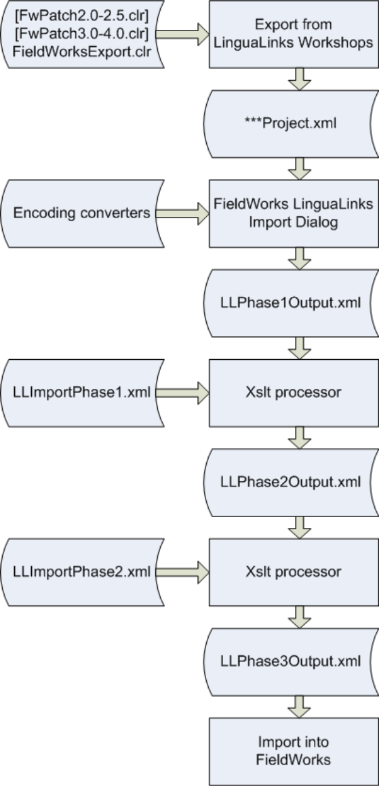

# Technical Notes on LinguaLinks Database Import

1 Data model differences 

1 

Ken Zook 

February 8, 2013 

## 1 Data model differences

### 1.1 Subentry and minor entry differences

In LinguaLinks, subentries and minor entries were owned within major entries. This model has been changed in Language Explorer for various reasons. In Language Explorer, major entries, minor entries, and subentries are all top-level entries in the lexical database, with minor entries and subentries pointing to one or more main entry or sense. An **Exclude from headword** flag on each minor entry or subentry can be used to keep this entry from displaying as a headword in the main dictionary. 

### 1.2 LinguaLinks annotations

LinguaLinks provided annotation capability on entries and senses. Each annotation had a type, which came from an extensible list, plus a note that could be in multiple languages. The original intent was that the note could be translated into different languages. Many users were confused by the purpose of multiple languages in the note, and instead used the English marker to type English text and used the vernacular marker to type vernacular examples of what they were discussing (e.g.,ENG Some individuals use the formBUA reggumeng.). Or they intermixed English with vernacular text within the same language marker, but did not indicate which language was being used. Users should have used a single marker for their annotation and used Edit…Change Language to switch vernacular words to the correct language, unless they really gave translations in different languages as originally envisioned. 

In Language Explorer the annotation mechanism has not been developed yet. Instead of using this, annotations from LinguaLinks are brought across as various kinds of notes. In Language Explorer each note is multilingual, allowing for translations in multiple languages. In each language, you can properly embed additional languages. A single annotation from LinguaLinks will come across as multilingual translations if more than one language marker was used. Thus in the above example, “Some individuals use the form” will come across as an English note, and ‘reggumeng’ will come across as a Buang translation of the English note. In Language Explorer, notes are displayed in the checked analysis writing systems in the Format…Setup Writing Systems dialog. Vernacular writing systems are typically not included in the analysis list, so it will appear that only part of the LinguaLinks annotation was transferred. If the whole annotation was typed after the vernacular marker, it will appear that the entire annotation is missing. You can see these missing portions by adding your vernacular writing system to the analysis list in the Format…Setup Writing Systems dialog. 

In Language Explorer, sense annotations from LinguaLinks will go into different note fields depending on the type of the LinguaLinks annotation: Grammar Note, Anthropology Note, Discourse Note, Phonology Note, Semantics Note, Sociolinguistics Note, Encyclopedic Info, and Bibliography. Any other sense note will go into General Note. Each note in General Note will start a new line and display the LinguaLinks type followed by a colon and the contents of the note. All entry annotations go into the entry Note field in Language Explorer, with each annotation starting on a new line with the LinguaLinks type followed by a colon and the contents of the note. (Language Explorer Beta 0.8 does not display entry Notes by default, but you can request a patch from Language Software Development that will fix this.) 

1 Data model differences 

3 

If you split annotations between alternate writing systems or full annotations in the wrong writing system, you can partially correct them by using the Bulk Edit capability in Language Explorer. 

#### Steps: Entry Notes

1. In the Lexicon area, go to Bulk Edit Entries. 

2. To the right of the column headings click the chooser icon and select “More Column Choices.” 

3. In the configure dialog in the left column, find Note and click Add. **Result:** Moves it to the right. In the Writing System combo, select English. 

4. Repeat step 3 choosing your vernacular as the writing system, then click OK to close the dialog. 

5. In the Note (your vernacular) column, click the Filter Combo box and choose Non-blanks. **Result:** All senses with vernacular notes will be checked in the left column. 

6. Go to Bulk Copy and select Note (your vernacular) as the source field and Note (Eng) as the target field. Click "Add after old value…." In the “sep. by” box, press Shift+Return, click Preview, and then click Apply. 

**Result:** Appends the vernacular notes to the English notes. 

7. Go to Bulk Replace and select Note (your vernacular) in the target field. Click Setup, and in the Find and Replace dialog type “.*” (period, asterisk) in the Find what box and in the Replace box, do not type anything. Click More and check “Use regular expression.” Click Ok to close the dialog, click Preview, and then click Apply. **Result:** This will remove any text in the target field. 

8. Go back to "Show All" in the Note (your vernacular) filter combo, then go back to Configure Columns and remove the Note fields. 

You will need to repeat this process for any sense notes that have similar problems using Bulk Edit Senses. This process puts all of the text under the English note alternative, but the writing system for individual words may be wrong. You can either keep it this way, or go to each note and select the words in the wrong writing system and use the toolbar writing system combo to correct it. You should have all text properly identified by language so spelling checks or consistent changes to a given writing system will work properly. 

### 1.3 Interlinear text sections

In LinguaLinks, interlinear texts had a sequence of interlinear sections that could be nested. Sections had one or more paragraphs and paragraphs had one or more segments. Users had full control over where a segment was broken. Each segment could have free translations and literal translations in multiple languages. 

Language Explorer has a simpler model of interlinear text. It only provides a flat sequence of paragraphs. Each paragraph is currently broken into sections automatically based on punctuation. New sections are started after any period, question mark, exclamation point, or section sign (§). Each section can have free translations, literal translations, and notes in multiple languages, but it 

1 Data model differences 

4 

is possible for these translations and notes to get shifted to the wrong sections when moving sections around in the baseline text. It works reasonably well when adding or deleting punctuation and breaking or joining paragraphs. See <u>http://fieldworks.sil.org/supportdocs/Conceptual model overview.doc</u> section 2.2.14 for more details on this. 

During LinguaLinks export, a section sign is appended to the end of each segment to force Language Explorer to break sections. This solves the problem where LinguaLinks breaks segments mid-sentence. During Language Explorer import, the section signs are removed if the section ends in a period, question mark, or exclamation point. You will see any remaining section signs on the end of sections without closing punctuation. If you remove these, it will cause your translations to shift to the wrong sections. 

**Caution!** Translations will still be shifted to wrong sections if LinguaLinks has any segments that have periods, question marks, or exclamation points in the middle of segments, since Language Explorer will break sections at this punctuation. For example, consider the following 3 LinguaLinks segments. 

1s1 Sentence one. Sentence two? Sentence three! Translation one. Translation two? Translation three! 1s2 Sentence four. Translation four. 1s3 Sentence five. Translation five. 

When brought into Language Explorer, this will be 1s1 Sentence one. Translation one. Translation two? Translation three! 1s2 Sentence two? Translation four. 1s3 Sentence three! Translation five. 1s4 Sentence four. 1s5 Sentence five. 

This leaves your free translations badly scrambled, which is highly undesirable. Trying to edit the results in Language Explorer can be very difficult because of the difficulty of scrolling between the location of the text and the location of the translations. If you have much of this in your LinguaLinks data, it would be much easier to split the segments with multiple sentences into one segment (or segmented paragraph) per sentence and fix the free translations before exporting the data for import into FieldWorks. Using segmented paragraphs will reduce the possibility of Language Explorer scrambling free translations later as you add or remove punctuation, since scrambling is limited to the current paragraph. 

### 1.4 Interlinear text collections

Language Explorer does not contain interlinear text collections, so is unable to maintain the hierarchy of texts that is possible in LinguaLinks. All texts are exported into a flat list of texts in Language Explorer. 

1 Data model differences 

### 1.5 Thesaurus links

LinguaLinks made extensive use of thesaurus links as a way to categorize senses. Instead of the LinguaLinks thesaurus, Language Explorer uses a much larger semantic domain index developed by Ron Moe. The semantic domain index is a superset of the LinguaLinks thesaurus. During the import process, all LinguaLinks thesaurus links are mapped to corresponding semantic domains. 

### 1.6 Nested sense limitations

Language Explorer does not have sense groups as in LinguaLinks. Instead, senses can be nested within senses in Language Explorer. By filling in minimal information on a top-level sense, it can be made to work somewhat like a sense group in LinguaLinks. At this point, Language Explorer support of nested senses is somewhat limited 

- inheritance from parent senses is not implemented, 

- entry browse view does not show such things as glosses and semantic domains from subsenses, and 

- assuming the part of speech is set on every nested sense, the dictionary view doesn't provide a way to eliminate the part of speech from printing on nested senses. 

In LinguaLinks, the Part of Speech and Sense Type could be set in a sense group. All senses that were part of this sense group would inherit the Part of Speech and Sense Type from the parent sense group, and they could not be changed in the sense until the item in the sense group was cleared. If any sense explicitly set a Part of Speech or Sense Type, it was not possible to set the Part of Speech or Sense Type of the parent sense group. 

Language Explorer does not currently support this type of inheritance between a sense and its nested senses. Thus, Grammatical Function (Part of Speech) and Sense Type must be set explicitly on every sense. During the import process, any Part of Speech or Sense Type that is set in a sense group will be set on subsenses as well. The Grammatical Function (Part of Speech) in Language Explorer is much more complex than the Part of Speech in LinguaLinks. It contains quite a bit of grammatical information such as inflection classes, features, and stem names. 

In LinguaLinks, sense groups had a heading that was printed after the sense group part of speech but before the following senses. During import into Language Explorer, the heading is placed in the definition of the parent sense that is taking the place of the sense group. 

### 1.7 LinguaLinks sense media files

A fairly recent addition to LinguaLinks allowed senses to hold a series of media files such as pictures, sound files, and movie files. Language Explorer does not have an equivalent place to store these in senses. The LinguaLinks import process converts these media file links by adding a Media file label to the general note field and the media file caption which is formatted as a link to an external file. Thus you still have an active link to your original media files. 

### 1.8 Limitations with interlinear text baselines in multiple scripts

LinguaLinks has the ability to interlinearize text in multiple writing systems. This capability has not yet been implemented in Language Explorer. If you import texts from LinguaLinks that were in different writing systems, the baseline text will have the correct writing systems, but Language 

2 Exporting data from LinguaLinks 

Explorer will add all of the wordforms to the wordform inventory rather than finding the correct wordform based on an alternate writing system. As a result, you will end up with duplicate wordforms in your wordform inventory. 

### 1.9 Pictures and pronunciation files

Pictures and pronunciation files will be transferred to Language Explorer, but there are some potential problems you should be aware of. 

When a picture file is imported into Language Explorer, the original picture will be copied to the FieldWorks\Pictures directory. If the file already exists in that directory, a new copy will be made with a unique digit appended to the file name. FieldWorks uses the copy in the pictures directory for display purposes, but keeps track of the original name. Unfortunately, the current version of Language Explorer shows the original file name which can be misleading. If the picture file cannot be located on the machine, a message is written to the import log file and the picture is ignored. Also, be aware that importing multiple times will cause new copies of all pictures. To avoid this problem, if you are repeating an import, be sure to delete all of the pictures from the pictures directory before each import. 

Pronunciation sound files work in a similar way, but they are copied to the FieldWorks\Media directory. At this point Language Explorer does not provide a UI to show or play the sound files. The files will actually be stored during an import process, so they will become available as soon as Language Explorer has the UI. 

Also, be aware that if you are a consultant importing someone’s data on your own machine, all of the picture information will be lost unless you have all of the files in their original location. You can do the export from LinguaLinks and preprocessing of the files on your machine, but the final import should be done on the user’s machine where the picture files actually exist. 

### 1.10 LinguaLinks subentry types

LinguaLinks allows users to create new subentry types that are not in Language Explorer by default. When these are imported, FieldWorks will add appropriate entry types to the Entry Types list, however it does not set the Type field. To get these entry types to display properly as subentries in Language Explorer, you’ll need to go to the Entry Types tool in the lists area, and click on newly added items and set the Type field to Subentry. 

## 2 Exporting data from LinguaLinks

Before you can import your LinguaLinks data, you must first export your LinguaLinks project to an XML file. Note that this must be done on a 32-bit operating system. This process involves adding one or two patches to your LinguaLinks knowledge base and then exporting your project. It is possible to export your data from LinguaLinks Workshops versions 2.0, 2.5, 3.0, 3.5, 4.0, and 5.0. If you have an older version, you need to upgrade your LinguaLinks to at least Version 2.0 or contact Language Software Development in Dallas. 

If you plan to continue doing serious work in LinguaLinks after the export, you should copy Current.kb and Current.ind from your c:\LingLink\Cellar directory to some other directory. Follow the steps below and then copy your original files back into the c:\LingLink\Cellar 

2 Exporting data from LinguaLinks 

7 

directory. There is a slight possibility the export patches might disturb patches loaded on versions since 4.0, so restoring your original files will guarantee that nothing has changed. 

The *.clr files to patch LinguaLinks for FieldWorks version 7 are available for download in individual zip files. After downloading the file unzip the file to obtain the .clr file. Here are the URLs: 

<u>http://downloads.sil.org/FieldWorks/LLPatches/FieldWorksExport.zip http://downloads.sil.org/FieldWorks/LLPatches/FwPatch3.0-4.0.zip http://downloads.sil.org/FieldWorks/LLPatches/FwPatch2.0-2.5.zip</u> 

The *.clr files to patch LinguaLinks for FieldWorks version 6 are available on the installation CD or in the FieldWorks download package in the FieldWorks\LinguaLinks Export Patches directory. 

### 2.1 Steps: LinguaLinks export

LinguaLinks provided a way to limit the amount of memory used. This was especially important when memory was much more limited. The amount of memory reserved for LinguaLinks is specified in the c:\Linglink\Cellar\Cellar.ini file. These two lines are important: [Memory] 

limit=200 

If your limit is set too low, or your data is too large, you could get an “out of memory” error message. If setting the limit to 400 still results in an "out of memory" or "virtual machine stack overflow" error, see section 5.3. 

1. To set the limit higher, edit Cellar.ini and make the value 200 or larger if you run out of memory. 

2. Start LinguaLinks, open Workshop Explorer, and make sure the Projects combo is set to the project you desire to export. 

3. To determine your version number, go to Help…About LinguaLinks Workshops. Close the About LinguaLinks Workshops dialog after you determine the version number. A. If your version is 2.0 or 2.5 press Shift+Right-click , choose Install Patch, select FwPatch2.0-2.5.clr, and skip to step 4. 

B. If your version is 3.0, 3.5, or 4.0, press Shift+Right-click, choose Install Patch, and select FwPatch3.0-4.0.clr, and skip to step 4. 

C. If your version is 5.0, skip to step 4. 

**Note:** If the patch file is read-only, LinguaLinks may refuse to install the patch. If so, copy the file to a hard disk (if not already there), and right-click the file in Windows Explorer and choose Properties, then clear the Read-only checkbox. 

4. Press Shift+Right-click, choose Install Patch, and select FieldWorksExport.clr. 

5. Press Shift+Right-click over the Workshop Explorer window, and choose Export Project for FieldWorks. 

**Result:** Displays an information dialog to explain what will happen. 

6. Read the warning and click Continue. **Note:** If you used AmpleLinks in your project, another dialog allows you to match your Ample categories to a part of speech. For each category in the left column, click a corresponding part of speech in the right column and click Link to move it to the center 

3 Importing LinguaLinks data into Language Explorer 

8 

column. If you leave items in the left column, it will create parts of speech for each one using the category name. When you dump the project, another dialog gives you the name of the file you need to use to import into Language Explorer. LinguaLinks places this dump file in the c:\LingLink\Cellar directory. While this file has XML tags, the data has not been converted to Unicode UTF-8 so some programs will not be able to use the file in this state. The first part of the import process in Language Explorer will convert all of the data to Unicode UTF8. Press Continue again. 

7. Exit LinguaLinks and click No to avoid saving the knowledge base. 

8. If you have more than one project in your knowledge base, restart LinguaLinks, choose the next project in the Projects combo, and repeat steps 5–7. 

### 2.2 Steps: Listing fonts used in LinguaLinks

While in LinguaLinks, it is advisable to determine the fonts you use with each language you export. This information is useful when specifying the conversion to Unicode. These steps will work after the above patches have been made. 

1. Open your dictionary in LinguaLinks. 

2. Press Shift+Right-click and choose Interactive Query. 

3. In the dialog, select the row that ends in “: lexical database.” 

4. In the Interactive query dialog, paste “self using template project of ^R using projectFonts” in the window and press Ctrl+T. 

5. In the new window giving details on the language definitions and fonts, choose File…Print or File…Save View as Text. 

## 3 Importing LinguaLinks data into Language Explorer

### 3.1 Importing into existing Language Explorer data

The import process assumes you will import into a new FieldWorks project. It appends 

- all lexical entries to the dictionary 

- all wordforms to the wordform inventory 

- all interlinear texts to the text collection, and 

- items to various lists such as the parts of speech list if the items are not already present. 

All LinguaLinks links are maintained in this process. Importing into a FieldWorks database with Scripture and Data Notebook entries is not a problem. However, if you have existing lexical entries, your import will probably result in many duplicate entries that you will need to merge manually. Likewise, if you have existing analyzed interlinear texts, you will have many duplicate wordforms that you will also need to merge. At this point there is no good way to do this. 

### 3.2 Steps: Importing LinguaLinks data

After exporting your LinguaLinks data, import it into Language Explorer. 

3 Importing LinguaLinks data into Language Explorer 

9 

1. In Language Explorer, use File…New FieldWorks Project. **Tips:** To create a new project for your data, it is best to set up the vernacular and analysis languages before entering the import dialog, although you can do it at that stage as well. When creating a writing system for a LinguaLinks IPA or Americanist language description, when you are in the Writing System Wizard, search for the same language as your standard orthography. The results from step 1 should be identical to setting up your standard orthography. You make the refinements in step 2. 

For an IPA font, you can click the IPA checkbox. If you want to see what happens, open the Advanced section to see that the writing system code is identical to your standard orthography code, but it will have “__IPA” appended to the end. 

If you need to set up an Americanist writing system, in step 2 you need to open the Advanced section and specify “Americanist” in the Variant name combo. You should generally shorten the Variant abbreviation to a few letters. Make sure all writing systems for the same language have the same writing system code up to the first underscore. 

If your LinguaLinks data only uses IPA, you can use a single vernacular IPA writing system in Language Explorer. In this case, make sure your IPA writing system is the top vernacular writing system prior to import. 

2. Choose File…Project Management…Backup and Restore and make a backup of your new database before proceeding. 

3. Open the new FieldWorks project and choose File…Import…LinguaLinks Data. 

4. Click Browse and select the XML file you exported from LinguaLinks. **Result:** Language Explorer reads this file and lists the LinguaLinks language definitions it found. It will try to fill in the information on standard languages. 

5. For each language definition, specify the equivalent FieldWorks writing system plus an encoding converter to convert the LinguaLinks data to Unicode. Double-click or click Specify for each writing system, then fill in the writing system and the encoding converter for that language definition. 

**Tips:** If you need to, you can add another writing system or encoding converter. If you want to drop all data in a certain language definition, select “ignore” for the FieldWorks writing system. 

The Scientific Name field in a sense always defaults to the first analysis writing system in Language Explorer. In LinguaLinks this field typically used the Latin writing system. Until there is a better way to handle Latin, map the LinguaLinks Latin language into FieldWorks English. 

For standard Windows fonts such as Times New Roman, use the Windows 1252<>Unicode encoding converter supplied by Language Explorer. 

For an IPA font from LinguaLinks, use the silipa93.tec TECkit converter provided in your Program Files\SIL\FieldWorks\Fonts\IPA93Mapping directory. Other TECkit maps are available from 

http://scripts.sil.org/cms/scripts/page.php?site_id=nrsi&cat_id=ConversionMaps. Always choose some encoding converter since LinguaLinks exported data is never “Already in Unicode.” 

6. After you specify all languages, click Import. **Result:** When done, it shows a dialog that tells you where you can see the log file. 

4 Technical process flow of LinguaLinks import 

10 

## 4 Technical process flow of LinguaLinks import

Files used in the import process: 

%Temp%\LanguageExplorer\LLPhase1Output.xml %Temp%\LanguageExplorer\LLPhase2Output.xml 

5 Advanced import problem solving 

11 

%Temp%\LanguageExplorer\LLPhase3Output.xml %Temp%\LanguageExplorer\LLPhase3Output-Import.log %FieldWorks%\Language Explorer\Import\LLImportPhase1.xsl %FieldWorks%\Language Explorer\Import\LLImportPhase2.xsl 

Note that the output file from LinguaLinks is not in UTF-8, even though the header claims that it is. The first phase of the import process transforms the 8-bit characters into real UTF-8. If you are editing this file in ZEdit, be sure to use ANSI mode. 

During the import process, your data is transformed several times. The transforms used during this process come from the c:\Program Files\SIL\FieldWorks\Language Explorer\Import directory. The output files are written to a LanguageExplorer directory in your system temporary directory. If you have not changed this, it is in %USERPROFILE%\Local Settings\Temp . 

**Note** : %USERPROFILE%\Local Settings\Temp is C:\Documents and Settings\*\Local Settings\Temp on Windows XP and c:\Users\*\AppData\Local\Temp on Vista where * is your Windows logon name. 

The output files written to this directory are as follows: 

- LLPhase1Output.xml is a copy of the XML file you exported from LinguaLinks, but all data has been converted to Unicode UTF-8 based on the converters you specified. Fields you asked to ignore are removed at this stage. 

- LLPhase2Output.xml results from running the LLImportPhase1.xsl transform on LLPhase1Output.xml . This transform converts the LinguaLinks export file to the current model for Language Explorer. At this point it represents an entire language project, complete with LgWritingSystems and full possibility lists. This is similar to a FieldWorks xml dump file, but it is missing things normally supplied by FieldWorks such as the semantic domain list. 

- LLPhase3Output.xml results from running the LLImportPhase2.xsl transform on LLPhase2Output.xml . This removes such things as LgWritingSystems and Parts of Speech list that are already in a FieldWorks project created via the New FieldWorks Project dialog. This file is ready to import into a newly created FieldWorks project. 

- LLPhase3Output-Import.log is written when LLPhase3Output.xml is imported into FieldWorks. It will list any new list items created, plus warnings or errors encountered as the data is imported. It gives the line number in LLPhase3Output.xml where the error occurred. You can ignore warnings in this file. If there are any errors in this file, it indicates some problem with the import process. You may be able to figure it out, or you may need to ask for help from Language Software Development in Dallas. It generally indicates a bug in the process, although if you modified the LLPhase3Output.xml manually, the problem is likely in your modifications. 

## 5 Advanced import problem solving

### 5.1 Partial processing

There may be rare cases where you need to make some changes to the xml file just prior to import . For example, If you have |b |r codes in your LinguaLinks data that were imported from SFM, it would be nice to convert these to Emphasized Text prior to import. 

5 Advanced import problem solving 

12 

The Import LinguaLinks Data dialog provides a special option if you press Shift before clicking the Import button. When you do this, the Import button will change to Process, and the program will go through all of the processing up to the point of actually importing the data into Language Explorer. You can then make changes to LLPhase3Output.xml prior to the actual import. 

The Import LinguaLinks Data dialog also assumes a special mode if you choose one of the LLPhase#Output.xml files in the LinguaLinks XML file edit box. In this case, the program will start processing the file at that stage and continue through the end. Thus, if you make changes to LLPhase3Output.xml , then enter that as the LinguaLinks XML file, it will import the file into Language Explorer without doing any further processing. 

### 5.2 Step: Testing encoding converters

If you have problems with encoding converters, Language Explorer provides a test mode that will allow you to see the results of your converter. 

1. From the Import LinguaLinks Data dialog, click Specify for a LL Language Definition. **Result:** Brings up the Specify FieldWorks writing system dialog. 

2. To the right of the Encoding Converter combo, click Add. **Result:** Brings up the Encoding Converters dialog. 

3. From the Available Converters combo, choose a converter or add a new one if needed. 

4. Switch to the Test tab. 

5. Select an input file. 

**Tip:** Make a small test file with samples of all characters you want to convert rather than using the full xml file. 

6. Choose an output font that will display the resulting Unicode characters. 

7. Click Convert. 

**Result:** Converts the entire file using the specified converter and displays the results in the Converted pane. 

**Tip:** You should only be concerned with text in the encoding you want to convert. If your test file has a mixture of encodings, they all go through the selected converter, generally resulting in garbage for the encodings on which you are not focusing. 

8. Save the converted text to a file and explore the code points in ZEdit.exe, or some other program that can give code point information. 

### 5.3 Really large databases

If you have a really large database (e.g., Greek, Ancient) setting the memory limit to 400 may still result in memory or stack overflows. Setting the memory limit higher will not help. The only solution is to dump the project in steps. This requires familiarity with Cellar Query Language (CQL) programming. The actual solution may take some experimentation, since it depends on where the bulk of the data resides—whether in the lexicon or in interlinear texts, or both. You’ll want to discard your database when done, so make sure you make a copy of archive.kb, current.kb, and current.ind prior to doing this and restore the originals when done. The dump process makes a number of changes to the database to add classes that Language Explorer needs, then it dumps out the data. Normally we exit without saving the changes. However, each time 

5 Advanced import problem solving 

13 

these methods are run, the IDs for these classes change. So in order to dump a project in stages, we need to run the methods that make changes once, then save the database, then reopen to clear memory, then dump part of the data, then reopen again and dump the next part, repeating this process until everything is dumped. Then the individual dump files need to be merged together. The steps below give suggestions on how to do this. This process is complex. If you need help, contact Language Software Development. 

1. In Workshop Explorer, click your lexical database, then Shift+Right-click your lexical database and choose Interactive Query from the menu. Select the line that ends in lexical database. In that window, copy each of the following queries, one at a time, and do Ctrl+T in the window. This should tell you how many entries you have in your lexicon, wordforms, texts, and segments in your texts. size over my majorEntries size over wordforms of my wordformInventory size over allInterlinearTexts of first over rooms of owner of my workshopResults size over allSegments of sections of allInterlinearTexts of first over rooms of owner of my workshopResults 

2. In RootFolder, use unstoreObject KRZZook 548 May-21-98 14:1:9 to unstore the saveXmlData MethodDefn on LinguaLinksResults. This is the method that stores the extra data, then dumps the view. Comment out the following source line, compile (Ctrl+T), execute the method on the LinguaLinksResults for your project, then save the KB, ignoring the normal message telling you not to save: 

/* do saveToFile ( ^pathdata, 'xmlData' ) to self */ 

3. Stop LinguaLinks, then restart the program. You might get an error at this point about "The attribute 'senses' is not defined for the class WordAnalysis". If so, just click Cancel and go on. In RootFolder, use unstoreObject RBRRegnier 926 February-23-2000 11:29:23 and comment out the following section that dumps out the interlinear text and compile (Ctrl+T) the results. 

   - /*    if exists over [^pText] then pile showing ( 

'<Annotations6001>', allSegments of sections of ^pText using xmlDataAnnotations, '</Annotations6001>' ), pile showing ( ^pText using xmlData ) with target [beforeFirst = '<Texts6001>', afterLast = '</Texts6001>'], */ 

4. Open InteractiveQuery tool on the LinguaLinksResults for your project then execute the following code to dump out everythisng except the interlinear texts. begin var  pathdata, rootType rootType := find ( 'currentKB', 'items' ) of find ( 'pathRoots', 'authorityLists' ) of !PathName pathdata := create of !PathName set rootType of ^pathdata to ^rootType set fileName of ^pathdata to ( asCellarName of  my name + 'LanguageProject.xml' ) 

5 Advanced import problem solving 

14 

do saveToFile ( ^pathdata, 'xmlData' ) to self end 

5. Stop LinguaLinks without saving, then restart the program and go back to the view you modified in step three and comment out the following code: /*    pile showing ( 

my lexicalDatabase using xmlData) with target [beforeFirst = '<LexicalDatabase6001>', afterLast = '</LexicalDatabase6001>'], 

pile showing (partsOfSpeech of my lexicalDatabase using xmlData("CmPossibilityList", "PartOfSpeech", 5049) 

) with target [beforeFirst = '<PartsOfSpeech6001>', afterLast = 

'</PartsOfSpeech6001>'], pile showing ( wordformInventory of my lexicalDatabase using xmlData 

) with target [beforeFirst = '<WordformInventory6001>', afterLast = '</WordformInventory6001>'], */ 

6. Rename the file dumped out in step 4 by adding Lx to the beginning of the name. Then repeat the query in step 4 a second time. This time you’ll be dumping everything except the lexical database, parts of speech, and wordform inventory. 

7. Open the dump file from step 6 in ZEdit (editor installed in your FieldWorks directory) and the one from step 4. Copy the following sections from the one in step 4 to the one in step 6: <LexicalDatabase6001> through </WordformInventory6001>. You can't make a large midfile selection directly, but you can copy everything from <LexicalDatabase6001> to the end of the file to a blank window, then search for </WordformInventory6001> and select everything above that and copy it into the main file. This will be a complete dump file that you can then import into Language Explorer. 

8. The above steps worked reliably for a database that had around 150 texts and resulted in a combined dump file of 95Mb. If you didn’t have any memory problems above, you can replace your original current/archive files and proceed to Language Explorer import. 

9. However, if either step 4 or step 6 ran out of memory, you’ll need to try additional changes to reduce the amount of data that is dumped. For example, if the dictionary is too large to dump in one step, remove the comments put in the code in step 5, and restore the comments in step 3 so that you’ll only be dumping out the lexicon. Then in addition, in RootFolder, use unstoreObject KRZZook 523 May-13-98 13:30:26 to unstore the StyledViewDefn for LexicalDatabase and change 

pile showing (my baseFormIndex) to 

pile showing (first(4000) over my baseFormIndex) 

then compile (Ctrl+T) the code. This will only dump the first 4,000 records from your lexicon. 

10. Repeat step 4 to dump your data. 

11. Stop LinguaLinks, then restart the program and then unstore KRZZook 523 May-13-98 13:30:26 again and change pile showing (my baseFormIndex) 

5 Advanced import problem solving 

15 

to 

pile showing (allButFirst(4000) over my baseFormIndex) Compile the code (Ctrl+T). This will dump all entries after the first 4,000. 

12. Rename the dump file so you don’t overwrite it, then repeat step 4 to dump the last part of your dictionary. 

13. If either of the above fails, you may need to try other numbers and/or use more than 2 passes. You can chain these methods (e.g., "first(3000) over allButFirst(3000) over my baseFormIndex" to get the second 3,000 entries). You can also use last(3000) if it's useful. 

14. If necessary, a similar approach can be taken with interlinear texts. 

15. Once everything is dumped to individual files, pick one file as your master file, then copy the missing sections that were dumped in separate files. In the case of steps 10 and 12 note that each file is identical, except for the records in the <Entries5005>…</Entries5005> element. The object is to copy all of the entries from the additional file(s) into the master file so that the Entries5005 element has a complete set of entries. 

16. Once you have a complete master file, then you can restore your saved current/archive files, then import the combined XML file into Language Explorer. 

### 5.3 Converting bar codes

If your LinguaLinks data has bar codes left over from an SFM import, you can change these using a simple CC table or some some simlar means on the XML file dumped from LinguaLinks or any of the intermediate XML files used for Language Explorer import. For details on this process see section 4.7 “Converting bar codes to formatted text” in FieldWorks XML model.doc <u>(http://fieldworks.sil.org/supportdocs/FieldWorks%20XML%20model.doc).</u> 

### 5.3 Missing writing systems

During the LinguaLinks export, the program tries to find the language encodings used by your project (using the projectEncodings virtual property of LinguaLinksResults). It would be too time-consuming to search every possible string for embedded encodings. It also tries to determine used encodings by searching the first 100 entries and senses. This process may fail to find all of the encodings. All strings will be exported in all of their encodings, but the LgWritingSystem classes are only dumped using the projectEncodings. To make sure that all LgWritingSystems are dumped, you can to Options…Preferences in LinguaLinks prior to the export, go to the Languages tab, and add any writing systems you need to the Selected Encodings pane.