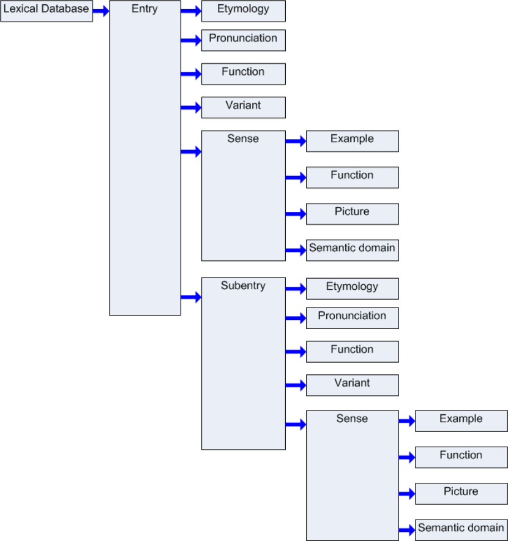
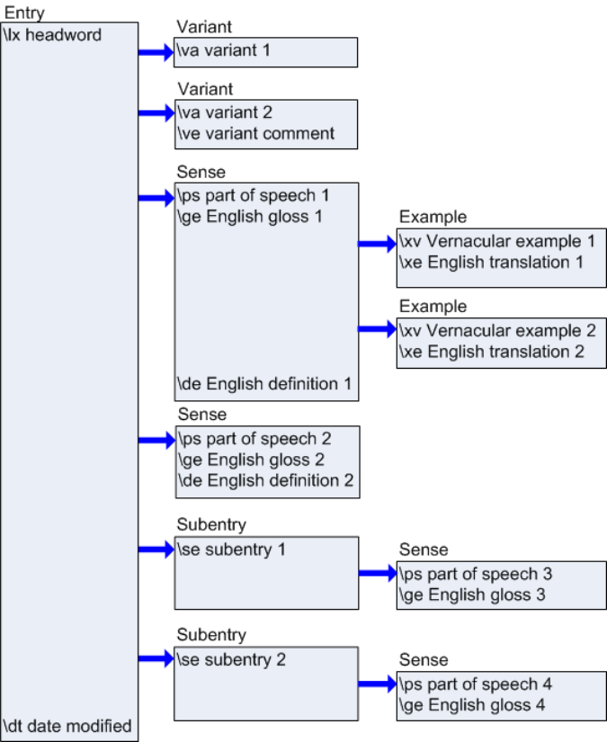
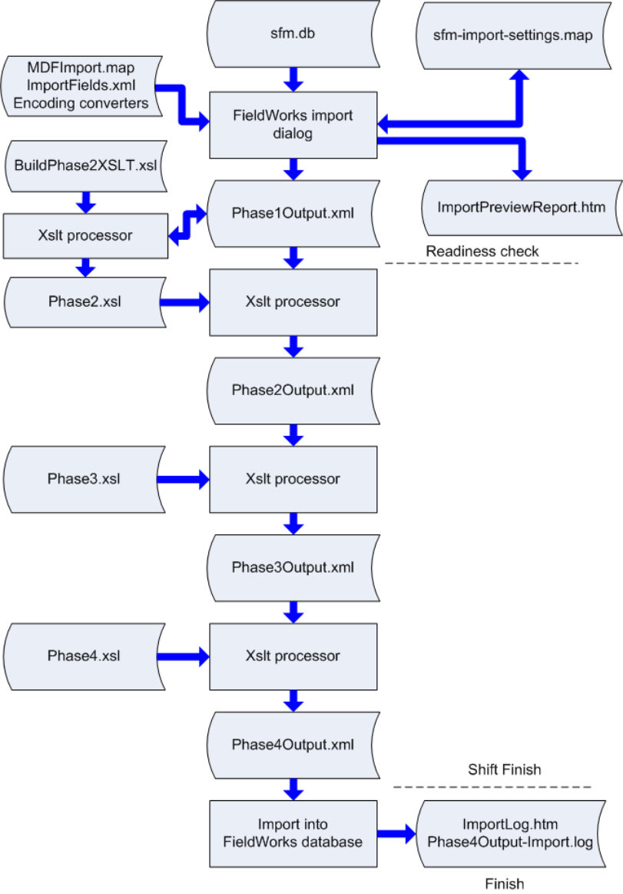

# Technical Notes on SFM Database Import

August 24, 2009 

## 1 Mapping SFM fields to the FieldWorks Language Explorer model

### 1.1 Basic field mapping

SFM dictionary files consist of a sequence of entries. Each entry starts with a record marker (e.g., \lx) followed by other fields starting with various backslash codes. To import SFM files into FieldWorks, the fields in the SFM records must be mapped to corresponding fields in FieldWorks. In FieldWorks, fields are grouped into objects or classes that represent entries, senses, example sentences, etc. Many SFM fields result in a link between objects in FieldWorks. This arrangement of objects, fields, and links is known as the FieldWorks conceptual model. 

An SFM entry is a loosely structured flat collection of fields. Not only can fields be in any order within an entry, but there may be bad markers (mistyped or missing a space after the marker), references without targets, mistyped parts of speech, etc. In the import dialog the user maps each SFM marker to a FieldWorks field. The FieldWorks fields are grouped to correspond to the FieldWorks conceptual model, or functionality that enables several fields to be mapped to correct structures in FieldWorks. 

The following diagram illustrates the basic grouping of fields that FieldWorks uses in the import process. 

One deficiency of SFM files is there is no clear delineation of when one object stops and another begins. We know that an entry starts with \lx, but how do we know when a sense begins or ends? It typically begins with a \sn or \ps, but these will frequently be missing, or perhaps a gloss field will accidentally precede the \ps for some senses. This uncertainty presents one of the biggest challenges to importing SFM files into FieldWorks. In the import dialog, the user must map each SFM marker to a corresponding FieldWorks field, plus indicate key fields which begin each group of fields in the above structure. If SFM entries are well-formed, the import process generally works very well. If fields are out of order, Language Explorer will do the best it can at loading your data, but the results may be disappointing. 

**Tip:** The SOLID program (http://palaso.org/solid) was written to help users clean up SFM files. In addition to cleaning up a SFM file, it can also be used to produce a LIFT file that can be imported into Language Explorer. If you choose to use LIFT generated from SOLID, see section 15.2 in Flex tips.doc to make sure you make valid writing system codes for Language Explorer. The SOLID LIFT import path has not been tested thoroughly and may have some problems such as not importing to custom fields, and handling variants and complex forms improperly. 

However, the program provides various ways to check and clean up your SFM data, so is worth checking out. 

Here’s a simple well-formed example (If it were truly well-formed, the first \de would come after \ge, but for Language Explorer import it makes no difference.) 

\lx headword (starts Entry) \va variant 1 (starts Variant in Entry) \va variant 2 (ends 1st Variant and starts 2nd Variant in Entry) \ve variant comment \ps part of speech 1 (ends 2nd Variant & starts Sense in Entry) \ge English gloss 1 \xv Vernacular example 1 (starts Example in Sense) \xe English translation 1 \xv Vernacular example 2 (ends 1st Example & starts 2nd Example in Sense) \xe English translation 2 \de English definition 1 \ps part of speech 2 (ends 2nd Example & 1st Sense & starts 2nd Sense in Entry) \ge English gloss 2 \de English definition 2 \se subentry 1 (ends 2nd Sense & starts Subentry in Entry) \ps part of speech 3 (starts Sense in Subentry) \ge English gloss 3 \se subentry 2 (ends Sense and 1st Subentry & starts 2nd Subentry in Entry) \ps part of speech 4 (starts Sense in 2nd Subentry) \ge English gloss 4 \dt date modified (ends Sense & 2nd Subentry & falls back to Entry since dates are only allowed in Entry) 

The following diagram illustrates how these fields fit into the FieldWorks group hierarchy. 

In this case, \lx is the key field that starts an entry, \va is the key for a variant, \ps is the key for a sense, \xv is the key for an example sentence, and \se is the key for a subentry. 

Here’s a mal-formed example: 

\lx headword (starts Entry) \ge English gloss \hm 1  <<< Senses do not have homographs. They are in entries. \ps part of speech (starts Sense in Entry) 

By default, we use \sn, \ps, and \ge to start a sense. In this case we start the sense with \ge, but then we encounter \hm which is part of an entry instead of a sense. Language Explorer will actually load this entry correctly. If it encounters a field that it knows is part of some other group, it will attempt to make the change. Thus in this case the \hm will still be part of the sense, and the sense will continue with the following \ps. 

If you change the default to not include \ge to start a sense, (leaving \sn and \ps to start a sense) this would potentially cause a problem if your data had 

\lx headword (starts Entry) 

\ge English gloss  <<< \ge is part of a sense, but it’s still in the entry section. \ps part of speech (starts Sense in Entry) 

In this case, we encounter a gloss before the sense starts, and since an Entry can’t have a gloss, we have a potential problem. Language Explorer will actually load this entry correctly. It knows that \ge is part of a sense, so it will go ahead and add the \ge to the sense even though the key field for the sense is \ps. When Language Explorer makes these decisions, it will add the entry to the review section at the end of the import preview report. 

There is some risk in allowing Language Explorer to make these interpretations, however. Let’s look at a more complex example, and see how Language Explorer will load this data. Let’s assume the MDF default key fields: \lx for entry, and \sn or \ps for sense. 

\lx bank 

\ge financial institution  (start of sense 1) \sn \ps n \ps v  (start of sense 2) \ge tip airplane \ge edge of river \sn \ps n  (start of sense 3) 

The initial \lx field will always start a new entry. \ge is part of a sense, so even though we aren’t in a sense yet and \ge is not a key field for a sense, it will start the first sense. \sn is a key field for a sense, but since the first sense hasn’t encountered an \sn field yet, it interprets this \sn as part of the first sense. Likewise, even though \ps is also a key field for a sense, since the current sense does not have a \ps field, it is also added to the first sense. \ps v is a key field for a sense, and since the first sense already has a \ps field, we start a second sense with this \ps. Since we are in a sense now, the \ge field will become part of the second sense. The second \ge field is already in a sense, and since it is not a key field to start a new sense, it remains part of the second sense. Language Explorer will append the second \ge field to the first (e.g., tip of airplane; edge of river). The last \sn field could start a new sense, but since the second sense does not have an \sn, it goes in the second sense. The final \ps field can start a new sense, and since the second sense already has a \ps field, the final \ps actually starts the third sense. 

The above interpretation is probably not what you wanted. There are usually two ways to resolve these problems. In this particular case, the problem could be solved by adding \ge to the sense key markers. (This is the default for FieldWorks 6.0.) This way instead of concatenating the two \ge fields, the second \ge field would force the third sense. Another way is to change the input file so it has a consistent order with a key marker at the beginning of each sense. The following ordering would work as desired. 

\lx bank \ps n  (start of sense 1) \ge financial institution \ps v  (start of sense 2) \ge tip airplane 

\ps n  (start of sense 3) \ge edge of river Here’s another mal-formed example: 

\lx headword (starts Entry) \ps part of speech (starts Sense in Entry) \dt 2/13/05 (ends Sense & falls back to Entry since dates only allowed in Entry) \dt 4/12/06 <<<  error 

The problem here is that an entry can only have one date modified. Language Explorer will issue an error if it encounters a second \dt field for the entry. 

Another mal-formed example: 

\lx lexeme (starts Entry) \dt approximately January, 2000 <<< error 

FieldWorks stores dates as an internal date, not a string. Since this string doesn’t parse into a valid date, we have a problem. FieldWorks does have a generic date format, but not in an entry. This date will need to be fixed prior to import. Language Explorer will issue an error if it encounters a date it can’t parse. 

As of FieldWorks 6.0, when you import senses without a part of speech, the part of speech will be added from the previous sense. Also, the default MDF import map now assumes \sn, \ps, and \ge are all key sense markers. Consider how this works in the following example. 

\lx abc \ps v \ge gloss1v \ge gloss2v \ps n \ge gloss3n \ge gloss4n 

When \ge is considered a key marker for sense (the default), the resulting part of speech will be v for sense 1 and n for senses 2-4 because \ge gloss2v and \ps n will be grouped together. The developers hope to improve this in a future version. For now, the system works fine for entries with a single part of speech. If you have multiple parts of speech as in this example, you can either remove \ge from the key fields or modify your input file to include \sn and/or \ps between each \ge. 

When the import process adds a missing part of speech to a sense, it adds a note to the Import Residue field of the entry: ‘\ Review the Grammatical Info of senses.’ You can filter on this after an import to check that senses in these entries have been interpreted properly. 

When \ge is not considered a key marker for sense, the result from the above import will be one verb sense with a single gloss (gloss1v; gloss2v) and a single noun sense with a single gloss (gloss3n; gloss4n). 

### 1.2 Text fields

Language Explorer has two basic types of strings. One is a plain Unicode string that does not allow any embedded languages or formatting, and the other is a complex Unicode string that can have embedded languages, formatting, external links, etc. 

Most fields in a lexicon are text fields. This includes lexeme forms, citation forms, glosses, definitions, example sentences, notes, etc. In Language Explorer, most of these fields are multilingual, meaning they can have translations in any number of languages or writing systems. For example, a lexeme form could have a writing system for the standard orthography and another for the same thing in IPA. Glosses may be in English, German, Spanish, etc. 

Outside of a few specialized fields, such as a file name, all strings in FieldWorks have a language associated with every character in a string. In the import dialog, we need to identify the language for every field that we import. This has two purposes. 

- It identifies an encoding converter to convert the legacy encoding to Unicode, and 

- It associates a language with the string in FieldWorks so that we pick the correct font and style information, as well as identifying strings for future features such as spell checking. 

The Info pane of the Modify Mapping dialog gives information about the type of strings for each destination. “Interprets character mapping” is one of the properties that is Yes for complex strings and No for plain strings. “Allows an equivalent field for each language” is another field that is Yes for mutilingual fields and No for other fields. 

\ge house  Sense: Gloss (English) \gn casa  Sense: Gloss (National) \gr maison  Sense: Gloss (Regional) 

An SFM file might have 3 separate gloss fields as illustrated for English, Spanish, and French. In FieldWorks these would be represented by one multilingual gloss field. In the import dialog, these are handled by mapping multiple markers to the same destination, but changing the Language Descriptor for each one. 

MDF has special codes for English, Vernacular, National, and Regional languages. FieldWorks uses Vernacular and Analysis categories, which can be changed on the fly by the user, but knows nothing about National and Regional. Furthermore, it is not limited by these classifications, but you can have any number of writing systems for vernacular or analysis fields. Vernacular writing systems should be limited to writing systems within the same language, while analysis writing systems can be multiple languages or multiple scripts in those languages. (Due to this distinction, when Language Explorer exports to an MDF file, we have no way to specify the National and Regional MDF codes. Instead, we append the writing system abbreviation to all fields to clarify what we are actually exporting.) 

### 1.3 List references

\lx lexeme \ps noun \pn nom 

MDF has numerous fields that typically list the national (n) and regional (r) translations of the English fields. We’ve already seen how this gets mapped for normal strings. For list references such as the part of speech, however, we only provide for one marker. The field content for this marker is looked up in the appropriate possibility list in FieldWorks and a link is set to that list item. If a match cannot be found, then a new item is created in the root of the list with the name and abbreviation set to the field contents. In FieldWorks, the translations for these names are entered once in the list itself rather than repeated hundreds or thousands of times in each entry using national or regional markers as in MDF. Other than semantic domains, we do not provide the option for importing these alternate languages for list items. Usually the lists are quite small, so it is not difficult for the user to add the translations in the lists area. As a result, fields containing translations of list items should be excluded from import. If you use national and regional fields for more than consistent translations, the best you can do is import these fields into a custom field or Import Residue. 

The Info pane of the Modify Mapping dialog identifies fields that map to lists. “Uses list item” is yes for fields that map to list items, and no for other fields. 

### 1.4 Semantic domains

Semantic domains are a specialized example of linking to list items. 

\is 2.6.6.3 

\sd Doctor, nurse 

\th Omusanu, omujanjabi 

This is the approach for entering semantic domains using Ron Moe’s methodology. \is is the semantic domain number, \sd is the English semantic domain name, and \th is the vernacular translation of the \sd field. We would map these fields as follows: 

\is  SemanticDomain: Semantic Domain 

- \sd  SemanticDomain: English Name 

- \th  SemanticDomain: Vernacular Name 

Note the SFM \is numbering scheme may be for some earlier version of the semantic domain list. FieldWorks 4.0 uses version 4 of Ron’s list. In order to import this cleanly, you need to at least convert the \is field to the current version 4 numbers. CC tables for doing this are available at the DDP web site, www.sil.org/computing/ddb. If we import without making these changes, we will link to the domain that currently has the \is number. This will usually be correct, but not always. If the \is field no longer exists, the import process will create a new semantic domain with \is as the abbreviation, \sd as the English name, and \th as the top vernacular name. 

Also be aware that people may use these codes for other purposes in their SFM data. Ron took over standard MDF fields, but they are used in a different way than originally intended. As long as we can process the \is field, we can link to the semantic domain list. If they are used in some other way, they should be mapped differently. There are several ways you could handle semantic domains that are not equivalent to Ron Moe’s semantic domains. 

 Use a CC table or some other means to map the \is field to Ron Moe’s version 4 numbers. 

- If you want to maintain your semantic domains, and you don’t plan to use the existing Academic domains list, you could delete the Academic domains items from the list then map your \is fields into that list. 

- Import the \is field to Import Residue or a custom field, or drop it from the import all together. 

Our import process assumes the database is right. We currently try to find an existing domain based on the name, and if that fails, then the abbreviation (as long as both are mapped in the mapping file). If a domain is found, we do not change the name or abbreviation as long as they exist. If one is missing, it will fill it in. If the vernacular name is already filled in, it will not change it. If it is missing, it will fill it in. 

Based on this logic, if you only update the \is fields, then you should exclude the \sd field in your mapping. As long as you update both the \is and \sd fields to the current version, there isn’t any problem. 

### 1.5 Repeating fields

Here’s an example illustrating issues with repeating fields. 

\lx lexeme (starts Entry) \ps part of speech (starts Sense in Entry) \ps another part of speech <<< problem? \ge English gloss \gn national gloss \de English definition \ge another English gloss \de another English definition \st status \st another status <<< problem \ue usage type \ue another usage type 

We can only have one part of speech in a sense because it marks the beginning of the sense. So in this case the second part of speech actually starts a new sense. If the user really wanted two parts of speech in a single sense, the SFM file must be changed to use a single \ps marker (e.g., \ps part of speech; another part of speech). 

We only allow a single gloss for a given writing system to occur in a sense. As long as \ge is not defined to start a sense, the import process will allow multiple glosses, but will concatenate them together (e.g., \ge English gloss; another English gloss). The national gloss is not a problem, because it is a different language and there is only one gloss for that language. A similar situation occurs with the English definitions. The import process will automatically concatenate these together (e.g., English definition; another English definition). 

FieldWorks stores the sense status as a single link to a possibility item. Since this is an atomic reference, we can’t have two statuses for a single sense. The import process will silently discard all but the last one, so if you don’t want to lose information, you need to concatenate the multiple fields into a single field prior to import. 

FieldWorks stores usage types as a collection of links to possibility items. As a result, having multiple usage type fields results in multiple references without any concatenation. 

The Info pane of the Modify Mapping dialog gives information on how multiple SFM fields will be handled in the section, “Allows multiple SFM fields”. 

### 1.6 Multiple items per field

\lx lexeme 

\ps part of speech 

\ie English reversal1; English reversal2 

This illustrates a fairly typical practice in SFM files of combining multiple items under one field separated by semicolon or some other separator. At this point, Language Explorer will treat this as a single entry, which usually isn’t what the linguist wants. The only way to solve this for now is to break this single \ie field into two \ie fields prior to import. A cc table would be ideal for doing this. 

### 1.7 Lexical functions

There are three accepted ways in SFM files to store lexical relations and cross references. 

\lf synonym 

\lv house 

This is the current MDF recommendation for storing lexical functions. The \lf defines the type of function, and \lv stores the lexeme of the word we are referencing. In Language Explorer, we map these as follows: 

\lf  Function: Lexical Function \lv  Function: Lexical Function Lexeme 

\sy house 

There are several MDF codes that are shortcuts for common lexical functions. \sy is used for synonym. In Language Explorer we map this lexical relation as: 

\sy  Lexical Relation 

When you specify the Lexical Relation destination, you need to specify the Lexical Reference Type in the combo for Language Explorer to know what relation to use. This combo lists the functions that have been defined in the Lexical Reference Type list. If you need to use a type that is not currently defined, you can type in the type name and a pair relation will be created with this name. 

\lf synonym = house 

This is an older MDF standard for lexical functions. This is equivalent to the newer \lf \lv example above. But since this is a single line, we need a different destination. In Language Explorer we map this relation as: 

\lf  Lexical Function and Lexeme. 

You might find someone using multiple lexemes in a single \lv field 

\lf synonym 

\lv house, cottage, dwelling 

or multiple \lv fields 

\lf synonym \lv house \lv cottage 

\lv dwelling 

Language Explorer cannot import this form. The acceptable way to do this for import is: 

\lf synonym 

\lv house \lf synonym \lv cottage \lf synonym 

\lv dwelling 

In Language Explorer, when you make a lexical relations link from one sense, the corresponding link from the other sense is automatically made. If your SFM file contains the corresponding link, it will be merged with the one that Language Explorer creates. As of FieldWorks 6.0, if a specified sense cannot be found, Language Explorer will add the missing entry or sense, but will add a note to Import Residue, ‘This was automatically created to satisfy a lexical relation, and it should be checked.’ This way you can filter for the added senses and decide whether you want to keep them or make some other correction. 

### 1.8 References to entries and senses

Lexical functions, minor entries, subentries, etc. are links to entries or senses in FieldWorks. There is not a simple field for identifying an entry or sense. To identify entries, the import process uses the headword form, morph type, and homograph number. Note that the headword is the citation form, if it exists, otherwise the lexeme form. For senses, we use the entry identifier plus a sense number, defaulting to sense 1 if it is not specified. Examples: 

\lv car Links to entry car or sense 1 of entry car 

\lv bank1  Links to entry bank homograph 1 or the first sense in this entry 

\lv bank2 1.2  Links to the second subsense of sense 1 of entry bank with homograph 2 

\lv -ing  Links to entry ing with morph type of suffix 

If the SFM file uses some other format, this will need to be fixed prior to import. 

### 1.9 Multiple uses of an SFM marker

\lx lexeme 

\co note on entry \ps part of speech 

\co note on sense 

This illustrates a problem where the same SFM marker is used in different contexts. In this case we may want to map the note on the entry to Entry: Summary Definition, while in the sense we 

would probably map it to Sense: General Note. But we can’t map the same code in different ways, other than accepting Import Residue (Auto) which will add the field to Import Residue in the entry or sense in which it was found. If we really want to map it differently, then the SFM file must be edited (cc, etc.) to use different codes in the different contexts. (This also applies to fields in subentries, as explained below.) 

### 1.10 In-line markers, or character mapping

\nt The form |f01{草药} is used in |bdire|r circumstances to mean fv:hijo or fv:hija. 

This illustrates in-line formatting in a field. There are various ways for doing this. The |f{} is one approach for indicating vernacular text. |b is a typical way to identify bold, |i italic, and then |r turns off bold and italic. Using fv: before a word is another way to indicate the following word is vernacular. The character mapping page in the import dialog allows users to specify the in-line markers they use and how these should be interpreted. Each in-line marker can indicate a writing system and/or a style. You can specify a begin marker and an end marker for each type of character mapping. Begin markers must be unique, but end markers (e.g., |r) can be shared by multiple markers. Instead of an actual end marker you can indicate the character mapping ends at a space or the end of the field, as well. By specifying No Change for both the language descriptor and character style, Language Explorer will remove the marker, leaving the text without any special character mapping. 

Users frequently mix vernacular and analysis languages in the same field without marking the change of language. This is very bad practice for a number of reasons. Fixing this will usually take a lot of work either prior to import or after import. It’s especially messy if the vernacular language requires different encoding conversion than the analysis language. For example, if we mix vernacular characters from a hacked font with English, we need to apply a special encoding converter to convert the hacked vernacular to Unicode. If the vernacular is marked, this is easy. If not, you’ll have to specify the entire field as vernacular in order to convert the vernacular characters properly. This results in the field getting into the wrong writing system inside of Language Explorer. Fixing this will require bulk edits to move the strings to the correct writing systems, then selecting each vernacular word and assigning it to the correct writing system. 

The Info pane of the Modify Mapping dialog gives information on whether a FieldWorks destination allows in-line markers. This is given in the “Interprets character mapping” section. 

### 1.11 Variants

Variants in MDF are usually encoded as one or two fields in the main entry, plus there is frequently a minor entry that refers back to the major entry. 

\lx man \va men \ve plural \ps n \va abc \de A male homosapien. 

. . . \lx men \mn man 

#### \lx abc

\mn man 1 

In this case we list the plural form of man as a variant. But then there is another minor entry for men that refers the reader back to the main man entry. Here's the mapping we would use when importing to Language Explorer: 

- \lx  Entry: Lexeme Form 

- \va  Variant Form: (specify Variant Type from combo) 

- \ve  Comment (Variant) 

- \ps  Sense: Category (Part Of Speech) 

- \de  Sense: Definition 

- \mn  Entry: Main Entry/Sense Reference 

In FieldWorks, a variant is stored as a separate entry that uses an Entry Ref object to link to the main entry or sense and the variant type. Therefore, when we encounter a \va field, we create a new entry with the variant form as the lexeme form. The variant comment is stored on this Entry Ref. But then later if we encounter the minor entry record, we end up creating a second entry. So now we have two entries for men, one created directly by the \va field and one created by the original minor entry. We don't want these duplicates, so Language Explorer merges these into a single minor entry. The merge process works as long as the \va field matches the minor entry \lc field (or \lx field when \lc not present), and as long as the minor entry \mn field matches the \lc field (or \lx field when \lc not present) of the main entry or sense. If these two conditions are not true, then Language Explorer will leave the two entries. 

Language Explorer can import variants on main entries, subentries, or senses. In the example, \va abc occurs in the sense (after \ps) so the reference for the minor entry will refer to the sense rather than the main entry. 

By default, Language Explorer provides several types of variants defined in the Variant Types list. Users can create additional types by adding items to this list in the Lists area. When setting up the mappings in the import dialog, you can map an SFM code to any of the items in this list. 

If you want to map variants to different types, you’ll need to use a different SFM marker for each type, and map them appropriately. 

If you don’t want particular variants to have minor entries, you can turn these off by unchecking the Show Minor Entry checkbox in the Variant section. 

### 1.12 Subentries

There are two basic ways for storing subentries in SFM files. MDF recommends the following approach: 

\lx lexeme \se subentry \ps part of speech \de definition \ps part of speech2 \de definition 2 ….. 

\lx subentry 

\mn lexeme 

This is somewhat similar to variants, but the subentry may contain most of the fields that can be part of an entry. The body of the subentry is included directly under the main entry in this format. When a minor entry is used, it just refers back to the main entry. In mapping to Language Explorer, we would use the following: 

- \lx  Entry: Lexeme Form 

- \se  Subentry/Complex Form: (specify Subentry/Complex Form from combo) 

- \ps  Sense: Category (Part Of Speech) 

- \de  Sense: Definition 

- \mn  Main Entry/Sense Reference 

In FieldWorks, a subentry is stored as a separate entry that uses an Entry Ref object to link to the main entry or sense and the complex form type. Therefore, when we encounter a \se field, we create a new entry with the subentry form as the lexeme form. A subentry comment can also be stored on this Entry Ref. But then later if we encounter the minor entry record, we end up creating a second entry. So now we have two entries for the subentry, one created directly by the \se field and one created by the original minor entry. We don't want these duplicates, so Language Explorer merges these into a single subentry. The merge process works as long as the \se field matches the minor entry \lc field (or \lx field when \lc not present), and as long as the minor entry \mn field matches the \se field of the subentry. If these two conditions are not true, then Language Explorer will leave the two entries. 

By default, Language Explorer provides several types of subentries defined in the Complex Form Types list. Users can create additional types by adding items to this list in the Lists area. When setting up the mappings in the import dialog, you can map an SFM code to any of the items in this list. 

If you want to map subentries to different types, you’ll need to use a different SFM marker for each type, and map them appropriately. 

Internally, Language Explorer allows subentries of main entries, subentries, or senses. However, the SFM import process only allows subentries on entries. Internally, Language Explorer also allows subentries to have multiple main entries or senses. The import process assumes there is only one main entry for each subentry. 

Subentries have most of the same fields as a main entry. However, during the import process we currently distinguish between fields that are directly on the main entry as opposed to the subentry. A number of these restrictions on importing subentries from SFM are due to the inherent shortcoming in SFM files that restrict nesting. Without an end marker for objects, it’s not always possible to determine when an object is finished. As a result, if you have the following 

\lx main 

\lc mainer 

\se sub 

\lc suber 

Language Explorer will append the two \lc fields together on the main entry, resulting in “mainer; suber”. Assuming you really want suber to be the citation form on sub, you’ll need to 

use a different SFM marker, say \slc, and map that field to Citation Form (Subentry) for the import to work properly. This change is not required for variants, senses, and other groups of fields that can occur on either an entry or a subentry, but does apply to Bibliography, Citation Form, Cross Reference, Import Residue, Literal Meaning, Note, Restrictions, Summary Definition, and Underlying Form fields. 

The second approach used by the Philippine branch and others that prefer root dictionaries have the body of the subentry in a separate entry. 

\lx lexeme \se subentry \lx subentry \mn lexeme \ps part of speech \de definition \ps part of speech2 \de definition 2 

Language Explorer can handle this approach as well. As in the earlier example, Language Explorer creates a minor entry from the \se field, but then merges this entry with the subentry that is already present in the lexicon as long as the usual linkages exist between \lx, \se, and \mn. 

If you don’t want particular subentries to have minor entries, you can turn these off by unchecking the Show Minor Entry checkbox in the Complex Form Type section. 

### 1.13 Nested senses

Language Explorer can import nested senses as long as the nesting is marked in a specific way. 

\lx \sn 1 \ps \sn 1.1 \ps \sn 1.2 \ps \sn 2 \ps 

Sense numbers are normally ignored during the import process (except as references to senses) since they are not stored internally. Language Explorer generates sense numbers automatically based on their ownership in the entry or sense. However, if sense numbers begin each sense and are used as in this example, Language Explorer will use the information to nest senses as specified by the legal sense number. Other formats for numbering should not be used for this purpose. Also, if you start off with a number with a decimal point, such as \sn 1.0, Language Explorer will currently drop some senses from the import. 

### 1.14 Allomorph conditions

\a beg /_[V] 

This is a typical way to indicate allomorphs in CARLA files. The import process provides a way to import allomorphs, but it currently doesn’t provide a way to handle the environment strings. A straight import would include the environment string as part of the allomorph. These could be cleaned up after importing to Language Explorer. Another option is to use the advanced technique described later to process all of the import transforms, then use CC or some other process to convert the environments into the proper XML FieldWorks structure before final import into Language Explorer. 

### 1.15 Import residue

When something is assigned to Import Residue, the SFM field is simply copied into the Import Residue field complete with backslash marker. It appends as many fields as needed to the Import Residue field with intervening spaces. If you choose Import Residue as a destination for an entry or sense, the field must be grouped with other entry or sense fields. On the other hand if it is assigned to Import Residue Auto, it will add the contents to the entry, if it occurs while processing an entry, or to the sense, if it is processing a sense. 

When importing fields to Import Residue, it’s important that you select the correct Language Descriptor in order to apply the correct encoding conversion on import. Using this approach, the SFM marker along with the field contents will all be converted and stored as an embedded string in the specified writing system. In addition, Import Residue interprets character mapping, so you can have embedded writing systems as well, as long as they are marked in a consistent manner. 

### 1.15 Custom fields

FieldWorks allows users to create custom fields on entries and senses. FieldWorks provides the capability to import information into custom fields. This makes it easier to import information when there isn’t a ready place to store it in normal FieldWorks fields. It also provides a convenient way to import data into a temporary location where you can clean it up using bulk edit and then copy the cleaned up data into a final location. For example, if you have parts of speech that are very messy, one option is to import these into a custom field and after cleaning them up use bulk edit to copy these to the desired senses. Once you are done with the custom field, it can be deleted. Another example is sense status, sense types, and sense usage types. In Language Explorer these are stored as lists which works well if your data is consistent and has a limited set of possibilities. However, if you have freeform text in these fields, it would be much better to import these into a custom field. 

To import into custom fields, you need to create the custom field(s) prior to import. Custom fields show up in the list of destination fields in the Modify Mapping dialog during the import mapping process. In this way you can map a SFM field to a custom field just as you would a normal field. The Modify Mapping dialog has an **Add Custom field...** button you can use to add a new custom field to an entry or sense. 

**Caution:** If you create a map file based on custom fields in one database and then try to use the same map file on a different database without custom fields, the SFM fields previously mapped to custom fields will revert to import residue. If you use this same map file on a database that has custom fields defined in some other way, you’ll likely get a crash in FieldWorks 6.0. 

### 1.16 Affix markers

\lx root 

\lx -suffix 

\lx prefix- 

\lx -infix- 

The import process uses affix markers on the \lx field to determine the morph type of the entry. These affix markers are defined in the Morpheme Types list in the Lists area. If you use hyphens as glottal stops, or some other orthographic character, then you’ll either need to change them to some Unicode value other than standard Hyphen, or change the affix markers to = or some other character instead of hyphen. 

On import, the affix markers are stripped from the lexeme and citation forms. Usually this is desirable because Language Explorer automatically displays the affix markers from the Morpheme Type with the forms when it displays headwords. 

If you use some non-standard affix marker in your SFM file to indicate bound roots, etc., it will work best if you either change your SFM file or change the affix marker in the Morpheme Types list prior to import so your affix markers will cause the desired result. 

### 1.17 Picture & Pronunciation files

Pictures and captions can be imported into Language Explorer, but there are some cautions you need to observe. A \pc field defaults to the Picture File destination in Language Explorer. The contents of the field must be a full path name to a picture file or a relative path from the SFM file. Instead of copying the picture as in older versions, FieldWorks 6.0 will link to the picture wherever it is located. If the path is inside the External Links folder, the a relative path will be stored, otherwise a full path will be stored. The External Links folder is specified in File…Project Management…FieldWorks Project Properties in the External Links tab. If the \pc contents do not match an actual file, a set of picture fields will be added and the File field will list the contents of the \pc field. By clicking the Picture field, you can manually set it to the desired picture. 

If your \pc fields contain other information, either clean this up prior to import, or map these fields to the Picture Caption field. If the file names do not contain a full path, or a relative path from the SFM file directory, this will need to be fixed prior to the import. 

Also, be aware that if you are a consultant importing someone’s data on your own machine, all of the picture information will be lost unless you have all of the files in their original location. You should set up the dictionary and mapping files, then do the final import on the user’s machine where the picture files actually exist. 

In the Pronunciation section, pronunciation file names are handled in a similar way as picture files. This allows you to reference sound or media files as part of your pronunciation. 

### 1.18 MDF supported fields

These MDF fields are imported into similar fields in FieldWorks 

| \an | Antonym                               | part of Sense            |
|-----|---------------------------------------|--------------------------|
| \bb | Bibliography                          | part of Sense            |
| \cf | Cross-reference                       | part of Entry by default |
| \de | Definition (English)                  | part of Sense            |
| \dn | Definition (national)                 | part of Sense            |
| \dr | Definition (regional)                 | part of Sense            |
| \dt | Date modified                         | part of Entry            |
| \dv | Definition (Vernacular)               | part of Sense            |
| \ec | Etymology comment                     | part of Etymology        |
| \ee | Encyclopedic information (English)    | part of Sense            |
| \eg | Etymology gloss (English)             | part of Etymology        |
| \en | Encyclopedic information (national)   | part of Sense            |
| \er | Encyclopedic information (regional)   | part of Sense            |
| \es | Etymology source                      | part of Etymology        |
| \et | Etymology (proto form)                | part of Etymology        |
| \ev | Encyclopedic information (Vernacular) | part of Sense            |
| \ge | Gloss (English)                       | part of Sense            |
| \gn | Gloss (national)                      | part of Sense            |
| \gr | Gloss (regional)                      | part of Sense            |
| \gv | Gloss (Vernacular)                    | part of Sense            |
| \hm | Homonym number                        | part of Entry            |
| \is | Semantic Domain (outline number)      | part of SemanticDomain   |
| \lc | Citation form                         | part of Entry            |
| \lf | Lexical function                      | part of Sense/Entry      |
| \lt | Literally                             | part of Entry            |
| \lx | Lexeme                                | part of Entry            |
| \lv | Lexical function lexeme               | part of Sense/Entry      |
| \mn | Main entry cross-ref.                 | part of Entry            |
| \na | Anthropology note                     | part of Sense            |
| \nd | Discourse note                        | part of Sense            |
| \ng | Grammar note                          | part of Sense            |
| \np | Phonology note                        | part of Sense            |
| \nq | Notes (questions)                     | part of Sense            |
| \ns | Sociolinguistics note                 | part of Sense            |
| \nt | General note                          | part of Sense            |
| \oe | Restrictions (English)                | part of Sense            |

| \on | Restrictions (national)                | part of Sense          |
|-----|----------------------------------------|------------------------|
| \or | Restrictions (regional)                | part of Sense          |
| \ov | Restrictions (Vernacular)              | part of Sense          |
| \pc | Picture                                | part of Picture        |
| \ph | Phonetic form                          | part of Pronunciation  |
| \ps | Part of speech                         | part of Sense          |
| \re | Reversal (English)                     | part of Sense          |
| \rf | Reference for example sentence         | part of Example        |
| \rn | Reversal (national)                    | part of Sense          |
| \rr | Reversal (regional)                    | part of Sense          |
| \sc | Scientific name                        | part of Sense          |
| \sd | Semantic domain (English name)         | part of SemanticDomain |
| \se | Subentry                               | part of Entry          |
| \sn | Sense number                           | part of Sense          |
| \so | Source                                 | part of Sense          |
| \st | Status                                 | part of Sense          |
| \sy | Synonym                                | part of Sense          |
| \th | Thesaurus (vernacular semantic domain) | part of SemanticDomain |
| \ue | Usage                                  | part of Sense          |
| \va | Variant form(s)                        | part of Entry          |
| \ve | Variant comment (English)              | part of Entry          |
| \vn | Variant comment (national)             | part of Entry          |
| \vr | Variant comment (regional)             | part of Entry          |
| \xe | Translation of example (English)       | part of Example        |
| \xn | Translation of example (national)      | part of Example        |
| \xr | Translation of example (regional)      | part of Example        |
| \xv | Example sentence in vernacular         | part of Example        |

### 1.19 Unsupported features

- Carla phonological rules cannot be imported without special processing 

- Other specialized Carla fields can only be imported as custom fields, import residue, or appended to a note field. If you are appending them to a note field, it would probably be worthwhile using search and replace to add a label of some kind following the SFM marker so that the source will be obvious. If you bring them into import residue, the SFM marker is automatically included so the source is obvious. 

- You should use a single input file rather than multiple files in order for links to be established accurately. Note some Carla projects use separate files for roots and affixes. These should be merged into a single input file for Language Explorer. 

- Importing MDF paradigm fields is not yet supported. 

- Importing MDF morphology fields is not yet supported. 

- Tables are not supported, although you could convert Returns in your table to some code point that will get translated into U+2028 LINE SEPARATOR. When you bring this into a note field, it will maintain the original table appearance. (Shift+Return inserts these inside of Language Explorer.) 

- Importing MDF word-level glosses is not supported. (Language Explorer stores word glosses in the wordform inventory, not in the lexical database.) 

- Some MDF national/regional languages are not supported. In Language Explorer, these are stored in the possibility list, so you can type in the translations for each name and abbreviations after import. If you happen to have a huge list where this would take many hours to do manually, it may be better to use an advanced technique using CC in an XML dump file or SQL queries to add the translations. If the translations are not consistent, you may want to import these fields into custom fields or import residue. 

By default, if an SFM field is not recognized, it will be mapped to Import Residue Auto. This way the information will not be lost. Make sure the Language Descriptor is set correctly for all Import Residue Auto fields. 

The following MDF fields cannot be mapped to appropriate locations in FieldWorks in this version. Instead they are all mapped to Import Residue. Thus the information will not be lost on import, but will show up along with the original backslash code in the Import Residue field. The information for most of these fields is available in FieldWorks, but it is stored in a way that does not facilitate conversion directly from the dictionary file. Most of these fields would be stored in the Grammar, Words, or Lists areas in Language Explorer. If you do not want to lose the information, and storing it alongside other fields in Import Residue is undesirable, consider importing the information into a custom field. 

| \1d | First dual             |
|-----|------------------------|
| \1e | First plural exclusive |
| \1i | First plural inclusive |
| \1p | First plural           |
| \1s | First singular         |
| \2d | Second dual            |
| \2p | Second plural          |
| \2s | Second singular        |
| \3d | Third dual             |
| \3p | Third plural           |
| \3s | Third singular         |

2 Legacy to Unicode encoding conversion 

22 

| \4d  | Non-animate dual                  |
|------|-----------------------------------|
| \4p  | Non-animate plural                |
| \4s  | Non-animate singular              |
| \bw  | Borrowed word (loan)              |
| \ce  | Cross-ref. gloss (English)        |
| \cn  | Cross-ref. gloss (national)       |
| \cr  | Cross-ref. gloss (regional)       |
| \le  | Lexical function gloss (English)  |
| \ln  | Lexical function gloss (national) |
| \lr  | Lexical function gloss (regional) |
| \mr  | Morphology                        |
| \pd  | Paradigm                          |
| \pde | Paradigm form gloss (English)     |
| \pdl | Paradigm label                    |
| \pdn | Paradigm form gloss (national)    |
| \pdr | Paradigm form gloss (regional)    |
| \pdv | Paradigm form                     |
| \pl  | Plural form                       |
| \pn  | Part of speech (national)         |
| \rd  | Reduplication form(s)             |
| \sg  | Singular form                     |
| \tb  | Table                             |
| \un  | Usage (national)                  |
| \ur  | Usage (regional)                  |
| \uv  | Usage (v)                         |
| \we  | Word-level gloss (English)        |
| \wn  | Word-level gloss (national)       |
| \wr  | Word-level gloss (regional)       |

## 2 Legacy to Unicode encoding conversion

FieldWorks stores all data internally in Unicode. An SFM file may or may not be in Unicode. It typically uses some hacked ANSI fonts to display the desired characters. While it is possible using special techniques to bring this data into FieldWorks and display it with the original fonts, this is HIGHLY discouraged and should only be done as a temporary solution in extremely dire situations. 

Language Explorer uses SIL Encoding Converters to convert legacy data to Unicode. This conversion can be done with a standard Windows code page, a CC table, a TECkit source or compiled table, an ICU converter, or a Perl or Python program. 

3 Importing SFM data into Language Explorer 

23 

It’s important that every field and in-field marker is accurately mapped to a FieldWorks writing system. If not, you may get boxes or other garbage in FieldWorks. For example, if you have an unmarked Chinese string embedded in an English field, you’ll likely run into two problems. 

- Language Explorer will not apply the appropriate encoding converter to your data, usually resulting in the text turning into garbage. 

- Language Explorer may display the data as boxes. When we display an English string, this is normally done with the Times New Roman font. Any code point not defined in that font (e.g., Chinese code points) will be displayed as a box. As long as the data is correctly encoded as Chinese, and the Chinese writing system is set to use an appropriate Chinese font, then the display will look normal and allow normal typing. 

Language Explorer provides a dialog for creating and testing encoding converters once you have an appropriate CC or TECkit table. You can access this dialog during the import process from the Modify language mapping dialog by clicking Add next to Encoding Converter. Otherwise you can access this dialog through Format…Setup Writing Systems, click Modify for a writing system, then in the Attributes pane of the Writing System Properties dialog you can click the More button next to Encoding converters. You can actually start this dialog outside of FieldWorks as well by running the RunAddConverter.exe program in your FieldWorks directory. 

## 3 Importing SFM data into Language Explorer

Language Explorer is capable of importing any SFM data, whether it is in MDF format, or some other format. The import dialog defaults to using c:\Program Files\SIL\FieldWorks\Language Explorer\Import\MDFImport.map as the mapping file. If your data is in MDF, most of the mapping process will already be done. If you are using a non-MDF format, you’ll need to specify the mapping for each field. If your SFM data is consistent and well-formed, the import process is fairly easy. If your data is inconsistent, you’ll have more work to do to get your data to import satisfactorily. 

Note that the import process does not alter your original SFM file in any way.  If your original attempt to import does not yield satisfactory results, it is easy to try again, as will be shown below. If you decide to make edits on the SFM file, you'll probably want to make a copy of your original file and work with the copy. 

Here is a list of general steps for importing your data. 

1. Look at the dictionary files in Toolbox or ZEdit (editor provided in your FieldWorks directory) to get an idea of what you are facing. With the original fonts, Toolbox lets you see everything normally, while ZEdit is limited to a single font. The browse view in Toolbox can also be very useful to find how given fields are used. Check for the following problems and fix, if needed: 

   - Older or incorrect semantic domain numbers 

   - Proper use of homograph and sense numbers in references 

   - Multiple items in one field separated by delimiters 

   - In-field markers being used 

3 Importing SFM data into Language Explorer 

24 

2. Determine the writing systems needed. If you are using MDF, what are your vernacular, regional, and national languages? What analysis languages are being used? What pronunciation and tone writing systems are being used? 

3. Prepare and test encoding converters for each writing system. Check for language data embedded in fields without appropriate in-field markers. If found, how will this be handled? When you enter the import dialog, Language Explorer will automatically create an encoding converter for standard Windows fonts called “Windows1252<>Unicode”. If you have no special characters and can display your data with the Times New Roman font, then this converter will be all that you need. If your SFM data is already in Unicode UTF-8, you should use the “<Already in Unicode>” option which will do nothing during the import. 

4. Make sure you have appropriate fonts for displaying the Unicode characters you need for each writing system. 

5. If necessary, find an appropriate input method editor (IME) or make appropriate Keyman tables to keyboard Unicode characters in each writing system. 

6. Use File…New FieldWorks Project to create a FieldWorks project for your language. In this project, add any new writing systems needed for your language, and for each, set them up to use appropriate keyboards, fonts, and encoding converters. Make sure the top vernacular language matches your \lx (headword) field. See Help…Resources…Technical Notes on Writing Systems for information on creating multiple writing systems for a single language (e.g., orthographic/phonetic/phonemic). 

7. Back up your empty FieldWorks project so that you can recover easily if the import didn’t produce the desired results. 

8. Use File…Import…Import Standard Format Lexicon to open the import dialog, and go through each step, setting up the necessary information for your import. This information will be saved in a settings file that corresponds to your input file. In step 2 of the dialog, the settings file will default to MDFImport.xml the first time you work on a dictionary file. If your file is considerably different from MDF, you should leave this file blank. In step 3 of the dialog you can sort any column by clicking the heading for the column. (If you sort on some other order and want to get back to the original file order, drag the Count column to the right, then click the Sort Order column that is normally hidden.) 

   - If you start over with the same SFM dictionary file, Language Explorer will default to the settings file you previously used with that dictionary. Note if your settings file was from an older version of FieldWorks, you may encounter problems. We do not provide an automatic upgrade path for older settings files.  You will need to create a new settings file for the import. 

9. At step 7 in the dialog, you need to click Generate Report before going on. This will process your file using all of the settings you specified and give a report of any errors it encountered. It’s usually best to fix errors in the settings or in the input file before going on, but you can continue if you want to experiment to see what happens when you ignore the errors. A section below gives some help in resolving problems shown by the error report. 

10. When you click Finish in step 8 of the dialog, the data will actually be loaded into Language Explorer. An optional error report can be shown which includes the previous information plus any other errors that were encountered as the data was actually imported. 

4 Resolving errors reported by the SFM readiness check 

11. Look over the results carefully to see what problems may exist. Depending on the problems, it might be easiest to use manual editing or bulk edit capabilities in Language Explorer to fix the problems, or it may be best to import again from scratch.  To do this, restore your backed up empty database (see step 7), fix problems in your SFM file, adjust encoding converters and/or import settings, and try importing again. 

## 4 Resolving errors reported by the SFM readiness check

After clicking the Generate Report button, Language Explorer will process your SFM input file using your mapping settings and then bring up your browser with an error report. All of the errors in the error report have blue links with line numbers. The line numbers are where Language Explorer discovered a problem in your SFM file. In some cases, the real problem is several lines above the listed line number. If you click one of these links in Internet Explorer, it will open ZEdit (an editor installed in your FieldWorks directory) and select the line where the error was discovered. By default, Internet Explorer security will require clicking a yellow bar and answering several dialogs whenever you want to do this. The section below describes a way you can eliminate these extra steps. If you use some other browser, the links will probably not work. In this case you can start ZEdit manually and use Ctrl+G to go to the specified line numbers. 

Here are some of the errors that may be encountered, along with suggestions on solving the problem. 

- Error in Mapping File: FieldDescription 'ph' refers to undefined (or invalid) language 'phonetic'. This error indicates that the language descriptor (phonetic) for this field is not currently defined. Either add the specified language descriptor in step 3 or change the language descriptor for the ph field in step 4 to something that is currently available. 

- Error in Mapping File: Unknown 'lang' value 'phonetic' in the 'fieldDescriptions' section. This error indicates some field in the mapping file has a phonetic language descriptor, but it currently isn’t defined. Either add the specified language descriptor in step 3 or change the language descriptor for the bad field in step 4 to something that is currently available. 

- Error in SFM file at line 16: SFM 'gn' contains an illegal UTF-8 code (0xe3) in its data. Invalid code points will be dropped from the imported text. This indicates that an illegal UTF-8 character was found in the file. This is usually because you specified the encoding was already in Unicode when it really wasn’t. If this is the case, go back to step 3 and set a valid encoding converter for this writing system. Otherwise it means you actually have some invalid Unicode code points in your Unicode data. If you continue with the import, these characters will be dropped. It’s usually best to correct the code points in the SFM file before going on. ZEdit provides a way to examine and insert code points in UTF-8 files. Language Explorer will stop listing these illegal code points after 20 errors to avoid having a huge number of errors for these kinds of files. 

- Warning: FieldDescription with SFM of 'ph' is being IGNORED. This warning indicates that the language descriptor for the indicated field is not currently defined. To correct this, go to step 4. You’ll notice the ph field has a red Unknown in the 

4 Resolving errors reported by the SFM readiness check 

Language Descriptor. To correct the problem, Modify the ph field and select a valid Language Descriptor in the combo box, adding a new one if needed. 

- Warning: dt date changed from: [23/Feb/2006] to [2006-02-23 12:00:00.000] This warning is just telling you how Language Explorer is interpreting your date fields. If it happens to be interpreting dates incorrectly, you may need to reformat your dates prior to import. 

- Error on line: 25: dt has an unrecognized date form '23/8/2006 ' - ignoring data. This indicates that the date format you used couldn't be interpreted as a valid date. One place this can happen is if you are importing a file with British date format on an American machine. It will try to interpret a date in D/M/Y as M/D/Y and will fail on many dates. The solution at this point is to change the format of the date to match your machine, or ignore the dates and Language Explorer will substitute the current date. 

- Error in SFM file at line 323: SFM 'dt' already exists in this 'Entry' - this marker is being ignored. 

   - This occurs if you have more than one date field in an entry. The second field will be ignored. 

A common problem with SFM files is that fields come out of the order expected by the FieldWorks hierarchy. If Language Explorer finds fields out of order, it will make a best guess at how these fields should be imported, and it will list up to 2,000 entries where it made a guess. It lists each entry where out-of-order fields were found, along with the backslash field and the line number in the input file. 

- hayun: sd:23883 ; 

- hayuy: sd:23919 ; pl:23906 ; 

In the example above, the hayun entry had a \sd field on line 23,883 that was out of order. The hayuy entry had a \sd field as well as a \pl field on line 23,906 that was out of order. It's good to review these records to see if you want to go on, or if you want to correct the potential problem prior to import. Sometimes you can correct the problem by just adding another marker as a key marker. For example, if you frequently have \ge before the \ps marker, and you only have one \ge marker per sense, you could just add \ge as a key field for Sense, (Step 5, Key markers page of the import dialog), and all of these error reports would go away. In other cases, modifying the input file via CC or some other means can solve the problem. However, if the decision that Language Explorer makes is adequate, you can just go ahead and import the file without making any further changes. 

A "click here" link appears above list of questionable entries. This will open up the first output pass of the import process ( Phase1Output.xml ). This file shows how Language Explorer has interpreted your out-of-order fields. Here is a sample from this file which was generated from an actual SFM database: 

<Entry> <lx srcLine="207">a</lx> <lc srcLine="208">a</lc> <hm srcLine="209">2</hm> <dt srcLine="218">1996-10-02 12:00:00.000</dt> 

4 Resolving errors reported by the SFM readiness check 

27 

<Variant> <va srcLine  210 > </va> </Variant> <Sense> <ps srcLine="211">voc</ps> <ge srcLine="212">VOC</ge> <re srcLine="213">vocative marker</re> <de srcLine="214">vocative marker</de> <SemanticDomain> <sd srcLine="215">miscellaneous</sd> </SemanticDomain> <Example> <xv srcLine  216 >A M su!</xv> <xe srcLine="217">Mesue!</xe> </Example> </Sense> </Entry> 

This is an XML form of your input file with FieldWorks group markers inserted. Within each group, you'll see the SFM code, original line number, and field contents. In this particular example, the \sd field was listed as an error because the default \is was marked as a key marker, but it wasn't present. Language Explorer knew that \sd was part of a semantic domain, so it went ahead and inserted it into a semantic domain without a key field. This is a case where you could ignore the warnings and go on, or you could add \sd as a beginning marker for semantic domains in Step 5, Key markers page of the import dialog. In this particular SFM database, making this simple change dropped the number of entries to review from 3,221 to 210. (Note, there is another issue with this semantic domain as the name does not match the ones in Ron Moe's list, so it would add new items.) 

### 4.1 Eliminating Internet Explorer warnings when launching ZEdit

We are not aware of any problems with making this change, but if you are not used to working in the registry, you might get some help from someone who is. 

1. Modify the registry setting in 

HKCU\Software\Microsoft\Windows\CurrentVersion\Internet Settings\Zones\0 set the Flags dword to 47 (hex). 

2. In Internet Explorer go to Tools…Internet Options. 

3. In Security tab, click “My Computer” (reboot if it’s not there yet) then Custom Level. 

4. Under “ActiveX controls and plug-ins" Change "Download signed ActiveX controls" to Enable Change "Download unsigned ActiveX controls" to Enable Change "Initialize and script ActiveX controls not marked as safe" to Enable Change "Run ActiveX controls and plug-ins" to Enable 

Change "Script ActiveX controls marked safe for scripting" to Enable 

5 Technical process flow of SFM import 

28 

## 5 Technical process flow of SFM import

This diagram illustrates the SFM import process. Files that are supplied by the FieldWorks installation ( MDFImport.map , ImportFields.xml , BuildPhase2XSLT.xsl , Phase3.xsl , and Phase4.xsl ) are located in the c:\Program Files\SIL\FieldWorks\Language Explorer\Import directory. All other 

5 Technical process flow of SFM import 

29 

intermediate files are stored in the %TEMP%\Language Explorer directory and can be viewed from there after the import process. 

**Note** : By default, the %TEMP% directory is %USERPROFILE%\Local Settings\Temp which is C:\Documents and Settings\*\Local Settings\Temp on Windows XP and 

c:\Users\*\AppData\Local\Temp on Vista where * is your Windows logon name. 

ImportFields.xml defines possibilities of the import dialog, such as the class hierarchy, the destinations for SFM fields in each group, help information, etc. The transforms that prepare data for import are based on this file as well. If ImportFields.xml is changed, the transforms must also be changed to interpret the new data. 

The import dialog takes an SFM input file and an xml mapping file as input. For a new input file, Language Explorer looks for a corresponding map file that has the name of the input file with  “ - import-settings.map ” appended to the end. If this isn’t found in the same directory, then it defaults to MDFImport.map for input. When you make changes to options in the import dialog, these changes are stored in the output map file. It will never overwrite MDFImport.map . After the initial save, the input and output map files are usually the same file. 

Note if you change the name of your input file and want to continue using the same mapping file, you should also change the name of the map file to correspond with the input file. 

When you click “Generate Report” at the Readiness check page, Language Explorer saves your map file, then processes up to the Readiness Check line above. This step uses your map file and specified encoding converters to convert your SFM data into a UTF-8 hierarchical XML file. It also generates some reports including a preview report (ImportPreviewReport.htm) that lists any errors it couldn’t resolve, and allows you to move to the final step where data is actually imported into the FieldWorks database. 

If you hold Shift down when clicking the Finish button on the last page of the dialog, all the remaining processing will occur except actually modifying the FieldWorks database. This provides a chance for advanced users to modify the Phase4Output.xml file in some special way prior to actual import. On the second page of the import dialog, you can actually specify any of the Phase?Output.xml files as the database file. In this special case, processing will continue from that point on without going through the normal steps leading up to this file. 

Under normal operation, when the Finish button is clicked, Language Explorer goes through all of the above transforms and then imports the data into the FieldWorks database. The final import report (ImportLog.htm) includes information from the preview report as well as any significant problems encountered while actually loading the data into the database. 

When the data is loaded into the database, a log file is generated that gives some details and lists any warnings or errors encountered during the import ( Phase4Output-Import.log ). This file gives line numbers and detail on errors it encountered. The line numbers in this report refer to Phase4Output.xml . 

6 Advanced import problem solving 

30 

## 6 Advanced import problem solving

### 6.1 Extra processing during importing

The Language Explorer SFM import dialog provides some “hidden” features that can be helpful for advanced users. These were mentioned in the last section. In step 8 of the dialog, if you hold Shift down prior to clicking Finish, a blue message appears explaining that this will run all of the transforms on your data, but will not actually import the data into the database. 

As described in the previous section, there are 4 output files that get generated during the import process. Any one of those files can be entered as the Database File in step 2 of the import dialog. When this is done, the dialog jumps straight to the final step and the import process will start with this file and continue to the end. 

There are a few places, such as handling allomorph conditions, where it may prove useful to use these techniques to produce Phase4Output.xml and then process this file with a CC table, or XSLT transform, or some other means prior to final import. 

### 6.2 Handling non-MDF standards

For branches that use a standard other than MDF, once you’ve worked out the mapping for an import using your standard, other users can use this same map file as the Settings file in step 2 of the import dialog. This will make the job much quicker for the remaining users. 

## 7 Language Explorer V3.0 (FieldWorks 6.0) bugs

- Flex assumes the custom fields in the map file match the custom fields in the database. If they do not, you’ll likely get crashes when you try to save the map file or get a readiness check. This could happen if you delete fields and add new ones and then try to use an earlier map file. Also be aware that Flex does not attempt to create custom fields in a database based on what’s in a map file.