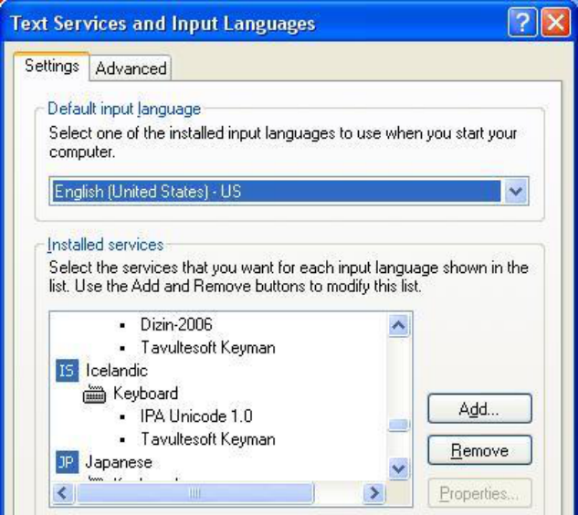
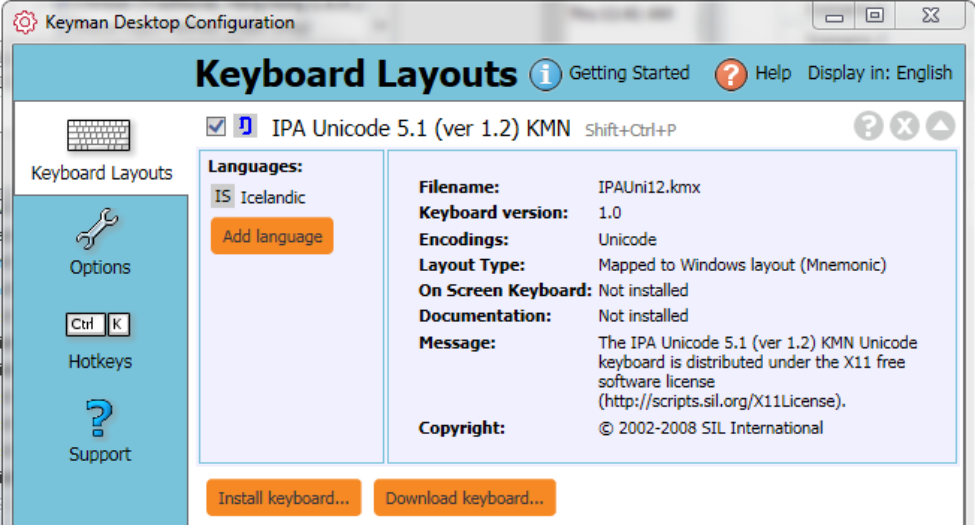
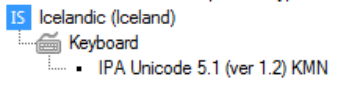
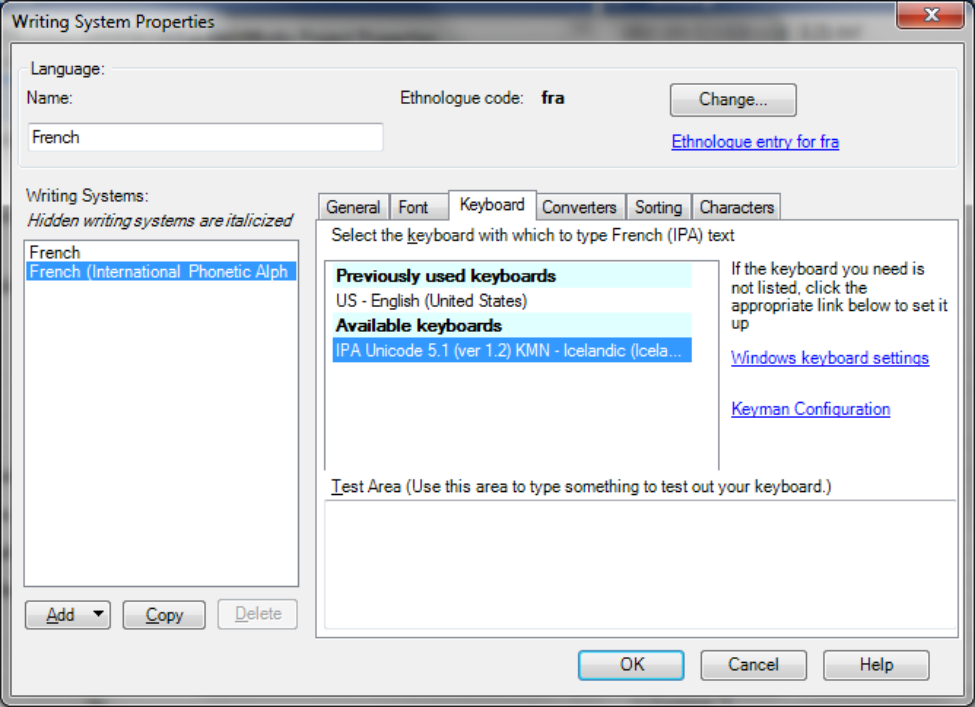
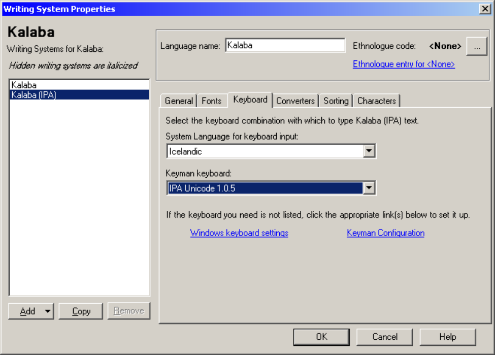
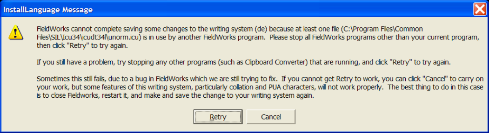

# Technical Notes on Writing Systems

1 Ingredients 

1 

October 17, 2014 

## 1 Ingredients

### 1.1 Encoding Converter

Within FieldWorks, all data needs to be in Unicode. If you need to convert your data to Unicode during import into FieldWorks or pasting from a non-Unicode application via Clipboard Converter, you need an _Encoding Converter_ . The best person to provide this for you is your local technical support person. 

In some cases, a Windows codepage or an NRSI encoding converter may work for you. A technical support person who knows the complexities of the script you are working with should be able to advise you. We have provided some further information in section 2 below. 

Make sure you have the encoding converter you need available before you try to import your data. You need to register the encoding converter either when you make the writing system or 

> 1 Open FieldWorks Language Explorer Help from the Help menu, or from the Start menu in Windows. (Start, All programs, Fieldworks, Language Explorer, Language Explorer Help.) Under the Contents tab, go to Advanced Tasks, Writing Systems, Defining a New Writing System. 

1 Ingredients 

2 

during import. Please ask your technical support person to provide you with the appropriate data about the converter to register it. 

For technical information on encoding converters, see SIL Encoding Converters.pdf at http://fieldworks.sil.org/fw-info/technical-documents/ . See the Language Explorer Help file2 on how to register the encoding converter. 

### 1.2 Font

To display your data within FieldWorks, you need to have a Unicode font. 

In many cases, a standard Windows font or an NRSI font may have all the characters you need. A list of NRSI fonts can be found here on the SIL website. One such font is Doulos SIL. 

**Doulos SIL** has the characters needed for almost any Roman- or Cyrillic-based writing system (including IPA), whether for phonetic or orthographic needs. In addition, there is provision for other characters and symbols useful to linguists. More information. 

The Doulos SIL and Charis SIL fonts are installed automatically as part of the installation of FieldWorks. (On occasional machines this automatic install may not complete successfully causing crashes. The solution is to manually install the font after FieldWorks installation.) 

If you do need a new font to be created, please talk to your local technical support person. 

For technical information on fonts and rendering, see Rendering issues.pdf at http://fieldworks.sil.org/fw-info/technical-documents/ . 

### 1.3 MSKLC or Keyman keyboard

If you used Keyman to enter non-Unicode data in another software application and you are converting your data to Unicode during import, you will need a _new,_ Unicode compliant Keyman keyboard, or a Microsoft Keyboard Layout Creator (MSKLC) keyboard. 

We provide a MSKLC keyboard for use with the phonetic characters in Doulos SIL. After FieldWorks installation, it is located in the folder C:\Program Files (x86)\SIL\FieldWorks 8\ Keyboards\IPA\MSKLC on your computer. ipa101\setup.exe is the file to install the keyboard into Windows, while the document Sources\ IPA Unicode 5.0c (ver 1.0.1) MSK.doc contains more information, such as the keyboard layout. 

We provide a Keyman Keyboard for use with the phonetic characters in Doulos SIL. After FieldWorks installation, it is located in the folder C:\Program Files (x86)\SIL\FieldWorks 8\Keyboards\IPA\Keyman on your computer. IPAUni12.kmp is the actual Keyman keyboard file, while the document IPA_Unicode_5.1 (ver 1.2) KMN.doc contains more information, such as the keyboard layout. You will need to install (register) the keyboard in Keyman before you can use it. See the Language Explorer Help file3 for instructions on how to make a Keyman keyboard work with a FieldWorks writing system. Some information and examples are also given in this document in section 3. 

> 2 Open FieldWorks Language Explorer Help from the Help menu, or from the Start menu in Windows. (Start, All programs, Fieldworks, Language Explorer, Language Explorer Help.) Under the Contents tab, go to Advanced Tasks, Writing Systems, Encoding Converters, Encoding Converters overview. 

2 Notes and Recommendations 

3 

There are various Keyman keyboards supplied on http://scripts.sil.org/KeymanKeyboardLinks or you can search on http://www.tavultesoft.com/keyman/downloads/keyboards/search.php 

If you need a custom keyboard made for use with your vernacular writing system, the best person to provide this for you is your local technical support person. 

For technical information on keyboarding issues, see Keyboard input.pdf at http://fieldworks.sil.org/fw-info/technical-documents/ . 

## 2 Notes and Recommendations

### 2.1 Encoding Converters

Here are some recommendations for encoding converters that usually work for the listed scripts: 

**Basic Roman characters** : When you use one of the Lexicon import wizards, FieldWorks automatically registers an encoding converter for you called “Windows 1252<>Unicode”. (This is Windows Code Page, Western European (Windows) [ **1252** ].) 

**IPA data** : We provide a TECkit mapping you can use in C:\Program Files (x86)\FieldWorks 8\Fonts\IPA93Mapping\silipa93.tec to convert characters entered using the SILDoulos IPA93 legacy font. 

**Chinese** : Windows Code Page, Chinese Simplified (GB2312-80) [20936] 

**Korean** : Windows Code Page, Korean (EUC) [51949] 

You need to register the relevant encoding converter according to the instructions given in the Language Explorer Help file. See “Encoding Converters overview” and the associated help topics. 

### 2.2 Same Script for different languages?

Even if the same script (e.g. Roman) is used for multiple languages, you should still create a _separate writing system_ for each language. Each writing system in FieldWorks is a _combination_ of language and script properties. Therefore you should create a separate writing system for the vernacular language even if it uses exactly the same set of characters as your analysis language. 

### 2.3 Multiple Writing Systems for the same language

FieldWorks supports the need for multiple writing systems (such as scripts) for the same language. This includes, for example, a Roman representation of a non-Roman script, or phonetic and phonemic representations of the standard orthography. 

#### 2.3.1 Creating and adding phonetic and phonemic writing systems to your project

1. When you create your FieldWorks project and define the vernacular writing system, go through the Writing System Wizard normally and create your orthographic writing system first. Assume the language is Waorani for this explanation. In particular, in Step 2 do not 

> 3 Open FieldWorks Language Explorer Help from the Help menu, or from the Start menu in Windows. (Start, All programs, Fieldworks, Language Explorer, Language Explorer Help.) Under the Contents tab, go to Advanced Tasks, Writing Systems, Defining a new writing system, Keyman setup. 

2 Notes and Recommendations 

4 

click the IPA checkbox. If you click the Advanced button, you'll see a Writing System code at the bottom (e.g., auc). (Note, even if you do not have a formal orthography yet, you can still set up the writing system now to use later. You can change the details if necessary when the orthography is formalized.) 

2. To add a phonetic writing system, open your project and from the menu choose Format…Setup Writing Systems. Under Vernacular Writing Systems make sure Waorani is selected, then click Add…Writing System for Waorani… This brings up the Writing System Properties dialog for the Waorani language, and a new writing system for this language has been added to the list. Before you can do anything else, you need to specify a variant name and/or script name to make this writing system unique. For a phonetic writing system, select Phonetic in the Variant name  box. You'll see the Internal Writing System code has the same language identifier as your orthographic writing system, but it will be followed by two underlines and X_ETIC (e.g., auc__X_ETIC). This tells FieldWorks that it is a different writing system for the same language. You'll want to change the writing system Abbreviation to indicate it is phonetic (e.g., aucPt) and then specify other properties for this writing system such as Fonts and Keyboard. Doulos SIL is the normal font you should use for IPA. For a keyboard, you’ll probably want to use the Keyman or MSKLC keyboard discussed in this document. 

3. To add a phonemic writing system, assuming you are still in the Writing System Properties dialog for Waorani, click Add…Writing System for Waorani… This adds a new writing system in the list. Before you can do anything else, you need to specify a variant name and/or script name to make this writing system unique. For a phonemic writing system, select Phonemic in the Variant name box. You'll see the Internal Writing System code has the same language identifier as your orthographic writing system, but it will be followed by two underlines and EMC (e.g., auc__X_EMIC). This tells FieldWorks that it is a different writing system for the same language. You'll want to change the writing system Abbreviation to indicate it is phonemic (e.g., aucPm) and then specify other properties for this writing system such as Fonts and Keyboard. Doulos SIL is the normal font you should use for IPA. For a keyboard, you’ll probably want to use the Keyman or MSKLC keyboard discussed in this document. 

#### 2.3.2 Creating an alternative writing system, e.g. Roman for a non-Roman script

1. When you create your FieldWorks project and define the vernacular writing system, go through the Writing System Wizard normally and create your non-Roman orthographic writing system first. If you click the Advanced button, you'll see a Writing System code at the bottom (e.g., fr). 

2. To create a Roman-based vernacular writing system, follow step 2 above, but instead of selecting Phonetic in the Variant name box, select Latin in the Script Name box. Now you'll see the Writing System code has the same language identifier as your orthographic writing system, but it will be followed by an underscore and Latn (e.g., fr_Latn). This tells FieldWorks that it is a different writing system for the same language. You'll want to 

2 Notes and Recommendations 

change the writing system Abbreviation to indicate it is romanized (e.g., freRm), and then fill in appropriate fonts and a keyboard. 

The instructions provided here also apply to analysis writing systems, if for example you need a Roman version of a non-Roman analysis language. In this case, begin the process by selecting the desired language in the Analysis Writing Systems list, then click Add…Writing System for <language>… Then follow step 2 above to define the writing system. 

If you want to add a new analysis language, in the Analysis Writing Systems section click Add…New…. This will bring up the new language dialog allowing you to specify the language and the first writing system for that language. 

#### 2.3.3 Reordering writing systems

Once you have the additional writing systems created, you can choose to enable whichever ones you want in whatever order you want. To change this, choose Format…Setup Writing Systems4 and in the Vernacular Writing Systems box, check the ones you want to see in the Edit views and in columns, and use the up/down arrows to change the order. The topmost one is the current default vernacular writing system. When you click OK you'll see that lexeme forms, citation forms, example sentences, etc. provide the capability to enter forms in any of the checkedvernacular writing systems. 

Unchecked writing systems are available in the toolbar writing system chooser. This feature allows you to select a span of text and change the writing system of the selected text. However, note that not all fields support this feature. Unchecked writing systems are also available to display in fields by using the Writing Systems submenu in the field context menu. However, unchecked writing systems are never available for columns in this version. 

Caution: If you change the order of vernacular writing systems so that the topmost writing system changes, and if you plan to do any work with interlinear text in the new writing system, be sure to read and follow the help information on Baseline Text Writing Systems to avoid certain pitfalls you may encounter. 

#### 2.2.4 Current limitations on multiple scripts for interlinear baseline texts

Language Explorer 2.0 and later added capabilities for interlinearizing baseline texts in different writing systems, but at this point care must be taken to avoid saving your data in an erroneous way that cannot easily be rectified until future enhancements are made. 

When text is interlinearized, the program identifies words in the baseline text and adds words (wordforms) to the word list or matches them up with existing words. 

If the program has processed the word "kat" in a phonetic text, "kat" is entered into the word list. If you then enter an orthographic story containing the word "cat", the program will check the Word list but won't find a match. A new wordform item will be created for "cat". Now there are two separate wordform records for the same underlying word. One that has 'kat' as a phonetic form and the other one with 'cat' as the orthographic form. You would need a way to merge these 

> 4 In other FieldWorks applications, this is found in File…Project Management…Project Properties. Click on the Writing Systems tab. 

3 MSKLC and Keyman setup 

two wordform records into a single wordform record. Language Explorer does not yet have a way for you to merge wordform records. 

To avoid this problem, you can add a second Word line to the interlinear view in the other vernacular writing system. For example, if the text is phonetic, you should add a second Word line, set to the orthographic writing system. You can then type in the orthographic form of each word. The Word list then stores both forms of the word together in the same wordform record. 

If you need to change the spelling of a word, use the Tools>Spelling>Change Spelling… tool. This ensure you change all occurrences (if desired) and changes the spelling of the form in the wordform record, not just in this text. 

In Words Analyses, you can add separate Form columns for each writing system. By default, the Form column will show the Default Vernacular unless it is empty, in which case it displays content of the next vernacular writing system, such as a phonetic word. This is called Best Vernacular. If it is hard to tell your writing systems apart, either use separate columns, or add a color (etc) to each writing system in the Normal style. 

You can use Bulk Edit Wordforms to enter missing forms in one or more writing systems, and you can use the bulk edit tools to do this, if appropriate. If you are going to interlinearize text that contains words in more than one writing system, you need to make sure that all wordforms and lexeme forms have both writing systems filled in. Otherwise you will end up with duplicate wordforms with no way to merge them until a new feature becomes available to do this merge. Lexeme forms and citation forms can be filled in via the Browse view or Bulk Edit Entries in the Lexicon. 

Refer to the help information for more instructions on interlinearizing with multiple scripts. For technical information on interlinearizing with multiple scripts, see Flex tips.doc at www.fieldworks.sil.org/techsupportdocs.htm . 

## 3 MSKLC and Keyman setup

So that FieldWorks will choose the correct writing system and MSKLC or Keyman keyboard automatically, every MSKLC or Keyman keyboard you intend to use in a given FieldWorks project must first be installed. A MSKLC keyboard is installed by using the supplied .MSI file. A Keyman keyboard is installed via the Keyman Configuration dialog. After they are installed, they must be assigned to a _Windows input language_ that is not used for any other purpose on your computer. Before FieldWorks can use the Windows input language, you must enable that language in the **Text Services and Input Languages** dialog box. If you are using Keyman 9, it’s easiest to just create the Windows input language directly from the Keyman Configuration dialog. 

3 MSKLC and Keyman setup 

7 

_Windows input languages_ are defined in **Start...Settings...Control Panel...Regional and Language Options** . Choose the **Languages** tab, and then click the **Details** button. A shortcut to get to this dialog is to right-click the language bar in the system tray and choose **Settings** . This dialog can also be opened from within the FieldWorks Writing System Properties dialog by clicking the blue Windows keyboard settings link in the Keyboard tab. Click the **Add** button to add a new input language. Select an **Input Language** that you do _not_ expect to ever use for another purpose, such as actually typing that language. Select the appropriate MSKLC keyboard or Keyman keyboard under **Keyboard layout/IME** . You may like to choose an input language which has an association of some kind with the keyboard, such as **I** celandic for typing **I** PA. 

#### Keyman 9 and FieldWorks 8.0.6 and later Notes

Keyboards have to be set up in a different way for Keyman 9. Installed keyboards no longer show up in Text Services and Input Languages under the Show More option when adding an input language. Instead, you need to do your setup from Keyman Configuration. 

3 MSKLC and Keyman setup 

8 

For FieldWorks use, after installing a Keyman keyboard, you need to add it to a Windows language that you are not using for any other purpose. You do this in the Keyman Configuration dialog. Click the down arrow to the right of the Keyman keyboard you want to assign. This gives a screen as shown above. Click the Add language button and choose the Windows language you want to use with this keyboard (Icelandic in the example). If there is another language assigned, you can remove it you can remove it by clicking the X to the right of the language you want to remove. For FieldWorks use, you should only assign it to one language. Click OK to close the configuration dialog. 

If you click the “Windows keyboard settings” blue link in the FieldWorks Writing System Properties dialog in the Keyboard tab, you should only have the Keyman keyboard in the input language keyboard section as shown here (in Windows 7). 

Now the keyboard is properly installed and ready to use in FieldWorks. To enable the Keyman keyboard for a FieldWorks writing system, in the Keyboard tab click the available keyboard that contains the Keyman keyboard and the associated language and click OK to close the dialog. Now when you click in a field that uses this writing system, it Flex should automatically switch to the appropriate Keyman keyboard. 

3 MSKLC and Keyman setup 

9 

Note the same Keyman keyboard can be used with multiple FieldWorks writing systems using the single Windows input language. But you shoujld never assign two Keyman keyboards to the same Windows input language. Instead, each Keyman keyboard should be assigned to a unique Windows input language. 

#### Notes for older versions of Keyman and FieldWorks

Earlier versions of FieldWorks (before FW8.0.6) worked best if a Keyman keyboard assigned in this way also had Tavultesoft Keyman (Keyman 6) or Tavultesoft Keyman Desktop TSF Addin (Keyman 7) as another option in the Keyboard section. This line enabled Text Services Framework in Keyman and was required for proper operation of some Keyman keyboards in FieldWorks. If it is not there, add it to the Keyboard section. 

**Note** : All versions of FieldWorks since FW8.0.6 do not use the TSF Addin and if any still exist in Windows input languages, they should be deleted. 

- For Keyman 6, Keyboard label for your language, then click the **Add** button and choose Tavultesoft Keyman in the **Keyboard layout/IME** combo. 

- For Keyman 7 or 8, you need to have at least Keyman version 7.0.241.0 or higher for this to work. After you have defined all of the input languages you need, then go to the Keyman configuration dialog. If you are in the FieldWorks Writing System Properties dialog, you can do this by clicking the blue Keyman Configuration link. In the Keyman Configuration dialog, click Addins, then under kmtip click the Configure button, then click OK to the dialog that 

3 MSKLC and Keyman setup 

10 

adds TSF to installed languages. You’ll need to repeat this step any time you add a new input language for Keyman use. 

**Note** : Keyman 7 Light and the earlier free version of Keyman 6.2 do not provide options for selecting the Keyman keyboard or Tavultesoft Keyman in this combo. For these keyboards, US is usually the best keyboard choice. 

#### Keyman 7 Notes

Keyman 7 has an option in the Configuration dialog that can cause the automatic writing system selection in FieldWorks to fail. In the Options tab, in the Advanced section, there is a checkbox for ‘Switch Windows language when a Keyman keyboard is selected’. When using FieldWorks, if this is checked, you may find that the correct writing system is not selected when you click in different fields. Clearing this checkbox will solve the problem as long as other things are configured properly. 

Some versions of Keyman 7 sticking shift problems which will interfere with entering the desired characters and may affect the ability to use certain functions in programs. This problem has been fixed in Keyman 7.1.268. If you experience this problem, download and install the latest version. 

Once system input languages are set properly, in the FieldWorks Writing System Properties dialog, select the input language and Keyman keyboard pair that you defined in Windows (such as Icelandic and IPA Unicode 5.0c (ver 1.1.5) KMN). If you are using a MSKLC keyboard, leave the **Keyman keyboard** combo set to None. 

3 MSKLC and Keyman setup 

11 

Here are some examples (FW = FieldWorks writing system, SL = System Language, KM = Keyman keyboard): 

This example is typical for a single IPA writing system for a vernacular language: 

FW: French SL: French (France) KM: None FW: French (Phonetic) SL: Slovenian KM: IPA Unicode 1.1.5 This example will cause problems in FieldWorks because the Keyman keyboard does not have a unique language: FW: French SL: French (France) KM: None FW: French (Phonetic) SL: French (France) KM: IPA Unicode 1.1.5 This example will work if you have two languages each with the same IPA keyboard. FW: French SL: French (France) KM: None FW: French (Phonetic) SL: Slovenian KM: IPA Unicode 1.1.5 FW: English SL: English (United States) KM: None FW: English (Phonetic) SL: Slovenian KM: IPA Unicode 1.1.5 This example handles multiple Keyman keyboards: FW: Northern Yi SL: Faeroese KM: Yi keyboard FW: Northern Yi (Phonetic) SL: Icelandic  KM: IPA Unicode 1.0.5 FW: Northern Yi (Pinyin)  SL: Estonian KM: Yi Pinyin FW: Chinese (Pinyin) SL: Polish KM: Pinyin 

This example will cause problems in FieldWorks because the Keyman keyboard does not have a unique language: 

This example will work if you have two languages each with the same IPA keyboard. 

This example handles multiple Keyman keyboards: 

Keyman 7 Light and the earlier free version of Keyman 6.2 do not support TSF (Technical Services Framework). TSF provides (amongst other things) context sensitive typing. For example, if you type a d but subsequently realize it should be ð you can simply place the cursor after the d and add the = necessary for Keyman to transform it into ð. Without TSF, you need to delete the d and retype d=. You can continue to use Keyman 6.2 if you already have it installed, but any new installations, including installations on Vista will need to use Keyman 7 which is no longer free. 

If you are designing Keyman keyboards for use with FieldWorks, you need to be aware that context sections must be designed to expect Unicode characters in Normalization Form Decomposed (NFD). The output of a Keyman table for FieldWorks programs can be NFD or NFC (Normalization Form Composed). 

There are some sensitivities between older versions of Keyman and FieldWorks. Please read the section in the Language Explorer ReadMe to get advice on how to troubleshoot. You can open the ReadMe as follows: Start, All Programs, FieldWorks, Language Explorer, View the Language Explorer ReadMe file. 

4 Writing System Error Message 

12 

## 4 Writing System Error Message

There are three scenarios in which an error message labeled “InstallLanguage Message” may appear. The information in the top paragraph will vary according to the scenario. 

### Scenario 1

When opening a FieldWorks application that you have not used before since (re)installing, and you already have other FieldWorks applications5 open, you may see the above message while the application is loading. 

**Action** : Close the other FieldWorks applications and click Retry on the above message box, once the other applications have closed. You may need to click Retry twice. 

**Note** : Any other programs which use ICU, such as Clipboard Converter, may also cause this error. If you are aware of any other program like this, close it as well. 

If you continue to get the error message after having closed all programs which could cause the error, follow the instructions under Scenario 3. 

### Scenario 2

When creating a new writing system or modifying an existing writing system, you may get this error message if you have more than one FieldWorks application running. **Action** : Close all other instances of FieldWorks, and then click Retry. You may need to click it more than once. 

**Note** : Any other programs which use ICU, such as Clipboard Converter, may also cause this error. If you are aware of any other program like this, close it as well. 

If you continue to get the error message after having closed all programs which could cause the error, follow the instructions under Scenario 3. 

### Scenario 3

When creating a new writing system or modifying an existing writing system, it is sometimes possible to get this error message spuriously even when you do _not_ have any other FieldWorks applications running. 

**Action** : 

5 By this we mean Data Notebook or Topics List Editor, for example. Other instances of Language Explorer should not cause this problem. 

4 Writing System Error Message 

13 

1. Double-check that no other FieldWorks applications are running. If they are, follow the instructions under Scenario 2. Check that no other programs which use ICU, such as Clipboard Converter, are running. If so, close them and click Retry. 

2. Otherwise, click Cancel. The result will be that your writing system appears to be added correctly in FieldWorks, but under the hood it is not added to ICU. This means that complex things such as the sort order may not work correctly. 

3. To remedy this (i.e. to get the writing system added to ICU correctly) next time you open the relevant project, modify the writing system (Format…Setup Writing Systems) such as by changing writing system abbreviation. Assuming you do not get the error message this time, the writing system will be added to ICU.