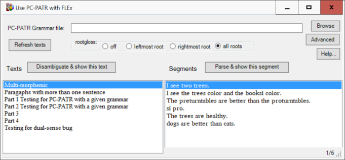
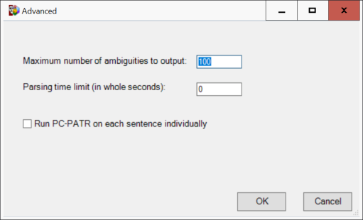
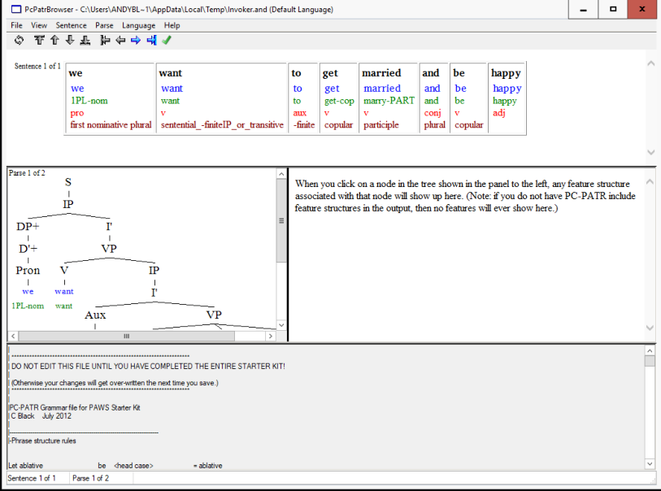
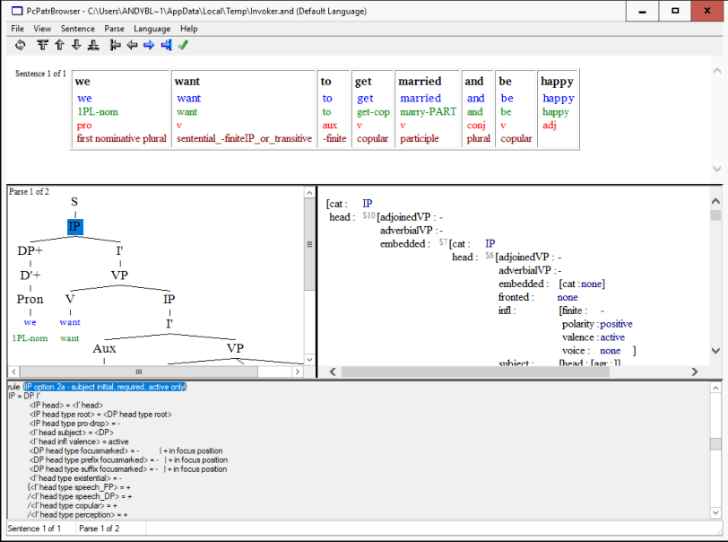

# Use PC-PATR with FLEx User Documentation

**_Use PC-PATR with FLEx_ User Documentation** _H. Andrew Black SIL International_ andy_black@sil.org 3 April, 2026 Copyright © 2018-2026 SIL International 

## 1 Introduction

_Use PC-PATR with FLEx_ is a tool that works as a utility in _FieldWorks Language Explorer_ (aka _FLEx_ ). _Use PC-PATR with FLEx_ can use a PC-PATR grammar to disambiguate a text or a portion of a text that has been analyzed in a _FLEx_ project. You tell _Use PC-PATR with FLEx_ the PC-PATR grammar file to use. Then you can choose a text or a portion of that text and ask _Use PC-PATR with FLEx_ to try and disambiguate it. 

_Use PC-PATR with FLEx_ works with version 9.1.14 Beta or higher of _FLEx_ and is only available on 64-bit Windows computers. 

While you can use any PC-PATR grammar file, _Use PC-PATR with FLEx_ expects that you will have used the _PAWS_ program to create the PC-PATR grammar file. See <u>https://software.sil.org/paws/</u> for more on _PAWS_ . 

### 1.1 Invoking** **_Use PC-PATR with FLEx_ from within** **_FLEx_

While running _FLEx_ , use Tools menu item / Utilities.... Find the “Use PC-PATR with FLEx” item, check it, and then click on the “Run Checked Utilities Now” button. 

### 1.2 Initial invocation

The first time you invoke _Use PC-PATR with FLEx_ on a _FLEx_ database, it will automatically add to your _FLEx_ database the following: 

1. a custom field to each sense (called “PCPATR”) and 

2. a custom list (called “PCPATR Feature Descriptors”) containing the template names that the PC-PATR grammar generated by the _PAWS_ program expects. 

The names shown above are always in the English analysis writing system and English is the only writing system containing these names. 

You can find the custom list by clicking on the “Lists” button in _FLEx_ . 

### 1.3 Appearance

_Use PC-PATR with FLEx_ looks like what is shown in (1). 

(1) 

_Advanced_ 

_3_ 

The texts in the _FLEx_ database are shown in the left pane and the segments of the first text are shown in the right pane. There are buttons you can click. Each is discussed in section 2 below. 

## 2 Buttons

You control _Use PC-PATR with FLEx_ by using the various buttons. This section briefly describes them. See sections 3–4 for more on what happens for the segment and text buttons, respectively. 

### 2.1 PC-PATR grammar Browse button

To choose which PC-PATR grammar file to use, click on the Browse button. By convention, PC-PATR grammar files have an extension of “.grm” so this is what the file browser uses. 

### 2.2 Rootgloss choices

_PC-PATR_ allows you to have “rootglosses” in rules. This section allows you to set one of four options with respect to how rootglosses are handled. See section 3.2.14.22 “set rootgloss” in the PC-PATR Reference Manual.1 The four options are: 

1. off: rootglosses are not used; this is the default; 

2. leftmost root: the first / leftmost root is used; 

3. rightmost root: the last / rightmost root is used; 

4. all: every root is used. 

### 2.3 Advanced

The “Advanced” button is used to changed some advanced options. It brings up a dialog that looks like what is shown in (2). 

(2) 

There are three options: 

> 1Use the Help menu item / PC-PATR Reference Manual to see this document. 

_4_ 

_Use PC-PATR with FLEx User Documentation_ 

1. “Maximum number of ambiguities to output:” is the maximum number of ambiguities that will appear in the _PcPatr Browser_ . The default is 100. 

2. “Parsing time limit:” is how many seconds to allow for parsing the segments. The default is 0 (which means no time limit). 

3. “Run PC-PATR on each sentence individually” is for running each segment individually when disambiguating a text. It is most useful when using a time limit. With this option, you can have _Use PC-PATR with FLEx_ parse each segment for a maximum number of seconds given by the parsing time limit. Without this option, the maximum time limit is for the entire text. With this option, the maximum time limit is for each segment. 

_Use PC-PATR with FLEx_ will remember the settings for each of these three options when you close _Use PC-PATR with FLEx_ . 

### 2.4 Help button

The “Help...” button is used to get this user documentation file, show the PCPATR Reference Manual, or to show the “About” dialog box. 

### 2.5 Refresh texts button

Whenever you click on the “Refresh texts” button, _Use PC-PATR with FLEx_ will reload all of the texts from _FLEx_ . This is so if you know that if some texts have been added, deleted or changed since you first started _Use PC-PATR with FLEx_ , you can get the most current list of texts. 

### 2.6 Disambiguate button

Above the pane containing the texts is a button labeled “Disambiguate & show this text.” You use this button to try and use the PC-PATR grammar to disambiguate this entire text. See section 4 for more. 

### 2.7 Parse button

Above the pane containing the segments of the selected text is a button labeled “Parse & show this segment.” You use this button to try and use the PC-PATR grammar to parse this particular segment. See section 3 for more. 

## 3 Parsing a segment

When you use the “Parse & show this segment” button for a segment or double click on that segment, _Use PC-PATR with FLEx_ will pass the parsing information that you entered in _FLEx_ to _PC-PATR_ , along with the PC-PATR grammar, and process that segment. The result will be shown in a slightly newer version of the _PcPatr Browser_ tool (https://software.sil.org/carla/pc-patr-browser/). See appendix A for more information on this tool. 

_Restarting Use PC-PATR with FLEx_ 

_5_ 

You use this tool to see all the parses the _PC-PATR_ program produced for this segment using the PC-PATR grammar file. When there are two or more parses, you can show the correct one and then use Parse / Use This Parse menu item (or click on the tool bar button) to have this analysis be recorded in the _FLEx_ database for this segment. That is, this segment will be disambiguated, using the information from this parse. 

If you are using the TreeTran program, you can save the results of the disambiguated parses in a file called Invoker.xml in the %TEMP% directory. You do this by using File / Save for TreeTran to make sure there is a check mark before it. Alternatively, you can click on the item in the tool bar. 

When you are done looking at the results, close the _PcPatr Browser_ tool and you will return to _Use PC-PATR with FLEx_ . 

You can also select more than one segment. When you then use the “Parse & show this segment” button, _Use PC-PATR with FLEx_ will parse and show all of the selected segments. 

## 4 Disambiguating a text

When you use the “Disambiguate & show this text” button, _Use PC-PATR with FLEx_ will pass the parsing information for all segments in the text to _PC-PATR_ , along with the PC-PATR grammar, and process all those segments. Since all the segments are processed, this will probably take a while. So please be patient. The result will be shown in the slightly newer version of the _PcPatr Browser_ tool. See appendix A for more information on this tool. 

Unlike with parsing a segment (see section 3), the result will have as many “sentences” as there are segments in the text. 

By default, _Use PC-PATR with FLEx_ will disambiguate a segment in the _FLEx_ database whenever the result of the parsing uniquely identifies the analysis of each word in the segment. For those cases where there are still ambiguities, you can use the _PcPatr Browser_ tool to select a given parse to use. Like with parsing a segment, you show the correct parse and then use Parse / Use This Parse menu item (or click on the tool bar button) to have this analysis be recorded in the _FLEx_ database for this segment. That is, this segment will be disambiguated, using the information from this parse. 

When you are done looking at the results, close the _PcPatr Browser_ tool and you will return to _Use PC-PATR with FLEx_ . 

## 5 Restarting** **_Use PC-PATR with FLEx_

Whenever you exit and restart _Use PC-PATR with FLEx_ , it will do the following: 

1. remember its window size, location, and layout; 

2. remember which PC-PATR grammar file you last chose; 

3. remember which text in that project you last selected; and 

_Use PC-PATR with FLEx User Documentation_ 

_6_ 

### 4. remember which segment in that text you last selected.2

## 6 Error messages

In certain situations, _Use PC-PATR with FLEx_ will issue an error message. Table 1 lists the errors _Use PC-PATR with FLEx_ reports along with a brief description of what the error might mean. 

| Error | Meaning |
|----|----|
| The PC-PATR grammar file had an error in it and failed to load. We will show the error log after you click on OK. Please fix all errors in the grammar file and then try again. | The PC-PATR grammar file being used has at least one error in it so the PC-PATR program could not load and use it. The list of errors (and any warning messages, too) will be shown as soon as you click on the OK button. Note that in the error message file, the grammar file's location may look odd, but it is the same as what is showing before the “Browse” button.3 Also, the error messages and warnings may be a bit cryptic. See the PC-PATR Reference Manual for (some possible) help on this. (The manual is available via the "Help” button; see section 2.4.) |
| The following glosses contain a space. Please fix them and try again. | At least one gloss used in one of the segments has a space in it. This will produce incorrect values in some of the files used. You will continue to get this message until you find and fix the gloss. You should be able to search for the gloss in Lexicon Edit in FLEx. |
| Segment number number does not have any words in it. Please remove it or add words and try again. | The indicated segment number does not have any words in it. You need to either remove the segment from the text or add some words to the segment in FLEx. |

> 2If you selected more than one segment, _Use PC-PATR with FLEx_ will remember the bottom-most one. 

> 3This happens for long file names or folder names. _PC-PATR_ is a “DOS” program and uses this cryptic format. 

_Known problems_ 

_7_ 

**Error Meaning** ~~Sorry, but not every sentence has every The indicated word does not have a~~ word parsed. At least the word ' _word_ ' parse. You need to give that word a did not parse. Please make sure every parse in _FLEx_ . word is parsed and try again. Sorry, but at least the word ' _word_ ' has an The indicated word does not have a analysis with an invalid parse. Please valid parse. You need to fix it in _FLEx_ . make sure every word has valid parses and try again. The read failed for segment number Something went wrong while _number_ ; _some error message_ processing the indicated segment number. This only shows when the “Run PC-PATR on each sentence individually” option is set (see section 2.3). It may be that the “Parsing time limit” was met and _Use PC-PATR with FLEx_ had some issue trying to read one of its temporary files. 

The PC-PATR processing failed! Perhaps there are incompatible feature values in one of the forms. We will show the error log after you click on OK. You may also want to try and run the PcPatrFLEx.bat file in the %TEMP% directory. This may or may not show which features are incompatible or some other PC-PATR error or warning message. 

When processing the input segment, the PC-PATR grammar file being used has at least one incompatibility in it. The list of errors (and any warning messages, too) will be shown as soon as you click on the OK button. Note that in the error message file, the grammar file's location may look odd, but it is the same as what is showing before the “Browse” button. Also, the error messages and warnings may be a bit cryptic. See the PC-PATR Reference Manual for (some possible) help on this. (The manual is available via the "Help” button; see section 2.4.) 

**Table** 1: _Error messages_ 

If you get an error message not in the list above, please report it. See section 8. 

## 7 Known problems

The following items are known to be less than desirable with this version of _Use PC-PATR with FLEx_ : 

_8_ 

      - _Use PC-PATR with FLEx User Documentation_ 

1. _Use PC-PATR with FLEx_ assumes that the comment character in the PC-PATR grammar file is a vertical bar |. If you use something else, the parser will fail every segment. 

2. When a word in _FLEx_ does not have the “Word Cat" field filled out for a word in the interlinear, _Use PC-PATR with FLEx_ will try and guess what the category of the word should be. It does this as follows: 

   - a. If there is only one morpheme, use its category. 

   - b. If there are two or more morphemes and only one stem/root, find the stem and use its category. (This could be incorrect if one of the affixes is derivational and changes the category.) 

   - c. If there are two or more stems, use the category of the left-most one. (This could be incorrect if some other stem is the correct category to use or if the stem compounding results in a different category or if one of the affixes is derivational and changes the category.) 

   - Therefore, it is always a good idea to overtly fill out the “Word Cat” field in _FLEx_ . 

3. When a morpheme in a word analysis has just the form but no sense or grammatical info, then the gloss showing in the output will be the gloss of the first sense of the entry for the morpheme. 

4. When a morpheme in a word analysis has the form and grammatical info but no sense overtly indicated and there are two or more senses using the grammatical info in the entry, then the gloss showing in the output will be the gloss of the first sense which uses the grammatical info. 

5. The user interface is in English only. 

## 8 Support

If you have any questions with _Use PC-PATR with FLEx_ or find bugs in it, please send an email to <u>andy_black@sil.org.</u> 

## A. The** **_PcPatr Browser_ tool

This appendix briefly covers the various parts of the _PcPatr Browser_ tool. 

## A.1 Overview

Example (3) is a screen shot of what it looks like for one segment using one PC-PATR grammar. 

<!-- Start of picture text -->
Overview 9 <!-- End of picture text -->

<!-- Start of picture text -->
(3) <!-- End of picture text -->

There are four panes: 

1. the segment in an interlinear form (at the top); 

2. the syntactic tree, if any (left, middle); 

3. the feature structure of the selected node in the tree (right, middle); and 

4. the PC-PATR grammar file used (bottom) 

When a node in the tree is selected, the bottom pane will show the rule in the PC-PATR grammar file that produced that node. In addition, the features for that selected node will appear in the right, middle pane. For example, when clicking on the IP node, it looked like example (4). 

_Use PC-PATR with FLEx User Documentation_ 

_10_ 

(4) 

When there is more than one segment, you can use the Sentence menu item options or the first set of arrow buttons on the tool bar to navigate from one sentence to another. See appendix A.3 for keyboard shortcuts. (Please note that with _Use PC-PATR with FLEx_ , “sentence” is the same as “segment.”) 

When there is more than one parse for a given segment, you can use the Parse menu item options or the second set of arrow buttons on the tool bar to navigate from one parse to another. See appendix A.3 for keyboard shortcuts. 

When you manually select to use a parse, then the entire tree description will be highlighted in yellow. In addition, the sentence number in the interlinear pane will be highlighted in yellow. 

## A.2 Right-to-left script

If the vernacular language of your _FLEx_ project is a right-to-left script, _Use PCPATR with FLEx_ will try to tell the _PcPatr Browser_ this. You may need to use the Language menu item, though, and uncheck and then check the “Use right-to-left orientation in parse tree and interlinear” option. 

## A.3 Keyboard shortcuts

To make processing texts faster, there are several keyboard shortcuts available. These only work when the “focus" is in the interlinear, tree, or feature panes. When _PcPatr Browser_ begins, the default is to have the “focus” on the feature pane. If you have clicked in the _PC-PATR_ grammar file pane or if you are using the keyboard 

_Keyboard shortcuts_ 

_11_ 

to select a menu item, then these shortcuts will not work. You will need to click in the interlinear, tree, or feature pane first. The shortcuts are as in example (5): 

| \(5\) | Shortcut              | Operation                            |
|-------|-----------------------|--------------------------------------|
|       | Ctrl+Down Arrow       | Next sentence                        |
|       | Ctrl+Up Arrow         | Previous sentence                    |
|       | Ctrl+Right Arrow      | Next parse                           |
|       | Ctrl+Left Arrow       | Previous parse                       |
|       | Ctrl+Shift+Down Arrow | Use this parse & go to next sentence |
|       | Ctrl+/4               | Use this parse                       |
|       | Ctrl+L                | Use this parse                       |

> 4Some keyboards may not work with this sequence. Therefore we also offer the **Ctrl+L** option.