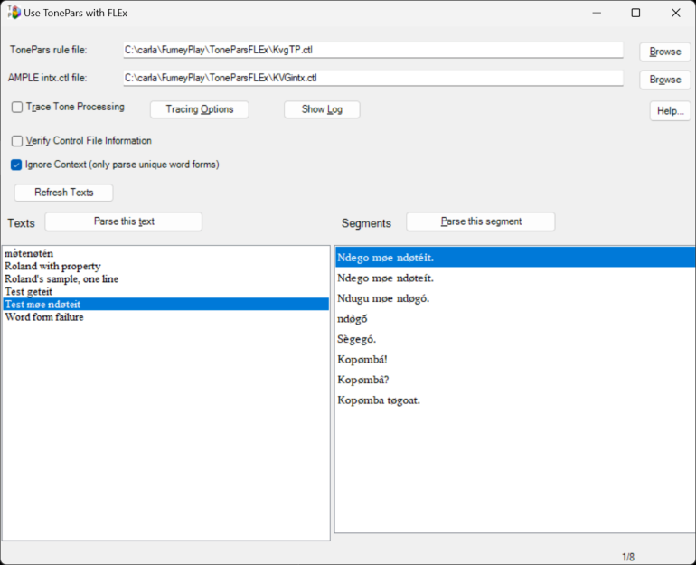
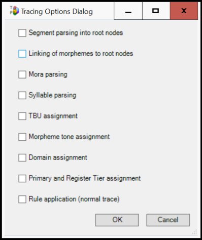

# Use TonePars with FLEx User Documentation

**_Use TonePars with FLEx_ User Documentation** _H. Andrew Black SIL International_ andy_black@sil.org 3 April, 2026 Copyright © 2019-2026 SIL International 

## 1 Introduction

_Use TonePars with FLEx_ is a tool that works as a utility in _FieldWorks Language Explorer_ (aka _FLEx_ ). _Use TonePars with FLEx_ runs either the _XAmple_ program or the _Hermit Crab_ program followed by the _TonePars_ program on a text or a portion of a text that exists in a _FLEx_ project. You tell _Use TonePars with FLEx_ the _TonePars_ rule file to use as well as an _XAmple_ input control file.1 Then you can choose a text or a portion of that text and ask _Use TonePars with FLEx_ to process it. The result will show in _FLEx_ the same as it does when using either of the two morphological parsers that come with _FLEx_ . 

When using the _XAmple_ program, the input to the _XAmple_ program is the same as what _FLEx_ uses for the default morphological parser (which is _XAmple_ ). This means that you must control _XAmple_ using the capabilities _FLEx_ offers, not what you may have used with _AMPLE_ via, say, _CARLAStudio_ . 

_Use TonePars with FLEx_ works with version 9.1.18 or higher of _FLEx_ and is only available on 64-bit Windows computers. 

### 1.1 Invoking** **_Use TonePars with FLEx_ from within** **_FLEx_

While running _FLEx_ , use Tools menu item / Utilities.... Find the “Use TonePars with FLEx” item, check it, and then click on the “Run Checked Utilities Now” button. 

### 1.2 Initial invocation

The first time you invoke _Use TonePars with FLEx_ on a _FLEx_ database, it will automatically add to your _FLEx_ database the following: 

1. a custom field to each sense (called “ToneParsSense”); 

2. a custom field for each allomorph/lexeme form2 (called “ToneParsForm”); and 

3. a custom list (called “TonePars Properties”). You use this custom list to create 

   - any allomorph or morpheme properties used in your _TonePars_ rule file. 

The names shown above are always in the English analysis writing system and English is the only writing system containing these names. 

You can find the custom list by clicking on the “Lists” button in _FLEx_ . 

> 1When using the _Hermit Crab_ program, you still need an input control file in order to define the set of input changes. These are normally used to remove tone markings from an input word. 

> 2The current version of _FLEx_ does not show this custom field on Lexeme Form. You can set it, though, by swapping the lexeme form with an allomorph. See the _FLEx_ help system for how to do this. 

_3_ 

_AMPLE intx ctl file Browse button_ 

### 1.3 Appearance

_Use TonePars with FLEx_ looks like what is shown in (1). 

(1) 

The texts in the _FLEx_ database are shown in the left pane and the segments of the first text are shown in the right pane. There are buttons you can click. Each is discussed in section 2 below. 

## 2 Buttons and check boxes

You control _Use TonePars with FLEx_ by using the various buttons and check boxes. This section briefly describes them. 

- **2.1** **_TonePars_ rule file Browse button** 

To choose which _TonePars_ rule file to use, click on the topmost Browse button. By convention, _TonePars_ rule files have an extension of “.ctl” so this is what the file browser uses. 

- **2.2** **_AMPLE_ intx ctl file Browse button** 

As you most likely already know, when using _TonePars_ , one first parses a text via _AMPLE_ but as part of the processing, _AMPLE_ strips out tone marking. The result is then passed to _TonePars_ . In order to correctly strip out the tone markings, _Use TonePars with FLEx_ needs to know the location of the input text control file 

_Use TonePars with FLEx User Documentation_ 

_4_ 

needed. To choose which input text control file to use, click on the Browse button. By convention, _AMPLE_ input text control file names end with “intx.ctl” so this is what the file browser uses. 

If you are using the _Hermit Crab_ parser in _FLEx_ , you will still need to specify this file. _Use TonePars with FLEx_ will read the input text changes from this file and apply them before parsing a word via _Hermit Crab_ . 

### 2.3 Trace Tone Processing check box

The next item is a check box with a label of “Trace Tone Processing.” When working with _TonePars_ , you often need to get a trace of what the tool is doing. When this check box is checked, _Use TonePars with FLEx_ invokes _TonePars_ with tracing turned on. The log file will show the results of the tracing process. See section 2.4 for the various tracing options available and see section 2.5 for how to see the resulting log file. 

### 2.4 Tracing Options button

When you click on the “Tracing Options” button, it brings up a dialog box that looks like what is in example (2): 

The options listed are the same as the options available in _CARLAStudio_ . 

### 2.5 Show Log button

When you click on the “Show Log” button, the log file generated by the last invocation of _TonePars_ will be displayed. 

_Parse this text button_ 

_5_ 

### 2.6 Help button

The “Help...” button is used to get this user documentation file, show the TonePars Manual, show the TonePars Grammar documentation file, or show the “About” dialog box. 

### 2.7 Verify Control File Information check box

One run time option for _TonePars_ is to verify various pieces of information. When the “Verify Control File Information’ check box is checked, _Use TonePars with FLEx_ will invoke _TonePars_ in such a way that this information will be included in the log file. You can see it by showing the log file (see section 2.5). 

### 2.8 Ignore Context check box

When the “Ignore Context” check box is checked, _Use TonePars with FLEx_ will determine all the unique word forms in the text (or segment) and parse them. This means that each unique word form is parsed once and only once no matter how many times it appears in the text (or segment). It therefore runs much faster especially on a text. This is the default setting. 

When this check box is not checked, then the input to parsing is like it is for _AMPLE_ : Each word is parsed in turn, even if it occurs multiple times. So this takes longer to parse. On the other hand, if your tone rules need to go across word boundaries,3 then you may need to process texts (and segments) this way. 

### 2.9 Refresh Texts button

Whenever you click on the “Refresh Texts” button or press the **F5** key, _Use TonePars with FLEx_ will reload all of the texts from _FLEx_ . This is so if you know that if some texts have been added, deleted or changed since you first started _Use TonePars with FLEx_ , you can get the most current list of texts. 

### 2.10 Parse this text button

Above the pane containing the texts is a button labeled “Parse this text.” You use this button to parse this entire text via the current parser chosen in _FLEx_4 and then _TonePars_ . Before parsing the text, _Use TonePars with FLEx_ will check to make sure the following files exist: 

1. The _AMPLE_ intx control file. 

2. The _TonePars_ rule file. 

3. The segments file from the _TonePars_ rule file. 

If any cannot be found, then an error message showing the unfound file(s) will show. The parsing will not be done. 

> 3That is, if some of your tone rules are edge rules… 

> 4To set the parser in _FLEx_ , use Parser menu item / Choose Parser. 

_Use TonePars with FLEx User Documentation_ 

_6_ 

If these files are there, then the mouse icon will change to the “busy” shape until it is done. The results will show in _FLEx_ the same way as using one of the morphological parsers that come with _FLEx_ show their result. It is easiest to see this in the “Texts & Words" / “Interlinear Texts" view or the “Texts & Words" / “Word Analyses” view. 

During the parsing process, the bottom left of the window will display the current step that is occurring. 

### 2.11 Parse this segment button

Above the pane containing the segments of the selected text is a button labeled “Parse this segment.” You use this button to parse this particular segment via the current parser chosen in _FLEx_5 and then _TonePars_ . Before parsing the text, _Use TonePars with FLEx_ will check to make sure the following files exist: 

1. The _AMPLE_ intx control file. 

2. The _TonePars_ rule file. 

3. The segments file from the _TonePars_ rule file. 

If any cannot be found, then an error message showing the unfound file(s) will show. The parsing will not be done. 

If these files are there, then the mouse icon will change to the “busy” shape until it is done. The results will show in _FLEx_ the same way as using one of the morphological parsers that come with _FLEx_ show their result. It is easiest to see this in the “Texts & Words" / “Interlinear Texts" view or the “Texts & Words" / “Word Analyses” view. 

During the parsing process, the bottom left of the window will display the current step that is occurring. 

## 3 Maximum analyses setting for** **_XAmple_

By default, _FLEx_ only returns a maximum of the first twenty parses found by _XAmple_ . This is often very reasonable when one is not using _TonePars_ . With _TonePars_ , however, this could easily be too few. In one _TonePars_ project, there are twenty-six nulls possible for various tone possibilities within a given word. Only returning twenty will never do. We have changed the default to be 1000. If this is ridiculously high for your situation, you can always change the setting to a different number. To do so, in the main _FLEx_ window, use the Parser / Edit Parser Parameters… menu item and set the “MaxAnalyses” value to what you need. Note that a value of -1 will be treated as 1000 by _Use TonePars with FLEx_ . 

This situation is only for when the using the _XAmple_ parser in _FLEx_ . There is no such restriction when using the _Hermit Crab_ parser. 

> 5To set the parser in _FLEx_ , use Parser menu item / Choose Parser. 

_Known problems_ 

_7_ 

## 4 Restarting** **_Use TonePars with FLEx_

Whenever you exit and restart _Use TonePars with FLEx_ , it will do the following: 

1. remember the size and position of the _Use TonePars with FLEx_ window; 

2. remember which _TonePars_ rule file you last chose; 

3. remember which _AMPLE_ intx ctl file you last chose; 

4. remember the settings of “Trace Tone Processing,” “Tracing Options.” and “Verify Control File Information;” 

5. remember which text in that project you last selected; and 

6. remember which segment in that text you last selected. 

## 5 Known problems

The following items are known to be less than desirable with this version of _Use TonePars with FLEx_ : 

1. The location of the _TonePars_ rule file and the _AMPLE_ intx ctl file work best if the path to them does not contain any spaces. 

2. The location of the segments file within the _TonePars_ rule file needs to follow the MSDOS 8.3 file convention or it may not be found. See <u>here</u> for some ways to do that. 

3. If a lexical entry in _FLEx_ is marked as either a proclitic or an enclitic, it may not parse correctly. This is because _FLEx_ creates two entries for it with the same morphname; one is as an affix and the other is as a root. _Use TonePars with FLEx_ may not process it correctly due to this ambiguity. It might be possible, however, to model these as affixes instead of as proclitics/ enclitics. 

4. When you need to mark an allomorph with an allomorph property using the custom field of “ToneParsForm,” the custom field only shows up in _FLEx_ for an allomorph. It does not show for a lexeme form. To add an allomorph property to a lexeme form, you can use the “Swap Lexeme Form with Allomorph” capability (on the Lexeme Form item) or the “Swap Allomorph with Lexeme Form” capability (on the Allomorph item). See the _FLEx_ help system for how to do this. 

5. The current version of _FLEx_ does not always parse a capitalized word. Here is one way to try and deal with this:6 

   - a. Go to the Baseline tab and change the upper-case letter to lower case. 

   - b. Return to the Analyze tab and parse the segment in _Use TonePars with FLEx_ . 

   - c. If there are multiple parser-generated analyses available, select the correct one, then click on the green check mark. (This marks that particular analysis as “user-approved” in the Word Analyses area, which the interlinear view uses as one of its default sources.) 

> 6This is a slightly modified version of Kevin Warfel's work-around in _FLEx_ 's issue tracking system at <u>LT-5722.</u> 

_Use TonePars with FLEx User Documentation_ 

_8_ 

   - d. Go back to the Baseline tab and change the letter back to upper case. 

   - e. Return to the Analyze tab, click on the word, then use the drop-down arrow on the Morphemes line to select the lower-case form of the word. (This should enable FLEx to associate the previously generated analysis of the lower-case form with the current instance.) 

6. The user interface is in English only. 

7. Be sure to close _Use TonePars with FLEx_ *before* you close _FLEx_ or there may a version of _FLEx_ running in the background. This can prevent _FLEx_ from starting again. 

8. _Use TonePars with FLEx_ produces a copy of the Tone Rule file with an extension of “.hvo” in the directory where the Tone Rule file is. This file is used by _TonePars_ in order to correctly handle “morphname is” statements in the rule file. 

## 6 Output files

When you parse a segment or a text, _Use TonePars with FLEx_ produces several temporary files. There may be times when seeing these files will prove useful, especially if you are used to seeing such files in _CARLAStudio_ . To see the files, open a Windows Explorer window in the temp directory. One way to do this is to click in the address bar and then replace its contents with “%TEMP%” (without the quotes). Next, view the directory showing details and click on the "Date modified” column header so that the most recently used files are ordered first. The files used by _Use TonePars with FLEx_ are shown in example (3) below. 

| \(3\) | File name | Contents |
|----|----|----|
|  | FLExProjectNameadctl.txt | The analysis data control file used by XAmple. |
|  | FLExProjectNamegram.txt | The PC-PATR grammar file used by XAmple. (Most likely this file will not make much sense unless you have a lot of experience with PC-PATR grammar files. |
|  | FLExProjectNamelex.txt FLExProjectNameTPadctl.txt | The lexicon file used by XAmple. The analysis data control file used by TonePars. |
|  | FLExProjectNameTPlex.txt | The lexicon file used by TonePars. |
|  | ToneParsCmd.cmd | A file containing the files loaded by TonePars. |
|  | ToneParsFLEx.bat ToneParsInvoker.ana | The batch file which invokes TonePars. The ANA file produced by XAmple which is used as the input to TonePars. |
|  | ToneParsInvoker.ant | The output ANA file produced by TonePars. |

_Support_ 

_9_ 

| ToneParsInvoker.log | The log file produced by TonePars. See section 2.5 for an easier way to see this. |
|----|----|

Note that most of these files use numbers instead of text for things like morphnames. This is how it needs to be done for _FLEx_ to properly process the data. 

## 7 Error messages

When parsing a segment or a text, you may see an error message box. The following tries to explain them. 

| Message | Explanation |
|----|----|
| Could not find the AMPLE intx.ctl file at: file location | This appears when you try to parse a text or a segment and the AMPLE intx ctrl file was not found. |
| Could not find the segments file in the TonePars rule file at: file location. Remember that this file path may need to be in 8.3 format. | This appears when you try to parse a text or a segment and while the TonePars rule file was found, the file indicated by the \segments field was not found. See section 5, item 3. |
| Could not find the TonePars rule file at: file location | This appears when you try to parse a text or a segment and the TonePars rule file was not found. |
| Log file does not exist; please parse a segment or a text. | This appears when you try to show the log file and we could not find one. |
| Somehow the result file was empty. Please try again. | We detected that the resulting TonePars file was empty. This seems to be a result of some kind of timing issue. |
| There was a timing problem. Check if the \segments path to xxxTP.seg in xxxTP.ctl is correct. See the Log file. | For some reason, the running of TonePars did not finish. One possibility is that the \segments field in the TonePars rule file had a problem or could not be found. |

## 8 Support

If you have any questions with _Use TonePars with FLEx_ or find bugs in it, please send an email to <u>andy_black@sil.org.</u>