# Variant Generator User Documentation

_H. Andrew Black SIL International_ andy_black@sil.org 9 March, 2026 Copyright © 2023-2026 SIL International 

## 1 Introduction

_Variant Generator_ is a tool that works as a utility in _FieldWorks Language Explorer_ (aka _FLEx_ ). _Variant Generator_ allows you to define operations on a form in an entry to produce new variants of that entry. You can use what is in the Citation Form, Lexeme Form, or in the first Etymology Source form for what to match on. It is possible to use a custom field, too. _Variant Generator_ defaults to using the Citation Form. 

_Variant Generator_ works with version 9.1.18 Beta or higher of _FLEx_ and is only available on 64-bit Windows computers. 

Each operation defined in _Variant Generator_ describes a pattern that is used to match the indicated kind of form in the _FLEx_ database. There also is a set of actions that are to be applied to each such form. The result of the action will produce a new variant of that entry. 

### 1.1 Invoking** **_Variant Generator_ from within** **_FLEx_

While running _FLEx_ , use Tools menu item / Utilities.... Find the “Variant Generator” item, check it, and then click on the “Run Checked Utilities Now” button. 

### 1.2 Appearance

_Variant Generator_ looks something like what is shown in (1).1 

(1) 

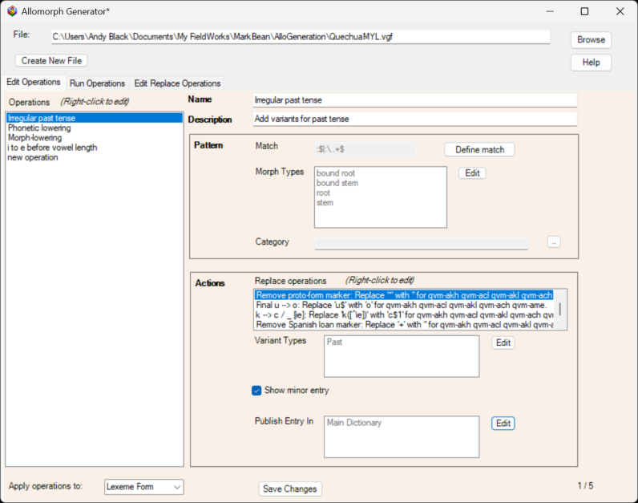

> 1Since _Variant Generator_ is based on _Allomorph Generator_ , they share many portions. We use a different background color in the tabs for _Variant Generator_ in order to provide a potentially more obvious visual distinction between the two tools. 

_Appearance_ 

_3_ 

The top portion shows the file containing the variant generation operations. Below it are three tabs, one for editing the operations, one for running them, and one for editing the master list of replace operations. See section 2 for information on using the Edit Operations tab. In one project, the Run Operations tab looks like what is in (2). 

(2) 

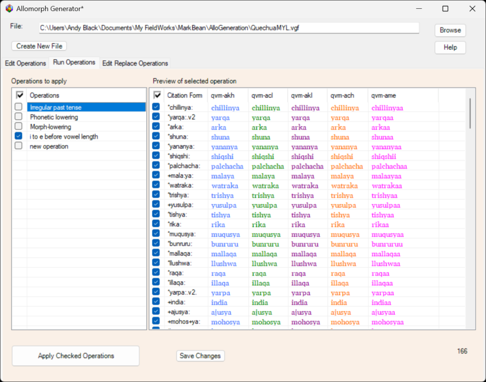

This tab is explained in section 3 below. In this same project, the Edit Replace Operations tab looks like what is in (3). 

_Variant Generator User Documentation_ 

_4_ 

(3) 

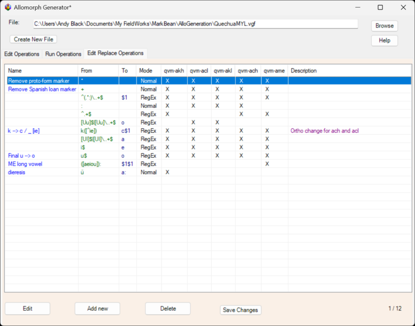

This tab is explained in section 4 below. 

The “Create New File” button is used to create a new file containing a new set of operations. When saving a _Variant Generator_ file, I suggest you put it in a folder under the “My FieldWorks” directory in your “Documents” folder. The “Browse” button is used to select an operations file. _Variant Generator_ files by convention have an extension of “.vgf” and this is what the file browser uses. The “Help” button is used to get this user documentation file. 

## 2 Edit Operations tab

The Edit Operations tab has a list of operations in a column on the left. When you select one of them, the rest of the tab contains the information about the selected operation. See sections 2.1–2.5 for more. 

You can create new operations, rearrange them, or delete them by right-clicking on one. You will then see a context menu like what is in (4). 

(4) 

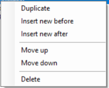

_Replace operations_ 

_5_ 

### 2.1 Operation name and description

The top two text boxes are where you give a name and a description for the operation. These are for your benefit so use something that makes sense to you. 

### 2.2 Pattern section

The pattern section contains three parts which define which forms will be used: the Match pattern, the morpheme types to use, and an optional category. 

### _2.2.1 Match_

The “Match” part uses the same dialog box that _FLEx_ uses for filter searches. To use it, click on the “Define match” button. 

### _2.2.2 Morph Types_

To set which morpheme types to use in the pattern, click on the “Edit” button to the right of the box showing the currently selected morpheme types. 

### _2.2.3 Category_

If you need to limit the pattern to a particular category, then click on the _FLEx_ - like chooser button to the right of the category box. 

### 2.3 Actions section

The Actions section allows you to define a set of ordered replace operations to be applied to the indicated form to create the shape of the new variant. You can also optionally select a set of variant types and/or indicate whether the newly created variant entry should show as a minor entry. 

### _2.3.1 Replace operations_

The first box in the actions section contains an ordered set of replace operations. They are ordered in the sense that the output of one is the input to the next. You can edit one by double-clicking on it or by right-clicking and choosing an appropriate option from the ensuing context menu. Example (5) shows what this menu might look like. 

(5) 

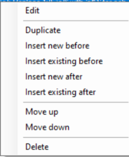

_Variant Generator User Documentation_ 

_6_ 

When you edit a replace operation, you will see a dialog box that will look something like what is in (6). 

(6) 

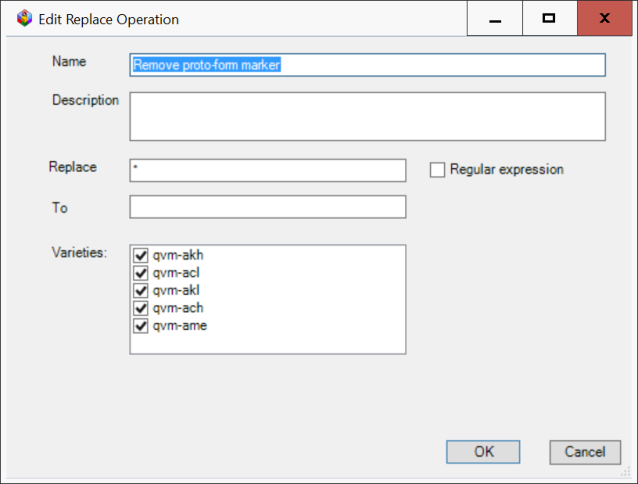

There are four text boxes: 

1. A name to use for this replace operation; 

2. a description for it; 

3. what to look for (“Replace”) and 

4. what to change what matches ("To”). 

There is also a set of vernacular writing systems names, each with a check box before it. Be sure to check each vernacular writing system that this replace operation should apply to. 

The replace can be a portion of the content of the indicated form. That is, you do not have to try to match the entire content. There is an option to use regular expressions for what to replace and what to change it to. Simply check the “Regular expression” check box or leave it unchecked. When you edit any replace here, the changes made will also be made in the corresponding replace in the Edit Replace Operations tab. That is, you do not need to make the same change here and in the Edit Replace Operations tab. You only need to make the change once in either place. 

Each replace operation can be applied to one or more of the currently defined vernacular writing systems. Check all that apply. 

When you choose either the “Insert new before” or “Insert new after” option, a new replace operation will be inserted and you will see the “Edit Replace Operation” dialog box. Any new replace operation is automatically added to the master list of replace operations shown in the Edit Replace Operations tab. 

When you choose either the “Insert existing before” or “Insert existing after” option, you will see the “Replace Operations Chooser” dialog box. It will look something like what is in example (7). 

_7_ 

(7) 

#### Publish entry in

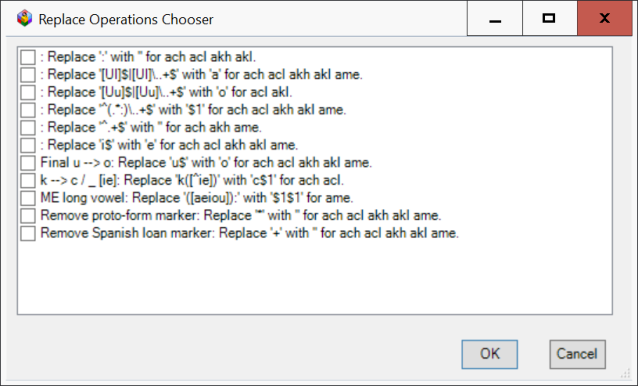

You can choose as many replace operations as are appropriate. They will be inserted together. 

When you choose either the “Move up” or “Move down” option, the currently selected replace operation will be moved up or down in the list of replace operations. 

When you choose the “Delete” option, the currently selected replace operation will be removed from the list of replace operations for the current operation. _Variant Generator_ will also show you a list of which other operations, if any, are using the currently selected replace operation and ask if you want to delete the currently selected replace operation from the master list of all replace operations. 

### _2.3.2 Variant types_

If you need to have one or more variant types be associated with the variant entry that will be produced, click on the “Edit” button to the right of the variant types box. This brings up a chooser showing all currently available variant types in the _FLEx_ project. Click on the check box before all those that you need to be used.2 

### _2.3.3 Show minor entry_

When the new variant entry is created, you can make it so it will show as a minor entry or not. Check the box if you want it to show as a minor entry. 

### _2.3.4 Publish entry in_

By default, any newly created variant entry will have its “Publish Entry In’ field set to “Main Dictionary.” If you need this to be some other publication for these variant entries, click on the “Edit” button to the right of the publish entry in box. This brings up a chooser showing all currently available publications in the _FLEx_ project. Click on the check box before all those that you need to be used. 

> 2Unlike the variant types chooser in _FLEx_ , this chooser flattens all the types into one list. That is, the chooser does not show a hierarchical list. 

_Variant Generator User Documentation_ 

_8_ 

### 2.4 Apply operations to drop-down box

In the bottom left hand corner, there is a drop-down box. You can click on the button and choose which field in an entry to use for matching and applying replace operations. There are at least three options available: 

1. Citation Form 

2. Lexeme Form 

3. Etymology Form 

_Variant Generator_ will use the default vernacular writing system in each case. If there is more than one etymology field, it will use the first one. It will also show any custom fields you have at the entry level which were created with the pattern illustrated by what is in example (8). 

(8) 

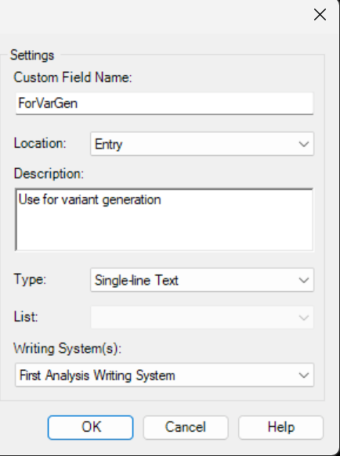

In particular, the custom field must have: 

- A Location of “Entry” 

- A Type of “Single-line Text” and 

- A Writing Systems(s) of “First Vernacular Writing System.” 

### 2.5 Save changes button

Use the “Save Changes” button to save any changes you have made to the operations file. 

_Run Operations tab_ 

_9_ 

## 3 Run Operations tab

The Run Operations tab lists the same set of operations as are shown in the Edit Operations tab except that each one has a check box in front of it. Whichever operation is currently selected will be applied and the resulting forms will be shown in the “Preview of selected operation” portion of the tab.3 These forms will appear as the Lexeme Form of the newly created variant entry. 

Note that the preview portion only shows entries having the indicated form for which there is no Lexeme Form of some variant entry already in the database. In addition, the indicated forms shown are for the default vernacular writing system. You can click on a column header to sort the rows by the content of that column. Note that it sorts by Unicode code points, not the way it might in _FLEx_ . 

Both of the items in the Run Operations tab have check boxes and both have a checked check box as the column header of the first column. When you click on this checked box in the top row, you will see the menu shown in example (9). 

Both of the items in the Run Operations tab have check boxes and both have a checked check box as the column header of the first column. When you click on this checked box in the top row of the “Operations to apply” portion, you will see the menu shown in example (9). 

(9) 

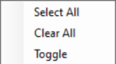

When you click on this checked box in the top row of the "Preview of selected operation" portion, you will see the menu shown in example (10). 

(10) 

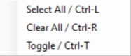

These work like the bulk edit check box menu does in _FLEx_ . For operations, you choose which operations you want to be applied when you press the “Apply Checked Operations” button. For the preview portion, it works like it does in bulk edit in _FLEx_ : if an item is checked, a new Stem Allomorph will be produced for the entry containing that indicated form. If an item is not checked, it will be ignored (i.e., it will remain as it currently is). 

Note that for the "Preview of selected operation" portion, there are three keyboard shortcuts shown. These keyboard shortcuts only work when you have overtly clicked in the “Run Operations" tab. 

See section 5 for more on what the “Apply Checked Operations” button does. 

> 3In the preview portion, we try to set the various column widths automatically by the longest width in each column. This can sometimes make the view appear to “dance” a bit. Be patient and it will settle down. 

_Variant Generator User Documentation_ 

_10_ 

## 4 Edit Replace Operations tab

The Edit Replace Operations tab contains the master list of all replace operations. It lists them in a tabular form. Like in the Run Operations tab, you can click on the table column headers to sort the table by that column. 

This tab has four buttons: 

1. Edit: this brings up the Edit Replace Dialog shown in example (6). 

2. Add new: this also brings up that dialog but it is empty so you can add a new replace operation. 

3. Delete: this allows you to delete replace operations you no longer wish to maintain. When you click on the "Delete” button, _Variant Generator_ will show you a list of which operations, if any, are using the currently selected replace operation and ask if you want to delete it. 

4. Save Changes: this is the same as the “Save Changes” buttons in the other two tabs. 

Alternatively, you can right-click in the table and use the context menu shown in example (11). 

(11) 

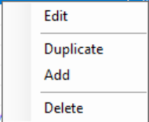

## 5 Applying operations

When you use the “Apply Checked Operations” button, _Variant Generator_ will first check to see if there are any variant types which are not currently valid in the _FLEx_ project and give you a message about which ones they are and which operation they are in. While not necessarily likely, it is possible that a given variant type may have been deleted in the _FLEx_ project since you created the operation. 

If there are no problematic variant types, then _Variant Generator_ will insert a new variant entry for each checked operation. When it is done, the preview portion will no longer show those indicated forms which have had a variant entry added. In addition, in _FLEx_ , the Edit / Undo menu item will show the last operation performed. You can use this to reverse the changes it made. In fact, the Undo/Redo menus will list the operations performed in reverse order. 

If the replace operations for a particular writing system results in an empty form, _Variant Generator_ will use a non-breaking space to avoid the _FLEx_ parser using a non-empty value in some other writing system for that Lexeme Form. 

_Known problems_ 

_11_ 

## 6 Restarting** **_Variant Generator_

Whenever you exit and restart _Variant Generator_ , it will do the following: 

1. remember its window size, location, and layout; 

2. remember which _Variant Generator_ file you last chose; 

3. remember which tab you last selected; 

4. remember which operation you last selected for each tab. 

## 7 Error messages

In certain situations, _Variant Generator_ will issue an error message. Table 1 lists the errors _Variant Generator_ reports along with a brief description of what the error might mean. 

| Error | Meaning |
|----|----|
| The category 'category name' was not found in the FLEx database | The indicated category is no longer found in the FLEx project. Try to change it to one that is now present. |
| No operations are selected, so there's nothing to do | This is shown when the “Apply Checked Operations” button is pressed but no operations have been checked. Try checking at least one operation. |
| The publication 'publication' is no longer found. Please fix it in operation 'operation name'. | The indicated publication is no longer in the FLEx project. You will need to fix it in the indicated operation. |
| The variant type 'variant type' is no longer found. Please fix it in operation 'operation name'. | The indicated variant type is no longer in the FLEx project. You will need to fix it in the indicated operation. |

**Table** 1: _Error messages_ 

If you get an error message not in the list above, please report it. See section 9. 

## 8 Known problems

The following items are known to be less than desirable with this version of _Variant Generator_ : 

1. The user interface is in English only. 

_Variant Generator User Documentation_ 

_12_ 

2. When you start _Variant Generator_ , if _FLEx_ is showing as full screen, you may not see the _Variant Generator_ dialog. You may have to either make _FLEx_ be in its “Restore” mode or find the _Variant Generator_ dialog and move it to another screen. 

3. Every newly added Lexeme Form will have the same Morph Type as does the Lexeme Form of the main entry. If this is incorrect, you will need to use Lexicon / Bulk Edit Entries / List Choice (with the Morph Type column showing) to fix this. 

4. If no “Publish Entry In" items are specified, newly created variant entries will default to "Main Dictionary." 

## 9 Support

If you have any questions with _Variant Generator_ or find bugs in it, please send an email to <u>andy_black@sil.org.</u>