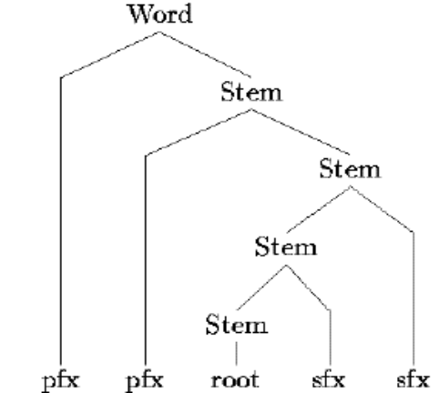
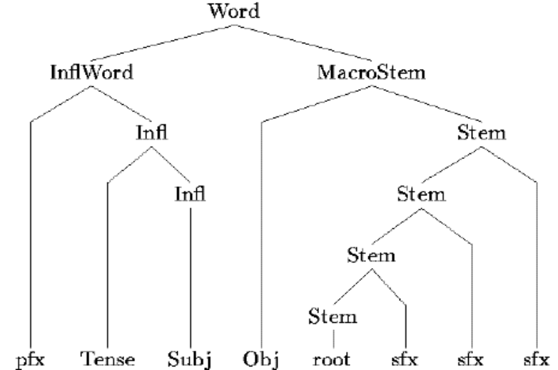
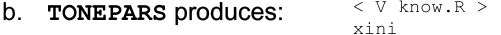

# TonePars: A Computational Tool for Exploring Autosegmental Tonology

H. Andrew Black 

SIL International 2007 

Editor's note: This paper was originally presented at SIL's General CARLA Conference, 14–15 November 1996, Waxhaw, NC. CARLA (Computer-Assisted Related Language Adaptation) is the application of machine translation techniques between languages that are so closely related to each other that a literal translation can produce a useful first draft. The morphological parsing program AMPLE is often used in CARLA applications. 

Editor's note to 2005 revision: This version was converted from HTML to PDF format for inclusion in the LinguaLinks Library. The file ToneParsGrammar.txt, originally distributed with the paper as a separate file, is also included in this version as appendix B. 

## Abstract

The TonePars program augments the AMPLE morphological parser program to allow for modeling an autosegmental approach to tone. This paper describes both the linguistic and implementation issues involved. 

## 1 Introduction

One of the areas where the morphological parsing program AMPLE (Weber, Black, and McConnel 1988) lacks strength is in the area of tone. While AMPLE is able to do a fine job when trying to analyze lexical or underlying tone, it can run into great challenges when attempting to analyze surface tone. This is especially so for languages with complex tone systems. The TonePars program has been developed to help deal with this situation. TonePars models an autosegmental approach to tone. The current implementation was written in C and has been applied successfully to a corpus of over 40,000 words in Peñoles Mixtec (see Daly 1993). 

The basic idea of the tone parsing scheme is to have the AMPLE morphological parsing program do a morphological parse of the input text, ignoring all tones. That is, AMPLE reads the input file and converts all tone-marked segments to their toneless counterparts (e.g., ndàá would become ndaa) via a user-specified change table. Based on this segment-only representation, AMPLE parses the word into its possible morphemes. Because tone is ignored, the result is usually highly ambiguous (e.g., ndaa has 14 parses). 

The TonePars program reads the AMPLE analysis output file, augmented AMPLE dictionary files, and a special control file (which is a superset of the AMPLE analysis data control file). For each analysis posited by AMPLE, it builds a model of the phonological word (segments, moras, syllables, and tone tiers). It posits the underlying tones based on the appropriate dictionary entries and applies the user-defined tone rules to the tones. After all the rules have applied, it creates a tone-marked form (e.g., it might be ndàá). This tone-marked form is compared with the original form that the word had before AMPLE converted it to its segmentonly form. If the tone-marked form and the original form are the same, the analysis is passed on to the output. If they are different, the analysis is assumed to be in error and is thrown away. The output of TonePars is thus a disambiguated analysis output file. 

The paper is organized as follows. The first section sketches the key phonological concepts modeled by TonePars. The next section delineates the implementation details, describing and illustrating how TonePars proceeds.The final section discusses how effective TonePars has been. There also are two appendices: Appendix A contains an annotated listing of all of the field codes TonePars has available in its control file, and appendix B is an annotated syntax of the tone rules. 

## 2 Phonological Concepts

This section contains a brief introduction to the key concepts that TonePars models. A much more thorough explanation can be found in Kenstowicz (1994), especially chapters 6 and 7. 

We begin by considering how one might model a tone linguistically. Are tones segmental features like voice or labial or sonorant? If so, why do they rarely ever show up on consonants and then only when the consonant is a syllabic nasal (or other syllabic sonorant)? Tones, therefore, are not features of the segment, but are rather autosegments (i.e., "self-segments") that live on a distinct tier from the rest of the segments (Goldsmith 1976). These autosegments do not attach to segments, but rather to what are called Tone Bearing Units (TBUs). A TBU may be considered to be a vowel or a syllable or a sub-constituent of the syllable called a mora. That is, the tone attaches to a TBU which is a constituent of the phonological word. 

A basic picture of a phonological word is shown in (1). 

(1) 

A phonological word consists of one or a sequence of syllables. Every syllable (indicated by σ) has at least one mora (indicated by μ). A mora is a unit of syllable weight; light syllables have one mora, while heavy syllables have two (see Hayes 1989 for one account of moraic theory). Some languages make distinctions between heavy and light syllables for stress and reduplication. 

How are syllables constructed? A view that has been around for long time is the Sonority Sequencing Principle: A syllable has a segment with a sonority peak that is preceded and/or followed by segments of decreasing sonority (see Kenstowicz 1994:254–255 for a discussion). Phonologists agree on the relative sonority scale given in (2), where obstruents are the least sonorous and vowels are the most sonorous. 

(2) obstruent nasal liquid glide vowel 

In order to properly determine syllables, several pieces of additional information may be needed. This includes such things as whether codas are allowed or not, whether syllables are monomoraic or not, and how a VCCV sequence is to be split; etc. 

For example, given that codas are allowed and that syllables may be bimoraic, the forms in (3) will be syllabified as shown. 

(3) 

In (3a), the sonority hierarchy determines that the syllable boundary is between the a and the p. It follows the assumed universal that in a VCV sequence, the C will become an onset and not a coda. In (3b), there is a sequence of two consonants word medially. Since the sonority is decreasing between them, the syllables are split between the two consonants. Note that this, too, assumes that a pre-vocalic consonant will be an onset. 

Example (3c) also has the same two consonants but in the reverse order. In this case, the sonority is increasing going from the p to the r. Now there are two possibilities allowed by the Sonority Sequencing Principle. In (3ci), the p is incorporated into the onset while in (3cii), it is treated as a coda of the preceding syllable. Clearly sonority alone is not enough to determine which of these two options to use. As I understand it, a particular language will consistently choose one option or the other. 

As mentioned above, the syllables and moras and segments are on one plane, while the tones are on an independent one. That is, tones reside on a tone tier. This view, originally argued for by Goldsmith (1976), makes quite good sense because tones really do seem to act independently of segments. 

There is more than one view of what the tone tier looks like. The simplest picture of a tone tier is as follows. In the diagrams, the o's represent TBUs; H and L represent a high and a low tone, respectively. The lines show how the tones are associated to the TBUs. 

This would be a H H L H L L tone pattern. One can view tone spreading very nicely this way: 

That is, the one linked H tone spreads onto the following two TBUs that do not have any tone associated with them. Notice that by associating these tones to TBUs rather than to segments (such as vowels), the spreading is all very local: there is no need to worry about whether the next segment is a consonant or a vowel, for example. 

Another view of what the tone tier is like has been articulated by some theorists such as in Snider (1988, 1990). They find it advantageous to posit internal structure for tone. Rather than just being a single unit (such as H or L), a tone consists of several parts. These parts can act somewhat independently of each other. The two most important are two distinct tiers of tone: a primary and a register tier. The primary tier provides the basic pitch of the tone, and the register tier provides a modification of that pitch. 

All of this means that the following kinds of tone diagrams can be represented: 

The e of te has a primary low tone only. The a in da **̌** tnùní has a register h, primary L **̌** combination as well as a primary H tone. The ù of datnùní has a register h, primary L **̌** combination. The final í of datnùní has just a primary H tone. Finally, the ni` has a floating **̌** register h. Floating tones are ones that are a part of the representation of a particular morpheme, but are not associated with or linked to any of the TBUs of that morpheme. They float to the side of the morpheme and may become associated or linked to a surrounding morpheme. 

Underspecification of one tone may also prove to be beneficial. In Peñoles Mixtec, for example, the low tones almost never need to be explicitly entered. They can fall out by default. 

## 3 Implementation Issues

Having introduced the key phonological concepts modeled by TonePars, we now address how they actually work within the tool. We first address syllabification, then the augmented AMPLE lexical entries, followed by the tone rules, and end with a discussion of the orthographic output. 

### 3.1 Syllabification and TBUs

In order to properly determine syllables, several pieces of information are needed. 

First, TonePars must know what the segments are. TonePars works on the internal orthographic representation of the segments (that is, the representation of the input word that results from AMPLE's text orthography changes). The \segment field in the control file provides the name of a file that contains a full definition of each such segment. The conventional file extension for this file is .seg. Example (7) shows two entries from the Peñoles Mixtec file; the first is for a vowel, and the second for a consonant. 

(7) \s a \mb \son + \cons - \toneseg H = á \toneseg h = à \toneseg L h = à \toneseg h H = ǎ \toneseg L h H = ǎ \s p \son - \cont - 

The \s record marker field contains the segment symbol itself. 

The \mb field indicates that the segment is mora-bearing (i.e., has a mora). Under the moraic theory, long vowels can be viewed as a single segment with two moras. Such long vowels are indicated by using \mb 2 to tell TonePars that such a segment has two moras. 

The \son, \cons, and \cont fields are to define the sonority, consonantal, and continuant features for these segments. (By default, \cons is + and \cont is +.) These three features are used to determine the relative sonority of the segments by the syllable building routine. The ranking in increasing sonority is: 

(8)-cont +cont +cons -cons -son +son mora-bearing 

The user is expected to label each segment with its appropriate features in order to get the correct sonority ranking. 

The \toneseg fields give the mapping between the tones linked to a TBU and their internal orthographic representations. See section 3.4 for a discussion and exemplification. 

Given the segment definitions, TonePars is able to parse the input word form into its respective segments. It assumes that the longest segment that matches is correct. Note that this could be erroneous in certain ambiguous cases. For example, consider an orthography that includes the four segments t, tl, l, and ll. A sequence of tll will always be interpreted by TonePars as tl followed by l and never as t followed by ll. If the latter is correct, TonePars will be in error.1 

Having parsed the word into its segments, TonePars can use the sonority feature information of the segments to begin syllabifying the word. As noted above, more information than sonority alone may be needed. TonePars uses several field codes in the control file to provide such information, as described in the following paragraphs. 

Some languages allow codas (consonants at the end of a syllable) and some do not. If the language under study does not, the \nocodas field should be included in the control file. 

Some languages never have more than one segment in a syllable nucleus (that segment is usually a vowel, although it could also be a syllabic sonorant). That is, in such languages every syllable is monomoraic. The field \monomoraic can be used to tell TonePars to limit syllables to containing only one mora. 

As discussed above, a sequence of VCCV (vowel-consonant-consonant-vowel) can be ambiguous as to how it should be syllabified. If the first C is less sonorous than the second C and syllables can have codas, it is not clear whether the first C should be a coda of the first syllable, or whether it should be the first member of a complex onset of the second syllable. The \v.ccv and \vc.cv fields can be used to tell TonePars which approach to use. If the first C should be an onset, then use the \v.ccv field. If the first C should be a coda, use the \vc.cv field. 

Hayes (1989) proposes that codas can become mora-bearers under a process called "Weight by Position." The \wtbypos field allows this to happen. 

In addition, TonePars has a debug option whereby it shows the results of syllabification. It assumes that the syllable symbol will be a dollar sign ($), the mora symbol will be a lower case m, and that syllable boundaries are to be indicated by a period. The user can tell TonePars to use other symbols via the \sylstr, \morastr, and \sylsep fields. The string that appears after these fields will be used for the syllable symbol, the mora symbol, and the syllable separation character, respectively. 

Once TonePars has determined the syllable structure, it can assign tone bearing units (TBUs) to the prosodic structure. Only moras are treated as TBUs by the current version. Later versions will allow the user to specify (via a field in the control file) whether TBUs should be assigned to moras, vowels, or syllables. 

### 3.2 Lexical Representation

After assigning the appropriate TBUs, the next step is to determine how to assign the underlying tones to their appropriate TBUs. In order to do this, TonePars must first determine which sequences of segments correspond to which morphemes. It deduces this by parsing the decomposition field (\d) from the analysis file in conjunction with the analysis field (\a). This segment-to-morpheme correspondence tells TonePars where a morpheme begins and ends segmentally. By referring to the syllable structure built upon these segments, it can determine what TBUs (if any) are contained by the morpheme. 

TonePars uses the morphname from the analysis field to lookup the dictionary entry for each morpheme. The tone information is keyed via a separate field in the AMPLE dictionary file. Consider the entries listed in (9). 

(9) a. \r chɨɨ \a chɨɨ \c N \g hilltop \u chɨɨ b. \r àdi+ \a adi \c Prt               | CNJ \g or \u àdi \mp h_association_exception  | conjunctions are exceptions \tone linked h @ tbu 1 c. \r agòstó \a akosto \c N \g August \u akòstó \tone linked h @ tbu 2 \tone linked H @ tbu 3 d. \r chíléhé \a chilehe \c N \g armpit \u chíléhé \tone linked H @ tbu 1 2 3 e. \r chindee` \a chindee \c V \g help \u chindee` \tone right-floating h @ tbu 3 

f. \r dǎtnùní \a datnuni \c Adv \g then \u dǎtnùní \tone linked h @ tbu 1 | this is two morphemes; hence \tone linked H @ tbu 1 | the tones are not shared \tone linked h @ tbu 2 \tone linked H @ tbu 3 \r espíritú` g. \a espiritu \c N \g Holy.Spirit | must be followed by Yǎ Ndiǒxí \u espíritú` \mp h_association_exception \tone linked H @ tbu 2 \tone linked H @ tbu 4 \tone right-floating h 

These are normal AMPLE root dictionary records, where \r is the record marker, \a is the allomorph entry, \c is the category, \mp is morpheme property, and \g is the (English) gloss. The \u is for the underlying or base form of the word (including tone information). We can use this field to store the underlying form and then produce interlinear text showing the underlying form. The \u field is used solely for this purpose and no other. Notice that the morpheme properties can be used to control the action of the tone parser. 

The new field is \tone. This field, of course, is for the lexical tone information. There is one \tone field for each type of tone. The syntax for this field is given in (10) (parentheses indicate optional elements). 

(10) \tone <type> <value> (<marker> <domain_location>) 

The possible values for <type> are listed in (11). 

(11) linked the tone is linked underlyingly left-floating the tone is floating to the left of the morpheme right-floating the tone is floating to the right of the morpheme boundary the tone is associated to the edges of a morphological domain floating the tone is floating without specifying where it is relative to the morpheme delinked the tone has been delinked 

Only the first four would normally be found in lexical entries. 

The tone values (<value>) are under user control. These values also tell TonePars whether to use both primary and register tiers or just a primary tier. The user specifies the values via 

fields in the control file. The \tonevalue field gives the primary tone values and the \tone_reg_value field gives the register tone values. If there is no \tone_reg_value field, then TonePars assumes that there is only a primary tier. For the example data above, there are the four listed in (12) which are to be interpreted as in (13). 

- (12) \tonevalue H 

\tonevalue L 

\tone_reg_value h 

\tone_reg_value l 

- (13) H primary high 

   - L primary low 

   - h register high 

   - l register low 

The type and value of the tone field tell TonePars the underlying status of the tone (linked, left-floating, etc.) and the value (primary high, register h, etc.), but not to which TBU in the morpheme the tone belongs. By default, the first TBU will be assumed for a linked tone. A right-floating tone is aligned with the last TBU in the morpheme by default. A left-floating tone is aligned with the initial TBU in the morpheme by default. 

One can specify which TBU a tone should be aligned with by using the marker symbol (an @ sign), the key word tbu, and a number as in the examples above.2 

The relative order of the \tone fields can be crucial. If an entry has a TBU with two distinct tones, then the first indicated tone will be aligned first, followed by the second tone. 

### 3.3 Tone Rules

Once the underlying tones are assigned to their respective TBUs, TonePars applies the ordered tone rules. Such rules associate, spread, delink, delete, or insert tones. They can be cyclic or non-cyclic. 

The user writes the rules via a \tone_rule field in the control file. Each rule begins with a name and is followed by one or more commands. Thus, one can bundle several commands under one name. A rule may also be optionally conditioned to apply only when the specified conditions are met. The rules are applied in the order specified in the control file. 

The tone rules in TonePars are conceptually modeled after Archangeli and Pulleyblank (1993) and Hyman (1990) (which is based on early work of Archangeli and Pulleyblank) and are based on discussions in Pulleyblank (1986) and Kenstowicz (1994). In order for the tool to be 

as general as possible, the rules have been highly parameterized. The following sections delineate these parameters and briefly illustrate them.3 

#### 3.3.1 Operations

Every command begins with an operation that is to be performed on some tone. The possible operations are listed in (14). 

- (14) Associate Associate the indicated tone: This means to insert the tone into the tone tier and to link that tone to its appropriate TBU. 

   - Delete Delete the indicated tone. The tone is removed from the tone tier and all of its association lines (i.e., links) are also erased. 

   - Delink Delink the indicated tone: i.e., erase all of its association lines. The tone is not removed from the tone tier. 

   - Insert Insert the indicated tone into the tone tier. No association lines are drawn. Link Link the indicated tone to its appropriate TBU. The tone is assumed to already be in the tone tier. Linking inserts an association line (or lines). 

   - Spread Spread the indicated tone by drawing in the appropriate association lines (i.e., make the appropriate links). The direction, iteration, etc., of the spreading operation depends on the setting of the appropriate rule operation parameters (see section 3.3.2). Spreading assumes that the indicated tone is linked. 

   - Copy Copy a tone or tone pattern (as in reduplication). This has not been implemented yet. 

Some examples are given in (15). 

- (15) \tone_rule clitic_register_h_TR Associate a h tone. 

\tone_rule verbal_H_delinking_TR Delink a current linked H tone, Delete a current right-floating h tone. 

\tone_rule L_clitic_h_association_TR Delete a left floating h tone, Insert a right-floating h tone. 

\tone_rule h_association_TR Link a left floating h tone. 

\tone_rule H_spread_TR Associate a H tone, Spread a linked H tone. 

Each of these assumes the default settings for the various operation parameters. 

#### 3.3.2 Operation Parameters

The operations are further qualified via direction, iteration, mode, and OCP (Obligatory Contour Principle) settings. 

Direction is either towards the left (right-to-left) or towards the right (left-to-right). The direction parameter is especially appropriate for the spreading operation. The user may specify the direction using any of the values listed in (16). 

- (16) left-toThe operation applies towards right the right. leftward The operation applies towards the left. 

- right-toThe operation applies towards left the left. rightward The operation applies towards the right. 

Iteration deals with how many times and in what fashion the operation is to be applied.4 The possibilities are delineated in (17). 

- (17) noniteratively The action is to apply non-iteratively; i.e., it applies once and only once. 

   - iteratively The action is to apply iteratively; i.e., it applies to as many TBUs as possible. For example, if the action is to spread a H tone to the right noncyclically, then the action attempts to spread the H tone to all the TBUs in the word to the right. If such an action were cyclic within morphemes, then the spreading would be to all TBUs within the morpheme. 

   - edge-in The action is to apply the tones in an edge-in fashion. See Yip (1988) and Hewitt and Prince (1989). Example (18) illustrates the two possibilities. If the direction is to the left, then (i) associate the rightmost tone to the right edge of the domain, (ii) associate the leftmost tone to the left edge of the domain (if possible), and (iii) associate all remaining unassociated tones right-to-left beginning to the immediate left of the first tone (18a). If the direction is to the right, then (i) associate the leftmost tone to the left edge of the domain, (ii) associate the rightmost tone to the right edge of the domain (if possible), and (iii) associate all remaining unassociated tones left-to-right beginning to the immediate right of the first tone (18b). This has not been implemented yet.5 

   - one-to-one There is a one-to-one matching between tones in the list of tones and TBUs. This has not been implemented yet. 

(18) 

Mode deals with various ways of associating the tone to a TBU.6 The possible values are listed in (19) and are illustrated in (20). Each of the forms in (20a–c) should be considered as beginning with the initial form in (20). 

- (19) featureFeature-adding mode causes the tone of the action to be appended to the adding TBU. That is, if there is already a tone linked to the TBU, the new tone will also be linked to it (20a). 

featureFeature-changing mode causes any existing tones on the indicated TBU to changing be replaced by the new tone (20b). 

featureFeature-filling mode causes the new tone to not be linked if there are existing filling tones already on the TBU (20c). 

- (20) 

The OCP or Obligatory Contour Principle, originally due to Leben (1973), basically bans adjacent identical tones from a representation. The validity and precise definition of the OCP has been debated (see McCarthy (1986) and Goldsmith (1990) for some discussions). The OCP is also not overtly represented in the graphic form of autosegmental rules. The handling of the OCP within TonePars has not been totally implemented yet. The possible values are listed in (21). 

- (21) optional OCPAn OCP violation will optionally block the action from applying. blockage 

   - OCP-blockage An OCP violation will block the action from applying. 

OCP-ignored The OCP is ignored (does not apply at all). (This is the effect currently.) 

OCP-merger When the application of an action will result in an OCP violation, merge the two offending tones into one. 

The default settings for these operation parameters are as indicated in (22). 

(22) direction rightward (left-to-right) 

iteration non-iteratively 

mode feature-filling OCP OCP-ignored 

The user can override the defaults in two ways. The global default can be altered by including a \default field in the control file containing the name of the operation, a colon, and the new default in the control file. Alternatively, the user can explicitly state any of the operations in the rule itself. See the examples in (23). 

(23) \tone_rule clitic_register_h_TR Associate a h tone rightward non-iteratively. 

\tone_rule verbal_H_delinking_TR Delink a current linked H tone non-iteratively, Delete a current right-floating h tone. \tone_rule H_spread_TR Associate a H tone, Spread a linked H tone rightward iteratively using feature-filling mode with OCP-merger. 

#### 3.3.3 Rule Application

Rules can apply pre-cyclically, cyclically, or post-cyclically (pre-cyclic is potentially the case of the Universal Association Convention of Goldsmith 1976 and Pulleyblank 1986). Strict left-toright or right-to-left cyclicity currently can be handled. 

Rule application is controlled via a \default field in the control file or as an default override on a rule. The possible values for the \default CYCLE: field are listed in (24) with comments explaining their meaning. 

(24) none Indicates that there are no cyclic rules. domain Indicates that all "lexical" rules should be applied within the domain(s) specified by each rule. If the rules do not specify any domains, apply the rules from the innermost morphological domain node outward (presumably this will be root-out). This has not been implemented yet. 

left-to-right Apply "lexical" rules in the specified direction across the morphemes; leftward ignore any morphological domain structure. right-to-left rightward 

The domain notion is with respect to morphological domains. The idea is that the user will specify phrase structure rules to indicate the domain or morphological structure of a word. Tone rules in turn may refer to these domains. 

For example, a language which builds suffixes first, then prefixes could end up with the following domain structure in (25): 

(25) 

C. Black (1995) (building on work of Barrett-Keach 1986, Myers 1987, and Mutaka 1990) has argued for the following word structure in (26) for (at least some) Bantu verbs. 

(26) 

Many of the complex verb tone patterns in Kinande can be captured quite nicely by making use of the Infl, MacroStem, and Stem domains. 

We can also use these domains to model the phonological cycle of Lexical Phonology where needed. The cyclic tone rules are bracketed by \begcycle and \endcycle. Each rule delimits which morphological domains it applies to (think of these as modeling levels or strata). 

We do not have any way to restrict a rule to apply to only contiguous domains (the Continuous Domain Hypothesis of Mohanan 1986). This is because at load time we will not know whether particular domains are contiguous or not. We can, however, follow the spirit of the Continuous Domain Hypothesis and say that once a rule is turned off, it can never be turned on again. This is much like the Strong Domain Hypothesis of Kiparsky (1985) (that says that every rule is turned on at the beginning of the derivation and rules may only be turned off), except that we do not require all rules to be "on" initially. 

What do we do when a domain is nested (such as Stem in the examples above)? Cyclic rules will be applied within a domain by finding the innermost morpheme of the domain and then successively moving upwards through the domain (I assume that in such a case all domains will have binary branching). 

In contrast, boundary tone rules will apply to the highest level of a domain. (Boundary tones are tones which are associated to an outermost edge of a domain.) 

#### 3.3.4 Edge Rules

In some languages, a tone from one word can spread or link to an immediately neighboring word. For example, a final high tone may spread onto a following word. 

In order to model this, TonePars has two special types of tone rules called edge rules. An edge rule carries over a condition from a preceding or following word. This is an attempt to allow tone rules to apply across word boundaries. 

Edge rules follow the same syntax as tone rules; they just use a different field code. The codes and their interpretation are listed in (27). 

(27) edge_rule Apply the rule from the left (i.e., carry over any tonal conditions from the previous word). 

right_edge_rule Apply the rule from the right (i.e., carry over any tonal conditions from the following word). 

Since TonePars processes words from left to right, carrying a condition from a word to a following word is straightforward: When TonePars determines that an analysis for the current word succeeds, it checks to see if any edge condition flags need to be set. (These flags are defined by the user via \ec fields in the control file. They are set by \edge_cond fields, which are similar to tone rules. Rather than modifying any tones, \edge_cond fields set edge condition flags.) When the next word is analyzed, its edge rules can check to see if the appropriate edge condition was set by the preceding word. 

Consider the example of an edge condition in (28). 

(28) \edge_cond H_spread_EC Set edge condition to H_spread. CONDITION: (   (final tbu has a linked H tone) OR (final tbu has a delinked H tone) ) 

The H_spread edge condition is set whenever the final TBU has either a linked or a delinked H tone. 

While dealing with edge conditions coming from a preceding word is straightforward, it is much more challenging when the current word being processed depends on a tone or a property of a following word. Such dependencies are encoded in right edge rules. These rules are attempted only when the other tone rules fail for a particular analysis of the word. When the other rules fail to produce a correct tone-marked form, TonePars includes all right edge rules in the ordered list of rules and tries again. 

Presumably, any right edge rule will also set an edge condition, thus implying that the following word should meet the appropriate condition that would permit the right edge rule. 

Consider the example in (29). 

(29) \right_edge_rule H_shifted_right_RER Delete a linked H tone, Set edge condition to H_spread, Set edge condition to is_H_initial. CONDITION: (    (current property is H_can_shift_right) AND (   (word tone pattern is a linked h tone a linked H tone) OR (word tone pattern is a linked h tone a linked H tone a right-floating h tone) ) ) 

This rule seeks to address some cases where a (primary) H tone ends up on a preceding word instead of the original word as usual. When this rule applies, it also sets two edge conditions. The first is to guarantee that the usual rightward spreading of a (primary) H tone will still apply, and the second requires that the following word have an initial H tone (which is the one that would have shifted to the left). The special conditions on the rule are discussed in the next section. 

#### 3.3.5 Conditions on Rules

Rules can be conditioned to apply based on surrounding contexts. The context can be segmental, tonal, prosodic, or morphological. Tone conditions can also be carried over from either preceding or following words. Conditions follow a rich syntax to allow precision and flexibility. They are similar in style to the test conditions of AMPLE (Weber, Black, and McConnel 1988). 

Several examples taken from the implementation for Peñoles Mixtec are given in (30)–(34) below (see Daly 1993 for the facts and an analysis of this complex tonal system). We use a left-to-right cyclic approach; that is, the rules are applied for each morpheme in turn moving from the initial to the final morpheme. 

(30) \tone_rule h_association_TR Link a left floating h tone rightward non-iteratively using feature-adding mode. CONDITION: (     NOT (current property is h_association_exception) AND NOT (current morpheme tbu 1 has a linked h tone) ) 

In (30) a left floating (register) h tone (i.e., one that is floating to the left of the morpheme) is linked to the current morpheme whenever the current morpheme fails to be an exception or fails to already have an initial linked (register) h tone. 

(31) \edge_rule is_H_initial_ER Associate a H tone. CONDITION: (        (edge condition is is_H_initial) AND NOT (initial tone is a linked H tone) ) 

In (31) a (primary) H tone is associated to the first TBU of the word whenever the is_H_initial edge condition is set and as long as the initial tone does not already have a linked H tone. 

(32) \right_edge_rule h_shifted_left_RER Link a final floating h tone leftward, Set edge condition to next_is_h_shifted_left. CONDITION: (    (current property is can_receive_shifted_h) AND (word tone pattern is a right-floating h tone) ) 

In (32) any word-final floating (register) h tone is linked to the left whenever the current morpheme is marked as being a potential recipient of such a h tone and when the tone pattern of the word consists solely of such a floating h tone. In addition, an edge condition is set. 

(33) \edge_rule clitic_register_h_ER Associate a h tone rightward non-iteratively. CONDITION: (    (edge condition is h_insertion) AND     (current morpheme underlying tbu 1 has a linked H tone) AND NOT (current property is h_association_exception) AND NOT (current category is V) ) 

The edge rule in (33) is applied only when the h_insertion condition has been set (by a previous word in this case) and when the current morpheme's first tone is an underlyingly linked (primary) H. In addition, the morpheme cannot be an exception to the rule and its category must not be a verb. 

(34) \right_edge_rule H_shifted_right_RER Delete a linked H tone, Set edge condition to H_spread, Set edge condition to is_H_initial. CONDITION: (    (current property is H_can_shift_right) AND (   (word tone pattern is a linked h tone a linked H tone) OR (word tone pattern is a linked h tone a linked H tone a right-floating h tone) ) ) 

The rule in (34) requires the current morpheme to have the specified property and, in addition, the word must have one of the two indicated tone patterns. 

#### 3.3.6 Example

We now consider more fully an example from Peñoles Mixtec. In this language a linked register h tone is deleted when the immediately preceding linked tone is also a register h tone. This effect can occur across word boundaries and even across many words as in (35). 

(35) 

The following three fields from the control file address this situation. 

(36) \ec h_deletion \edge_cond h_deletion_EC Set edge condition to h_deletion. CONDITION: (   (final linked tone is a linked h tone) OR (    (edge condition is h_deletion) AND (word tone pattern is none) ) ) \tone_rule h_deletion_TR Delete a linked h tone. CONDITION: (   (left tone is a linked h tone) OR (    (edge condition is h_deletion) AND (left tone is none) ) ) 

The \ec field defines the edge condition h_deletion. The \edge_cond field defines a rule which sets (or turns on) the h_deletion edge condition whenever the final linked tone of the word is a linked register h tone or whenever the preceding word had the h_deletion edge condition set and the current word does not have any tones. The \tone_rule rule deletes a linked register h tone whenever the immediately preceding tone is a linked h tone or whenever the h_deletion condition has been set and there are not any tones to the left of the linked register h tone in question. 

The above rule in Peñoles Mixtec only applies within a phonological phrase. The user can specify which punctuation characters are to be treated as indicators of a phrase boundary. The \phrasefinalchars field in the control file is used for this. (The default characters are .,;:!?- and ¿ and ¡). All edge conditions are reset (i.e., turned off) at a phrase boundary. 

### 3.4 Orthographic Output

After all of the tone rules have applied, TonePars attempts to determine the orthographic representation of the tone-marked word in order to compare it to the original tone-marked word. 

To determine the tone representation for the output of the tone rules, TonePars scans the segments looking for TBUs. For each TBU, it determines what tones are linked to it and finds the corresponding orthographic representation based on the \toneseg fields in the segment definition file. 

For example, consider the segment definition record in (37) repeated from (7). 

(37) \s a \mb \son + \cons - \toneseg H = á \toneseg h = à \toneseg L h = à \toneseg h H = ǎ \toneseg L h H = ǎ 

The first \toneseg line says that if the TBU has just a linked primary H tone, then it is to be represented as á (an a with an acute accent). The second says that if it has just a register h tone, then it should be rendered as à (an a with a grave accent). The third line indicates that if the TBU has a primary L tone with a register h tone, it, too, should be rendered as à. The fourth line says that when the TBU has a register h tone followed by a primary H, it should be shown as a� (an a with a wedge). The final line indicates that when the TBU has a primary L, register h tone followed by a primary H tone, it also is to be rendered as ǎ. 

If none of the indicated tone patterns are found, TonePars renders the segment as it appears in the \s field (as a in our example). Note that this means a toneless segment is actually ambiguous between "no tone" and "unrecognized tone". A future version of TonePars should mark the "unrecognized tone" in some unique way. 

The order of the tone values in the \segment fields is crucial. For example, there is a distinction between the order of the tones illustrated in (38). 

(38) a. \toneseg L H = ǎ 

b. \toneseg H L = â 

The field in (38a) indicates a Low tone followed by a High tone (i.e., a rising tone), while the one in (38b) indicates a High tone followed by a Low tone (i.e., a falling tone). 

In (37) above, only linked tones were considered in determining the orthographic representation of a tone-marked word. Floating tones may also be used in determining the orthographic representation as can be done for those languages which have downstepped tones and which represent such tones via a floating-linked tone combination (see Pulleyblank 1986). 

In addition, while viewing a trace of a derivation, one might wish to orthographically represent floating and delinked tones. To tell TonePars which tone types to use in derivations and which to use in orthographic representations, the \tonetype field in the control file is used. Consider these fields in (39). 

(39) | Tone "types" or "status"; a "D" means that the 

| status is used in showing Derivations; an "O" 

| means that the status is used in showing Orthographic 

| forms. 

\tonetype linked         D O \tonetype floating       D \tonetype left-floating  D \tonetype right-floating D \tonetype boundary \tonetype delinked 

The D's after "linked," "floating," "left-floating," and "right-floating" indicate that any tone with these types are to be orthographically represented during a derivation (trace). The O after "linked" indicates that only linked tones are to be used when determining the orthographic representation of the (final) tone-marked form. If one wishes to include floating tones while determining the orthographic representation, one would include an O in that field. 

Once TonePars has determined the tone-marking for the analysis under consideration, it compares the results to the original word. If the two are identical, the analysis is declared to be "good" and is passed on to the output. If the two differ in any way, the analysis is assumed to be incorrect and is thrown away. 

## 4 Using TonePars with AMPLE

Having discussed the key phonological issues and sketched the basic implementation details, we now address how effective TonePars can be. 

While TonePars is still a work in progress, it has successfully been applied to the complexities of Peñoles Mixtec (Daly 1993). Over 40,000 words have been successfully analyzed in context.7 Many of these words surface with four or more tone patterns depending on the 

context (which makes using a tool like ShoeBox very cumbersome in producing glossed text). TonePars is able to select the correct word based on the tone rules. 

For example, consider the word xiní which occurs in Luke 1:2. It is eight-ways ambiguous when ignoring tone (40a), but it can be correctly disambiguated by TonePars (40b). The ambiguity derives from a four-way ambiguity on the identification of the lexical form and a twoway ambiguity as to whether or not the Continuative aspect is present. The Continuative aspect only surfaces via tonal differences. 

(40) a.  AMPLE produces: 1. say.xi < Adv nor > xi-ni 2. Con say.xi < Adv nor > 0-xi-ni 3. Con < V necessary.xini > 0-xini 4. Con < V know.R > 0-xini 5. Con < V be.drunk.R > 0-xini 

6. < V necessary.xini > xini 

7. < V know.R > xini 

8. < V be.drunk.R > xini 

To further illustrate the disambiguation capabilities of TonePars, the ambiguity level statistics from the AMPLE and TonePars runs of Luke chapter 1 are listed in (41). There are a total of 2,063 words.8 

#### (41) AMPLE **TonePars

279 1167 words with 1 analysis. 456 460 words with 2 analyses. 433 192 words with 3 analyses. 84 138 words with 4 analyses. 139 11 words with 5 analyses. 126 58 words with 6 analyses. 84 6 words with 7 analyses. 124 20 words with 8 analyses. 46 5 words with 9 analyses. 38 2 words with 10 analyses. 

- 8 words with 11 analyses. 

- 33 2 words with 12 analyses. 15 words with 13 analyses. 33 words with 14 analyses. 25 words with 15 analyses. 

- 140 2 words with 16 or more analyses. 

## 5 Conclusion

The TonePars program in conjunction with AMPLE provides a way to model autosegmental tone. While TonePars is still under development, it has already proven quite useful in one language program. 

## Appendix A: List of Field Codes

The following is an annotated alphabetical listing of the field codes in the control file which are especially significant to TonePars. Note that this control file can include all the information from the analysis data control file used for AMPLE. 

Field code Description 

\begcycle Indicates the beginning of cyclic rules. \dch These are string changes that map the original word from its orthographic to its internal representation. These are crucial for getting the tone parser to know when a tone-marked form matches the original word (if orthographic changes were made in the AMPLE pass).9 \default Changes a default tone rule parameter. \ec Edge condition definition. \edge_cond A rule that sets an edge condition. \edge_rule A tone rule that applies only on the left edge of a word. \endcycle Indicates the ending of cyclic rules. \monomoraic This tells the syllable building routine that every syllable is mono-moraic (i.e., the nucleus has at most one segment, usually a vowel). \morastr The symbol to use for displaying a mora. \nocodas Codas are not allowed in syllables. 

\phrasefinalchars This indicates which punctuation characters constitute the end of a phrase. \right_edge_rule A tone rule that applies only on the right edge of a word. \segments filename.seg This gives the file name of a file which defines the following: what the segments are, their sonority-oriented features, mora-bearing information, and how they are to be represented orthographically when they have particular tones (for those segments that can bear tone markings). \sylsep The symbol to use to indicate syllable boundaries. \sylstr The symbol to use for displaying a syllable. \tbutype Indicates what the tone bearing unit is: either mora, syllable, or vowel. \tonedomain (Not implemented yet; to be used for defining domains.) \tone_rule A tone rule definition. \tonetype Provides an indication of whether the indicated tone type (or status) is to be used in constructing orthographic representations of tone. \tonevalue Indicates the value of a primary tone. \tone_reg_value Indicates the value of a register tone. \v.ccv Syllabify a sequence of VCCV as V.CCV. \vc.cv Syllabify a sequence of VCCV as VC.CV. \wtbypos Use "Weight by Position" in syllabification. 

## Appendix B: Annotated Syntax for Tone Rules

The following is an annotated grammar of the syntax for writing tone rules. These user-written tone rules (including the conditions) are implemented via the LALR(1) grammar writing tools yacc and lex; see Johnson (1978), Lesk and Schmidt (1978), Schreiner and Friedman (1985). 

TonePars Yacc Grammar Wed Dec 12 11:37:41 2001 

-----------------------------------------------------------Default_Or_Rule : Default | Tone_Rule /* Both default conditions and rules are handled by */ /* the grammar */ ; Default : Direction | Iteration | Feature_Op | Ocp | Entity | Cycle_Default /* Global default settings can be made for several */ /* of the rule parameters.  A default consists of */ /* the field code \default followed by one of the */ /* key words that indicates which default.  The */ /* name of the default is followed by a colon and */ /* then the value of the default */ ; Direction : 'DIRECTION' ':' direction /* Default direction can be any direction */ ; Iteration : 'ITERATION' ':' iteration /* Default iteration can be any iteration */ ; Feature_Op : 'mode' ':' feature_op /* Default mode can be any of the feature */ /* operations */ ; Ocp : 'OCP' ':' ocp /* Default OCP values can be any of the OCP */ /* settings */ ; Entity : 'domain' ':' entity /* Default domain can be any entity defined by the */ /* user */ ; Cycle_Default : 'CYCLE' ':' 'none' /* Indicates that there are no cyclic rules. */ | 'CYCLE' ':' 'domain' /* Indicates that all  "lexical" rules should be */ /* applied within the domain(s) specified by each */ /* rule.  If the rules do not specify any domains, */ /* apply the rules from the innermost morphological */ /* domain node outward (presumably this will be */ 

/* root-out). */ /* This has not been implemented yet. (9504.27) */ | 'CYCLE' ':' direction /* Apply "lexical" rules in the specified direction */ /* across the morphemes; ignore any morphological */ /* domain structure. */ ; Tone_Rule : name '(' 'optional' ')' Tone_Rule_Body | name Tone_Rule_Body /* Tone rules consist of a rule name followed by */ /* the main body of the rule.  The name can also be */ /* followed by an indication that the rule is to be */ /* treated as optional. */ /* The optionality code has not been implemented */ /* yet 9504.27 */ ; name : identifier /* name of the test */ /* The name of the rule consists of a user-defined */ /* string.  The only restrictions on the name are */ /* those of any other identifier.  See below.  It */ /* is conventional to append various suffixes on */ /* rule names to indicate the type of rule it is. */ /* Tone Rules are _TR, Edge Rules are _ER, and Edge */ /* Conditions are _EC */ ; Tone_Rule_Body : Rule_Body Rule_End Condition | Rule_Body Rule_End /* The body of a tone rule consists of three parts: */ /* one or more rule actions (contained within a */ /* Rule Body); an indication of the end of the rule */ /* actions, including information about the cyclic */ /* application of the rule; and any conditions on */ /* the rule's application */ ; Rule_Body : Rule_Action | Rule_Body ',' Rule_Action /* A Rule_Body is consists of one or more rule */ /* actions separated by semi-colons */ ; Rule_End : ';' Cycle '.' | '.' /* The end of rule actions consists of a period or */ /* a comma followed by information about the */ /* cyclicity of the rule's application. */ ; Rule_Action : operation Tone Dir_Iter_Mode OCP Domain | operation Tone Dir_Iter_Mode OCP | operation Tone Dir_Iter_Mode Domain | operation Tone Dir_Iter_Mode | operation Tone OCP Domain | operation Tone OCP | operation Tone Domain | operation Tone /* The action of a rule consists of an operation to */ /* be performed on an indicated tone.  The */ /* operation can be qualified in terms of the */ /* direction of its application, its iteration */ /* options, its mode, its relation to the OCP, and */ /* any particular domain in which it might apply. */ /* All of the latter parameters are optional and */ 

| \| 'Set' 'edge' ; operation : 'Associate' \| 'Delete' \| 'Delink' \| 'Insert' \| 'Link' | /\* default values will be used if they are not \*/ /\* specified. \*/ 'condition' 'to' identifier /\* A rule action can also consist of the setting of \*/ /\* a word edge condition (a flag to facilitate \*/ /\* tonal effects across word boundaries). \*/ /\* Associate the indicated tone: this means to \*/ /\* insert the tone into the tone tier and to link \*/ /\* that tone to its appropriate tbu. \*/ /\* Delete the indicated tone. The tone is removed \*/ /\* from the tone tier and all of its association \*/ /\* lines are also erased. \*/ /\* Delink the indicated tone: i.e., erase all of it \*/ /\* association lines. The tone is \*not\* removed \*/ /\* from the tone tier. \*/ /\* Insert the indicated tone into the tone tier. \*/ /\* No association lines are drawn. \*/ /\* Link the indicated tone to its appropriate tbu. \*/ /\* The tone is assumed to already be in the tone \*/ /\* tier. Linking inserts an association line (or \*/ /\* lines). \*/ |
|----|----|
| \| 'Spread' \| 'Fill-in' | /\* Spread the indicated tone by drawing in the \*/ /\* appropriate association lines. The direction, \*/ /\* iteration, etc. of the spreading operation \*/ /\* depends on the setting of the appropriate rule \*/ /\* action parameters. Spreading assumes that the \*/ /\* indicated tone is linked. \*/ |
| \| 'Copy' ; | /\* Fill-in a default tone value. \*/ /\* The indicated tone value will be inserted and \*/ /\* linked to every tbu that does not already have a \*/ /\* tone on the indicated tone's tier. The operation \*/ /\* parameters are always: left-to-right, \*/ /\* iteratively, using feature-filling mode with OCP \*/ /\* ignored. This rule will always be applied as a \*/ /\* non-cyclic rule (i.e., all morphemes and domains \*/ /\* will be ignored). N.B. there is no user-overide \*/ /\* of these parameters or of the non-cyclicity of \*/ /\* this operation. No matter what you say for the \*/ /\* parameters and no matter if you place this rule \*/ /\* among the cyclic rules, it will \*always\* operate \*/ /\* as prescribed above. The rule is also treated as \*/ /\* conditionless (i.e., any conditions on its \*/ /\* application will be ignored). \*/ /\* Copy a tone or tone pattern (as in \*/ /\* reduplication). /\* This has not been implemented yet. (9504.27) \*/ |
| Tone : 'a' tone_status \| 'a' position | identifier 'tone' /\* Indicates a tone with a particular value (such \*/ /\* as H or M or L) which has a particular status \*/ /\* (linked, right-floating, left-floating, etc.) \*/ tone_status identifier 'tone' /\* Indicates a tone with a particular value (such \*/ /\* as H or M or L) which has a particular status \*/ /\* (linked, right-floating, left-floating, etc.). \*/ /\* In addition, the tone must be located in the \*/ |

/* morpheme indicated by position.  If position is */ 

/* 'left', then it is the final tone of the */ /* morpheme (on the tone's tier); if position is */ /* 'right', then it is the initial tone of the */ /* morpheme (on the tone's tier). */ | 'a' tone_status 'tone' 

/* Indicates a tone with unspecified value which */ /* has a particular status (linked, right-floating, */ /* left-floating, etc.). */ | 'a' position tone_status 'tone' /* Indicates a tone with unspecified value which */ /* has a particular status (linked, right-floating, */ /* left-floating, etc.). /* In addition, the tone must be located in the */ /* morpheme indicated by position.  If position is */ 

/* 'left', then it is the final tone of the */ 

/* morpheme (on the tone's tier); if position is */ 

- /* 'right', then it is the initial tone of the */ 

/* morpheme (on the tone's tier). */ | 'a' identifier 'tone' 

- /* Indicates a tone with a particular value (such */ 

/* as H or M or L) irrespective of its status */ 

/* (linked, right-floating, left-floating, etc.) */ 

- | 'a' position identifier 'tone' /* Indicates a tone with a particular value (such */ 

/* as H or M or L) irrespective of its status */ 

- /* (linked, right-floating, left-floating, etc.) */ 

/* In addition, the tone must be located in the */ 

- /* morpheme indicated by position.  If position is */ 

/* 'left', then it is the final tone of the */ 

- /* morpheme (on the tone's tier); if position is */ /* 'right', then it is the initial tone of the */ /* morpheme (on the tone's tier). */ 

- | tone_status identifier 'tones' 

/* Indicates tones with a particular value (such */ 

/* as H or M or L) which have a particular status */ 

/* (linked, right-floating, left-floating, etc.) */ | position tone_status identifier 'tones' /* Indicates several tones with a particular value */ /*  (such as H or M or L) which have a particular   */ /* status (linked, right-floating, etc.). */ 

/* In addition, the tones must be located in the */ /* morpheme indicated by position.  */ | tone_status 'tones' 

/* Indicates several tones with the specified */ 

/* status (linked, right-floating, left-floating, */ /* etc.).  The value (such as H or M or L) is not */ /* specified. */ 

| position tone_status 'tones' 

/* Indicates several tones with the specified */ 

/* status (linked, right-floating, left-floating, */ 

/* etc.).  The value (such as H or M or L) is not */ /* specified. */ 

/* In addition, the tone must be located in the */ /* morpheme indicated by position.  */ 

- | identifier 'tones' 

/* Indicates tones with a particular value (such */ 

/* as H or M or L) irrespective of its status */ 

/* (linked, right-floating, left-floating, etc.) */ 

| position identifier 'tones' 

/* Indicates tones with a particular value (such */ 

/* as H or M or L) irrespective of its status */ 

/* (linked, right-floating, left-floating, etc.) */ 

/* In addition, the tone musts be located in the */ 

/* morpheme indicated by position. */ 

- | 'default' identifier 'tone' 

   - /* Indicates the default tone value. */ 

| position 'default' identifier 'tone' /* Indicates the default tone value. */ /* In addition, the tone must be located in the */ /* morpheme indicated by position.  If position is */ /* 'left', then it is the final tone of the */ /* morpheme (on the tone's tier); if position is */ /* 'right', then it is the initial tone of the */ /* morpheme (on the tone's tier). */ ; Dir_Iter_Mode : Dir_Iter Mode | Dir_Iter /* Actions can be qualified in terms of the */ /* direction of their applicability, how they */ /* iterate, and their mode.  Dir_Iter_Mode is a */ /* cover non-terminal symbol for these. */ ; Dir_Iter : direction iteration | direction |           iteration /* Dir_Iter is a cover non-terminal for direction */ /* and/or for iteration. */ ; direction : 'right-to-left' | 'rightward' /* Direction is either towards the left */ /* (right-to-left) or towards the right */ /* (left-to-right). */ ; iteration : 'noniteratively' /* The action is to apply non-iteratively; i.e., it */ /* applies once and only once. */ | 'iteratively' /* The action is to apply iteratively; i.e., it */ /* applies to as many tbus as possible.  For */ /* example, if the action is to spread a H tone to */ /* the right non-cyclically, then the action */ /* attempts to spread the H tone to all the tbus in */ /* the word to the right.  If such an action were */ /* cyclic within morphemes, then the spreading */ /* would be to all tbus within the morpheme. */ | 'edge-in' /* The action is to apply the tones in an edge-in */ /* fashion.  If direction is to the left, then */ /* (i) associate the rightmost tone to the right */ /* edge of the domain; (ii) associate the leftmost */ /* tone to the left edge of the domain (if */ /* possible); and (iii) associate all remaining */ /* unassociated tones right-to-left beginning to */ /* the immediate left of the first tone. /* If direction is to the right, then (i) associate */ /* the leftmost tone to the left edge of the */ /* domain; (ii) associate the rightmost tone to the */ /* right edge of the domain (if possible); and */ /* (iii) associate all remaining unassociated tones */ /* left-to-right beginning to the immediate right */ /* of the first tone. */ /* This has not been implemented yet. (9504.27) */ | 'one-to-one' /* There is a one-to-one matching between tones in */ /* the list of tones and tbus. */ /* This has not been implemented yet. (9504.27) */ ; 

| Mode | : | 'using' feature_op 'mode' |
|----|----|----|
| feature_op | ; : \| \| ; | /\* An action can be performed in one of three \*/ /\* modes: feature-adding, feature-changing, or \*/ /\* feature-filling. \*/ 'feature-adding' /\* Feature-adding mode causes the tone of the \*/ /\* action to be appended to the tbu. That is, if \*/ /\* there is already a tone linked to the tbu, the \*/ /\* new tone will also be linked to it. \*/ 'feature-changing' /\* Feature-changing mode causes any existing tones \*/ /\* on the indicated tbu to be replaced by the new \*/ /\* tone. \*/ 'feature-filling' /\* Feature-filling mode causes the new tone to \*/ /\* \*not\* be linked if there are existing tones \*/ /\* already on the tbu. \*/ |
| OCP ocp | : ; : \| \| \| ; | 'with' ocp /\* Actions may be subject (or not subject) to the \*/ /\* Obligatory Contour Principle (OCP) in various \*/ /\* ways. \*/ /\* This has not been implemented yet. (9504.27) \*/ 'optional' 'OCP-blockage' /\* An OCP violation will optionally block the \*/ /\* action from applying. \*/ /\* This has not been implemented yet. (9504.27) \*/ 'OCP-blockage' /\* An OCP violation will block the action from \*/ /\* applying. \*/ /\* This has not been implemented yet. (9504.27) \*/ 'OCP-ignored' /\* The OCP is ignored (does not apply at all). \*/ /\* This has not been implemented yet. (9504.27) \*/ /\* (Although this is the effect currently; 9504.27.) \*/ 'OCP-merger' /\* When the application of an action will result in \*/ /\* an OCP violation, merge the two offending tones \*/ /\* into one. \*/ /\* This has not been implemented yet. (9504.27) \*/ |
| Domain edge | : \| ; : \| ; | 'within' edge entity 'within' entity /\* Actions may apply only within a particular \*/ /\* domain. In addition, the application may only \*/ /\* be at the left or right edge of the domain. \*/ 'left' 'edge' 'of' 'right' 'edge' 'of' /\* This indicates the appropriate edge of a domain. \*/ |
| entity | : \| \| ; | identifier 'domain' 'morpheme' 'word' /\* Entities can be either user-defined domains or \*/ /\* morphemes or word boundary. \*/ |

Cycle : 'applies' 'cyclically' direction 'within' Domain_cycle /* The rule actions apply cyclically with the */ /* indicated domain(s) in the indicated direction. */ | 'applies' 'cyclically' direction /* The rule actions apply cyclically in the */ /* indicated direction. */ | 'applies' 'cyclically' 'within' Domain_cycle /* The rule actions apply cyclically with the */ /* indicated domain(s). */ ; Domain_cycle : identifier 'domain' | Multi_domains 'domains' /* Indicates one or more domains. */ ; Multi_domains : Two_domains | More_domains Two_domains /* Indicates two or more domains. */ ; Two_domains : identifier 'and' identifier /* Indicates two domains. */ ; More_domains : More_domains identifier ',' | identifier ',' /* Indicates a sequence of domains. */ ; Condition : 'CONDITION' ':' Condition_Body /* Rules may have conditions upon their */ /* application. */ ; Condition_Body : Factor | Condition_Body logop Factor | 'IF' Factor 'THEN' Factor | ForLeft Factor | ForRight Factor ; ForLeft ForRight Factor : 'NOT' Factor /* A condition can be negated. */ | '(' Condition_Body ')' | Edge_expr | Morpheme_expr | Prosodic_expr | Segment_expr | Tbu_expr | Tone_expr | Type_expr ; Edge_expr : 'edge' 'condition' 'is' identifier /* This checks to see if the indicated edge */ /* condition flag is set. */ ; Morpheme_expr : position 'category' 'is' identifier /* This checks to see if the category of the */ /* morpheme indicated by position is the indicated */ /* value. */ 

| \| position | 'category' 'is' 'member' identifier /\* This checks to see if the category of the \*/ |
|----|----|
| \| position \| position \| position | /\* morpheme indicated by position is one of the \*/ /\* categories in the indicated category class. \*/ 'morphname' 'is' identifier /\* This checks to see if the morpheme indicated by \*/ /\* position has the indicated morphname. \*/ 'morphname' 'is' 'member' identifier /\* This checks to see if the morphname of the \*/ /\* morpheme indicated by position is in the \*/ /\* indicated morpheme class. \*/ 'property' 'is' identifier /\* This checks to see if the morpheme indicated by \*/ /\* position has the indicated property. \*/ |
| ; Prosodic_expr : position \| position ; | 'syllable' 'has' onset_coda /\* This checks to see of the first syllable of the \*/ /\* morpheme indicated by position has an onset or \*/ /\* a coda. \*/ 'morpheme' 'is' prosodic_shape /\* This checks to see if the morpheme indicated by \*/ /\* position has the indicated prosodic shape. \*/ |
| Segment_expr : position \| position Tbu_expr | 'segment' 'is' identifier /\* This checks to see if any segment of the \*/ /\* indicated morpheme is the indicated segment. \*/ 'segment' 'is' 'member' identifier /\* This checks to see if any segment of the \*/ /\* indicated morpheme is a member of the indicated \*/ /\* string class. \*/ |
| : position \| position \| position \| position \| position \| position ; Tone_expr : position | 'tbu' 'is' Domain /\* This checks to see if the morpheme indicated by \*/ /\* position has a tbu in the indicated domain. \*/ /\* This has not been implemented yet. (9504.27) \*/ 'tbu' 'is' 'extrametrical' /\* This checks to see if the morpheme indicated by \*/ /\* position has a tbu that is marked as \*/ /\* extrametrical (extratonal). \*/ /\* This has not been implemented yet. (9504.27) \*/ 'tbu' 'has' Tone_none /\* This checks to see if the morpheme indicated by \*/ /\* position has a tbu with the indicated tone. If \*/ /\* position is initial, the first tbu of the word \*/ /\* is used. If position is final, the last tbu of \*/ /\* the word is used. If position is current or \*/ /\* right, the first tbu of the indicated morpheme \*/ /\* is used. If position is left, the last tbu of \*/ /\* the left morpheme is used. \*/ 'morpheme' 'tbu' identifier 'has' Tone_none /\* This checks to see if the indicated tbu of the \*/ /\* morpheme indicated by position has the indicated \*/ /\* tone. \*/ 'morpheme' 'underlying' 'tbu' identifier 'has' Tone_none /\* This checks to see if the indicated tbu of the \*/ /\* morpheme indicated by position has the indicated \*/ /\* underlying tone. \*/ 'morpheme' 'has' identifier tbu_tbus /\* This checks to see if the indicated morpheme has \*/ /\* the indicated number of tbus \*/ 'tone' 'is' Tone_none /\* This checks to see if the tone indicated by \*/ /\* position has the indicated tone. If position is \*/ |

- /* left, the tone is the immediately preceding */ /* tone.  If position is right, the tone is the */ /* immediately following tone.  For cyclic rules, */ /* this condition only makes sense if 'position' is */ /* not current. */ 

| position tone_status 'tone' 'is' Tone_none /* This scans the tones in the position for a tone */ /* with the indicated status.  If this tone matches */ /* the indicated tone pattern (in TONE), then the */ /* condition is true.  If no such tone exists, the */ /* condition fails.                                */ /* If position is  then scanning is  through the */ /*    --------     ----------------  ----------- */ /*    initial      left-to-right     word        */ /*    INITIAL      left-to-right     word        */ /*    left         right-to-left     morpheme    */ /*    current      left-to-right     morpheme    */ /*    right        left-to-right     morpheme    */ /*    final        right-to-left     word        */ /*    FINAL        right-to-left     word        */ /* It is assumed that the tone status is the same */ 

   - /* between the "position tone_status tone" and the */ 

   - /* tone_status of the tone (i.e., "final linked tone */ /* is a floating H tone" does not make sense).  The */ 

   - /* tone status value of the TONE will be used.  */ 

- | position 'morpheme' 'tone' 'is' Tone_none 

   - /* This checks to see if the morpheme indicated by */ 

   - /* position has only the indicated tone. */ 

- | position 'morpheme' 'underlying' 'tone' 'is' Tone_none 

   - /* This checks to see if the morpheme indicated by */ 

- /* position has only the indicated underlying tone. */ 

- | position 'tone' 'pattern' 'is' Tone_Pattern 

   - /* This checks to see if the tone indicated by */ 

   - /* position has the indicated tone pattern.  If */ 

   - /* position is left, the tone is the immediately */ 

   - /* preceding tone.  If position is right, the tone */ 

   - /* is the immediately following tone.  For cyclic */ 

   - /* rules, this only makes sense if 'position' is */ 

   - /* not 'current'. */ 

- | position 'morpheme' 'tone' 'pattern' 'is' Tone_Pattern 

   - /* This checks to see if the morpheme indicated by */ 

   - /* position has the indicated tone pattern. */ 

- | position 'morpheme' 'underlying' 'tone' 'pattern' 'is' Tone_Pattern /* This checks to see if the morpheme indicated by */ /* position has the indicated underlying tone */ /* pattern. */ 

- | 'word' 'tone' 'pattern' 'is' Tone_Pattern 

   - /* This checks to see if the word's tone pattern is */ 

   - /* the indicated tone pattern. */ 

; 

Type_expr : position 'type' 'is' type /* This checks to see if the morpheme indicated by */ /* position is of the indicated morpheme type */ /* (prefix, suffix, root, etc.) */ ; 

- /* This checks to see if the morpheme indicated by */ 

- /* position is of the indicated morpheme type */ 

Tone_none 

: Tone | 'none' ; 

/* Identifies a particular tone or no tone at all. */ 

Tone_Pattern 

: Tone_Pat 

- | 'none' /* Identifies a particular tone pattern, which can */ /* consist of no tones at all (none). */ 

- ; 

| Tone_Pat : \| ; onset_coda : \| ; prosodic_shape : \| \| \| \| \| \| ; | Tone_Pat Tone Tone 'onset' 'coda' 'monosyllabic' 'disyllabic' 'trisyllabic' 'quadrisyllabic' 'polysyllabic' 'monomoraic' 'bimoraic' | /\* The syllable has an initial consonant. \*/ /\* The syllable has a final consonant. \*/ /\* The form has exactly one syllable. \*/ /\* The form has exactly two syllables. \*/ /\* The form has exactly three syllables. \*/ /\* The form has exactly four syllables. \*/ /\* The form has more than one syllable. \*/ /\* The form has exactly one mora. \*/ /\* The form has exactly two moras. \*/ |
|----|----|----|
| logop : \| \| \| ; | 'AND' 'IFF' 'OR' 'XOR' | /\* Perform a logical ANDing of the two factors. \*/ /\* Perform a logical IFF of the two factors. \*/ /\* Perform a logical ORing of the two factors. \*/ /\* Perform a logical exclusive ORing of the two \*/ /\* factors. \*/ |
| position : \| \| \| \| \| \| \| \| \| \| ; | 'current' 'left' 'lefttwo' 'right' 'righttwo' 'LEFT' 'RIGHT' 'INITIAL' 'initial' 'FINAL' 'final' | /\* The item being scanned. \*/ /\* The item to the left of the item being scanned. \*/ /\* The item two morphemes to the left of the item \*/ /\* being scanned. \*/ /\* The item to the right of the item being scanned. \*/ /\* The item two morphemes to the right of the item \*/ /\* being scanned. \*/ /\* The item found in a FOR_SOME_LEFT or FOR_ALL_LEFT \*/ /\* scan. \*/ /\* The item found in a FOR_SOME_RIGHT or \*/ /\* FOR_ALL_RIGHT scan. \*/ /\* The first item in the word. \*/ /\* The first item in the word. \*/ /\* The last item in the word. \*/ /\* The last item in the word. \*/ |

tone_status 

: 'boundary' /* A boundary tone (one which associates to the */ /* edge of some domain). */ /* This has not been implemented yet. (9504.27) */ | 'delinked' /* A delinked tone. */ | 'floating' /* A floating tone (either right-floating or */ /* left-floating). */ | 'left-floating' /* A floating tone that is to the immediate left of */ /* its tbu. */ | 'linked' /* A linked tone. */ | 'melody' /* Yeah, I'm wondering what this is, too. */ | 'right-floating' /* A floating tone that is to the immediate right of */ /* its tbu. */ ; type : 'prefix' | 'infix' | 'root' | 'suffix' | 'initial' | 'final' ; tbu_tbus : 'tbu' | 'tbus' ; 

------------------------------------------------------------ 

Note that the following equivalencies also hold for the given lexical items: 

'within'             can also be 'in' 'within'             can also be 'at' 'rightward'          can also be 'left-to-right' 'noniteratively'     can also be 'non-iteratively' 'right-to-left'      can also be 'leftward' 'FOR_SOME_RIGHT'     can also be 'FORSOMERIGHT' 'FOR_SOME_RIGHT'     can also be 'FOR-SOME-RIGHT' 'FOR_SOME_LEFT'      can also be 'FORSOMELEFT' 'FOR_SOME_LEFT'      can also be 'FOR-SOME-LEFT' 'FOR_ALL_RIGHT'      can also be 'FORALLRIGHT' 'FOR_ALL_RIGHT'      can also be 'FOR-ALL-RIGHT' 'FOR_ALL_LEFT'       can also be 'FORALLLEFT' 'FOR_ALL_LEFT'       can also be 'FOR-ALL-LEFT' 

## Endnotes

- 1 One could add a simple string environment constraint for these segments and augment the longest match algorithm appropriately to remove such errors. 

- 2 The astute reader will have probably already wondered why we cannot just use the \r field or the \u field where the tone is marked and automatically build the tone information. There are two reasons why this has not been implemented. First, boundary tones cannot always be indicated in this fashion. Where they align may be totally outside of the morpheme in question. Second, tones need to be mapped to TBUs, not to vowel symbols. Some kind of special parser would need to be built that would be able to read in the appropriate field, figure out which symbols were going to become TBUs and which were not, and then assign the correct tone type and value for the given symbol. 

- 3 There is an annotated syntax for the tone rules in appendix B.  This annotated syntax is also in the user documentation much as AMPLE's documentation contains an appendix on the syntax of tests; see Weber, Black, and McConnel (1988:233–236). As in AMPLE, the userwritten tone rules (including the conditions) are implemented via the LALR(1) grammar writing tools yacc and lex; see Johnson (1978), Lesk and Schmidt (1978), and Schreiner and Friedman (1985). 

- 4 Note that iteration is not overtly represented in the usual graphic form of autosegmental rules (as noted by Archangeli and Pulleyblank 1993). 

- 5 While the edge-in iteration has not yet been implemented in TonePars, it has been successfully tested in a prototype version of the program that was hard-coded to specifically deal with the edge-in analysis for Kinande tone described in C. Black (1995). 

- 6 Note that mode is also not overtly represented in the usual graphic form of autosegmental rules. 

- 7 This was done by John Daly. Margaret Daly then used the output to adapt to two other varieties of Mixtec. 

- 8 Some of the inflated ambiguity is due to the addition of dictionary entries in dealing with exceptional forms. 

- 9 The name \dch is a misnomer and should be changed. 

## References

- Archangeli, Diana and Douglas Pulleyblank. 1993. Grounded phonology. Cambridge, Mass.: MIT Press. 

Barrett-Keach, Camillia N. 1986. Word-internal evidence from Swahili for AUX/INFL. Linguistic Inquiry 17:559–564. 

- Black, Cheryl A. 1995. Boundary tones on word-internal domains in Kinande. Phonology 12:1– 38. 

- Daly, John. 1993. Tone in Peñoles Mixtec. Summer Institute of Linguistics, ms. 

- Goldsmith, John. 1976. Autosegmental phonology. PhD dissertation, MIT. Published by Garland Press, New York, 1979. 

- Goldsmith, John. 1990. Autosegmental and metrical phonology. Cambridge, Mass. Basil Blackwell. 

- Hayes, Bruce. 1989. Compensatory lengthening in moraic phonology. Linguistic Inquiry 20:253–306. 

- Hewitt, Mark and Alan Prince. 1989. OCP, locality, and linking: the N. Karanga verb. In Proceedings of the West Coast Conference on Formal Linguistics 8 176–191, Stanford Linguistics Association, Stanford University: Stanford, Calif. 

- Hyman, Larry M. 1990. Boundary tonology and the prosodic hierarchy. In Sharon Inkelas and Draga Zec, (eds.), The Phonology-Syntax Connection, 109–125. Chicago: University of Chicago Press. 

- Johnson, S. C. 1978. Yacc: Yet another compiler compiler. In B. W. Kernighan and M. D. McIlroy (eds.), UNIX Programmer's Manual, Bell Laboratories. 

Kenstowicz, Michael. 1994. Phonology in generative grammar. Cambridge, Mass.: Basil Blackwell. 

- Kiparsky, Paul. 1985. Some consequences of lexical phonology. Phonology Yearbook 2:.83– 138. 

- Leben, William. 1973. Suprasegmental phonology. PhD dissertation, MIT. 

- Lesk, M. E. and E. Schmidt. 1978. Lex: A lexical analyzer generator. In B. W. Kernighan and M. D. McIlroy (eds.), UNIX Programmer's Manual, Bell Laboratories. 

- McCarthy, John J. 1986. OCP effects: Gemination and antigemination. Linguistic Inquiry 17:207–263. 

- Mohanan, K. P. 1986. The theory of lexical phonology. Dordrecht: Reidel. 

Mutaka, Ngessimo Mathe. 1990. The lexical tonology of Kinande. PhD Dissertation, University of Southern California, Los Angeles. 

- Myers, Scott P. 1987. Tone and the structure of words in Shona. PhD dissertation, University of Massachusetts, Amherst. Published by Garland Press, New York, 1990. 

Pulleyblank, Douglas. 1986. Tone in lexical phonology. Dordrecht: Reidel. 

- Schreiner, Alex T. and H. George Friedman, Jr. 1985. Introduction to compiler construction with Unix. Englewood Cliffs: Prentice-Hall, Inc. 

- Snider, Keith L. 1988. Towards the representation of tone: A three-dimensional approach. In Harry van der Hulst and Norval Smith (eds.), Features, Segmental Structure and Harmony Processes, Vol. 1, 237–269: Dordrecht: Foris . 

- Snider, Keith L. 1990. Tonal upstep in Krachi: evidence for a register tier. Language 66:453– 474. 

- Weber, David J., H. Andrew Black and Stephen R. McConnel. 1988. AMPLE: A tool for exploring morphology. Occasional Publications in Academic Computing No. 12. Dallas: Summer Institute of Linguistics. 

- Yip, Moira. 1988. Template morphology and the direction of association. Natural Language and Linguistic Theory 6:551–77. 

Date created: 10-DEC-1997 Date revised: 20-May-2005 URL: http://www.sil.org/silewp/1997/007/silewp1997-007.html Questions/Comments: SILEWP@sil.org Questions/Comments: SILEWP@sil.org 

[SILEWP 1997 Contents | SILEWP Home | SIL Home] 

Black, H. Andrew 

Affiliation: SIL International 

Postal address: SIL P.O. Box 8987 Catalina, AZ 85738-0987 U.S.A. 

E-mail: andy_black@sil.org