# A Conceptual Introduction to Morphological Parsing for FieldWorks Language Explorer

**FieldWorks Language Explorer** 

**FieldWorks Language Explorer** 

H. Andrew Black 

**3 July 2025** 

## Abbreviations

| 1     | first person  | m      | masculine                           |
|-------|---------------|--------|-------------------------------------|
| 2     | second person | neg    | negation, negative                  |
| 3     | third person  | nf     | non-future                          |
| abs   | absolutive    | nfd    | normalized decomposed form          |
| acc   | accusative    | nmlz   | nominalizer/nominalization          |
| act   | active        | obj    | object                              |
| adj   | adjective     | pas    | pseudo-passive                      |
| appl  | applicative   | pass   | passive                             |
| art   | article       | pfv    | perfective                          |
| auth  | authority     | pl     | plural                              |
| av    | actor voice   | poss   | possessive                          |
| caus  | causative     | pot    | potential                           |
| cntr  | contrafactive | prf    | perfect                             |
| compl | completive    | prs    | present                             |
| cont  | continuative  | prog   | progressive                         |
| dat   | dative        | pst    | past                                |
| dim   | diminutive    | ptcp   | participle                          |
| emph  | emphasis      | purp   | purposive                           |
| erg   | ergative      | r      | realis                              |
| f     | feminine      | rctpst | recent past; same day as spoken     |
| fam   | familar       | reg    | regressive                          |
| foc   | focus         | rep    | repetitive                          |
| fut   | future        | resp   | respect                             |
| goal  | goal          | s      | stative                             |
| hab   | habitual      | sbj    | subject                             |
| incl  | inclusive     | sg     | singular                            |
| ind   | indicative    | siml   | simultaneous action                 |
| inf   | infinitive    | ss     | same subject                        |
| int   | intensive     | t      | transitive verb in principal clause |
| intr  | intransitive  | tr     | transitive                          |
| ipfv  | imperfective  | un     | unreal                              |
| irr   | irrealis      | veri   | veritative                          |
| loc   | locative      | vso    | verb, subject, object               |

vi 

## 1 Introduction

Morphology is the study of word forms. Morphological parsers are computational tools that automatically produce a morphological analysis for a given word form. Such tools have proven to be quite useful as spelling checkers, as morphological grammar checkers, in producing interlinear text and in adaptation of a text from one related language to another. This document is designed to help the reader do morphological parsing using the approach allowed by the FieldWorks Language Explorer parser. We also introduce issues related to the phonological rule-based parser, where appropriate. 

The purpose of this documentation is to provide an introduction to the key concepts and notions in the FieldWorks Language Explorer approach to morphological parsing. It is divided into two main sections: morphotactics and morphophonemics. The first has to do with controlling which morphemes can co-occur with which other morphemes within a well-formed word. The second has to do with controlling the phonological shape1 of individual morphemes. (There are two other main sections; one deals with some issues related to lexical entries and the other to special considerations related to using compound rules.) 

As mentioned above, this document also includes the phonological rule-based parser2 that you can try in addition to the default parser that has been available since day one of FieldWorks Language Explorer. Both parsers are robust as far as we know. Please do report to us anything that you notice about this parser that may help us make it be more effective. See section 6 for more on this parser, as well as the subject index. 

### 1.1 Key issues

We begin by addressing some of the key issues that any general morphological parser must face. Before we can tell the computer what to do, we need to understand what is going on linguistically. What kinds of language phenomena must such a computational tool be able to handle if it will indeed be a general tool? 

#### 1.1.1 Inflection

Many, if not most, languages inflect verbs and/or nouns. Consider the nominal Orizaba Nahuatl [nlv] forms shown in (1) and the verbal ones shown in (2).3 

| \(1\) | nokal          | mokal            | ikal                |
|-------|----------------|------------------|---------------------|
|       | no-kal         | mo-kal           | i-kal               |
|       | 1sg.poss-house | 2sg.poss-house   | 3sg.poss-house      |
|       | ‘my house’     | ‘your(sg) house’ | ‘his/her/its house’ |
|       | tokal          | amokal           | inkal               |
|       | to-kal         | amo-kal          | in-kal              |
|       | 1pl.poss-house | 2pl.poss-house   | 3pl.poss-house      |
|       | ‘our house’    | ‘your(pl) house’ | ‘their house’       |

> 1 In this document, “phonological shape” and “surface form” are synonymous. 

> 2 This parser is an enhanced and updated version of Mike Maxwell's Hermit Crab parser. See Maxwell (1998). We are deeply indebted to Mike for his pioneering work on this parser. 

> 3 Data are from Tuggy (1991). 

_Parsing Conceptual Introduction_ 

2 

|  | nokalvan no-kal-van | mokalvan mo-kal-van |  | ikalvan i-kal-van |
|----|----|----|----|----|
|  | 1sg.poss-house-PlPoss | 2sg.poss-house-pl.poss |  | 3sg.poss-house-pl.poss |
|  | ‘my houses’ | ‘your(sg) houses’ |  | ‘his/her/its houses’ |
|  | tokalvan | amokalvan |  | inkalvan |
|  | to-kal-van | amo-kal-van |  | in-kal-van |
|  | 1pl.poss-house-pl.poss | 2pl.poss-house-pl.poss |  | 3pl.poss-house-pl.poss |
|  | ‘our houses’ | ‘your(pl) houses’ |  | ‘their houses’ |
| \(2\) | nimiki | timiki | miki |  |
|  | ni-miki | ti-miki | 0-miki |  |
|  | 1sg.sbj-die | 2sg.sbj-die | 3sg.sbj-die |  |
|  | ‘I die’ | ‘you(sg) die’ | ‘he/she/it | dies’ |
|  | timikih | anmikih | mikih |  |
|  | ti-miki-h | an-miki-h | 0-miki-h |  |
|  | 1pl.sbj-die-ipfv.pl | 2pl.sbj-die-ipfv.pl |  | 3pl.sbj-die-ipfv.pl |
|  | ‘we die’ | ‘you(pl) die’ | ‘they | die’ |

Notice how each possessed noun in (1) has at least a possessor prefix. Certain nouns require this possessor inflection. Similarly the verbs in (2) require subject markers (with the possible exception of 3rd person). A morphological parser must account for such inflectional items. 

#### 1.1.2 Derivation

Consider the English [eng] forms4 in (3). What is happening here? How do you get a dumb computer to “understand” these forms correctly? 

- (3) a. institute b. institution 

   - c. institutional d. institutionalize 

   - e. institutionalization 

   - f. institutionalizational 

   - g. institutionalizationally 

In (3a) _institute_ is a verb root (e.g., _We need to institute some changes around here._ ). By adding the suffix ‑ _ion_ as in (3b), the word is changed to a noun. The suffix ‑ _al_ can be added to a noun stem to change it to an adjective, as in (3c). The suffix ‑ _ize_ changes an adjective into a verb (3d). Further category changes occur with the addition of each suffix in (3e-g). From this English example, we have seen that the computer needs to be able to distinguish between roots and suffixes, with each one restricted as to what category it attaches to and what category it changes the stem to. (Note, for example, that the suffix ‑ _ly_ cannot be added to either a verb stem or a noun stem: * _institutely_ , * _institutionly_ .) 

A Huallaga Quechua [qub] example showing similar category changes along with various types of verbal and nominal affixes is given in (4). The verb root meaning ‘to see’ has the imperfective aspect marker added, followed by the first person object marker, yielding ‘to see me.’ The addition of the nominalizer changes the form to a noun meaning ‘seeing me.’ The noun form can now be possessed by the second 

> 4 These are taken from Spencer (1991:9). 

_Epenthesis_ 

3 

person possessive marker and then the purpose marker may optionally follow, finally giving ‘in order that you might be seeing me.’5 

(4) rikaykaamaanaykipaq rika-yka:-ma:-na-yki-paq see-ipfv-1.obj-nmlz-2.poss-purp ‘in order that you might be seeing me’ 

A morphological parser must account for such derivational items. 

#### 1.1.3 Ambiguity

Ambiguity is also apparent in (3a), since _institute_ can be either a verb, as above, or a noun, as in _Australian_ **_Institute_** _of Marine and Power Engineers_ . Note that there are different types of ambiguity in natural language as well. For example, the word _bank_ (among other things) can mean either the side of a river or a building that holds money. With either meaning, _bank_ is a noun. 

Now consider the following word: 

- (5) a. cooks cook-s person.who.prepares.food-pl 

   - b. cooks cook-s prepare.food-3sg.prs 

Note that _cooks_ is ambiguous not only in the root meaning but also as to the suffix: the _-s_ is a nominal plural morpheme in (5a) but a verbal third person singular present tense morpheme in (5b). 

A morphological parser must be able to deal with the fact that individual words can legitimately be ambiguous. That is, a morphological parser must be able to discover and report all possible analyses of a word form. In many cases, the ambiguity is eliminated when the word is seen in context, so ideally a morphological parser is used in the context of computational tools that look beyond a single word. 

#### 1.1.4 Epenthesis

There are still other types of challenges for morphological parsing. For example, consider the Caquinte [cot] word in (6):6 

- (6) itsavetakohitiro i-tsave-(t)-ako-hi-(t)-i-ro 3m-tell- -dat-pas- -nf-3f.obj ‘she is told about’ 

The _(t)_ in two places on the second line (which shows the word broken into morphemes) are not really morphemes at all. Instead, they are epenthetic consonants added to serve as onsets to syllables. Caquinte does not allow vowel clusters nor syllables without onsets (in this part of the verb), so whenever two vowels come together at a morpheme break, an epenthetic _t_ is inserted. A morphological parser needs to be able to correctly account for forms that include epenthetic segments inserted to preserve syllable structure. 

> 5 The data are from Weber, Black, and McConnel (1988:8). See also Weber (1989). 

> 6 All Caquinte data are from Ken Swift, personal communication, and Swift (1988). 

_Parsing Conceptual Introduction_ 

4 

#### 1.1.5 Discontinuous morphemes

Now consider the Caquinte form in (7), which is the same word as in (6), but changed to future tense: 

- (7) intsavetakohitero 

i-n-tsave-(t)-ako-hi-(t)-e-ro 3m-fut-tell- -dat-pas- -fut-3f.obj 

‘she will be told about’ 

What is the challenge here? The future tense is realized as a discontinuous morpheme: it is composed of the prefix _n_ ‑ and the suffix ‑ _e_ . The computer must be able to check these noncontiguous parts of the word to correctly analyze the future tense in Caquinte; one part cannot be present without the other. 

#### 1.1.6 Infixation

The Tagalog [tgl] forms in (8) illustrate another challenge:7 

- (8) a. sulat ‘to write or writing (infinitive form)’ b. sumulat ‘to write (with actor focus)’ 

   - c. sinulat ‘to write (with object focus)’ 

What is happening here? This is a case of infixation, where the root _sulat_ splits into two parts so that one of the focus morphemes, ‑ _um_ ‑ or ‑ _in_ ‑, can be inserted. A parser must correctly recognize the root even though it is broken apart by the infix. 

#### 1.1.7 Reduplication

Look at the additional Tagalog forms in (9) to determine how the imperfective aspect is marked: 

- (9) a. susulat ‘to write (imperfective)’ b. magpasulat ‘to make someone write (perfective)’ 

   - c. magpapasulat ‘to make someone write (imperfective)’ 

We know from (8a) that _sulat_ means ‘to write’. So in (9a) it appears that the imperfective marker is _su_ , but we cannot tell if it is a prefix or an infix without looking at other forms. In example (9b) the causative ‘to make someone’ is the prefix _pa_ ‑. The _mag_ ‑ is what some call the actor focus or actor voice morpheme. But the imperfective of this causative form is not * _sumagpasulat_ , * _magsupasulat_ , nor * _magpasusulat_ as we would expect from either prefixing or infixing _su_ . Instead, we have _magpapasulat_ in (9c) where it is clear that the marker for imperfective is the extra _pa_ . The correct analysis is therefore that imperfective aspect is marked in Tagalog by reduplicating either the first syllable of the stem or the initial consonant and vowel of the first syllable of the stem. 

A morphological parser must be able to recognize reduplication within a word form. 

#### 1.1.8 Root and pattern morphology

Semitic [sem] languages pose a special challenge with their root and pattern morphology. These languages have roots composed of three consonants, as exemplified in the Silt'e [stv] data in (10), where ‘buy’ is the root _wkb_ . The aspect markers are composed of vowel patterns that fit between or around the root consonants, such as the _a-a_ vowel pattern indicating the perfective aspect shown in (10). The parser 

> 7 The data are from Spencer (1991:12-13). 

_Morphemes that may be null_ 

5 

needs to be able to find the root consonants and corresponding vowels of the aspect, even though they are intermingled in the surface form of the word.8 

(10) wakaba a-a-wkb-a pfv-buy-3sg.pfv ‘he bought’ 

#### 1.1.9 Metathesis

Now study the following Caquinte word. 

- (11) ihikeke **ha** i 

i-hi-k-e-ke **a-h** i 3m-think.mistakenly-prog-nf-foc-neg ‘he thought mistakenly’ 

What change takes place at the juncture between the final two morphemes? Notice that where one might expect the sequence _ke_ **_ah_** _i_ , what surfaces is _ke_ **_ha_** _i_ , where the _h_ and _a_ switch positions.9 Such a transposition of phonemes is called _metathesis_ . Furthermore, notice that the metathesis process in (11) crosses morpheme boundaries. 

Such data imply that a morphological parser must be able to correctly identify morphemes even when some segments within the morphemes may have switched positions. 

#### 1.1.10 Morphemes that may be null

For a final challenge, consider these Caquinte forms (you do not need to understand all the morpheme glosses here; just concentrate on the initial subject prefixes): 

(12) a. **a** nehero **a** -∅-neh-e-ro **1incl** -fut-see-fut-3f.obj ‘we will see her’ 

b. **o** keekake **o** -keek-ak-e **3f** -dig-pfv-nf ‘she had dug’ 

c. oasanomahakemparime **∅** -∅-o-(a)-sano-maha-k-e-Npa-ri-me **1incl** -fut-eat- -veri.m-veri-prog-fut-r-3m.obj-cntr **3f** -fut-eat- -veri.m-veri-prog-fut-r-3m.obj-cntr ‘we/she will not really be eating it’ 

What is the problem with the subject prefixes? In (12a) we see that the first person inclusive subject marker is _a_ ‑, and in (12b) the third person feminine subject marker is _o_ ‑. Yet, in (12c), the gloss shows ambiguity between ‘we’ and ‘she’ as the subject, and both of these are represented as null. This is because both subject prefixes are vowels and the stem in (12c) is vowel-initial, yielding two vowels together. Recall 

> 8 The data are from Gardner (1994). 

> 9 This metathesis process is actually optional. The word is from Swift (1988:133). 

_Parsing Conceptual Introduction_ 

6 

from (6) that Caquinte generally does not allow vowel clusters, and therefore adds an epenthetic ‑ _t_ ‑ when necessary to avoid such clusters. It turns out that epenthesis is only used in the suffixes. Within the prefixes, the initial vowel of a cluster deletes, causing the ambiguity seen in (12c). 

This means that a morphological parser must be able to identify a morpheme even when the morpheme has no overt segments. 

### 1.2 Tasks for any morphological parser

Given the challenges of morphological parsing exemplified in the preceding section, how can a computer program go about analyzing words into their constituent morphemes? Let's say that the task of a morphological parser is to take a form like _itsavetacojitiro_ from (6) above and 

- see if it is a legitimate word, 

- give an indication of which characters correspond to what morpheme, and 

- produce an ordered list of its constituent morphemes (e.g., give glosses).10 

What are some of the things our parser is going to have to know and what are some of the things that it is going to have to do? 

Things the parser needs to KNOW: 

- the forms and glosses of prefixes, infixes, roots, and suffixes, 

- which of the affixes go with which roots, 

- the relative ordering of the affixes, and 

- when a particular shape of a form is legitimate and when it is not (allomorphy/phonology). 

Things the parser needs to DO: 

- find the affixes and root(s) in a given word, and 

- check to see whether each affix can go with the rest of the word (that is, apply a set of constraints). 

Clearly, properly using and controlling the constraints is the major task in implementing a parser for a given language. Since a morphological parser must model linguistic reality, it is a good idea to use constraints that model appropriate linguistic notions. Two major concepts for morphology are morphotactics and morphophonemics. Morphotactics deal with which morphemes can co-occur with which other morphemes. Morphophonemics deal with what shape a given morpheme will have in various phonological and morphological environments. The next two major sections outline the constraints available with the FieldWorks Language Explorer parser and how to use them. 

## 2 Morphotactics

Morphotactics has to do with controlling the order of the morphemes in a well-formed word and controlling which morphemes can co-occur with which other morphemes. As examples of the former, one would not expect to find a prefix at the end of a word or a suffix at the beginning of a word. As an example of the latter, while one would expect a tense affix to appear with a verb root in a verbal word, one would not expect a tense affix to show up on a pronoun. The morphotactic mechanisms described in this section delineate what one can do within the FieldWorks Language Explorer model to control such things. 

10 Another thing a parser could produce would be the actual word structure which could be shown via a tree diagram. While the default FieldWorks Language Explorer parser actually produces such a structure, we do not make it visible. 

_Inflectional affixes_ 

7 

The idea is to use the morphotactic mechanisms to correctly describe the facts of the language and thereby not only provide correct parses, but also rule out false parses. 

By the way, correctly describing the facts of the language also provides the basis for a grammatical description, something that FieldWorks Language Explorer provides. By making a correct description of the facts we can both generate a description that people can read to learn about the language and we can feed the information to a parser that can put our description to work checking spellings, adapting to other languages, and verifying the fit of our description. 

Note that for words which consist solely of a single morpheme, there are no special morphotactic considerations. One merely adds appropriate lexical entries for these and ensures that the morpheme type of the allomorph(s)11 in the entry is(are) set to a root or stem type. 

This section has four major sub-sections. The first deals with handling affixation to stems (section 2.1). The second deals with stem compounding (section 2.2). The third discusses issues related to clitics (section 2.3). The fourth is for those cases where the parser is producing parses that are incorrect, but the parser mechanisms do not allow any other way to eliminate the false parses (section 2.4). 

### 2.1 Affixation

This section discusses issues relating to adding affixes to stems. Linguists typically divide affixes into two major categories: inflectional and derivational. Therefore, FieldWorks Language Explorer allows you to declare a given affix as being either inflectional or derivational. In the process of analyzing a language, however, sometimes one does not yet know whether a given affix is inflectional or derivational. There are certain affixes which are truly difficult to classify in this fashion. For this reason, FieldWorks Language Explorer also allows you to label a given affix as being unclassified with respect to inflection and derivation. As you study the language more, you should eventually figure out whether such affixes are inflectional or derivational and then you can change their status from being unclassified to the appropriate one. 

#### 2.1.1 Unclassified affixes

You can label an affix as “unclassified” when you do not know if it is derivational or inflectional. Please understand, though, that when you do this, the affix is relatively unconstrained as to where it can appear. As a result, the FieldWorks Language Explorer parser may return a number of incorrect parses for some word forms which happen to contain a sequence of characters that match one or more allomorphs of an unclassified affix. One partial solution to this is to indicate the category of the stem to which the affix may attach. The best solution, of course, is to classify the affix as being either inflectional or derivational12 so it will only show up where it should. See section 2.1.5 for more on how to determine if an affix is derivational or inflectional. 

#### 2.1.2 Inflectional affixes

Inflectional affixes typically reflect what some call “grammatical meaning.” These are things like person, number, case, gender, tense, aspect, etc. One can also typically create a paradigm of word forms with the various inflectional categories as labels on a chart.13 

> 11 We use the term “allomorph” here as a cover term for any form in a lexical entry. Typically, a lexical entry contains a single morpheme. Some morphemes have more than one allomorph. 12 Note that it is possible to classify an affix as being inflectional or derivational, but still not fully specify the required information. Such partially specified inflectional and derivational affixes are effectively treated as “unclassified” affixes by the FieldWorks Language Explorer parser. See sections 2.1.2.9 and 2.1.3.7. 

> 13 For more on this, see Bickford (1998:113ff). 

_Parsing Conceptual Introduction_ 

8 

#### _2.1.2.1 Simple example_

For example, consider the information for a possessed noun in Orizaba Nahuatl given in (1) above, but this time displayed in a different fashion: 

| \(13\) | house                          | singular possessed noun |
|--------|--------------------------------|-------------------------|
|        | 1st Person Singular Possessive | nokal                   |
|        | 2nd Person Singular Possessive | mokal                   |
|        | 3rd Person Singular Possessive | ikal                    |
|        | 1st Person Plural Possessive   | tokal                   |
|        | 2nd Person Plural Possessive   | amokal                  |
|        | 3rd Person Plural Possessive   | inkal                   |

What are the inflectional affixes here? Given that every form has the sequence _kal_ , it appears that there are six possessor prefixes which occur before the noun stem. Similar paradigms for other singular possessed nouns would show the same situation (ignoring any morphophonology). Therefore we could posit that the singular possessed noun has an inflectional template that consists of a possessor prefix followed by the stem. We could diagram this as in table 1. 

Table 1. Orizaba Nahuatl Singular Possessor Template 

| Possessor     | Stem |
|---------------|------|
| no- 1sg.poss  |      |
| mo- 2sg.poss  |      |
| i- 3sg.poss   |      |
| to- 1pl.poss  |      |
| amo- 2pl.poss |      |
| in- 3pl.poss  |      |

Now consider the plural possessed noun data from (1) above, but displayed in a similar fashion to (13). 

| \(14\) | house                          | plural possessed noun |
|--------|--------------------------------|-----------------------|
|        | 1st Person Singular Possessive | nokalvan              |
|        | 2nd Person Singular Possessive | mokalvan              |
|        | 3rd Person Singular Possessive | ikalvan               |
|        | 1st Person Plural Possessive   | tokalvan              |
|        | 2nd Person Plural Possessive   | amokalvan             |
|        | 3rd Person Plural Possessive   | inkalvan              |

What are the inflectional affixes here? Notice that there is the same stem ( _kal_ ) and the same set of six possessor prefixes as in (13). In addition, there is a plural suffix ‑ _van_ . Similar paradigms for other plural possessed nouns would show the same situation (ignoring any morphophonology). Therefore we could posit that the plural possessed noun has an inflectional template that consists of a possessor prefix followed by the stem which, in turn, is followed by a plural suffix. Since plural is an instance of the notion of number, we could diagram this as an inflectional template as shown in table 2. 

_Optional affix slots_ 

9 

Table 2. Orizaba Nahuatl Plural Possessor Template 

| Possessor     | Stem | Number  |
|---------------|------|---------|
| no- 1sg.poss  |      | -van pl |
| mo- 2sg.poss  |      |         |
| i- 3sg.poss   |      |         |
| to- 1pl.poss  |      |         |
| amo- 2pl.poss |      |         |
| in- 3pl.poss  |      |         |

Notice what we have described here: for a particular category (possessed noun), we have an inflectional template with one prefix slot (for possessor) and one suffix slot (for number). The possessor slot can be filled by any of the inflectional prefixes listed in table 2. The number slot can be filled by the plural suffix. Be aware that if you define a template that has no slots, then the parser will ignore that template. A template must have slots for the parser to use it. Similarly, if a slot has no affixes in it, that slot will also be ignored. 

#### _2.1.2.2 Optional affix slots_

Now you may well have noticed that there is a potential problem here with the template in table 2. If we treat each slot in the template as being obligatory, then the template says we must have a number suffix in order for the template to be satisfied. This means that a possessed singular noun will not meet the requirements of this template because it does not have a suffix in the number slot. It turns out that FieldWorks Language Explorer actually does treat each slot as being obligatory unless it is overtly marked as being optional. 

What can we do about this? There are at least three options available within the FieldWorks Language Explorer approach: 

1. Treat the Number slot as being optional so that for the singular case, there would not be any suffix in the Number slot. 

2. Create two distinct templates for the possessed noun category: one for singular and one for plural. 

3. Create a null singular number suffix which could then satisfy the requirement of something being in the Number slot. 

Which of these three should we use? Options 1 and 2 will effectively give the same result, although option 1 is definitely simpler. Following the general principle known as Occam's Razor,14 option 1 is thus better. 

Option 3 requires us to posit a null suffix and some argue that if an affix is always null (as it would be here) then what we really have is a default feature: unless there is an overt number suffix, assume that the number is singular. The current parsers do not allow us to mark such default features. 

Therefore, from a long term perspective, we recommend following option 1. 

This means that to model this inflectional template, we will need to do what is shown in figure 1 below. Once we have done this, we will have successfully set up the inflectional morphotactics for possessed nominals in Orizaba Nahuatl. 

> 14 Occam's Razor states “one should not increase, beyond what is necessary, the number of entities required to explain anything.”. See Principia Cybernetica Web (1997) for more detail. 

_Parsing Conceptual Introduction_ 

10 

1. Create or at least make sure we have a possessed noun category. 

   - a. Use Grammar / Category Edit. 

   - b. Click on Noun. 

   - c. Use Insert menu item / Subcategory. 

   - d. In the ensuing dialog box, click on The category I need is not shown in the Catalog. Create a custom category. 

   - e. Fill in its name, abbreviation, and description. 

2. Create an inflectional template within the possessed noun category. 

   - a. Click on Affix Templates and then Insert Affix Template. 

   - b. Fill in a name for it. 

3. Give that template one prefix slot (for possessor). 

   - a. Right-click on STEM and then Insert Slot before Stem. 

   - b. Click on Add an obligatory slot to Noun. 

   - c. Type “Possessor” in the highlighted area. 

4. Give that template one suffix slot (for number). 

   - a. Right-click on STEM and then Insert Slot after Stem. 

   - b. Click on Add an optional slot to Noun. 

   - c. Type “Number” in the highlighted area. 

5. For the possessor prefix slot, put in it the six possessor prefixes listed in the first column of table 2. If these possessor prefixes do not already exist, then we need to create the lexical entries and mark them as inflectional. 

   - a. Right-click on Possessor and then Add inflectional affix(es) to Possessor . 

   - b. In the ensuing dialog, either select the already existing prefixes or click on the Create new inflectional affix link. 

6. For the number suffix slot, put the plural suffix in it. If the number suffix does not already exist, then create the lexical entry for it and mark it as inflectional. 

   - a. Right-click on Number and then Add inflectional affix(es) to Number . 

   - b. In the ensuing dialog, either select the already existing number suffix or click on the Create new inflectional affix link. 

Figure 1. How to Create Orizaba Nahuatl Possessor Inflectional Template with Optional Number Suffix. 

#### _2.1.2.3 Multiple templates_

In the previous section we suggested that using optional affix slots in a template was a good choice for handling Orizaba Nahuatl nominal possession. Since we noted that within the FieldWorks Language Explorer approach, one could add more than one template to a category, one might wonder when it would be appropriate to choose such an option. 

Orizaba Nahuatl happens to provide such a case. Consider the information for an intransitive, present tense verb given in (2) above, but this time displayed in a fashion more conducive to our purposes here: 

| \(15\) | die, present tense | 1st Person Subject | 2nd Person Subject | 3rd Person Subject |
|----|----|----|----|----|
|  | Singular | nimiki | timiki | miki |
|  | Plural | timikih | anmikih | mikih |

_Multiple templates_ 

11 

What are the inflectional affixes here? At least under one analysis, there are four subject prefixes and a plural suffix. Third person subject is the default or is null. Similarly, singular number is the default or null. Where do these inflectional affixes appear? Notice that all the subject ones appear just before the stem and that the plural suffix appears right after the stem. Similar paradigms for other intransitive verbs would show the same situation (ignoring any morphophonology). Therefore we could posit that the present tense, intransitive verb has an inflectional template that consists of a subject inflectional affix followed by the stem which is followed by a number inflectional suffix. We could diagram this as in table 3. 

Table 3. Orizaba Nahuatl Present Intransitive Template 

| Subject     | Stem | Number |
|-------------|------|--------|
| ni- 1sg.sbj |      | -h pl  |
| ti- 2sg.sbj |      |        |
| ti- 1pl.sbj |      |        |
| an- 2pl.sbj |      |        |

At first glance, this is very much like what we saw for possessed nominals in table 2 above. We might think initially that we can do exactly what we did for possessed nominals and merely mark the Number slot as optional for these intransitive verbs. If we were to do that, however, notice what would happen for a form like _timiki_ which is supposed to only mean ‘‘you(sg) die.’’ Because the Number slot would be optional, the FieldWorks Language Explorer parser would allow a parse of ‘1pl.sbj-die’ as well (this, of course, is because both ‘2sg.sbj’ and ‘1pl.sbj’ have the same shape: _ti_ ‑). At this point, we would have nothing to prevent this incorrect parse.15 

To eliminate this problem (as well as to eliminate the possibility of the parser allowing a parse for an ill-formed word such as * _anmiki_ ), we can create two inflectional templates: one for singular and one for plural. The singular one will be like this: 

Table 4. Orizaba Nahuatl Singular Present Intransitive Template 

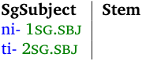

The plural one will be like this: 

Table 5. Orizaba Nahuatl Plural Present Intransitive Template 

| Subject     | Stem | Number |
|-------------|------|--------|
| ti- 1pl.sbj |      | -h pl  |
| an- 2pl.sbj |      |        |

Notice how this method places the singular subject markers in the singular template and puts the plural subject markers in the plural template. This way we force the presence of the plural suffix for the plural subject prefixes. 

> 15 In addition, the form _timikih_ could parse as ‘2sg.sbj‑die‑pl.’ This, too, is incorrect. If we used the Inflectional Affix Gloss Builder tool available in FieldWorks Language Explorer to create the glosses, then this parse would not appear: the subject number agreement feature would have a value of ‘singular’ which would conflict with the number agreement feature value of the suffix; namely ‘plural.’ The current parsers, however, do not have any way to indicate default features for a category (e.g., marking ‘singular’ as the default) in order to prevent the form _timiki_ from parsing as ‘1pl.sbj‑die.’ 

_Parsing Conceptual Introduction_ 

12 

What needs to be done to handle the 3rd person cases? We will need to mark the subject slot as optional in both templates in order to allow for the 3rd person cases. 

This means that to model this inflectional template, we will need to do what is shown in figure 2. 

1. Create or at least make sure we have an intransitive verb category. 

   - a. Use Grammar / Category Edit. 

   - b. Click on Verb. 

   - c. Use Insert menu item / Subcategory. 

   - d. In the ensuing dialog box, open up Verb and choose Intransitive verb. 

2. Create two inflectional templates within the intransitive verb category (see figure 1 for how to do this): 

   - a. For the singular template: 

      - i. Give it one optional prefix slot (for singular subject). 

      - ii. Put the 1sg.sbj‑ and 2sg.sbj‑ prefixes in this slot. If these prefixes do not already exist, create them and mark them as inflectional. 

   - b. For the plural template: 

      - i. Give it one optional prefix slot (for plural subject). 

      - ii. Put the 1pl.sbj‑ and 2pl.sbj‑ prefixes in this slot. If these prefixes do not already exist, create them and mark them as inflectional. 

      - iii. Give it a obligatory suffix slot (for number). 

      - iv. Put the ‑pl suffix in this slot. If this suffix does not already exist, create it and mark it as inflectional. 

Figure 2. How to Create Orizaba Nahuatl Intransitive Verb Templates. 

#### _2.1.2.4 Discontinuous morpheme_

In section 1.1.5 above, we noted that in Caquinte, the future tense is realized as a discontinuous morpheme: it is composed of the prefix _n_ ‑ and the suffix ‑ _e_ . We repeat the example here: 

- (16) intsavetacojitero (=7) i-n-tsave-(t)-ako-hi-(t)-e-ro 3m-fut-tell- -dat-pas- -fut-3f.obj ‘she will be told about’ 

How do we fulfill this requirement that both the future prefix and future suffix appear? One way is to create a future tense inflectional template which has both the prefix and the suffix required. The template might look like this: 

Table 6. Caquinte Future Template 

| Subject      | Future | Stem | Future | Object         |
|--------------|--------|------|--------|----------------|
| no- 1.sbj    | N- fut |      | -e fut | -na 1.obj      |
| a- 1incl.sbj |        |      |        | -ahi 1incl.obj |
| pi- 2.sbj    |        |      |        | -Npi 2.obj     |
| i- 3m.sbj    |        |      |        | -ri 3m.obj     |
| o- 3f.sbj    |        |      |        | -ro 3f.obj     |

_Inflection classes_ 

13 

Another possible way to treat discontinuous morphemes when one part appears before the stem and the other appears after the stem is to treat them as a single circumfix entry. See section 4.3. 

#### _2.1.2.5 Inflection and categories considerations_

The categories in FieldWorks Language Explorer are organized in a hierarchical fashion. For example, one can have a major category of verb and then nest other verb types underneath it (e.g., intransitive verb, transitive verb, etc.) One can even nest other types under these if one so wishes (e.g., one might put bitransitive verb under transitive verb.). 

The exact hierarchy one uses can make a difference for how the FieldWorks Language Explorer parser handles the inflectional templates and their slots. For templates, when you define an inflectional template for a given category, that template will be tried for any stem of that category or a stem of **any of its nested categories** . If, for example, you have intransitive verb and transitive verb nested under verb, then any inflectional template you define on verb will also be tried by the FieldWorks Language Explorer parser for any intransitive verb or transitive verb stem. On the other hand, in this scenario, any inflectional template defined under intransitive verb will only be applied to intransitive verb stems and any inflectional template defined under transitive verb will only be applied to transitive verb stems. 

Thus, you can capture generalizations about the inflectional templates by placing common inflectional templates higher in the hierarchy. 

Inflectional affix slots behave similarly with respect to the hierarchy: when one defines the slots for a given category, those slots may be used in any template for this category and **any of its nested categories** . For example, if all of your verbs share a common subject slot, then you can define this subject slot at the main verb category. This slot will then be available for any affix templates in all sub-categories of verb.16 You may well need to keep this in mind as you design your category hierarchy. 

#### _2.1.2.6 Inflection classes_

We now turn to something that is actually about morphophonemics, not morphotactics. We include it here, though, because it relates to inflectional affixes. Consider the Yalálag Zapotec [zpu] data given in (17)‑(18):17 

- (17) a. utecho u-te-cho fut-pass(tr)-1pl.incl 

   - b. u:ke'nia'cho u-:ke'nia'-cho fut-limp(intr)-1pl.incl 

16 Please note that you can use the same name for slots at different points in the hierarchy (e.g., use “Subject” at both the top verb level and also under a nested intransitive verb category). The FieldWorks Language Explorer parser will always know which one is which. You and others who look at your implementation, however, may find it confusing. Therefore, we do not recommend that you do this. 17 The data are from López y Newberg (1990). 

The orthography used here is slightly different from what is used in López y Newberg (1990). In particular, fortis consonants are preceded by a colon ( _:_ ). Lenis consonants are not (and use the voiceless equivalent instead of the voiced one). 

_Parsing Conceptual Introduction_ 

14 

(18) a. :techo :-te-cho fut-pass(intr)-1pl.incl 

b. :ti:pla':chcho :-ti:pla':ch-cho fut-encourage(tr)-1pl.incl 

What is the phonological shape of the Future marker? It appears to be _u_ ‑ in (17) but the “fortifier” segment/feature _:_ ‑ (i.e., a colon) in (18). Notice that there do not appear to be any phonological reasons for the different allomorphs. In fact, the stem has the same phonological shape in (17a) and in (18a). (The difference in future allomorphy is not due to transitivity.) This problem is not isolated to these pairs of forms; it turns out that verb stems in general divide into two groups, those that take the _u_ ‑ future and those that take the _:_ ‑ future. 

How do we handle this kind of allomorphy when the choice of allomorphs is not motivated by the phonological environment but by the choice of the lexical stem? The FieldWorks Language Explorer approach is to use inflection classes. An inflection class is “a set of lexemes whose members each have the same type of inflectional forms” (Aronoff 1994:64). They correspond to the traditional idea of declension classes or conjugation classes. For Yalálag Zapotec, we would create two inflection classes at the top-level verb category (so that it applies to verb and all sub-categories of verb; see section 2.1.2.6.2). One class would be for stems that select the _u_ ‑ allomorph and the other would be for those that take the “fortifier” _:_ ‑ allomorph. 

This means that to model these inflection classes, we will need to do what is shown in figure 3. 

1. Create two inflection classes within the verb category. 

   - a. Use Grammar / Category Edit. 

   - b. Click on Verb. 

   - c. Click on Inflection Class Info and then Insert Inflection Class. 

   - d. Fill in its name, abbreviation, and description. 

2. Create the future inflectional prefix (using Lexicon / Lexicon Edit) and within it 

   - a. Create the _u_ ‑ allomorph and tag it as belonging to the first inflection class. 

      - i. To see the Inflection Classes field, you may have to check the Show Hidden Fields box. 

      - ii. Click in the Inflection Classes field. 

      - iii. Click on the chooser button. 

      - iv. In the ensuing dialog box, check the first inflection class. 

   - b. Create the “fortifier” _:_ ‑ allomorph and tag it as belonging to the second inflection class. 

3. For each verb root (or stem), tag it as belonging to either the first or the second inflection class, whichever is correct for that verb. 

   - a. Use Lexicon / Lexicon Edit and find each verb, one at a time. 

   - b. To see the Inflection Class field, you may have to check the Show Hidden Fields box. 

   - c. Click in the Inflection Class field under Grammatical Info. Details. 

   - d. Click on the chooser button. 

   - e. In the ensuing dialog box, select the appropriate inflection class. 

   - f. Alternatively, use Lexicon / Bulk Edit Entries with the List Choice tab to set the values for many verbs at once. See the help files in FieldWorks Language Explorer for more. 

Figure 3. How to Create Yalálag Zapotec Inflection Classes. 

_Inflection subclasses_ 

15 

Now consider the following Latin [lat] data which also illustrates the use of inflection classes.18 

| \(19\) | Declension | Citation Form | Gloss   | Dative Plural |
|--------|------------|---------------|---------|---------------|
|        | I          | causa         | reason  | caus-is       |
|        | II         | annus         | year    | ann-is        |
|        | III        | civis         | citizen | civ-ibus      |
|        | IV         | manus         | hand    | man-ibus      |
|        | V          | dies          | day     | di-ebus       |

Note that while there are five distinct declensions in Latin, there are only three forms for the dative plural: ‑ _is_ , ‑ _ibus_ , and ‑ _ebus_ . In particular, notice that ‑ _is_ is used for both declension class I and II and, similarly, ‑ _ibus_ is used for both declension class III and IV. So to model this Latin data in FieldWorks Language Explorer, we will need to do the following.19 See figure 3 for details on the steps given. 

1. Create five inflection classes within the noun category. 

2. Create the dative plural inflectional suffix and within it 

   - a. Create the ‑ _is_ allomorph and tag it as belonging to both the first and second inflection classes. b. Create the ‑ _ibus_ allomorph and tag it as belonging to both the third and fourth inflection classes. 

   - c. Create the ‑ _ebus_ allomorph and tag it as belonging to the fifth inflection class. 

3. For each noun root (or stem), tag it as belonging to the appropriate inflection class, whichever is correct for that noun. 

Figure 4. How to Create Latin Inflection Classes. 

Note that one can also set the default inflection class to be one of the inflection classes. If you do this, the FieldWorks Language Explorer parser will use this default inflection class for any stem that is not overtly tagged with an inflection class. 

In addition, if an affix entry has any inflection classes and at least some of the allomorphs are constrained with environments (as described in section 3.1.3), one should be careful to tag all allomorphs in the entry with the inflection class(es) they go on. Otherwise, some allomorphs without environments may be incorrectly constrained. 

#### 2.1.2.6.1 Inflection subclasses

Now we consider one more situation where inflection classes are appropriate. Like Yalálag Zapotec, Isthmus Zapotec [zai] also has verbal inflection classes.20 There is a distinction, however. First, consider the data in (20)-(23), paying attention to the aspect prefixes. 

> 18 The data are from <u>http://www.thelatinlibrary.com/decl.html</u> and <u>https://web.archive.org/web/ 20000525045116/https://www.slu.edu/colleges/AS/languages/classical/latin/tchmat/grammar/ decl-c.html.</u> 

> 19 Of course, one would want to model the full nominal paradigm if one were working on Latin, but this limited usage here illustrates the point about letting a given allomorph refer to more than one inflection class. 

> 20 The data are taken from Pickett, Black & Marcial (2001) and follow the practical orthography. 

_Parsing Conceptual Introduction_ 

16 

<table><tr><th colspan="2">Habitual</th><th></th><th colspan="3">Progressive</th></tr><tr><td>(20)</td><td>a.</td><td>rucaa</td><td>(21)</td><td>a.</td><td>cucaa</td></tr><tr><td></td><td></td><td>ru-caa</td><td></td><td></td><td>cu-caa</td></tr><tr><td></td><td></td><td>hab-write</td><td></td><td></td><td>prog-write</td></tr><tr><td></td><td>b.</td><td>riree</td><td></td><td>b.</td><td>caree</td></tr><tr><td></td><td></td><td>ri-ree</td><td></td><td></td><td>ca-ree</td></tr><tr><td></td><td></td><td>hab-leave</td><td></td><td></td><td>prog-leave</td></tr><tr><td></td><td>c.</td><td>richesa</td><td></td><td>c.</td><td>cachesa</td></tr><tr><td></td><td></td><td>ri-chesa</td><td></td><td></td><td>ca-chesa</td></tr><tr><td></td><td></td><td>hab-jump</td><td></td><td></td><td>prog-jump</td></tr><tr><td></td><td>d.</td><td>rizá</td><td></td><td>d.</td><td>cazá</td></tr><tr><td></td><td></td><td>ri-zá</td><td></td><td></td><td>ca-zá</td></tr><tr><td></td><td></td><td>hab-walk</td><td></td><td></td><td>prog-walk</td></tr><tr><td>Unreal</td><td></td><td></td><td>Future</td><td></td><td></td></tr><tr><td>(22)</td><td>a.</td><td>nucaa</td><td>(23)</td><td>a.</td><td>zucaa</td></tr><tr><td></td><td></td><td>nu-caa</td><td></td><td></td><td>zu-caa</td></tr><tr><td></td><td></td><td>un-write</td><td></td><td></td><td>fut-write</td></tr><tr><td></td><td>b.</td><td>niree</td><td></td><td>b.</td><td>zaree</td></tr><tr><td></td><td></td><td>ni-ree</td><td></td><td></td><td>za-ree</td></tr><tr><td></td><td></td><td>un-leave</td><td></td><td></td><td>fut-leave</td></tr><tr><td></td><td>c.</td><td>nichesa</td><td></td><td>c.</td><td>zachesa</td></tr><tr><td></td><td></td><td>ni-chesa</td><td></td><td></td><td>za-chesa</td></tr><tr><td></td><td></td><td>un-jump</td><td></td><td></td><td>fut-jump</td></tr><tr><td></td><td>d.</td><td>nizá</td><td></td><td>d.</td><td>zazá</td></tr><tr><td></td><td></td><td>ni-zá</td><td></td><td></td><td>za-zá</td></tr><tr><td></td><td></td><td>un-walk</td><td></td><td></td><td>fut-walk</td></tr></table>

Notice that based on this data, there are two inflection classes as summarized in (24).21 

| \(24\) | Aspect      | Class | 1 Class 2 |
|--------|-------------|-------|-----------|
|        | Habitual    | ru-   | ri-       |
|        | Progressive | cu-   | ca-       |
|        | Unreal      | nu-   | ni-       |
|        | Future      | zu-   | za-       |

Second, when we consider two other aspects, things are not so straightforward. The stems are presented in the same order in (25)-(26) as they were above in (20)-(23): 

21 I am swapping the class numbering found in section 7.3 of Pickett, Black & Marcial (2001) for pedagogical reasons. 

_Inflection subclasses_ 

17 

<table><tr><th colspan="2">Completive</th><th></th><th colspan="2">Potential</th><th></th></tr><tr><td>(25)</td><td>a.</td><td>bicaa</td><td>(26)</td><td>a.</td><td>gucaa</td></tr><tr><td></td><td></td><td>bi-caa</td><td></td><td></td><td>gu-caa</td></tr><tr><td></td><td></td><td>compl-write</td><td></td><td></td><td>pot-write</td></tr><tr><td></td><td>b.</td><td>biree</td><td></td><td>b.</td><td>guiree</td></tr><tr><td></td><td></td><td>bi-ree</td><td></td><td></td><td>gui-ree</td></tr><tr><td></td><td></td><td>compl-leave</td><td></td><td></td><td>pot-leave</td></tr><tr><td></td><td>c.</td><td>guchesa</td><td></td><td>c.</td><td>guichesa</td></tr><tr><td></td><td></td><td>gu-chesa</td><td></td><td></td><td>gui-chesa</td></tr><tr><td></td><td></td><td>compl-jump</td><td></td><td></td><td>pot-jump</td></tr><tr><td></td><td>d.</td><td>guzá</td><td></td><td>d.</td><td>sa'</td></tr><tr><td></td><td></td><td>gu-zá</td><td></td><td></td><td>∅-sa'</td></tr><tr><td></td><td></td><td>compl-walk</td><td></td><td></td><td>pot-walk</td></tr></table>

For example, while the habitual prefix in (20b) differs from the one in (20a), they are the same for completive aspect in (25b) and (25a). Further, the potential aspect is quite different in (26d). How can we understand this data? 

At least one way to understand this data is to posit two main inflection classes where one of these has three subclasses. We can summarize the affix allomorphy as shown in (27). 

| \(27\) | Aspect      | Class 1 |         | Class 2 |         |
|--------|-------------|---------|---------|---------|---------|
|        | Habitual    | ru-     |         | ri-     |         |
|        | Progressive | cu-     |         | ca-     |         |
|        | Unreal      | nu-     |         | ni-     |         |
|        | Future      | zu-     |         | za-     |         |
|        |             |         | Class2A | Class2B | Class2C |
|        | Completive  | bi-     | bi-     | gu-     | gu-     |
|        | Potential   | gu-     | gui-    | gui-    | ∅-      |

Finally, there is the Perfect aspect which has the same shape for all verbs as illustrated in (28).22 

(28) a. huacaa hua-caa prf-write 

- b. huaree hua-ree prf-leave 

c. huachesa hua-chesa prf-jump 

d. huazá hua-zá prf-walk 

> 22 Some of these aspects also have some simple phonologically-based allomorphy which I am not showing here for pedagogical reasons. 

_Parsing Conceptual Introduction_ 

18 

To model this Isthmus Zapotec data in FieldWorks Language Explorer, we will need to do what is shown in figure 5. See figure 3 for details on the steps not overtly described. 

1. Create two inflection classes within the verb category. 

2. Within the second one, create three subclasses. 

   - a. In Grammar / Category Edit / Verb, click on Subclasses under the second inflection class. 

   - b. Click on Insert Inflection Class. 

   - c. Enter the name, abbreviation, and description for the subclass. 

   - d. Repeat for all three subclasses. 

3. For each verb stem, tag it as belonging to the appropriate inflection class or subclass, whichever is correct for that verb. 

4. For the Perfect aspect, merely create the inflectional prefix entry with its single form. 

5. For the Habitual, Progressive, Unreal, and Future aspects, create the inflectional prefix entries, including their two allomorphs. (You will need to decide which form to use as the lexeme form and which as the affix allomorph form.) 

   - a. For the Class 1 allomorph, tag it as belonging to Class 1. 

   - b. For the Class 2 allomorph, tag it as belonging to Class 2. 

6. For the Completive aspect, create the inflectional prefix entry, including its two allomorphs. a. For the _bi-_ allomorph, tag it as belonging to Class 1 and Subclass 2A. 

   - b. For the _gu-_ allomorph, tag it as belonging to Subclass 2B and 2C. 

7. For the Potential aspect, create the inflectional prefix entry, including its three allomorphs. a. For the _gu-_ allomorph, tag it as belonging to Class 1. 

   - b. For the _gui-_ allomorph, tag it as belonging to Subclass 2A and 2B. 

   - c. For the null allomorph, tag it as belonging to Subclass 2C. 

#### Figure 5. How to Create Isthmus Zapotec Inflection Classes.

In general terms, here is how the FieldWorks Language Explorer morphological parser will constrain an inflectional affix allomorph tagged for inflection classes when there are both main level classes and subclasses for at least one main level class: 

- (29) 1. If the inflectional affix entry has only one form, then that form will always be used, no matter what inflectional class or subclass the stem is tagged with. 

   2. If the inflectional affix entry has at least one allomorph tagged with a subclass: 

      - a. any allomorph tagged with a subclass will only go on stems which are also tagged with that subclass. 

      - b. any allomorph tagged with a main level class will only go on stems which are also tagged with that main level class 

   3. If the inflectional affix entry has allomorphs tagged only at the main level, then 

      - a. an allomorph can go on a stem tagged with the same main level inflection class as it is tagged with or 

      - b. an allomorph can go on a stem tagged with an inflection subclass that is a subclass of the main level inflection class that it is tagged with. This implies that the FieldWorks Language Explorer parser pays attention to the inflection class hierarchy. Even if a stem is tagged with a subclass, the inflectional affix needs to only be tagged at the main level. This is the case even if there are subclasses within subclasses. 

_Agreement and other inflection features_ 

19 

Finally, please recall that if an affix entry has any inflection classes and at least some of the allomorphs are constrained with environments, one should be careful to tag all allomorphs in the entry with the inflection class(es) they go on. This may need to include subclasses. Otherwise, some allomorphs without environments may be incorrectly constrained. For example, if the allomorph conditioned with an environment goes on a subclass and an unconditioned allomorph is tagged with a main level inflection class, you will need to change the unconditioned one to go on all subclasses. This is because of condition 2b in (29) above. 

#### 2.1.2.6.2 Inflection classes and category organization

As we noted in section 2.1.2.5, the categories in FieldWorks Language Explorer are organized in a hierarchical fashion. 

The exact hierarchy one uses can make a difference for how the FieldWorks Language Explorer parser handles inflection classes. When you define an inflection class (or an inflection subclass) at a particular category in the hierarchy, then that class is available to be used for any lexical item associated with that category or **any of its nested categories** . Thus, you will probably want to define your inflection classes at the highest appropriate level in the hierarchy in order to capture generalizations. 

#### _2.1.2.7 Agreement and other inflection features_

Consider the Spanish [spa] noun data given in (30) below: 

- (30) a. casa kas-a house-f 

   - b. caso kas-o case-m 

   - c. casita kas-it-a house-dim-f 

   - d. casito kas-it-o case-dim-m 

Notice that the main difference between these nouns is the gender agreement suffix. If the ‑ _a_ ‘f’ suffix is used, then the _cas_ root means ‘house.’ On the other hand, if the ‑ _o_ ‘m’ suffix is used, then the _cas_ root means ‘case.’ 

For a human, it is not necessarily difficult to keep these facts straight, but for a morphological parser, we need some way to prevent it from thinking that _casa_ has the masculine root _cas_ that means ‘case.’ Similarly we need a way to keep the parser from thinking that _caso_ has the feminine root _cas_ that means ‘house.' That is, we need a way to prevent the parser from giving “analyses” such as the ones shown in (31), where the asterisk (*) indicates that the analysis is incorrect. 

_Parsing Conceptual Introduction_ 

20 

(31) a. casa kas-a *case-f b. caso kas-o *house-m 

With the FieldWorks Language Explorer parser we use inflection features to deal with this issue. Inflection features are typically characteristics of a morpheme that play a role in the inflection of a word and/or play a role in the syntax (such as agreement within a noun phrase or agreement between a verbal affix and the noun phrase it agrees with). Note that if you use the Inflectional Affix Gloss Builder tool for glossing inflectional affixes, then FieldWorks Language Explorer will automatically add some inflection features for you. 

Coming back to the Spanish data in (30) and (31) above, how exactly does one use inflection features to rule out incorrect parses such as the ones in (31)? The problem here is that there is a mismatch between the gender of the root and the gender of the affix. If we can mark the root for the correct gender and also mark the suffixes for the gender they agree with, then the FieldWorks Language Explorer parser will only produce the correct parses. 

Many languages will use one or more of the inflection features listed in the chart shown in table 7 below. 

Table 7. Sample Inflection Features 

| Feature Type | Feature Name | Sample Values |
|----|----|----|
| Agr | Person | 1st, 2nd, 3rd |
|  | Number | Singular, Dual, Plural |
|  | Gender | Masculine, Feminine, Neuter |
|  | Class | 1, 2, …, 20 (or by shape or other classification system) |
|  | Animacy | Animate, Inanimate |
|  | Case | Nominative, Accusative, Dative, Locative, Genitive, Ergative, Absolutive |
| Infl | Aspect | Completive, Continuative, Habitual, Perfective, Progressive, Stative |
|  | Tense | Past, Present, Future |
|  | Mood | Declarative, Imperative, Interrogative, Irrealis, Realis |

These are just some examples. Your language may use these or may need others. You may want to check with a linguistic consultant who is familiar with your language family for ideas as to which inflection features are appropriate for your language. Or you may just want to add them only when you find a need for them, such as when the FieldWorks Language Explorer parser gives incorrect parses for forms. 

The features shown in table 7 are all simple features. There are times when a given word could contain more than one such set of simple features. This is where complex features are important. For example, for cases where a noun has noun class, say, and in addition, has a possessive affix which has a different noun class, then we must be careful to avoid the two noun classes from clashing with each other. If we merely use a simple inflection feature of “Class” for both the noun and the possessive affix, then the values will differ and the parser will not analyze the word. Instead, we need to use separate noun agreement and possessor agreement complex features. Within each of these complex features, we use the “Class” feature and its values. In this way, not only does the parser correctly analyze the word (because the two complex features do not clash), it also will have the correct features demarcated for eventual syntactic analysis. 

Another possible example for the use of complex features is when a verbal word has both subject and object agreement markers in it. If the person features are different for subject and object, then we need to be sure and use two complex features, one for the subject agreement features and the other for the object agreement features. 

_Agreement and other inflection features_ 

21 

The Spanish data illustrates how we can use gender inflection features to rule out incorrect parses when a gender affix shows up incorrectly on a root. Some possible situations where inflection features could play a similar role in ruling out incorrect parses include those shown in table 8. 

Table 8. Using Features to Rule Out Parses 

**Situation Possible Inflection Features to use** Gender mismatch between affix and stem Gender agreement features Noun class mismatch between affix and stem Noun class agreement features Animacy mismatch between affix and stem Animacy agreement features Two or more aspect markers showing on a verb, when there should only Aspect features be one Two or more tense markers showing on a verb, when there should only Tense features be one 

How does one create and use an inflection feature in FieldWorks Language Explorer? Figures 6–8 below explain how. 

1. Determine the inflection feature involved, including its type,_a_ name, and possible values. (You may need to check with a linguistic consultant on this.) 

2. Use Grammar / Inflection Features. 

   - a. Use Insert menu item / Feature. 

   - b. This brings up the “Add Inflection Features from Catalog” dialog box. 

   - c. Explore the catalog and try to find the feature you need. 

   - d. If so, add the feature via the catalog (it's much easier this way). 

   - e. If not, then in the dialog, click on the The inflection feature I need is not shown in the Catalog. Create a custom inflection feature link. i. Fill in the name, abbreviation, and description fields. 

      - ii. For each value this feature needs, click on Values and then on Insert Feature Value. 

      - iii. Fill in the value's name, abbreviation, and description. You'll probably want to check the Use Abbreviation as label box. 

3. For each category which will use the feature, a. Add the feature to the category's set of inflectable features. 

      - i. Use Grammar / Category Edit. 

      - ii. Click in the Inflectable Features field. 

      - iii. Click on the chooser button. 

      - iv. In the ensuing dialog box, check the box by the feature. 

   - b. Make sure that the category has appropriate affix templates (see section 2.1.2). If there are no templates for the category, then the FieldWorks Language Explorer parser will ignore the features. 

> _a_ We recommend using only two types: “Agr” for agreement features and “Infl” (= Inflection) for all others. 

Figure 6. How to Create Inflection Features. 

_Parsing Conceptual Introduction_ 

22 

1. For each root (or stem) needing the feature, add the feature and its appropriate value to the stem's grammatical information details. 

   - a. Use Lexicon / Lexicon Edit. 

   - b. To see the Inflection Features field, you may have to check the Show Hidden Fields box. c. Click in the Inflection Features field. 

   - d. Click on the chooser button. 

   - e. In the ensuing dialog box, select the feature and value you need. 

   - f. Alternatively, use Lexicon / Bulk Edit Entries with the List Choice tab to set the values for many entries at once. See the help files in FieldWorks Language Explorer for more. 

Figure 7. How to Add Inflection Features to Roots or Stems. 

1. For each inflectional affix needing the feature, add the feature and its appropriate value to the inflectional affix's grammatical information details. a. Use Lexicon / Lexicon Edit. 

   - b. To see the Inflection Features field, you may have to check the Show Hidden Fields box. c. Click in the Inflection Features field. 

   - d. Click on the chooser button. 

   - e. In the ensuing dialog box, select the feature and value you need. 

Figure 8. How to Add Inflection Features to Affixes. 

#### _2.1.2.8 Inflection classes versus inflection features_

When modeling a given language, one may well wonder if a given phenomenon should be handled by inflection classes or by inflection features. Here are some guidelines to help one decide: 

Table 9. Inflection Classes vs. Inflection Features 

| If the various affixes involved … | then use … |
|----|----|
| have no semantic differences (i.e., have the same meanIng), have non-phonologically motivated shape differences, and are not involved in (syntactic) agreement | inflection class |
| have semantic differences (i.e., actually have different meaning) | inflection features |
| are involved in (syntactic) agreement | inflection features |
| are really declension classes or conjugation classes | inflection classes |
| are noun classes or gender | inflection features |

_Major category-changing derivational affixes_ 

23 

#### _2.1.2.9 Underspecified inflectional affixes_

In the above, we discussed how one can fully specify inflectional affixes. Sometimes it is the case, though, that you are confident that a particular affix is inflectional, but you just do not yet know the category it goes on. Or it might be the case that you know the category, but you do not yet know what the template looks like so you cannot put it in an inflectional affix slot. 

FieldWorks Language Explorer allows you to model what you know. That is, you can still label such an affix as being inflectional, but only partially specify the rest of the information about it. If you know the category, but not the slot, you can say so. Be advised, though, that when you do this, the FieldWorks Language Explorer parser will treat such underspecified inflectional affixes just like it does for “unclassified” affixes (see section 2.1.1). 

#### 2.1.3 Derivational affixes

Derivational affixes typically reflect what some call “lexical meaning.” They go on a stem to produce a new stem. The new stem may then be inflected (if the category of the new stem has inflection). Derivational affixes often change syntactic category. See Bickford (1998:135ff) for more on this. 

#### _2.1.3.1 Major category-changing derivational affixes_

The English data from example (3) is repeated below with more information: 

| \(32\) | Form                     | Derivational Affix | Category  |
|--------|--------------------------|--------------------|-----------|
|        | institute                | (none)             | verb      |
|        | institution              | -ion               | noun      |
|        | institutional            | -al                | adjective |
|        | institutionalize         | -ize               | verb      |
|        | institutionalization     | -ation             | noun      |
|        | institutionalizational   | -al                | adjective |
|        | institutionalizationally | -ly                | adverb    |

What do we have here? We have five derivational suffixes, each of which changes the major category of the resulting stem. Recall that these suffixes only go on stems of a certain category. For example, the ‑ _al_ suffix only goes on noun stems. It does not go on other stems (* _institutal_ , * _institutionalal_ , and * _quicklyal_ ). These affixes are summarized in (33) below. 

| \(33\) | Form   | “attaches to category” | “changes to category” | Gloss         |
|--------|--------|------------------------|-----------------------|---------------|
|        | ‑ion   | verb                   | noun                  | Nominalizer   |
|        | ‑al    | noun                   | adjective             | Adjectivizer  |
|        | ‑ize   | adjective              | verb                  | Verbalizer    |
|        | ‑ation | verb                   | noun                  | Nominalizer2  |
|        | ‑ly    | adjective              | adverb                | Adverbializer |

How do we model these category changing affixes in FieldWorks Language Explorer? We need to do what is shown in figure 9. 

_Parsing Conceptual Introduction_ 

24 

1. Add each affix as a lexical entry and mark it as being derivational. a. Use Lexicon / Lexicon Edit. 

   - b. Use Insert menu item / Entry. c. In the ensuing “New Entry” dialog box, set the Affix Type to “Derivational.” 

2. For the “Attaches to Category” piece of information, use the category of the stem to which this affix attaches (see section 2.1.3.6 for more on this). 

3. For the “Changes to Category” piece of information, use the category of the stem that results when this affix is attached (see section 2.1.3.6 for more on this). 

Figure 9. How to Create Category Changing Affixes. 

#### _2.1.3.2 Sub-category-changing derivational affixes_

Now consider the pairs of data in (34)-(36) from Turkish [tur]:24, 25 

- (34) a. Çocuğu yıkadı Çocuğ-u yıka-dı child-acc wash-pst ‘(S)he washed the child’ 

   - b. Çocuk yıkandı Çocuk yıka-n-dı child wash-pass-pst ‘The child was washed’ 

- (35) a. Bu işi yapmaya başlıyorlar Bu iş-i yap-ma-ya başl-ıyor-lar this work-acc do-inf-dat begin-prog-3pl ‘They are beginning to do this work’ 

b. Bu iş yapılmaya başlanıyor Bu iş yap-ıl-ma-ya başla-n-ıyor this work do-pass-inf-dat begin-pass-prog ‘This work is beginning to be done’ 

- (36) a. O adamlar sigara içiyor O adam-lar sigara iç-iyor Those man-pl cigarette drink-prog ‘Those men are smoking cigarettes’ 

b. Sigara içilmez Sigara iç-il-mez cigarette(s) drink-pass-neg ’Cigarettes are not smoked here’ (= no smoking) 

> 24 The data are from Inkelas (2001). 

> 25 (I wish I had access to a more standard Turkish grammar to get examples, but this is the best I could find on the net. I also changed the glosses of two items per my Turkish Ample files which were based on Underhill's grammar.) 

_Non-category-changing derivational affixes_ 

25 

What is the key difference in each pair? It is the addition of the passive morpheme. Notice how the number of arguments changes from two (subject and object) to one (just subject) with the addition of the passive. 

Is passive, then, a category changing derivational affix? While it does not change major category (i.e., it does not change a verb into a noun, say), it does change a transitive verb into an intransitive verb. That is, passive is a case where the sub-category is changed. Many languages have other such sub-category changing derivational affixes such as causatives, applicatives, and transitivizers. As far as FieldWorks Language Explorer is concerned, these are category changing derivational affixes since the result of the derivation produces a different sub-category that potentially requires a different inflectional template to complete the word form. 

How do we model these sub-category changing affixes in FieldWorks Language Explorer? We need to do what is shown in figure 10. See figure 9 for details on the first step. 

1. Add each affix as a lexical entry and mark it as being derivational. 

2. For the “Attaches to Category” piece of information, use the (sub-)category of the stem to which this affix attaches (see section 2.1.3.6 for more on this). 

3. For the “Changes to Category” piece of information, use the (sub-)category of the stem that results when this affix is attached (see section 2.1.3.6 for more on this). 

Figure 10. How to Create Sub-category Changing Affixes. 

#### _2.1.3.3 Non-category-changing derivational affixes_

Now consider the following Yalálag Zapotec data:26 

- (37) a. :xopcho :-xop-cho fut-drag-1pl.incl 

   - b. waxopcho w-a-xop-cho fut-rep-drag-1pl.incl 

- (38) a. uchi:chcho u-chi:ch-cho fut-laugh-1pl.incl 

   - b. wachi:chcho w-a-chi:ch-cho fut-rep-laugh-1pl.incl 

The addition of the repetitive prefix does not change either the major category or the sub-category of the words in (37)-(38). One might wonder, then, if the repetitive in Yalálag Zapotec is actually an inflectional prefix. The evidence that it is derivational is that it actually changes the inflection class of the resulting 

> 26 The data are from López y Newberg (1990). 

> The orthography used here is slightly different from what is used in López y Newberg (1990). In particular, fortis consonants are preceded by a colon ( _:_ ). Lenis consonants are not (and use the voiceless equivalent instead of the voiced one). 

_Parsing Conceptual Introduction_ 

26 

stem. As we saw in section 2.1.2.6, Yalálag Zapotec verbs have two inflection classes. In (37a) the stem is inflection class 2 (because it takes the “fortifier” _:_ ‑ allomorph of the future prefix). After the _a_ ‑ repetitive prefix is added in (37b), the resulting stem uses the inflection class 1 allomorph of future ( _u/w_ ‑). How do we model these non-category changing affixes in FieldWorks Language Explorer? We need to do what is shown in figure 11. See figure 9 for details on the first step. 

1. Add each affix as a lexical entry and mark it as being derivational. 

2. For the “Attaches to Category” piece of information, use the category of the stem to which this affix attaches (see section 2.1.3.6 for more on this). 

3. For the “Changes to Category” piece of information, use the same category as for the “attaches to category”. 

Figure 11. How to Create Non-category Changing Affixes. 

Notice that in this case the from‑ and to‑ categories will be the same, but we do need to deal with the change in inflection class. This leads us to the next topic below. 

#### _2.1.3.4 Inflection class and derivational affixes_

If the language you are studying has inflection classes (see section 2.1.2.6), then what happens when derivational affixes are attached? Does the inflection class of the stem stay the same or does it change? 

#### 2.1.3.4.1 Inflection class may change

As we saw from the Yalálag Zapotec data in section 2.1.3.3, the inflection class can indeed change. How do we model this? In addition to what we've done for the categories, we need to do what is shown in figure 12. 

1. Also indicate the resulting inflection class in the “To Inflection Class” piece of information in the lexical entry for the appropriate affix. a. Use Lexicon / Lexicon Edit. 

   - b. To see the To Inflection Class field, you may have to check the Show Hidden Fields box. 

   - c. Under Grammatical Info. Details, click in the To Inflection Class field. 

   - d. Click on the chooser button. 

   - e. In the ensuing dialog box, select the inflection class you need. 

Figure 12. How to Create Non-category Changing Affixes When the Inflection Class Changes. 

Note that rarely, if ever, does one need to indicate the “from inflection class” information. We include it in case you do find that you need it. 

#### 2.1.3.4.2 Inflection class does not change

There are cases, though, where a derivational affix is attached and it does not change the inflection class of the resulting stem. For example, consider the following data from Atzingo Popoloca [poe]:27 

> 27 Data are from Austin, Kalstrom, and Hernández (1995). 

_Inflection Features and Derivational Affixes_ 

- (39) a. tjanchia t-janchi-a prs-ask-1sg.auth.sbj.act 

   - b. tjáncháhā t-jánchá-h-ā prs-ask-appl-1sg.auth.sbj.act 

- (40) a. nínkaon ∅-nínkaon prs-get.angry 

   - b. nínkakonhen ∅-nínkakon-hen prs-get.angry-appl 

The applicative suffix ‘appl’ adds an argument to the verb, but it does not change the inflection class of the resulting stem. The root in (39) belongs to inflection class 1 and so takes the _t_ ‑ allomorph of the present tense morpheme. Adding the applicative does not change this (39b). Similarly, the root in (40) belongs to inflection class 2 and so takes a null allomorph of the present tense. Once again, adding the applicative does not change the inflection class of the resulting stem (40b). 

To model this in FieldWorks Language Explorer, one does what is shown in figure 13. 

1. Merely leave the “To Inflection Class” information blank in the lexical entry for the appropriate affix. 

Figure 13. How to Create Non-category Changing Affixes When the Inflection Class Does Not Change. 

#### _2.1.3.5 Inflection Features and Derivational Affixes_

If the language you are studying has inflection features (see section 2.1.2.7), then what happens when derivational affixes are attached to a stem with, say, agreement features? Or what happens when a derivational affix changes the category of the stem to a category that has agreement features? For example, consider the Spanish data in (41) and (42):28 

- (41) a. apretar apret-ar press-inf 

   - b. apretón apret-ón press-nmlz 

> 28 This data are taken from Velásquez (1974:16). 

_Parsing Conceptual Introduction_ 

28 

- (42) a. trasquilar traskil-ar shear-inf 

   - b. trasquilón traskil-ón shear-nmlz 

Here we have a verb (e.g., _apretar_ ) and a noun derived from that verb (e.g., _apretón_ ). Recall from section 2.1.2.7 that Spanish nouns are marked for gender (masculine or feminine). While Spanish verbs are not marked for gender, a noun derived from a verb will have gender. In the case of the ‑ _ón_ derivational suffix, the resulting noun has masculine gender. To properly model this, we would need to indicate that the resulting noun has this gender. 

How does one mark a derivational affix for inflection features in FieldWorks Language Explorer? See figure 14. 

1. Determine the inflection feature involved, including its type,_a_ name, and possible values. 

2. Create them if needed. See figure 6. 

3. For each derivational affix needing a feature: 

   - a. If the derivational affix requires the stem to have such a feature, add the feature and its appropriate value to the derivational affix From Inflection Features field. i. Use Lexicon / Lexicon Edit. 

      - ii. To see the From Inflection Features field, you may have to check the Show Hidden Fields box. 

iii. Click in the From Inflection Features field. 

   - iv. Click on the chooser button. 

   - v. In the ensuing dialog box, select the features and values you need. 

- b. If the stem that results from adding the derivational affix has such a feature, add the feature and its appropriate value to the derivational affix To Inflection Features field. i. Use Lexicon / Lexicon Edit. 

   - ii. To see the To Inflection Features field, you may have to check the Show Hidden Fields box. 

iii. Click in the To Inflection Features field. 

- iv. Click on the chooser button. 

- v. In the ensuing dialog box, select the features and values you need. 

> _a_ We recommend using only two types: “Agr” for agreement features and “Infl” (= Inflection) for all others. 

Figure 14. How to Create a Derivational Affix With Inflection Features. 

#### _2.1.3.6 Category-changing derivational affixes and category organization_

As we noted in sections 2.1.2.5 and 2.1.2.6.2, the categories in FieldWorks Language Explorer are organized in a hierarchical fashion. 

The exact hierarchy one uses can make a difference for how the FieldWorks Language Explorer parser handles the categories of derivational affixes. When one indicates the “from category”, the FieldWorks 

_Derivation outside of inflection_ 

29 

Language Explorer parser will allow the derivational affix to apply to stems of this category and **any of its nested categories** . You may well need to keep this in mind as you design your category hierarchy. 

You can use the hierarchy to capture some generalizations. For example, suppose your language has a nominalizing derivational affix that can attach to any verb stem, resulting in a noun stem. Further, suppose that the top-level verb category has two sub-categories: intransitive verb and transitive verb. If you mark the “from category” as being verb, then this affix can attach to a verb stem, an intransitive verb stem, or a transitive verb stem. 

Sometimes, however, the hierarchy implies that one will need to have more than one mapping for a given derivational affix. For example, one might need a causative to map as follows if the inflectional templates are different for intransitive verb, transitive verb, and ditransitive verb: 

| \(43\) | “from category”   | “to category”     |
|--------|-------------------|-------------------|
|        | intransitive verb | transitive verb   |
|        | transitive verb   | ditransitive verb |
|        | noun              | transitive verb   |

To do this, you need to add a separate mapping for each possible from/to pair. You do that by adding distinct senses and associating each sense with the appropriate mapping. 

If a derivational affix only changes meaning (i.e., it does not change the category or the sub-category), then one can use the highest level category for both the “from category” and the “to category”. In this case, the FieldWorks Language Explorer parser will pass on the (sub-)category of the stem to which the derivational affix attaches as the resulting category of the new stem. For example, if one chooses to model an adverbial affix on a verb as being derivational, then if one marks both the “from category” and the “to category” as "verb," then when this affix attaches to an intransitive verb, the resulting stem will still be intransitive. If it attaches to a transitive verb, then the resulting stem will still be transitive. 

#### _2.1.3.7 Underspecified derivational affixes_

In the above, we discussed how one can fully specify derivational affixes. Sometimes it is the case, though, that you are confident that a particular affix is derivational, but you just do not yet know the category it goes on or the resulting category after it attaches. Or it might be the case that you know either the category it attaches to or the category it results in, but not both. 

FieldWorks Language Explorer allows you to model what you know. That is, you can still label such an affix as being derivational, but only partially specify the rest of the information about it. If you know the category it attaches to, but not the resulting category, you can say so. If you know the category it results in, but not the category it attaches to, you can say so. Be advised, though, that when you specify the category it attaches to, but not what the resulting category is, the FieldWorks Language Explorer parser will treat such an underspecified derivational affix just like it does an “unclassified” affix (see section 2.1.1). If, on the other hand, you do not say what category it attaches to, but do say what the resulting category is, the FieldWorks Language Explorer parser will treat it as if you had said that the derivational affix can go on every category. 

#### 2.1.4 Derivation outside of inflection

Derivational affixation tends to be close to the root. Since derivation sometimes changes the category of a stem, this is not surprising. Derivational affixes, then, normally occur inside of inflectional affixes. However, there are cases in some languages where a stem will be inflected, then a category changing derivational affix will be attached and the resulting stem will be inflected. The Quechua example we saw in (4) is such a case. It is repeated below in (44). 

_Parsing Conceptual Introduction_ 

30 

(44) rikaykaamaanaykipaq (=4) rika-yka:-ma:-na-yki-paq see-ipfv-1obj-nmlz-2.poss-purp ‘in order that you might be seeing me’ 

At least under one analysis, the verb root meaning ‘to see’ has the imperfective aspect marker added, followed by the first person object marker, yielding ‘to see me.’ We thus have a verb stem inflected with an aspect and an object marker. To this inflected form, the nominalizer derivational affix is attached, resulting in a noun meaning ‘seeing me.’ The noun form then has the second person possessive marker and the purpose marker added, finally giving ‘in order that you might be seeing me.’ That is, the resulting noun stem is now inflected by a possessive and a (kind of) case marker. We could diagram this process as in figure 15. 

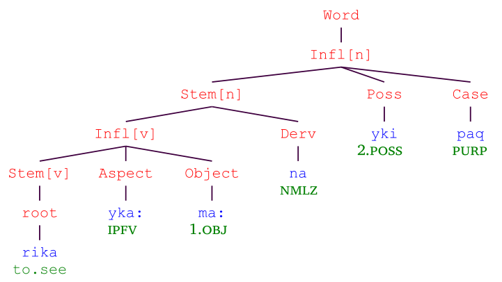

Figure 15. Huallaga Quechua Derivation Outside of Inflection. 

In figure 15 the Infl nodes represent inflected forms. Note how the derivational suffix ‑ _na_ changes the inflected verb into a noun stem (Stem[n]). This stem is then inflected. 

It turns out that while the Infl[n] node is a fully inflected noun, the Infl[v] is actually only a partially inflected verb: It lacks a required subject suffix. That is, a form such as _rikaykaamaa_ with the analysis of ‘see‑Ipgv‑1.obj’ is ill-formed. Thus, the verbal inflectional template given in table 10 is a special kind of template. It does not represent a fully inflected form. Rather, it requires that there be a derivational affix attached outside of the template in order for the word to be well-formed. When you have such templates, you will need to mark them as requiring additional derivation. The default situation is for the FieldWorks Language Explorer to assume that an inflectional template does not require additional derivation outside of the template. 

Table 10. Quechua Non-final Template (Schematic) 

**Stem Aspect Object** 

How does one handle such derivation outside of inflection in FieldWorks Language Explorer? One needs to perform the steps shown in figure 16. (See figures 1–2 for details on how to create templates.) 

_Derivation versus inflection_ 

31 

1. Add all the inflectional and derivational affix entries. 

2. Create the "inside" inflectional template and mark it specially as a template that requires additional derivation by checking the box after Requires more derivation. Please note that this template **must** have at least one slot that is required. If all of the slots are marked as being optional, the FieldWorks Language Explorer parser will arbitrarily treat them as if they are all required. The reason is that when all slots are optional, the implication is that the template is not needed. It also results in invalid instructions for the parser. 

3. Create the "outside" inflectional template. 

Figure 16. How to Create Derivation Outside of Inflection. 

#### 2.1.5 Derivation versus inflection

Determining if a given affix is derivational or inflectional can sometimes be quite a challenge. Arguably, the range from derivational to inflectional is a continuum and there are some affixes which seem to “float” somewhere in the middle. Nonetheless, there are recognized criteria one can use to try and help one figure out which kind a given affix might be. These are not hard and fast rules, however. Albert Bickford offers the following guidelines in helping one to decide (taken from Bickford 1998:139, including the note on productivity).29 

Table 11. Inflection vs. Derivation 

| Characteristic                         | Inflectional     | Derivational    |
|----------------------------------------|------------------|-----------------|
| Changes one lexical entry into another | no               | yes             |
| Changes syntactic category             | no               | often           |
| Productivity                           | virtually totala | partial at best |
| Organized in paradigms                 | yes              | no              |
| Distance from root                     | farther          | closer          |
| Type of meaning                        | grammatical      | usually lexical |
| Meaning predictable from parts         | usually yes      | often not       |
| Relevant to syntax                     | yes              | no              |

aAlthough some words may be inflected irregularly, they will almost always have some form for every position in the inflectional paradigm. On rare occasions, there may be words whose paradigms are defective, or missing certain forms, such as English troops soldiers,’ a noun which has only a plural form with no singular. 

> 29 Bickford (1998:138) uses the term “Conventionalized semantics” and explains this term as follows: 

In semantics, when the meaning of the whole is not fully predictable from the meaning of its parts, we say that the meaning is conventionalized. One characteristic of derivational morphology is that its meaning is often conventionalized, while the meaning of inflectional morphology is almost always fully predictable. 

Here in this table, I've chosen to use “meaning predictable from parts” instead in order to avoid a double negative. 

_Parsing Conceptual Introduction_ 

32 

Tom Payne also has some suggestions about characteristics of derivational affixes. The following quote is taken from T.Payne (1997:42): 

According to Bybee (1985) derivational operations tend to be more RELEVANT to the situation expressed in the root than do inflectional operations. Derivational operations consist primarily of the following: 

1. Operations that change the grammatical category of a root, e.g., denominalization (changing a noun into some other category) and nominalization (changing a form of any grammatical category into a noun…). 

2. Operations that change the valence (transitivity) of a verb root, e.g., detransitivization, causativization and desiderative… 

3. Operations which in other ways significantly change the basic concept expressed by the root, e.g., distributive, diminutive… 

Characteristics of derivational operations include: 

1. They are 'non-obligatory' insofar as they are employed in order to adjust the basic semantic content of roots and are not themselves determined by some other operation or element in the syntactic structure. 

2. They tend to be idiosyncratic and non-productive. 

3. They tend not to occur in well-defined paradigms. 

#### 2.1.6 Exception “features”

Even when one has correctly classified the affixes in a language as being derivational or inflectional, sometimes a morphological parser will find combinations of stem and affix that are simply incorrect. This may be due to historical or some other seemingly arbitrary reasons. 

For example, consider the following Orizaba Nahuatl data: 

| \(45\) | nitlakuika ni-tlakuika | tlakuikatl tlakuika-tl |
|--------|------------------------|------------------------|
|        | 1sg.sbj-sing           | sing-abs               |
|        | ‘I sing’               | ‘song’                 |
|        | kiavi                  | kiavitl                |
|        | kiavi                  | kiavi-tl               |
|        | rain                   | rain-abs               |
|        | ‘it rains’             | ‘rain’                 |

Notice that in this data, the “Absolutive” suffix (which normally goes on singular, unpossessed nouns) appears to derive a noun from a verb. When one models this, one may find that other nouns which have the absolutive suffix now analyze as derived nouns. For example, one might get these: 

_Exception “features”_ 

(46) komitl komitl kom-itl *kom-i-tl jug-abs *jug-drink-abs ‘jug’ kakavatl kakavatl kakava-tl *ka~kava-tl peanut-abs *int-leave-abs ‘peanut’ 

The FieldWorks Language Explorer parser allows one to rule out such incorrect combinations via what have sometimes been called exception “features.”30 The basic idea is to tag the affix with an exception “feature.” The only time the FieldWorks Language Explorer parser will then allow this affix to occur is when the stem to which it attaches also has been tagged with the same exception “feature.” Thus you can restrict the productivity of the affix to only occur on certain stems. Note that this is only possible for affixes which have been fully classified as either being derivational or inflectional. Exception “features” are not available for unclassified affixes. 

1. If necessary, create the exception “feature.” We recommend you give as meaningful a description as you are able. For example, if you happen to know that there are historical reasons for this situation, then go ahead and say what they are. 

   - a. Use Grammar / Exception “Features.” 

   - b. Use Insert menu item / Exception “Feature.” 

   - c. Enter name, abbreviation, and description. 

2. Tag the affix with that exception “feature.” 

   - a. Use Lexicon / Lexicon Edit. 

   - b. To see the From Exception “Features” field, you may have to check the Show Hidden Fields box. 

   - c. Click in the From Exception “Features” field under Grammatical Info. Details. 

   - d. Click on the chooser button. 

   - e. In the ensuing dialog box, check the box for each appropriate exception “feature.” 

3. For each root or stem to which the affix may attach, tag the root or stem with the exception “feature.” 

   - a. Use Lexicon / Lexicon Edit. 

   - b. To see the Exception “Features” field, you may have to check the Show Hidden Fields box. 

   - c. Click in the Exception “Features” field under Grammatical Info. Details. 

   - d. Click on the chooser button. 

   - e. In the ensuing dialog box, check the box for each appropriate exception “feature.” 

Figure 17. How to Create and Use Exception “Features.” 

If a given affix has two or more exception “features,” then the stem to which it attaches must be tagged with all of the exception “features” that the affix has. Note that if an affix does not have any exception 

> 30 The way we have implemented these in FieldWorks Language Explorer is to create a separate list for these objects. Technically, these are not true features. Internally, we are calling these “productivity restrictions” because they restrict the productivity of an affix. Another way of looking at them is as restricting the distribution of an affix. 

_Parsing Conceptual Introduction_ 

34 

“features” but the stem to which it is being attached does have one or more exception “features,” then the affix will still be allowed to attach (as far as the exception “features” are concerned). To tag affixes and stems with exception “features,” follow what is in figure 17 above. 

### 2.2 Stem compounding

This section relates to the compounding of two or more stems within a single orthographic word.31 There are two basic kinds of compounds: headed compounds (section 2.2.1) and non-headed compounds (section 2.2.2). We also discuss issues relating to incorporation (section 2.2.3), issues relating to compounding when stems contain affixes (section 2.2.4), issues relating to the organization of categories (section 2.2.5), and issues relating to controlling the productivity of compound rules (section 2.2.6). 

#### 2.2.1 Headed compounds

Consider the following Orizaba Nahuatl data:32 

| \(47\) | adjective | noun | Compound |
|----|----|----|----|
|  | tliltik tlil-tik black-adj | kowatl kowa-tl snake-abs | tlilkowatl tlil-kowa-tl black-snake-abs ‘black snake’ |
|  | weyi weyi | atl a-tl | weyatl wey-a-tl |
|  | big | water-abs | big-water-abs ‘river’ |
|  | weyi weyi | ohtli oh-tli | wéyohtli wéy-oh-tli |
|  | big | road-abs | big-road-abs ‘highway’ |

What are the categories of the two members of the compound? The left one is an adjective and the right one is a noun. What is the category of the compound? It is a noun. Thus the examples in (47) show an adjective compounding with a noun where the result is the right member of the compound. Thus, we can say that the “head” of the compound is the right member of the compound. 

Now consider the following Orizaba Nahuatl data: 

(48) a. tlaxkálsolli tlaxkál-sol-li tortilla-old-abs ‘tortilla from the day before’ 

- b. nomahppagebrilweyi no-mah-pil-weyi 1sg.poss-hand-projection-big ‘my thumb’ 

> 31 Compounds involving more than one orthographic word (e.g., _student film society_ ) are not dealt with here since they are properly outside the realm of morphology. 

> 32 The data are taken from Tuggy (1991:76-77). 

_Non-headed compounds_ 

35 

In (48) the left member is a noun and the rightmost member is an adjective. Like in (47), the result is a noun. Thus the “head” of the compound is the left member in the cases in (48). 

Both of these are instances of headed compounds. Either the left or the right member of the compound is the head of the compound. That is, the category of the resulting compound is the same as either the left or the right member of the compound. 

How do we model these kinds of rules for FieldWorks Language Explorer? See the steps in figure 18. 

1. Create a headed compound rule. 

   - a. Use Grammar / Compound Rules. 

   - b. Use Insert menu item / Headed Compound. 

   - c. Enter its name and description. 

2. Indicate what the left member's category is by clicking on the drop-down box and choosing the category. 

3. Indicate what the right member's category is by clicking on the drop-down box and choosing the category. 

4. Indicate whether the resulting compound is left-headed or right-headed by checking the Right Headed check box if it is right-headed; leave the box unchecked if it is left-headed. 

Figure 18. How to Create a Headed Compound Rule. 

#### 2.2.2 Non-headed compounds

Now consider the following Spanish data: 

| \(49\) | Word | Meaning | Source |
|----|----|----|----|
|  | paracaidas | parachute (m; ambiguous for number) | from the third person singular present indicative verb para ‘stops’ and the feminine plural noun caidas ‘falls’ |
|  | sacamuelas | dentist (m or f; singular) | from the third person singular present indicative verb saca ‘removes’ and the feminine plural noun muelas ‘teeth’ |

Which member of the compound is the head? Clearly it is not the left member since the resulting compound in both cases is a noun and the left member is a verb. But is the head really the right member of the compound? While the right member is a noun, this noun is not inflected for the correct gender and/or number. Thus, these examples show the need for the other kind of compound rule: non-headed compounds. In non-headed compounds, the category and/or agreement features of the resulting stem are not merely the same as the head. Instead, the new stem may be something different. 

To model this in FieldWorks Language Explorer, we do what is shown in figure 19. 

_Parsing Conceptual Introduction_ 

36 

1. Create a non-headed compound rule. 

   - a. Use Grammar / Compound Rules. 

   - b. Use Insert menu item / Non-headed Compound. 

   - c. Enter its name and description. 

2. Indicate what the left member's category is by clicking on the drop-down box and choosing the category. 

3. Indicate what the right member's category is by clicking on the drop-down box and choosing the category. 

4. Indicate what the category of the resulting compound is by clicking on the drop-down box and choosing the category. 

5. If the language you are modeling has inflection classes (see section 2.1.2.6) and the resulting category has inflection classes, then also indicate the inflection class of the resulting category. a. Click in the Inflection Class field. 

   - b. Click on the chooser button. 

   - c. In the ensuing dialog box, select the inflection class. 

Figure 19. How to Create a Non-headed Compound Rule. 

#### 2.2.3 Incorporation

Some languages allow the incorporation of lexical roots within the stem. The resulting stem may or may not differ from the non-incorporated stem in terms of category and/or features. This means that if the language you are modeling has incorporation, you will need to consider whether to use a headed or a non-headed compound rule for it. 

#### _2.2.3.1 Incorporation as a simple headed compound_

Consider the following Yalálag Zapotec data:33 

(50) a. sejpe' s-ej-pe' s-go-3fam ‘He left.’ 

- b. sejtope' s-ej- **to** -pe' s-go- **rapidly** -3fam ‘He left quickly.’ 

(51) a. chpipe' ch-pip-e' prs-bite-3resp ‘He bites.’ 

> 33 The data are from López y Newberg (1990). The orthography used here is slightly different from what is used in López y Newberg (1990). In particular, fortis consonants are preceded by a colon ( _:_ ). Lenis consonants are not (and use the voiceless equivalent instead of the voiced one). 

_Incorporation as a headed compound with override_ 

- b. chpip:cha:che' ch-pip- **:cha:ch** -e' prs-bite- **repeatedly** -3resp ‘He bites repeatedly.’ 

At least under one analysis, in (50b) the adverb _to_ is incorporated onto the verb _ej_ . In (51b), a different adverb, _:cha:ch_ , is incorporated. 

Notice that the resulting stem appears to have all of the characteristics of the verbal stem which is the left member of the compound as indicated by (50a) and (51a). Therefore, this kind of data can be modeled as a left-headed compound rule. 

#### _2.2.3.2 Incorporation as a headed compound with override_

Now consider the following Orizaba Nahuatl data:34 

| \(52\) | a\. | pahtli pah-tli           | \(53\) | a\. | nakatl naka-tl      |
|--------|-----|--------------------------|--------|-----|---------------------|
|        |     | medicine-abs             |        |     | meat-Abs            |
|        |     | ‘medicine’               |        |     | ‘‘meat’’            |
|        | b\. | niktolova                |        | b\. | nikkua              |
|        |     | ni-k-tolova              |        |     | ni-k-kua            |
|        |     | 1sg.sbj-3.obj-swallow    |        |     | 1SgSubj-3Obj-to.eat |
|        |     | ‘I swallow it’           |        |     | ‘‘I eat it’’        |
|        | c\. | nipahtolova              |        | c\. | ninakakua           |
|        |     | ni-pah-tolova            |        |     | ni-naka-kua         |
|        |     | 1sg.sbj-medicine-swallow |        |     | 1SgSubj-meat-to.eat |
|        |     | ‘I medicine-swallow’     |        |     | ‘‘I meat-eat’’      |

What is happening here? Notice how the nouns in (52a) and (53a) replace the ‘3.obj’ marker in (52b) and (53b) to produce the forms in (52c) and (53c). In particular notice that the resulting stem no longer requires a transitive verb inflectional template, but rather an intransitive verb one. We can say that this is because the noun has been incorporated as the object and the result is an intransitive stem. We can model this in FieldWorks Language Explorer as a headed compound, but override the category of the head stem. We could diagram it something like this (where “[vt]” means a transitive verb stem and “[vi]” means an intransitive verb stem): 

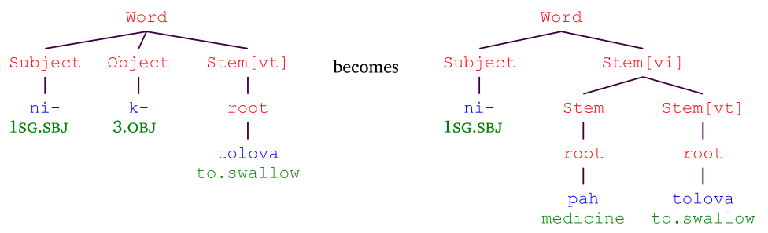

Figure 20. Orizaba Nahuatl Incorporation. 

> 34 Data are from Tuggy (1991:77-8). 

_Parsing Conceptual Introduction_ 

38 

That is, we create a right-headed compound rule and set the “Overriding category” in the rule to be an intransitive verb. The rule will use all the characteristics of the head stem except for the category. It will override the category of the head stem with the specified “Overriding category”. 

#### 2.2.4 Affixes between roots in compounds

Consider the Wanca Quechua [qvw] form given in (54) below:35 

- (54) wasin-wasin 

wasi-n=wasi-n house-3.poss=house-3.poss ‘from house to house’ 

Here we have a (reduplicated) compound consisting of a root, a suffix, the same root, and the same suffix. This forms a compound as shown in figure 21: 

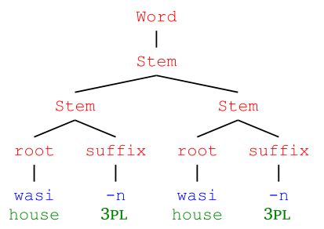

Figure 21. Wanca Quechua with Interfix. 

In FieldWorks Language Explorer, we must treat suffixes like ‑ _n_ in a special way. Affixes which can appear between roots in compounds we call “interfixes.” In order to tell the FieldWorks Language Explorer parser that a suffix like ‑ _n_ can appear in compounds like it does in (54), we must give it a morpheme type of “suffixing interfix.” This tells the FieldWorks Language Explorer parser that this suffix can appear either as a “regular” suffix (merely after a root) or as a suffix before another root in a compound. Note that it is the leftmost instance of ‑ _n_ that is crucial here. There are three varieties of interfixes as shown in table 12. 

Table 12. Types of Interfixes 

**Type Description** infixing interfix An infixing interfix is an infix that can occur between two roots or stems. prefixing interfix A prefixing interfix is a prefix that can occur between two roots or stems. suffixing interfix A suffixing interfix is an suffix that can occur between two roots or stems. 

If the language you are modeling has these kinds of compounds and you want the parser to analyze them via a compound rule, then you will need to mark any affixes which can appear between roots with these special morpheme types. 

> 35 The data are from Rick Floyd, personal communication 

_Restricting the productivity of a compound rule_ 

39 

#### 2.2.5 Compound rules and categories considerations

As we noted in sections 2.1.2.5, 2.1.2.6.2 and 2.1.3.6 above, the categories in FieldWorks Language Explorer are organized in a hierarchical fashion. 

The exact hierarchy one uses can make a difference for how the FieldWorks Language Explorer parser handles the categories in compound rules. When one indicates the information for a left or right member of a compound, FieldWorks Language Explorer will consider stems of this category and **any of its nested categories** to match. For example, if the main level verb category has two sub-categories of intransitive verb and transitive verb, then if a verb stem, an intransitive verb stem, or a transitive verb stem may be the left member, say, of a compound, you only need to say that the left member must be of category verb. The FieldWorks Language Explorer parser will allow the left member to be a verb stem, an intransitive verb stem, or a transitive verb stem. You can thus capture a generalization. 

You may well need to keep this in mind as you design your category hierarchy. 

#### 2.2.6 Restricting the productivity of a compound rule

Sometimes merely specifying the categories of the left and right members of a compound opens the door for many unwanted parses. For example, consider the following data from Ket [ket].36 

The nominal compound in example (55) is licit as are many other nominal compounds. 

(55) ís al īs āl fish soup noun noun ‘fish soup’ 

There are cases, however, where a nominal compound is given as a parse when it is not licit. For example, the word _áses_ could give the three parses shown in example (56). 

(56) a. áses áses what.kind adjective ‘what kind’ b. ā sēs a sēs̄ heat river noun noun ‘*’ c. ā seˀs a seˀs̄ heat larch noun noun ‘*’ 

Only the first one is a valid analysis. What can one do in such a situation? 

> 36 The Ket data are from a personal email from Alexandre Arkhipov dated June 4, 2025. 

_Parsing Conceptual Introduction_ 

40 

One solution is to use what we call exception “features” (see section 2.1.6). The idea is to require that a stem filling the left and/or right member of a compound rule must not only need to be of a specified category, but must also have at least one of any of these exception “features”37 associated with that member. For example, to deal with the situation in examples (55–56), we follow the steps outlined in figure 22. We might create an exception “feature” called “Right-headed nominal compound” and then tag the right member of the nominal compound rule to require this exception “feature.” We then set the _āl_ ‘soup’ stem to have this exception “feature.” When the FieldWorks Language Explorer parser tries the nominal compound rule with the _īs_ ‘fish’ stem on the left and the _āl_ ‘soup’ stem on the right, the compound will succeed. The compounds in (56b–c), however, will fail because neither _sēs̄_ ‘river’ nor _seˀs̄_ ‘larch’ have this exception “feature.” 

To reiterate: a member of a given compound rule can have more than one exception “feature” associated with it. When the FieldWorks Language Explorer parser tries a given stem in that member's position of the compound rule, that stem must have at least one of those exception “features” for the rule to successfully apply. The stem does not have to have all of the exception “features,” just one. 

1. If necessary, create the exception “feature.” We recommend you give as meaningful a description as you are able. 

   - a. Use Grammar / Exception “Features.” 

   - b. Use Insert menu item / Exception “Feature.” 

   - c. Enter name, abbreviation, and description. 

2. Tag the compound rule member with that exception “feature.” 

   - a. Use Grammar / Compound Rules. 

   - b. To see the Exception “Features” fields, you may have to check the Show Hidden Fields box. c. Click in the Exception “Features” field. 

   - d. Click on the chooser button. 

   - e. In the ensuing dialog box, check the box for each appropriate exception “feature.” 

3. For each root or stem that can be a part of this compound rule, tag the root or stem with the exception “feature.” 

   - a. Use Lexicon / Lexicon Edit. 

   - b. To see the Exception “Features” field, you may have to check the Show Hidden Fields box. 

   - c. Click in the Exception “Features” field under Grammatical Info. Details. 

   - d. Click on the chooser button. 

   - e. In the ensuing dialog box, check the box for each appropriate exception “feature.” 

Figure 22. How to Create and Use Exception “Features” in Compound Rules 

### 2.3 Clitics

We turn now to consider clitics. Consider the Shipibo [shp] data below38 and notice the ‑ _ra_ morpheme. Where does it occur and on what kinds of words does it appear? 

> 37 The way we have implemented these in FieldWorks Language Explorer is to create a separate list for these objects. Technically, these are not true features. Internally, we are calling these “productivity restrictions” because they restrict the productivity of a compound rule. 

> 38 Data are from Black (1992). 

_Clitics_ 

(57) Enra binon beque. e-n- **ra** binon be-que 1sg-erg- **ind** aguaje bring-compl ‘I brought aguajes.’ 

(58) Binonra en beque. binon- **ra** e-n be-que aguaje- **ind** 1sg-erg bring-compl ‘Aguajes I brought.’ 

In both (57) and (58), the indicative ‑ _ra_ morpheme appears at the end of the first word. In (57) it attaches to a subject and in (58) it attaches to the object. This morpheme can also attach to other categories as the following examples demonstrate: 

(59) Yahuish rabecanra pique. yahuish rabe-can- **ra** pi-que armadillo two-erg- **ind** eat-compl ‘The two armadillos have eaten.’ 

(60) Nii meranra ea catanhuanque. nii meran- **ra** ea ca-tan-huan-que forest in- **ind** 1sg go-reg-rctpst-compl 

‘I went into the forest today (and have come back).’ 

(61) Caquinra en pique. ca-quin- **ra** e-n pi-que go-siml.t.ss- **ind** 1sg-erg eat-compl ‘When I came, I ate.’ (62) Ramabira en janquenhati shinanai. rama-bi- **ra** e-n janquenha-ti shinan-ai now-emph- **ind** 1sg-erg think-cont finish-inf ‘Now I'm thinking of finishing it.’ 

The ‑ _ra_ morpheme attaches to an adjective in (59), a postposition in (60), a verb in (61), and an adverb in (62). Notice that it actually appears at the end of the first constituent (a noun phrase in (59) and a postposition phrase in (60)). 

Morphemes like this are often analyzed as being clitics. Orthographically, such clitics may be written attached to another word (like in Shipibo) or they may be written independently. In my experience, orthographic conventions vary on this point. If the clitic is written as attached, then it should be classified as a proclitic if it “prefixes” and as an enclitic if it “suffixes.” If the clitic is written as an independent word, then one may classify it as a clitic. Some orthographic conventions are such that what the analyst considers to be a proclitic or enclitic is also written as an independent word. In such cases, one may still give these a morpheme type of proclitic or enclitic. The FieldWorks Language Explorer parser will correctly handle a clitic that is labeled as being either a proclitic or enclitic whether it is written attached or as a separate word. 

How do we model such clitics in FieldWorks Language Explorer? See figure 23. 

FieldWorks Language Explorer will do the rest: such morphemes will be allowed to appear at the end (for enclitics which attach) or at the beginning (for proclitics which attach) of words. More than one clitic may appear on a single word. There is no ordering restriction between sequences of attached clitics (other than ad hoc rules; see sections 2.4 and 3.10). 

_Parsing Conceptual Introduction_ 

42 

1. Create the clitic lexical entry and mark it as being a clitic, proclitic or enclitic as appropriate. 

2. Give it the category that is appropriate for the clitic itself. 

3. If the clitic is written attached and can go on only certain sets of categories, then enter these sets of categories in the Attaches to Categories field under the Grammatical Info. Details section. As with other items that refer to categories, FieldWorks Language Explorer will allow such clitics to attach to any word whose category or sub-category is in one of the sets listed in this field. That is, the category hierarchy is taken into account. Thus, if the clitic can attach to any kind of verb, you can just list the top verb category and FieldWorks Language Explorer will allow the clitic to attach to any of the sub-categories of verb. 

4. If the clitic is written attached and can go on any category, merely leave the Attaches to Categories field blank. 

#### Figure 23. How to Create a Clitic.

A final note: if your orthographic convention permits several clitics to be written together as a single word (where every morpheme in that orthographic word is a clitic of some kind), then only one of the clitics may be marked as clitic. The others must be marked as proclitic or enclitic and these must be in the proper order (proclitics before the clitic and enclitics after the clitic). 

### 2.4 Ad hoc morpheme-oriented rules

When one uses a morphological parser, it is not unusual for the parser to sometimes return a parse that is simply incorrect. These are sometimes due to allomorphs matching in places one would not have expected them to match. When one has used all the mechanisms provided by the parser to the best of one's ability and such incorrect parses continue to surface, one may well wish for some kind of mechanism to rule them out. FieldWorks Language Explorer provides “Ad hoc Rules” for such situations. 

#### 2.4.1 Creating morpheme-oriented ad hoc rules

There are two main types of ad hoc rules: morpheme-oriented ones and allomorph-oriented ones. This section deals with morpheme-oriented ones (see section 3.10 for allomorph-oriented ones). The basic idea is to list a key morpheme and then to list one or more other morphemes that cannot co-occur with the key one. One can constrain these other morphemes to never occur in one of the following ways with respect to the key morpheme:39 

Note that when there are two or more morphemes listed for “other morphemes,” the rule only applies when all of them co-occur in the same word with the key morpheme. In addition, their relative order is significant. They should be listed in the same linear order they occur in a word. 

> 39 One approach to this is to strive to make the tightest constraint possible (i.e., use one of the adjacency ways first if possible; if not, then try the somewhere case; if that does not work, then try the anywhere case). That way, should you encounter another case involving these particular morphemes, then you will know more: it is now clear that you need looser constraints. You can then add some comments/annotations to document what you have learned (or put the information in the description). 

_Grouping ad hoc morpheme rules_ 

43 

Table 13. Morpheme Ad-hoc Rule 

| Manner | Meaning |
|----|----|
| Anywhere | The morphemes in question are constrained from appearing anywhere together in the same word. |
| Somewhere before | The key morpheme is constrained from appearing anywhere in the word before the other morphemes. |
| Somewhere after | The key morpheme is constrained from appearing anywhere in the word after the other morphemes. |
| Adjacent before | The key morpheme is constrained from appearing immediately before the other morphemes in the same word. |
| Adjacent after | The key morpheme is constrained from appearing immediately after the other morphemes in the same word. |

How does one create a morpheme-oriented ad hoc rule in FieldWorks Language Explorer? See figure 24 below. 

#### 2.4.2 Grouping ad hoc morpheme rules

Occasionally one finds a situation where a set of ad hoc constraints have a common theme. Perhaps they all relate to a particular morpheme or to particular morphemes of a certain variety. This may be a hint as to what is really happening and may lead you to discover a linguistically-motivated way to model them. Or it could be that the FieldWorks Language Explorer model just does not happen to provide the appropriate linguistic mechanism to model the phenomenon correctly. 

1. Determine the morphemes involved. 

2. Determine the most appropriate way to constrain them (see table 13). 

3. Create a morpheme-oriented ad hoc rule. 

   - a. Use Grammar / Ad hoc Rules. 

   - b. Use Insert menu item / Rule to prevent morpheme co-occurrence. 

   - c. Indicate the key morpheme involved. 

      - i. Click in the Key Morpheme field. 

      - ii. Click on the chooser button. 

      - iii. In the ensuing dialog box, key the form of the morpheme in the Find box. iv. Select the correct one in the middle pane. 

      - v. Check the Grammatical Info. drop-down box to make sure this is the one you want. 

   - d. Indicate the way or manner in which to constrain this morpheme (see table 13) by using the drop-down box in the Cannot Occur field. 

   - e. Indicate the non-key (i.e., other) morpheme(s) involved. 

      - i. Click in the Other Morpheme(s) field. 

      - ii. Click on the chooser button. 

iii. In the ensuing dialog box, key the form of the morpheme in the Find box. 

- iv. Select the correct one in the middle pane. 

- v. Check the Grammatical Info. drop-down box to make sure this is the one you want. 

- vi. Repeat the above steps for any other morphemes needed. 

Figure 24. How to Create a Morpheme-oriented Ad Hoc Rule. 

_Parsing Conceptual Introduction_ 

44 

Yalálag Zapotec dependent pronominal suffixes exemplify such a situation (see López y Newberg 1990:9). In Yalálag Zapotec, a verb may have both a subject and an object person suffix on it. Being a vso language, the subject occurs before the object. What is different here is that there is a pronominal hierarchy among these dependent pronominal suffixes. Given the subject suffix, the only dependent object suffixes which may follow are those that are lower down on the person hierarchy. This is illustrated in table 14. 

Table 14. Yalálag Zapotec Subject and Object Dependent Suffix Co-occurrence 

|  |  | 1st, 2nd | 3rd respect | OBJECT 3rd familiar | 3rd animate | 3rd thing |
|----|----|----|----|----|----|----|
| S | 1st, 2nd | No | YES | YES | YES | YES |
| U B | 3rd respect | No | No | YES | YES | YES |
| J | 3rd familiar | No | No | No | YES | YES |
| E C | 3rd animate | No | No | No | No | YES |
| T | 3rd thing | No | No | No | No | No |

How would one model such a hierarchy in FieldWorks Language Explorer? Well, one could create a number of different transitive verb inflectional templates in order to force the hierarchy to come out. But this does not really capture the facts all that well and also complicates and obscures what is common in the transitive verb template. (By the way, neither the subject nor the object is required to be filled by a suffix.) Probably the better approach is to create a morpheme ad hoc rule group and place the set of appropriate ad hoc rules for the hierarchy in that group. This way one can document the fact of the hierarchy and have it all in one place. It also documents the fact that the FieldWorks Language Explorer model does not have an overt mechanism to deal with such a hierarchy. 

How does one create such a group? See figure 25. 

1. Create an ad hoc rule group. 

   - a. Use Grammar / Ad hoc Rules. 

   - b. Use Insert menu item / Group of ad hoc rules. 

2. For each ad hoc morpheme rule in the group: 

   - a. Create the ad hoc morpheme rule (see figure 24) and include it in the group. 

#### Figure 25. How to Create a Group of Morpheme-oriented Ad Hoc Rules.

Finally, note that FieldWorks Language Explorer allows one to group both allomorph and morpheme ad hoc rules together. Please be sure to only do so if these rules truly do have something in common. 

## 3 Morphophonemics

Besides constraining the overall positions where morphemes can occur (i.e., deal with morphotactics), we need to be able to account for the surface forms that the morphemes have and the particular environments where an allomorph is legitimate. 

_Phoneme sets_ 

45 

### 3.1 Overview

Consider the following Orizaba Nahuatl data: 

| \(63\) | 1st Singular Subject | 2nd Singular Subject |
|--------|----------------------|----------------------|
|        | ni-miki              | ti-miki              |
|        | 1sg.sbj-die          | 2sg.sbj-die          |
|        | n-ahsi               | t-ahsi               |
|        | 1sg.sbj-arrive       | 2sg.sbj-arrive       |

What are the shapes of the ‘1sg.sbj’ and the ‘2sg.sbj’ allomorphs? The first person singular subject marker appears to be _ni_ ‑ before consonants and _n_ ‑ before vowels. Similarly, the second person singular subject marker alternates between _ti_ ‑ and _t_ ‑. 

How can we encode this information? There are at least two ways to deal with such phonological information: 

1. Give the underlying form along with a set of rules to create the surface forms; or 

2. List the surface allomorphs and condition each one to appear in the appropriate surface environment. 

Generative phonology uses the first approach (also known as the item and process approach, Hockett 1954). For example, given the data in (63), one might consider the underlying forms of the two subject prefixes would be _ni_ and _ti_ , respectively. We would then write a phonological rule to delete the first vowel when it is followed by a second vowel. 

The default parser of FieldWorks Language Explorer, however, chooses the second approach (also known as the item and arrangement approach, Hockett 1954). For example, once again considering the data in (63), we would need two forms for each subject prefix entry. We could make the Lexical Form be the longer one ( _ni_ and _ti_ , respectively) and have an allomorph for the shorter one ( _n_ and _t_ , respectively) that would be conditioned to have an environment saying that it must be followed by a vowel. 

As noted in section 1, we now also have the phonological rule-based parser which allows for both item and arrangement and item and process. See section 6 for more. 

For the default parser of FieldWorks Language Explorer, the basic mechanism available is to list surface allomorphs and then have the option to constrain individual surface allomorphs by their environment. To define an environment, one may well want to use natural classes of segments (e.g., consonant, vowels, voiceless stops, nasals, etc.). To define such natural classes, we need to know what the possible segments are. 

#### 3.1.1 Phoneme sets

In order to use environments which refer to phonemes or which have natural classes, you need to create a list of all the phonemes in your language. For each phoneme, you need to indicate one or more representations that represent them. For example, in Greek, the /s/ phoneme has two such representations: ς (which is used word finally) and σ (which is used everywhere else). 

In addition to these phonemes, you may also need to refer to word boundaries in an environment. For this reason, FieldWorks Language Explorer comes with a predefined word boundary marker: the # symbol. 

FieldWorks Language Explorer also comes with a potential set of phonemes already defined. That is, you do not need to start from scratch when building the list of phonemes for your language. However, you may well need to edit the list of phonemes initially included for a new language project. This initial set of phonemes is given in (64) below. 

_Parsing Conceptual Introduction_ 

46 

| \(64\) | Name | Description                     | Grapheme |
|--------|------|---------------------------------|----------|
|        | i    | high front unrounded vowel      | i        |
|        | e    | mid front unrounded vowel       | e        |
|        | a    | low central unrounded vowel     | a        |
|        | o    | mid back rounded vowel          | o        |
|        | u    | high back rounded vowel         | u        |
|        | p    | voiceless bilabial stop         | p        |
|        | b    | voiced bilabial stop            | b        |
|        | t    | voiceless alveolar stop         | t        |
|        | d    | voiced alveolar stop            | d        |
|        | k    | voiceless velar stop            | k        |
|        | g    | voiced velar stop               | g        |
|        | f    | voiceless labiodental fricative | f        |
|        | v    | voiced labiodental fricative    | v        |
|        | s    | voiceless alveolar fricative    | s        |
|        | z    | voiced alveolar fricative       | z        |
|        | x    | voiceless velar fricative       | x        |
|        | m    | bilabial nasal                  | m        |
|        | n    | alveolar nasal                  | n        |
|        | ŋ    | velar nasal                     | ŋ        |
|        | l    | alveolar lateral                | l        |
|        | r    | alveolar flap                   | r        |
|        | w    | labiovelar approximant          | w        |
|        | j    | palatal approximant             | j        |

To define the set of phonemes for the language you are modeling, do what is shown in figure 26. 

1. Determine the phonemes in your language. 

2. Use Grammar / Phonemes. 

3. Remove any phonemes that you do not need. a. Click on the phoneme in the middle pane. 

   - b. Use Edit menu item / Delete Phoneme.... 

4. For each phoneme not already present, 

   - a. Create a phoneme entry. 

      - i. Use Insert menu item / Phoneme. 

      - ii. Enter the basic symbol in the Refer to as field. 

      - iii. Enter the description. 

      - iv. Optionally, enter the IPA symbol. 

   - b. For each symbol or sequence of symbols that represent that phoneme, create a grapheme. i. Click on In Orthography as. 

ii. Click on Insert Grapheme. 

iii. Key the grapheme. 

5. For each phoneme in the list given in (64), 

   - a. Edit the name (or “Refer to as”), description, and graphemes if need be. 

   - b. Add any new graphemes needed. 

Figure 26. How to Create Phonemes. 

_No forms conditioned by tone_ 

47 

#### _3.1.1.1 Phonological features_

The default FieldWorks Language Explorer parser does not use phonological features, but the phonological rule-based parser does. This section mentions how to create phonological features and associate them with phonemes in case you wish to use the phonological rule-based parser. 

To create the set of phonological features, follow the steps in figure 27. 

1. Use Grammar / Phonological Features. 

2. Use Insert menu item / Phonological Feature. 

3. In the ensuing dialog box, check all features that you need. 

4. If the dialog box does not have a feature you need, click on the The phonological feature I need is not shown in the Catalog. Create a custom phonological feature. 

   - a. Enter the name, abbreviation, and description of the phonological feature. 

   - b. Edit the values if they are not correct. You can add a new value by clicking on Values and then clicking on Insert Feature Value. 

Figure 27. How to Create Phonological Features. 

Once you have created your phonological features, you can associate them with individual phonemes. See figure 28. 

1. Click in the Phonological Features field. 

2. Click on the chooser button. 

3. In the ensuing dialog box, select the value needed for each phonological feature. 

Figure 28. How to Associate Phonological Features with a Phoneme. 

#### _3.1.1.2 Digraphs_

If you have orthographic digraphs (or trigraphs) as phonemes, you follow the same basic steps outlined in figure 26 steps 3 and 4. Merely use the appropriate digraph for the phoneme and also use the digraph as the grapheme. For example, if you have an aspirated voiceless alveolar stop written as th, then use _th_ for the information. 

#### _3.1.1.3 Tones_

While many languages have tones, not all mark the tone in the practical orthography. If the language you are modeling includes tone symbols marked on vowels as accents, say, then you need to decide which of several ways to go in indicating tone. 

#### 3.1.1.3.1 No forms conditioned by tone

This is the simplest case where no forms are ever conditioned by surrounding tone. For example, it is never the case that you have an affix which must be preceded or followed by a high tone (or low tone). Because of this, you never need to write an environment that refers to tone, only to natural classes of segments. 

_Parsing Conceptual Introduction_ 

48 

If this is the situation you have, then for each vowel that bears tone, add a distinct representation for how that vowel with tone is written. For example, when the vowel _a_ has high tone, it is written as _á_ , then you need to add _á_ to the list of graphemes for the vowel _a_ . 

#### 3.1.1.3.2 Forms conditioned by tone

The second situation is more complicated. This is where there are forms in your language that must be conditioned by surrounding tone. For example, suppose there is an affix form which is licit only if it is preceded or followed by a particular tone (high, say). This means that you will need to be able to write an environment that contains all phonemes that bear high tone. To do this, there are two options. The first option is to have distinct phonemes for each high toned vowel, say. If this is your case, then you need to make distinct phonemes for each vowel that bears different tones. For example, if a low tone _a_ is written as _a_ while a high tone _a_ is written as _á_ , then you will need two phonemes: one for the low toned _a_ and one for the high toned _a_ . You can then create a natural class that contains all high-toned phonemes and write your environment in terms of this natural class. 

The second option is to create phonemes that consist merely of the tone diacritic itself. Since FieldWorks Language Explorer always processes its data in “decomposed” form (nfd), any accent marks or other diacritics will be stored after the main symbol. Thus, á is stored as two characters aˊ, the /a/ and then the acute accent. Taking advantage of this, you could create a phoneme that is for the acute accent _ˊ_ and call it something like “High tone.” You could then condition the forms to occur only when followed by this acute accent phoneme. 

#### 3.1.2 Natural classes

Once you have the phonemes defined, then you can create natural classes of phonemes. Some common ones include such things as consonants, vowels, voiceless stops, back vowels, etc. To do this in FieldWorks Language Explorer do what is shown in figure 29. 

1. Determine the natural classes you need. 

2. Use Grammar / Natural Classes. 

3. If any of the phonemes in any of these natural classes are not already in your list of phonemes, add them to the list of phonemes. See figure 26. 

4. Create any other natural classes you need. 

   - a. Use Insert menu item / Natural Class (Phonemes). 

   - b. Enter a name, abbreviation, and description. 

   - c. Click in the Phonemes field. 

   - d. Click on the chooser button. 

   - e. In the ensuing dialog box, check every phoneme that is a part of this natural class. 

#### Figure 29. How to Create Natural Classes.

We highly recommend that you seek to give unique abbreviations for these. While it is possible to have two or more natural classes with abbreviations spelled exactly the same way, we do not recommend that you do so on purpose. Having two or more natural classes with the same abbreviation will not confuse FieldWorks Language Explorer because FieldWorks Language Explorer uniquely identifies every natural class internally. That does not imply, however, that either you or a reader of your grammar will not be confused as a result. 

_Allomorph environments_ 

49 

#### 3.1.3 Allomorph environments

Once the set of phonemes and natural classes are defined for the language you are modeling, you can define environments for allomorphs. You can add them either in the environments editor or with a given lexeme form or allomorph. To use the environments editor, use Grammar / Environments. To add an environment within a lexeme form or allomorph, click in the Environments field. (To see the Environments field, you may have to check the Show Hidden Fields box.) See the help files in FieldWorks Language Explorer for more. 

In FieldWorks Language Explorer, you key these environments using a special notation. This notation is one that is reminiscent of what is used in many generative-style rules. The basic rules of thumb are given in figure 30. 

1. Begin each environment with the forward slash character /. 

2. The location of the allomorph itself is indicated by an underscore character _. 

3. Any phonemes or natural classes that must come before the allomorph are typed in before this underscore character. Type them in the order in which they must appear. 

4. Any phonemes or natural classes that must come after the allomorph are typed in after this underscore character. Type them in the order in which they must appear. 

5. Any phoneme is indicated by typing in the representation/grapheme of the phoneme. 

6. Any natural classes are indicated by 

   - a. typing a left square bracket [, 

   - b. typing the abbreviation of the natural class,_a_ and 

   - c. then typing a right square bracket ]. 

7. Optional phonemes or natural classes are indicated by 

   - a. typing an opening parenthesis (, 

   - b. typing the phoneme or natural class as above, and 

   - c. then typing a closing parenthesis ). 

   - d. Note that one should not nest optional items. The FieldWorks Language Explorer parser will not handle these properly. You must enter each optional item after the other. 

> _a_ This is another reason why you should use unique abbreviations for natural classes. If you have two or more natural classes with the same abbreviation, it is not clear which one you mean. FieldWorks Language Explorer will automatically select one, but it may not be the one you intended. 

Figure 30. How to Create Environments. 

Table 15 gives some sample environments along with what they mean. 

A given allomorph may have more than one environment, in which case the various environments are logically ORed with each other. That is, if any one of the environments for the allomorph are found, then the allomorph is considered to be valid (as far as its environments are concerned). For example, if a given allomorph can appear either before a consonant or word finally, then you can list both an environment for “before a consonant” and one for “before a word boundary.” Example (65) shows what this might look like, assuming that you have a natural class of consonants with an abbreviation of C. 

_Parsing Conceptual Introduction_ 

50 

Table 15. Sample Environments 

| Environment | Meaning |
|----|----|
| / m \_ | after an m phoneme |
| / \[V\] \_ | after a vowel (assuming there is a natural class of vowels called V) |
| / \# i \_ | after a word initial i phoneme |
| / \# \[V\] \_ | after a word initial vowel (assuming there is a natural class of vowels called V) |
| / \[V\] y \_ | after a vowel (assuming there is a natural class of vowels called V) and a y phoneme |
| / \_ i | before an i phoneme |
| / \_ \[C\] | before a consonant (assuming there is a natural class of consonants called C) |
| / \_ y \# | before a y phoneme which is word final |
| / \_ \[C\] \# | before a word final consonant (assuming there is a natural class of consonants called C) |
| / m \_ w | between an m and an w phoneme |
| / \[C\] \_ \[C\] | between two consonants (assuming there is a natural class of consonants called C) |
| / ai \_ | after an a and an i phoneme |
| / \_ ai | before an a and an i phoneme |
| / \_ (a)i | before an optional a and an i phoneme; that is, either before ai or before i |
| / \_ (\[C\]) \# | before an optional word final consonant (assuming there is a natural class of consonants called C); that is, either before a word final consonant or word finally |

#### (65) / _ [C] / _ #

Finally, if an affix entry has inflection classes as well as at least some allomorphs with environments, you should be careful to tag all allomorphs in the entry with the inflection class(es) they go on. Otherwise, some allomorphs without environments may be incorrectly constrained. 

#### 3.1.4 Allomorph ordering

It is crucial to note that allomorphs are ordered in the sense that their respective environments are disjunctively ordered. For example, for the Orizaba Nahuatl ‘1sg.sbj’ allomorphs above in example (63), we could list the two allomorphs in any of the ways shown in (66)-(69). 

| \(66\) | Overt 1 | \(67\) | Overt 2 | \(68\) | Implicit 1 | \(69\) | Implicit 2 |
|----|----|----|----|----|----|----|----|
|  | ni / \_ \[C\] |  | n / \_ \[V\] |  | ni / \_ \[C\] |  | n / \_ \[V\] |
|  | n / \_ \[V\] |  | ni / \_ \[C\] |  | n |  | ni |

Note in particular that for the two implicit methods, one does not have to overtly state the environment for the last allomorph. This is because each allomorph automatically inherits the negation of the environments of any preceding allomorphs. Thus, for the Implicit 1 method, the _n_ is automatically treated as having an environment of “not before a consonant.” Similarly, for the Implicit 2 method, the _ni_ is automatically treated as having an environment of “not before a vowel.” For more on this, see section 4.1.2. 

#### _3.1.4.1 Free fluctuation_

Sometimes a language has free fluctuation between two allomorphs of a morpheme. In such cases, one should create both allomorphs and condition them exactly the same way (in terms of environments and inflection classes). One should also order them one after the other. The FieldWorks Language Explorer default parser will try both forms in such cases. 

_Writing the pattern for full reduplication_ 

51 

### 3.2 Reduplication

In the next five sections, we will address five issues brought up in section 1.1. First, we deal with reduplication. 

#### 3.2.1 Full reduplication

Consider the following data from Bahasa Indonesia [ind]:40 

- (70) a. pel ‘mop’ b. pel-pel ‘mops’ 

- (71) a. buku ‘book’ 

   - b. buku-buku ‘books’ 

- (72) a. komik ‘clown’ 

   - b. komik-komik ‘clowns’ 

- (73) a. orang ‘person’ b. orang-orang ‘people’ 

- (74) a. perpustakaan ‘library’ b. perpustakaan-perpustakaan ‘libraries’ 

In examples (70)-(74) note that the entire word is reduplicated, no matter what its syllabic shape might be. This is what is often called _full reduplication_ .41 

In examples like (70)-(74), one cannot tell whether the reduplication morpheme is a prefix or a suffix. However, sometimes a stem will reduplicate and other affixes may be adjoined. For example, consider (75)‑(76): 

- (75) a. tangan ‘hand’ 

   - b. tangan-tangannya ‘his hands’ 

- (76) a. perpustakaan ‘library’ b. perpustakaan-perpustakaannya ‘his libraries’ 

Notice the ‑ _nya_ suffix which comes after the reduplicated stem. The way we are implementing full reduplication in the FieldWorks Language Explorer default parser, the root must be at one end and then any affixes (including the reduplication morpheme) must either be all prefixes or be all suffixes.42 Thus, in modeling examples (75)‑(76), we would make the reduplication morpheme be a suffix. 

#### _3.2.1.1 Writing the pattern for full reduplication_

How do we indicate full reduplication for the default parser of FieldWorks Language Explorer? See figure 31 below. (See section 6.1.1.1.1 for how to write an affix process rule for full reduplication using the phonological rule-based parser.) 

> 40 The data are from Howard Shelden, personal communication, and Jonathan Coombs, personal communication. 

> 41 It is also called _total reduplication_ and sometimes _general reduplication_ . 

> 42 There is a technical reason for this. The default parser matches the entire rest of the word (for a prefix) or the entire beginning of the word (for a suffix). It cannot match if there is additional material. This is not the case for the phonological rule-based parser. See section 6.1.1.1.1. 

_Parsing Conceptual Introduction_ 

52 

#### 3.2.2 Partial reduplication

As we saw in the Tagalog data from (9) from section 1.1.7, it is not always the case that the entire stem is reduplicated. The Tagalog data is repeated here. 

(77) a. susulat ‘to write (ipfv)’ (=9) b. magpasulat ‘to make someone write (pfv)’ c. magpapasulat ‘to make someone write (ipfv)’ 

Recall that we saw that this is a case where the imperfective aspect is realized by reduplicating the first CV syllable of the stem to which it attaches. (The _mag_ - prefix is what some call actor focus or actor voice.) 

1. Determine that the reduplication is indeed full reduplication. Note that if both prefixes and suffixes attach to a reduplicated sequence, then you will need to use partial reduplication (see section 3.2.2). 

2. Determine whether the reduplication morpheme is derivational or inflectional. 

3. Determine if the reduplication affix is a prefix or a suffix: 

   - a. If you do get either prefixes or suffixes (but not both) on a fully reduplicated stem, make the affix type be the same as the additional material. That is, if it can take additional prefixes, make the reduplicant morpheme also be a prefix. If it can take suffixes, make the reduplicant morpheme also be a suffix. 

   - b. If it is not clear, we suggest making it be a suffix (this will probably be more efficient for the parser). 

4. Create a lexical entry for the reduplication morpheme. 

   - a. Mark it as derivational or inflectional according to what you determined. 

   - b. Add a form which contains the special full reduplication sequence indicator: [...] (that's a left square bracket, three periods, and a right square bracket)_a_ in the lexeme form or an allomorph form. If there is constant segmental material that precedes or follows the reduplicated material, put that segmental material before or after the full reduplication pattern indicator. For example, for the Bahasa Indonesia data above, we would include a hyphen before the indicator._b_ 

   - c. Optionally label the morpheme using the Citation Form field (e.g., RDP- or CVC-). 

> _a_ This is the same notation as used in Shoebox and Toolbox. AMPLE uses <...>. _b_ Thus, it would be keyed as -[...] where we would put the hyphen before the indicator because the hyphen would be part of the suffix. You can put anything before or after the indicator. For example, if you used t[...]- and made it be a prefix, then this would match a full reduplication morpheme in a form such as _tabrak-menabrak_ ‘keep on running into,’ where we would model the _men_ as an infix and the _abrak_ would be the truncated allomorph of the stem _tabrak_ ‘collide.’ 

Figure 31. How to Create Full Reduplication via an Environment. 

Now consider the following Orizaba Nahuatl data:43 

> 43 Data are from Tuggy (1991:41). The hyphens are not part of the orthography but are included to clarify the relevant morphemes involved. 

_Writing the pattern for partial reduplication_ 

- (78) a. tone (the sun) shines 

   - b. toh-tone (the sun) burns 

- (79) a. chipin-tok it is dripping 

   - b. chih-chipin-tok it is dripping and dripping 

What is the reduplication pattern here? It is the initial CV of the stem followed by an _h_ . Thus we see that in this Nahuatl case of reduplication, there is not only the copied material, but also some fixed segmental material. 

The kind of reduplication illustrated in (77)-(79) above is often referred to as _partial reduplication_ . How do we model such partial reduplication for the default parser of FieldWorks Language Explorer? See figure 32. (See section 6.1.1.1.2 for how to write an affix process rule for partial reduplication using the phonological rule-based parser.) 

1. Determine whether the reduplication morpheme is derivational or inflectional. 

2. Determine what the reduplication pattern is (see section 3.2.2.1). 

3. Create any needed natural classes of segments that are in the pattern (see section 3.1.2). 

4. Create an environment that has the reduplication pattern either before or after the reduplication morpheme (depending, of course, on whether what is reduplicated comes after or before the “stem”). See section 3.1.3. 

5. Create a lexical entry for the reduplication morpheme. 

   - a. Mark it as derivational or inflectional according to what you determined. 

   - b. In the lexeme form (or in an allomorph form), type in the reduplication pattern. 

   - c. Condition that allomorph to use the environment you created above. 

   - d. Optionally label the morpheme using the Citation Form field (e.g., RDP- or CVC-). 

Figure 32. How to Create Partial Reduplication via an Environment. 

#### _3.2.2.1 Writing the pattern for partial reduplication_

For the default parser of FieldWorks Language Explorer, we use a special notation to indicate a partial reduplication pattern.44 The idea is to list a sequence of specially marked natural class names. The special marking consists of the steps outlined in figure 33. 

1. [ (i.e., a left square bracket) 

2. the abbreviation of the natural class 

3. ˆ (i.e., the caret character - a shift-6 on many keyboards) 

4. a positive integer number (usually 1, 2, or 3) which is an index indicating matching items between the allomorph and the environment 

5. ] (i.e., a right square bracket) 

> 44 It is the same notation as used in AMPLE. 

_Parsing Conceptual Introduction_ 

54 

Figure 33. How to Write the Pattern for Partial Reduplication. 

Suppose we have a natural class for consonants with an abbreviation of C and one for vowels abbreviated as V. Then the reduplication patterns for our Tagalog and Orizaba Nahuatl reduplication examples above in (77) and (78)‑(79) would be as in table 16. 

Table 16. Samples of Partial Reduplication 

| Language        | Allomorph       | Environment         |
|-----------------|-----------------|---------------------|
| Tagalog         | \[Cˆ1\]\[Vˆ1\]  | / \_ \[Cˆ1\]\[Vˆ1\] |
| Orizaba Nahuatl | \[Cˆ1\]\[Vˆ1\]h | / \_ \[Cˆ1\]\[Vˆ1\] |

For the Orizaba Nahuatl case, notice the use of the _h_ (the fixed segmental material) in the allomorph pattern. It is not included in the environment pattern for the simple reason that the _h_ does not show up in the environment. 

Note that if a language has a CVC reduplication pattern, then one would want to use a pattern of [Cˆ1][Vˆ1][Cˆ2], where the distinct indices on the consonant natural classes makes it clear that they can be different. 

### 3.3 Infixation

We now address another issue from section 1.1: infixation. We repeat here the Tagalog data from example (8) in section 1.1.6. 

- (80) a. sulat ‘to write or writing (infinitive form)’ (=8) 

   - b. sumulat ‘to write (with actor focus)’ 

   - c. sinulat ‘to write (with object focus)’ 

Recall that there are two focus morphemes here, ‑ _um_ ‑ and ‑ _in_ ‑, both of which are infixes. How does one create such infixes for the default parser of FieldWorks Language Explorer? See figure 34. (See section 6.1.1.2 for how to write an affix process rule for infixation using the phonological rule-based parser.) 

1. Determine the environment(s) of the infix with respect to the stem in which it infixes (see section 3.3.1) below. 

2. Add the environment(s) if needed (and any natural classes, too) in the Grammar area (see section 3.1.3). 

3. Create the lexical entry and its allomorph. 

4. Mark the allomorph as being an infix. 

5. Set the infix position to the environment(s). 

   - a. To see the Infix Positions field, you may have to check the Show Hidden Fields box. b. Editing the Infix Positions field is the same as editing an Environments field. See section 3.1.3. 

Figure 34. How to Create an Infix via an Environment. 

Note that infix allomorphs may be conditioned by regular environments just like any other allomorph. See section 3.1.3. With the default parser, these environments should be with respect to what the environment is **before** the infix has been pulled out of the stem. 

_Infixation and root and pattern morphology_ 

55 

If you need to have two or more infix forms, make sure that all of them use the same infixation environment. If some need a different infixation environment, you will need to split the entry into several entries where the forms in each entry all use the same infixation environment. 

#### 3.3.1 Writing the infixation environment

Infix environments describe the location within the sequence of characters where the infix is to go. For example, in (80), it would be within _sulat_ between the initial _s_ and _ulat_ . The environment would then be / # [C] _ [V] where # indicates the beginning of the sequence within the stem, [C] is the natural class of consonants and [V] is the natural class of vowels. Note that with the infixation environment, the # does not indicate word boundary, but rather the beginning of the stem. 

#### 3.3.2 Infixation and root and pattern morphology

In section 1.1.8 we noted the Silt'e data repeated here from (10): 

(81) wakaba (=10) a-a-wkb-a pfv-buy-3sg.pfv ‘he bought’ 

We noted that such Semitic languages have roots composed of three consonants, as exemplified in the Silt'e data in (81), where ‘buy’ is the root _wkb_ . The aspect markers are composed of vowel patterns that fit between or around the root consonants, such as the _a-a_ vowel pattern indicating the perfective aspect shown in (81). 

How does one model this in the default parser of FieldWorks Language Explorer? The basic idea is to treat each vowel as an infix. See figure 35. (See section 6.1.1.2.1 for how to write an affix process rule for this using the phonological rule-based parser.) 

1. One needs to model each vowel as a separate infix. Thus, the perfective aspect has to be treated as two parts: The first ‑ _a_ ‑ is part one and the second ‑ _a_ ‑ is part two. The result would then “pull out” the infixes in front of the root. That is, the resulting analysis would look something like what is in (82). 

2. Assuming that perfective aspect is inflectional, then one would build an inflectional template that had both parts as slots in the template. The template might look like the one in table 17. 

Figure 35. How to Create Root-and-Pattern Infixes. 

(82) wakaba a-a-wkb-a pfv1-pfv2-buy-3sg.pfv 

Table 17. Silt'e Template 

| Aspect1 -a- pfv1 | Aspect2 -a- pfv2 | Stem | Subject -a 3sg.pfv |
|------------------|------------------|------|--------------------|
| etc.             | etc.             |      | etc.               |

_Parsing Conceptual Introduction_ 

56 

### 3.4 Epenthesis

In section 1.1.4 we noted the Caquinte data repeated here from (6). 

- (83) itsavetakohitiro (=6) i-tsave-(t)-ako-hi-(t)-i-ro 3m-tell- -dat-pas- -nf-3f.obj ‘she is told about’ 

Recall that this is an instance of epenthesis. Many languages have certain syllable well-formedness constraints that require the insertion of either a vowel or a consonant to preserve syllable structure (see Itô 1989 for an interesting discussion). In the data above it is a consonant _t_ . 

How can one model such epenthetic segments using the default parser of FieldWorks Language Explorer? There are at least two ways: 

1. The first method is to treat the epenthetic segment as a kind of pseudo morpheme. 

2. The second is to create extra allomorphs containing the epenthetic segment(s) for every morpheme that might possibly be involved with epenthesis and using environments to condition them appropriately. 

The advisability of the use of the first method is debatable. If the epenthetic segment is rather common, then one might want to model it as a pseudo-morpheme. Such an approach allows you to use the output of FieldWorks Language Explorer to explore where it occurs and perhaps glean some insights about its true nature. The second approach captures the fact that epenthesis has no meaning whatsoever (as one would expect with a true morpheme) but it misses the generalization that the presence of the segment is due to syllabification considerations (by adding otherwise unnecessary allomorphs to many dictionary entries). FieldWorks Language Explorer does not model syllables. 

### 3.5 Metathesis

Another morphophonemic issue we noted in section 1.1 was metathesis. We repeat the Caquinte word in (11) given in section 1.1.9. 

(84) ihikeke **ha** i (=11) i-hi-k-e-ke **a-h** i 3M-to.think.mistakenly-PROG-NF-FOC-NEG ‘he thought mistakenly’ 

Recall that the _h_ and _a_ in the final two morphemes switch positions. 

How does one model such metathesis processes in the default parser of FieldWorks Language Explorer? Since this parser does not have any way to model processes, one must use allomorphy. For data like that in Caquinte, one would do what is shown in figure 36. (See section 6.1.2.3 for how to write a metathesis rule using the phonological rule-based parser.) 

1. In the lexical entry for _kea_ , create an allomorph of _keh_ and condition it to be followed by an _a_ (i.e., write an environment of / _ a). 

2. In the lexical entry for _hi_ , create an allomorph of _ai_ and condition it to be preceded by a _h_ (i.e., write an environment of / h _ ). 

Figure 36. How to Handle Metathesis. 

_Non-phonologically conditioned allomorphy_ 

57 

### 3.6 Morphemes that may be null

Recall that in section 1.1.10 we noted some other Caquinte data in (12) repeated here (you do not need to understand all the morpheme glosses here; just concentrate on the initial subject prefixes): 

- (85) a. **a** nehero (=12) 

**a** -∅-neh-e-ro **1incl** -fut-see-fut-3FO ‘we will see her’ 

b. **o** keekake **o** -keek-ak-e **3f** -dig-PERF-nf ‘she had dug’ 

c. oasanomahakemparime **∅** -∅-o-(a)-sano-maha-k-e-Npa-ri-me **1incl** -fut-eat- -veri.m-veri-prog-fut-r-3MO-cntr **3f** -fut-eat- -veri.m-veri-prog-fut-r-3MO-cntr ‘we/she will not really be eating it’ 

What is the issue with the subject prefixes? In (85a) we see that the first person inclusive subject marker is _a_ ‑, and in (85b) the third person feminine subject marker is _o_ ‑. Yet, in (85c), the gloss shows ambiguity between ‘we’ and ‘she’ as the subject, and both of these are represented as null. This is because both subject prefixes are vowels and the stem in (85c) is vowel-initial, yielding two vowels together. Recall from (83) that Caquinte generally does not allow vowel clusters, and therefore adds an epenthetic ‑ _t_ ‑ when necessary to avoid such clusters. It turns out that epenthesis is only used in the suffixes. Within the prefixes, the initial vowel of a cluster deletes, causing the ambiguity seen in (85c). 

How does one model such allomorphy in the default parser of FieldWorks Language Explorer? See figure 37. 

1. Ensure that you have a natural class for vowels. 

2. Create or check that you have an environment that is before a vowel. 

3. Create the lexical entries for the two prefixes. 

4. In each one, create two forms: 

   - a. Create one for the null allomorph (see section 4.1.1) and condition it as occurring before a vowel (i.e., use the “before a vowel” environment). This should be in an allomorph form. 

   - b. Create one for the overt form ( _a_ or _o_ ) in the lexeme form. It does not need to be conditioned by an environment if it is in the lexeme form because it will be the “elsewhere” allomorph. 

Figure 37. How to Create a Null Morpheme. 

### 3.7 Non-phonologically conditioned allomorphy

Sometimes there is unpredictable allomorphy in either stems or in affixes. How does one deal with these? We have already seen how to deal with affix allomorphy determined by inflection classes in section 2.1.2.6. The following two subsections explain how to use morpho-syntactic features to control both stem allomorphy and affix allomorphy. 

_Parsing Conceptual Introduction_ 

58 

#### 3.7.1 Stem allomorphs conditioned by morpho-syntactic features

The next morphophonemic issue we address relates to dealing with various inflectional stems which can appear in word paradigms. For example, consider the following data from Orizaba Nahuatl.46 

| \(86\) | want | 1st Person Singular Subject | 1st Person Plural Subject |
|----|----|----|----|
|  | Present tense | nikneki | tiknekih |
|  |  | ni-k-neki | ti-k-neki-h |
|  |  | 1sg.sbj-3.obj-want | 1pl.sbj-3.obj-want-ipfv.pl |
|  | Past tense | oniknek | otiknekkeh |
|  |  | o-ni-k-nek | o-ti-k-nek-keh |
|  |  | pst-1sg.sbj-3.obj-want | pst-1pl.sbj-3.obj-want-pfv.pl |

Notice the shape of the root. It is _neki_ in present tense, but merely _nek_ in the past tense. A more complete look at the rest of the verbal paradigm would show that the shorter _nek_ form also occurs with the pluperfect, the durative, and some special aspectuals. The longer _neki_ form occurs everywhere else in the verbal paradigm.47 

Further note that this truncation of the final vowel does not appear to be phonologically conditioned. Rather, it is conditioned by the inflectional features of the word itself. If the word is in past tense (or is pluperfect or is durative or has one of the special aspectuals), then the truncated allomorph of the root is used. Otherwise, the longer form of the root is used. 

So what we would need is “something” that allows us to define the sets of inflection features that must be present in order for a particular stem allomorph to be licit. We would then associate that particular stem allomorph with that “something” so that we and the parser both know that the allomorph can only occur when one of those feature sets is present. Further, since we are talking about inflection features, this “something” should be associated with the appropriate category which can inflect for the features contained in these sets. In the Nahuatl case, this would be the verb category. 

So what is this “something” in FieldWorks Language Explorer? It is what we call Stem Allomorph Labels (see Bonami & Boyé (2002:55), Hippisley et al. (2004) where they are referred to as “stem names”). Each Stem Allomorph Label is defined in a particular category. Each Stem Allomorph Label has one or more sets of inflection features associated with it. Whenever a stem allomorph is tagged with such a Stem Allomorph Label, then the FieldWorks Language Explorer parser will only allow that allomorph to be valid if one of the sets of inflection features is present. 

For example, for the Nahuatl case in (86), we could define a Stem Allomorph Label of, say, Truncates and then make at least one feature set. But how many feature sets would we need? Remember that the truncated allomorph occurs whenever the word is past tense, pluperfect, durative, or has one of the special aspectuals. Suppose we made one feature set and put all four of these features in it. This would mean that the truncated allomorph would only be valid when the word had all four features. But that never happens because some of these features are mutually exclusive. This means we would need as many feature sets as there are mutually exclusive features. In this Nahuatl case, we would need to give it four feature sets, one each for the past tense, pluperfect, durative, and the special aspectuals. Then in the lexical entry for _neki_ we would add an allomorph of _nek_ and tag it as belonging to the Stem Allomorph Label Truncates. 

In this example, what should we do with the _neki_ allomorph? We have tagged the _nek_ allomorph with the Truncates Stem Allomorph Label so we do not need to do anything to tag the _neki_ allomorph. The FieldWorks Language Explorer parser will automatically constrain the _neki_ allomorph so that it will 

> 46 Data are from Tuggy (1991:102). 

> 47 This variation of stem shape illustrated in (86) occurs only for verbs in inflection class II. Verbs in inflection class III also have a similar, but slightly different, allomorphy that occurs in different parts of the verbal paradigm. Verbs in classes I and IV do not have any such allomorphy. See Tuggy (1991:102-104) for examples. 

_Stem allomorphs conditioned by morpho-syntactic features_ 

59 

not occur with any of the inflection features defined in the Truncates Stem Allomorph Label. Similarly, if a lexical entry has three allomorphs, two of which need to be tagged with distinct Stem Allomorph Labels, then the third, untagged, one will automatically be constrained to never occur with any of the feature sets defined for the other two Stem Allomorph Labels associated with the other two allomorphs in that entry. How does one create and use a Stem Allomorph Label in FieldWorks Language Explorer? See figure 38. 

1. Unless you have already done so, set up the needed inflection features. See figure 6. 

2. Create a Stem Allomorph Label in the appropriate category (sub-categories will inherit any Stem Allomorph Labels which their parent categories have, so you will probably want to create the Stem Allomorph Label on the highest level category). 

   - a. Use Grammar / Category Edit. 

   - b. Click on Stem Allomorph Labels. 

   - c. Click on Insert Stem Allomorph Label. 

   - d. Give the Stem Allomorph Label a name, abbreviation, and description. 

   - e. Create the sets of inflection features that are relevant to this Stem Allomorph Label. That is, create one feature set for each mutually exclusive set of features that go on words in which this allomorph occurs. i. Click in the Feature Set field. 

      - ii. Click on the chooser button. 

iii. In the ensuing dialog box, select all feature values that apply. 

3. Tag all appropriate stem allomorphs with the Stem Allomorph Label. (Remember that you do not need to tag the other allomorphs unless they, too, have a limited set of inflection features. In this latter case, you will need to define yet another Stem Allomorph Label for them.) 

   - a. To see the Stem Allomorph Label field, you may have to check the Show Hidden Fields box. b. Click on the Stem Allomorph Label field. 

   - c. Click on the chooser button. 

   - d. In the ensuing dialog box, select the Stem Allomorph Label. 

4. Make sure that you have at least one inflectional template defined for the category (or categories) that use Stem Allomorph Labels._a_ See section 2.1.2 for more on inflectional templates. 

> _a_ The FieldWorks Language Explorer parser will only be able to correctly constrain stem allomorphs tagged with a Stem Allomorph Label if an inflectional template has been defined which has slots containing the inflectional affixes which bear the appropriate inflection features. For example, if you have verbal stems which have one shape when inflected in the past tense and another shape in all other tenses, then you will need to have at least one verbal inflectional template that has one or more slots containing these tense inflectional affixes. And, of course, these inflectional affixes will have to be overtly tagged with the appropriate tense feature (e.g., past tense, present tense, etc.). 

#### Figure 38. How to Create and Use Stem Allomorph Labels.

To summarize, one should use Stem Allomorph Labels to control stem allomorphy that is dependent not on phonological issues, but on the presence of certain inflection features. Note that Stem Allomorph Labels can only be used for stem allomorphs (not affix allomorphs). Finally, note that derivational affixes may also be constrained to only occur with a particular Stem Allomorph Label. 

_Parsing Conceptual Introduction_ 

60 

#### 3.7.2 Affix allomorphs conditioned by morpho-syntactic features

In section 3.7.1 we discuss how to control stem allomorphy based on sets of morpho-syntactic (inflection) features.49 This section deals with something similar, but for affixes, not for stems. For example, consider the following data from Axininca Campa [cpu].50 

(87) a. itʃʰikana (88) a. itʃʰikakina i-tʃʰik- **a** -na i-tʃʰik-ak- **i** -na 3m-cut-nf-1.obj 3m-cut-prf-nf-1.obj ‘he cut me’ ‘he has cut me’ b. itʃʰikimi b. itʃʰikakimi i-tʃʰik- **i** -mi i-tʃʰik-ak- **i** -mi 3m-cut-nf-2.obj 3m-cut-prf-nf-2.obj ‘he cut you’ ‘he has cut you’ c. itʃʰikiri c. itʃʰikakiri i-tʃʰik- **i** -ri i-tʃʰik-ak- **i** -ri 3m-cut-nf-3m.obj 3m-cut-prf-nf-3m.obj ‘he cut him’ ‘he has cut him’ d. itʃʰikiro d. itʃʰikakiro i-tʃʰik- **i** -ro i-tʃʰik-ak- **i** -ro 3m-cut-nf-3f.obj 3m-cut-prf-nf-3f.obj ‘he cut her’ ‘he has cut her’ 

Notice that in (87), the non-future suffix is ‑ _i_ except when it comes before the first person object marker ‑ _na_ where the non-future is ‑ _a_ (87a). Example (88) shows that when the non-future follows the perfect suffix, it is ‑ _i_ even when it comes before the first person object (88a). 

1. Add the appropriate inflectional features. See figure 6. 

2. Create the appropriate inflectional template. 

3. Create an entry for each morpheme (assigning the inflectional affixes to the appropriate slots in the template). 

4. Assign the appropriate inflectional features to those affixes which bear them. See figure 8. 

5. For those entries with allomorphy, create the Allomorph Form(s). 

6. For each Allomorph Form, 

   - a. To see the Required Features field, you may have to check the Show Hidden Fields box. b. Click on the Required Features field. 

   - c. Click on the chooser button. 

   - d. In the ensuing dialog box, select the inflectional features that this allomorph must have in order to be licit. 

   - e. You can leave the Lexeme Form without any “Required Features” if it is the “elsewhere” case. 

Figure 39. How to Create Feature-Dependent Affixes. 

> 49 These kinds of features are to be contrasted with phonological features. 

> 50 The Axininca Campa data are from Payne (1981:234; see also page 36). 

_Irregularly inflected forms_ 

61 

How does one model such allomorphy in FieldWorks Language Explorer? Since only allomorphy is available, one must create allomorphs for both forms of the non-future suffix and condition them to co-occur with the appropriate set of features.51 See figure 39. 

For the Axininca Campa data above, the verbal inflection features are for perfect aspect and for first person object agreement. We would need to create the appropriate inflectional suffixes and assign perfect aspect to the perfect ‑ _ak_ suffix and first person object agreement to the first person object ‑ _na_ suffix. For the non-future suffix, we would make the Lexeme Form be ‑ _i_ and we would create an Allomorph Form of ‑ _a_ . We would set the “Required Features” field of the ‑ _a_ allomorph to be for first person object agreement. One implication of this is that the default form ‑ _i_ of the Lexeme Form will automatically be conditioned to not occur when the first person object agreement feature is present. This means that a form like (88a) will fail to analyze correctly. Currently, a way to compensate for this is to add another Allomorph Form for ‑ _i_ , setting its “Required Features” field to be for both first person object agreement and perfect aspect. While this example is for inflectional affixes, the FieldWorks Language Explorer parsers also allow constraining allomorphs of derivational affixes. The process is similar: create the allomorph and constrain it via the “Required Features” field. 

Also please note that “Required Features” only apply between two affixes. If there is only one affix, it does not work. You have to have two or more affixes. 

### 3.8 Irregularly inflected forms

Next consider the following small set of data for Turka [tuz], a language spoken in Burkina Faso.52 

(89) a. duu ‘house’ b. don ‘house.pl’ c. fuga ‘field’ d. fugasǝ ‘field.pl’ e. gbaflǝ ‘pot’ f. gbafiɛ ‘pot.pl’ g. kuu ‘idol’ h. kii ‘idol.pl’ 

Notice that there is not an obvious way that plurals are formed. That is, the plural forms appear to be portmanteau morphemes: a combination of the singular morpheme plus plural. 

At least one way to deal with this is to create irregularly inflected form variants for each of the plural forms, tagging them as being the plural variant type, and linking them to their respective singular form. If you make sure that the plural variant type53 has its “Append to Gloss” field set to ‘.pl’ (if you are going to use small caps) or ‘.PL’ (if you are not), then the FieldWorks Language Explorer parser will parse these plural variant forms, using the gloss of the singular form plus what is in the “Append to Gloss” field. When you use this method, the irregularly inflected form must have no sense information or it will not work as intended. 

You can also set the “Inflection Features” field of the irregularly inflected variant type to those inflection features borne by the variant. The FieldWorks Language Explorer parser will then prevent parses where the indicated inflection features conflict with similar inflection features of other affixes that have different values. 

> 51 In cases like Axininca Campa, merely using environments (see section 3.1.3) will not work properly due to the fact that one must identify the exact morpheme, not merely its surface form. Other morphemes may well share the same form, but the allomorphy of the non-future does not occur with them. It is only with the perfect suffix and the first person object suffix. 

> 52 The data are from Colin Suggett, personal communication. 

> 53 Irregularly inflected variant types are located in the “Lists” area under “Variant Types.” 

_Parsing Conceptual Introduction_ 

62 

Suppose, now, that there are some inflectional templates that have required slots and that the irregularly inflected form portmanteau morpheme has in it the information needed to fill one or more of those required slots. What will happen? Since the FieldWorks Language Explorer parser requires these slots to be filled, the parse will fail when it should not. 

The solution is to set the “Slots” field of the irregularly inflected variant type to refer to all required slots in templates that it is taking the place of. The FieldWorks Language Explorer parser will then correctly parse such forms.54 In addition, it will prevent parses where the indicated slots are filled by some other affix. 

### 3.9 Coalescence

Another morphophonemic phenomenon can be illustrated by the following data from Menya [mcr].55 

- (90) a. mapŋque ma-p=ŋqä=i get-23.irr=goal=ind ‘they're going to get’ 

   - b. metuŋque ma-atu=ŋqä=i get-1.irr=goal=ind ‘we're going to get’ 

(91) a. ikäpŋque ikä-p=ŋqä=i tour-23.irr=goal=ind ‘they're going to tour’ 

- b. ikituŋque ikä-atu=ŋqä=i tour-1.irr=goal=ind ‘we're going to tour’ 

In example (90), the root is ma, but when this vowel-final root is followed by a vowel initial suffix as in (90b), the two vowels coalesce so it surfaces as me. In this case, the coalesced vowel also changes quality. A similar coalescence occurs in (91b) for the vowel-final root ikä. 

How does one model such allomorphy in the default parser of FieldWorks Language Explorer? Since only allomorphy is available, one must create allomorphs for both the root and the suffixes and condition them to have the correct environments.56 See figure 40. 

> 54 This works by FieldWorks Language Explorer automatically creating a null prefix (for required slots that occur before the stem) or a null suffix (for required slots that occur after the stem) and giving it the inflection features of the variant type. 

> 55 The data are from Whitehead (2004). 

> 56 It may be the case that the stem allomorphy will depend on the morphosyntactic features of the affixes. If so, you may be able to use Stem Allomorph Labels. See section 3.7.1. 

_Creating ad hoc allomorph-oriented rules_ 

63 

1. Create an entry for each morpheme. 

2. For those entries with allomorphy, create the Allomorph Forms. 

3. For each Allomorph Form, 

   - a. Create or check that you have an environment that is correct for the form. 

   - b. Assign the correct environment for the form. 

Figure 40. How to Handle Coalescence. 

### 3.10 Ad hoc allomorph-oriented rules

When one uses a morphological parser, it is not unusual for the parser to sometimes return a parse that is simply incorrect. These are sometimes due to allomorphs matching in places one would not have expected them to match. When one has used all the mechanisms provided by the parser to the best of one's ability and such incorrect parses continue to surface, one may well wish for some kind of mechanism to rule them out. FieldWorks Language Explorer provides “Ad hoc Rules” for such situations. 

#### 3.10.1 Creating ad hoc allomorph-oriented rules

There are two main types of ad hoc rules: morpheme-oriented ones and allomorph-oriented ones. This section deals with allomorph-oriented ones (see section 2.4 for morpheme-oriented ones). The basic idea is to list a key allomorph and then to list one or more other allomorphs that cannot co-occur with the key one. One can constrain these other allomorphs to never occur in one of the following ways with respect to the key allomorph as shown in table 18.57 

Table 18. Allomorph Ad-hoc Rule 

| Manner | Meaning |
|----|----|
| Anywhere | The allomorphs in question are constrained from appearing anywhere together in the same word. |
| Somewhere before | The key allomorph is constrained from appearing anywhere in the word before the other allomorphs. |
| Somewhere after | The key allomorph is constrained from appearing anywhere in the word after the other allomorphs. |
| Adjacent before | The key allomorph is constrained from appearing immediately before the other allomorphs in the same word. |
| Adjacent after | The key allomorph is constrained from appearing immediately after the other allomorphs in the same word. |

Note that when there are two or more allomorphs listed for “other allomorphs,” the rule only applies when all of them co-occur in the same word with the key allomorph. In addition, their relative order is significant. They should be listed in the same linear order they occur in a word. 

> 57 One approach to this is to strive to make the tightest constraint possible (i.e., use one of the adjacency ways first if possible; if not, then try the somewhere case; if that does not work, then try the anywhere case). That way, should you encounter another case involving these particular allomorphs, then you will know more: it is now clear that you need looser constraints. You can then add some comments/annotations to document what you have learned (or put the information in the description). 

_Parsing Conceptual Introduction_ 

64 

The English plurals in (92) show some cases where we might choose to use an allomorph ad hoc rule for the default parser of FieldWorks Language Explorer.58 

- (92) a. book-s b. dog-s 

   - c. ox-en 

The exceptional case, of course, is the ‑ _en_ allomorph (there are other exceptional plurals in English, but this one will do for our example here). Suppose you have these allomorphs in your dictionary and that you also have the noun _molt_ as well as the verb _molt_ in your dictionary. Then the word form _molten_ would be parsed at least two ways as shown in (93). 

(93) a. molt-en molt-pst.ptcp 

- b. molt-en 

   - molt-pl 

The parse in (93b), of course, is incorrect. To rule out this incorrect parse, one could create an allomorph ad hoc rule for the _en_ allomorph of the plural with the _molt_ allomorph of the noun _molt_ . 

1. Determine the allomorphs involved. 

2. Determine the most appropriate way to constrain them (see table 18). 

3. Create an allomorph-oriented ad hoc rule. 

   - a. Use Grammar / Ad hoc Rules. 

   - b. Use Insert menu item / Rule to prevent allomorph co-occurrence. 

   - c. Indicate the key allomorph involved. i. Click in the Key Allomorph field. 

ii. Click on the chooser button. 

iii. In the ensuing dialog box, key the form of the allomorph in the Find box. iv. Select the correct one in the middle pane. 

   - v. Check the Allomorph drop-down box to make sure this is the one you want. 

- d. Indicate the way or manner in which to constrain this morpheme (see table 18) by using the drop-down box in the Cannot Occur field. 

- e. Indicate the non-key (i.e., other) allomorph(s) involved. 

   - i. Click in the Other Allomorph(s) field. 

ii. Click on the chooser button. 

iii. In the ensuing dialog box, key the form of the allomorph in the Find box. 

iv. Select the correct one in the middle pane. 

- v. Check the Allomorph drop-down box to make sure this is the one you want. 

vi. Repeat the above steps for any other allomorphs needed. 

Figure 41. How to Create Allomorph-oriented Ad Hoc Rules. 

> 58 Admittedly, this is not the greatest example. One could use inflection classes for these or, perhaps better, one could merely use an environment to constrain the exceptional allomorphs for the roots to which they attach. 

_Order of allomorphs within a lexical entry_ 

How does one create an allomorph-oriented ad hoc rule in FieldWorks Language Explorer? See figure 41. 

By the way, when you are indicating the allomorph, be sure that the particular allomorph is for the correct morpheme, too. FieldWorks Language Explorer maintains a distinction between identically shaped allomorphs; only those for the particular morpheme will actually be constrained. 

#### 3.10.2 Grouping ad hoc allomorph rules

Occasionally one finds a situation where a set of ad hoc constraints have a common theme. Perhaps they all relate to a particular allomorph or to particular allomorphs of a certain variety. This may be a hint as to what is really happening and may lead you to discover a linguistically-motivated way to model them. Or it could be that the FieldWorks Language Explorer model just does not happen to provide the appropriate linguistic mechanism to model the phenomenon correctly. 

One can group such ad hoc rules together. How does one create such a group? See figure 42. 

1. Create an ad hoc rule group. 

   - a. Use Grammar / Ad hoc Rules. 

   - b. Use Insert menu item / Group of ad hoc rules. 

2. For each ad hoc allomorph rule in the group: 

   - a. Create the ad hoc allomorph rule (see figure 41) and include it in the group. 

Figure 42. How to Create a Group of Allomorph-oriented Ad Hoc Rules. 

Finally, note that FieldWorks Language Explorer allows one to group both allomorph and morpheme ad hoc rules together. Please be sure to only do so if these rules truly do have something in common. 

## 4 Lexical entry considerations

This section lists a few items that one should keep in mind while adding lexical entries. 

### 4.1 Allomorphs

There are two things to keep in mind while keying Lexeme Forms and Allomorph Forms. 

#### 4.1.1 Null allomorphs

Generally speaking, one wants to avoid having null allomorphs if for no other reason than that they can make the parser run rather slowly. If having a null allomorph is indeed the best analysis, then please keep what is shown below in figure 43 in mind. 

#### 4.1.2 Order of allomorphs within a lexical entry

In FieldWorks Language Explorer, the order of Lexeme Forms and Allomorph Forms is quite significant. Consider the following English data. 

_Parsing Conceptual Introduction_ 

66 

- (94) a. pisɪz ‘pieces’ b. dagz ‘dogs’ 

   - c. kaɪts ‘kites’ 

Under one possible analysis, we can say that the allomorphs for the English plural are: 

1. ‑ _ɪz_ after strident segments 

2. ‑ _z_ after voiced (but non-strident) segments 

3. ‑ _s_ elsewhere 

If we have a natural class for stridents and one for voiced segments (including stridents) and create two environments (one for “after stridents” and one for “after voiced segments”), then we can order and condition the allomorphs as follows: 

1. _ɪz_ to occur after stridents 

2. _z_ to occur after voiced segments 

3. _s_ 

1. One indicates a null in the allomorph's form field by typing either ˆ0 (a caret - shift-6 on many keyboards - followed by the zero character), &0 (an ampersand followed by the zero character), *0 (an asterisk followed by the zero character), or the empty set character (if the font you are using has it)._a_ Ideally, we would always just use the empty set character. Unfortunately, many fonts do not happen to include it, so we offer these other ways. Note that if you happen to use an asterisk (or caret or ampersand) as a leading or trailing token for some morpheme type, then there is a potential conflict between indicating the morpheme type and indicating a null. If you discover such a conflict, try using a different alternative for indicating a null (or change the leading or trailing token for the morpheme type; see the help files in FieldWorks Language Explorer for more.). 

2. Attempt to constrain the null with as specific an environment as possible. This is to avoid having it show up in undesired places in incorrect parses. 

3. You may also need to adjust the Parser Parameters to allow for more than one null allomorph per word. That is, determine what the maximum number of null allomorphs a legitimate word could have and set the MaxNulls parameter to that number. Remember, that the lower the number, the faster the parser will run. 

   - a. Use Parser menu item / Edit Parser Parameters... 

   - b. Click in the box below MaxNulls and enter the number you need. c. Click on OK. 

> _a_ The empty set character is Unicode hex code 2205. 

#### Figure 43. How to Create a Null Allomorph.

Because of the ordering and the fact that the first two are conditioned, the third (elsewhere) case will automatically be constrained to not occur after stridents as well as to not occur after voiced segments. The second allomorph will be conditioned to not only occur after voiced segments, but also to not occur after stridents. 

Do you see how it works? For a given Allomorph Form, FieldWorks Language Explorer applies the condition of this Allomorph Form and, at the same time, negates the conditions of all preceding Allomorph Forms. This is why the ordering of allomorphs is crucial. 

_Circumfixes_ 

67 

Having said that, please note that the Lexeme Form field is always automatically ordered last after all of the Allomorph Forms listed in the Allomorphs section of Lexicon Edit. 

### 4.2 Morpheme types

Morpheme types are things like “root,” “prefix,” “clitic,” etc. FieldWorks Language Explorer keys on certain ones of these in order to tell the parser how to handle the particular form. The types in the following list are significant to the parser.59 

- bound root 

- bound stem 

- enclitic 

- infix 

- infixing interfix 

- particle 

- phrase 

- prefix 

- prefixing interfix 

- proclitic 

- root 

- stem 

- suffix 

- suffxing interfix 

One should keep this in mind when applying a type to a form. 

In particular, note that if a form is tagged as a particle, then it must stand alone (i.e., it will not be allowed to take affixes or to participate in compounds). Clitics, though, may attach to a morpheme tagged as a particle. 

One may also tag a form as a phrase, although there are limitations. The FieldWorks Language Explorer parser treats such phrases like a stem. That is, any derivational or inflectional affixes must attach around the phrase, not within it (unless such an affix is an infix, of course). In particular, the FieldWorks Language Explorer parser cannot handle something like _kicked the bucket_ where the past tense inflection occurs as a suffix on the first word of the phrase. 

### 4.3 Circumfixes

In some languages, there is a special class of affixes. The segmental material represented by these affixes appears at both ends of the stem at the same time. It is as if there are two parts of such an affix: one part is typically a prefix and the other part is a suffix. These are called _circumfixes_ . Consider the following data from Bahasa Indonesia.60 

(95) kebangunan ke-bangun-an nmlz-wake.up-nmlz ‘awakening’ 

> 59 Another way of saying this is that the parser recognizes all morpheme types except for discontiguous phrase, simulfix, suprafix, and circumfix. For circumfix, however, see section 4.3. 

> 60 The data are from Howard Shelden, personal communication (December 15, 2006 email) 

_Parsing Conceptual Introduction_ 

68 

The _ke_ ‑ prefix and the ‑ _an_ suffix act together to form a single morpheme even though they are on opposite ends of the _bangun_ stem. Another way of looking at this is to say that the nominalizer (‘nmlz’) morpheme is realized by a circumfix whose left member is the _ke_ ‑ prefix and whose right member is the ‑ _an_ suffix. How does one create such circumfixes in the default parser of FieldWorks Language Explorer? See figure 44 below. (See section 6.1.1.3 for how to write an affix process rule for circumfixes using the phonological rule-based parser.) 

Note the following characteristics about circumfix entries created this way: 

1. The only place this entry is marked as being a circumfix is in the morpheme type field of the lexeme form. 

2. There is at least one allomorph for the prefix member. 

3. There is at least one suffix allomorph for the suffix member. 

When one keys a circumfix in this manner, the FieldWorks Language Explorer parser will require both the left and right member affixes to appear simultaneously for them to be parsed as an instance of this entry. Circumfixes may be classified as derivational, inflectional, or as unclassified. The FieldWorks Language Explorer parser handles all three varieties correctly. 

1. Add a new lexical entry for the circumfix. 

2. Indicate the lexeme form in such a way that it is clear that it is a circumfix. 

   - a. One way is to indicate the prefix portion (with a trailing hyphen), an ellipsis marker (...), and then the suffix portion (with a preceding hyphen). 

   - b. Another way is to merely separate the prefix and suffix portions by a space (but still using the hyphen to indicate the appropriate type). 

3. Two allomorphs will be created automatically: 

   - a. One is for the left member (the prefix in our example). Its morpheme type defaults to prefix (if yours is an infix, you will need to change the morpheme type by hand). 

   - b. The other is for the right member (the suffix in our example). Its morpheme type defaults to suffix (if yours is an infix, you will need to change the morpheme type by hand). 

   - c. If either of these have allomorphs, key those as well. 

   - d. Include all environments as appropriate for each member. For example, if a prefix allomorph only occurs before labials, indicate that for that prefix. Remember that the environments for the different members are independent of each other. 

Figure 44. How to Create a Circumfix. 

### 4.4 Senses/Glosses

While it is possible to have two or more glosses somewhere in your lexicon spelled exactly the same way, we do not recommend that you do so on purpose. Having two or more morphemes with the same gloss will not confuse FieldWorks Language Explorer because FieldWorks Language Explorer uniquely identifies every gloss internally. That does not imply, however, that either you or a reader of your glossed texts will not be confused as a result. 

_Item and process_ 

69 

## 5 Other considerations

The FieldWorks Language Explorer approach has been purposely designed to allow you to incrementally build up the morphological description piece by piece (with one exception; see section 5.1 below). For example, you can add inflectional templates as you discover them. It is not the case that once you start to use inflectional templates, you must define inflectional templates for all categories at once. You can define them one by one if you need to or all at once (if you happen to already know what they are). 

### 5.1 Exceptional Case for Compound Rules

The exception to this general case is compound rules. Once you define your first compound rule, the FieldWorks Language Explorer parser will then only allow compounds for which there are rules. In particular, this means that you may have a number of word forms that will suddenly fail to analyze once you write your first compound rule. To get them to analyze, you will need to define appropriate compound rules for them. We wish we could allow the discovery and development of compound rules to also be incremental, but we have not figured out how to do it. 

## 6 The phonological rule-based parser

As mentioned in section 1, FieldWorks Language Explorer has a phonological rule-based parser. This section outlines some of its capabilities in section 6.1, gives some tips for making it work in section 6.2, and lists some known limitations in section 6.3. 

### 6.1 Item and process

The phonological rule-based parser offers an item and process approach for both affixation and morphophonemics. That is, one can describe affixes as processes (such as infixation or reduplication)61 and one can also describe phonological rules. It is also designed to work with the item and arrangement approach of the default FieldWorks Language Explorer parser. This means that one should be able to move from an item and arrangement description to an item and process description as one determines what these processes are. 

When you get to the point of trying this parser and want to use processes, how might you describe such a process? That is, what are the pieces of a process? The approach we take is to think of what the input pattern is and then what the resulting output of the process should be. Therefore, all process rules will have an input pattern component and an output result component. 

Further, given the way the phonological rule-based parser works for both affixes and phonology, one needs to think generatively. For phonological rules, the rules are applied in order from the underlying form to the surface form. For affixation, the word is built from the root out. That is, each affix is attached to what has been built so far during the derivation. Contrast this with how the default FieldWorks Language Explorer parser works: the default parser searches for surface forms from the beginning of the word to the end of the word; that is, it basically looks for prefixes first, then roots, then suffixes.62 

The rest of this section illustrates these process rules. Examples of how one writes special affix process rules are in section 6.1.1 and how one writes phonological rules are in section 6.1.2. 

> 61 “Normal” affixation (prefixation and suffixation) are actually also treated as processes internally in the phonological rule-based parser, but the user does not need to do anything special. By merely saying that the affix is a prefix or a suffix, the phonological rule-based parser will treat them appropriately. 

> 62 If there are interfixes (see section 2.2.4), then it will also look for those between roots. In addition, it looks for infixes within prefixes and roots. 

_Parsing Conceptual Introduction_ 

70 

#### 6.1.1 Affix process rules

With the phonological rule-based parser, one can write an affix process rule that describes what the affix does to the material it “attaches” to. Any such affix process rule is entered in the lexical entry for the affix as a special kind of form (e.g., Lexeme Form or Affix Allomorph).63 As mentioned above, the rule has the general form of a pattern followed by a result. The pattern describes a sequence of items, where each item in the pattern is assigned an index number (starting with 1 for the left-most item). Then the result indicates how the pattern items are to be arranged and/or how new material is to be added. The following sections have examples of such rules.64 

#### _6.1.1.1 Reduplication as a process_

Recall from section 3.2 that there are two kinds of reduplication: full and partial. The phonological rulebased parser can handle both kinds. 

#### 6.1.1.1.1 Full reduplication as a process

Let's begin with full reduplication. Section 3.2.1 had the following data from Bahasa Indonesia (repeated here from (70-74) for your convenience). 

- (96) a. pel ‘mop’ b. pel-pel ‘mops’ 

(97) a. buku ‘book’ 

   - b. buku-buku ‘books’ 

- (98) a. komik ‘clown’ 

b. komik-komik ‘clowns’ 

- (99) a. orang ‘person’ b. orang-orang ‘people’ 

(100) a. perpustakaan ‘library’ 

- b. perpustakaan-perpustakaan ‘libraries’ 

Recall that in this data, the entire stem material is copied, no matter how long it is. In addition, an orthographic hyphen is inserted between the reduplicated material and the original stem. 

To handle full reduplication data like this using the phonological rule-based parser, what do we do? Remember that these processes are described by two parts: a pattern and a result. 

So, what is the pattern here for full reduplication? Since it is full reduplication, we want to describe a pattern that is the entire stem. That is, we will want to copy everything in the input. 

> 63 Since these special forms include information about the context (the pattern), it does not make sense to also have an environment for an affix process rule. Therefore, if you are changing an environmentallyconditioned affix form to an affix process rule, any environments you previously had for this form will no longer be associated with that form. 

> 64 Please be aware that while the phonological rule-based parser is able to handle any entry created for the default parser, the default parser does not know what to do with an affix process rule. Therefore, you cannot create affix process rules and then expect the default parser to use them. This is one area where it is not possible to switch back and forth between the two parsers. The other area is phonological rules since the default parser does not handle phonological rules. 

_Partial reduplication as a process_ 

What would the result look like? The result would be to copy the entire stem, then insert a morpheme boundary symbol, the (orthographic) hyphen, and then another copy of the entire stem. It might look like this: 

| \(101\) Pattern |     | Result  |
|-----------------|-----|---------|
| X 1             | ⇒   | 1 + - 1 |

So in (101), the pattern is quite simple: it is just the stem (indicated in this case by X). The result refers to the index number of the stem material (1), inserts a morpheme boundary symbol (+), the phonological shape of the hyphen ( _-_ in this case), and then a copy of the stem (indicated by the index number 1). Note that in order to include the orthographic hyphen in this process rule, we have to define it as a phoneme. See table 21 below and the discussion before it for more on this “phoneme;” also see sections 6.2.1 and 6.2.2. 

Like we did in section 3.2.1, we are treating the reduplication affix as a suffix. With the phonological rule-based parser, we can actually treat it either as a prefix or as a suffix. Either one will work fine. Note that this is different from the default FieldWorks Language Explorer parser where it is important to determine which kind of affix it is. 

By the way, if we chose not to use something like an orthographic hyphen to separate the two parts of the full reduplication, the affix process rule would be written like this: 

| \(102\) | Pattern | Result |
|---------|---------|--------|
|         | X ⇒ 1   | 1 + 1  |

Note how this rule merely says to make a copy of the stem and insert a morpheme boundary between the two copies. Because this rule is a copy of the entire stem, the rule itself does not give any indication of whether the affix is a prefix or a suffix (like the other process rules below do). One implication of this is that you must be sure to set the morpheme type within the lexical entry for a full reduplication affix. 

#### 6.1.1.1.2 Partial reduplication as a process

Turning now to partial reduplication, recall the Tagalog data from section 3.2.2. The data in (103) are repeated here from (77) for your convenience. 

- (103) a. susulat ‘to write (ipfv)’ b. magpasulat ‘to make someone write (pfv)’ c. magpapasulat ‘to make someone write (ipfv)’ 

Recall that in this data, the imperfective aspect is realized by reduplicating the first CV syllable of the stem to which it attaches. (The _mag_ - prefix is what some call actor focus or actor voice.) 

In order to treat this reduplication as a process using the phonological rule-based parser, we need to first determine the pattern and the result of the process. What is the pattern? Since what reduplicates is the first consonant and vowel of the stem, we will need to specify the first consonant and also the first vowel. We then can specify “whatever else is left over." 

What might the result be? We will need to have a copy of the initial consonant, then a copy of the initial vowel, a morpheme boundary, and then the initial consonant, the initial vowel, and finally, “whatever else is left over." It might look like this: 

_Parsing Conceptual Introduction_ 

72 

| \(104\) Pattern |       | Result      |
|-----------------|-------|-------------|
| \[C\] \[V\] 1 2 | X ⇒ 3 | 1 2 + 1 2 3 |

Thus, in (104) the pattern has three parts: the initial consonant ([C]), the vowel that follows it ([V]),65 and “whatever else is left over" (the X). Notice that these each have their respective index number, 1 through 3. The result is to copy the initial consonant (indicated by the first 1), copy the initial vowel (indicated by the first 2), the morpheme boundary (indicated by the +), and then to keep the original stem itself: the initial consonant (indicated by the last 1), the initial vowel (indicated by the last 2), and “whatever else is left over" (indicated by the 3). 

Note that in the pattern the “whatever else is left over" (the X) can be empty or have any positive number of segments in it. One thing this implies is that this rule will apply to a simple CV stem. In some languages this may be incorrect. That is, there may be a requirement that the stem be at least CVC or CVV in shape. How could we modify this rule to allow for this extra requirement? One way is to create a natural class that consists of all consonants as well as all vowels. Let's call it [A] (for all segments). Then we could rewrite the above rule as follows: 

<table><tr><th colspan="2">(105) Pattern</th><th></th><th></th><th>Result</th></tr><tr><th>[C]</th><th>[V]</th><th>[A]</th><th>X ⇒</th><th></th></tr><tr><td>1</td><td>2</td><td>3</td><td>4</td><td>1 2 3 + 1 2 3 4</td></tr></table>

Since the pattern now requires a consonant, a vowel, plus one more segment, the rule can only be applied to stems that are at least CVC or CVV in shape. 

For another example, consider the Orizaba Nahuatl data in (106-107), repeated from (78-79) (see section 3.2.2). 

- (106) a. tone (the sun) shines 

   - b. tohtone (the sun) burns 

- (107) a. chipintok it is dripping 

   - b. chihchipintok it is dripping and dripping 

Recall that the reduplication pattern here is to copy the first CV of the stem and then append an _h_ . That is, there is copied material plus some fixed material. In order to treat this as a process, we will need to write the pattern. What is it? Well, it is actually just like what we had for Tagalog above in (104): we need to specify the first consonant and the first vowel. These two items are the material that will be copied from the stem. Since every pattern must include it, we also need to then specify “whatever else is left over." 

What will the result be? Like with the Tagalog case, we need to copy the initial consonant and copy the initial vowel. This time, however, we need to then insert an _h_ . After this we need the morpheme boundary, then the first consonant, the first vowel, and finally “whatever else is left over." The process rule might look like this: 

> 65 It does not matter whether the C and V natural classes are defined via segments or via phonological features. What is important is to be sure that these natural classes do indeed correctly identify the set of phonemes you have in mind. 

_Infixation as a process_ 

| \(108\) Pattern |     |     | Result        |
|-----------------|-----|-----|---------------|
| \[C\] \[V\] 1 2 | X 3 | ⇒   | 1 2 h + 1 2 3 |

Thus, in (108) the pattern has three parts: the initial consonant ([C]), the vowel that follows it ([V]), and “whatever else is left over" (the X). Notice that these each have their respective index number, 1 through 3. The result is to copy the initial consonant (indicated by the first 1), copy the initial vowel (indicated by the first 2), insert the phoneme _h_ , the morpheme boundary (indicated by the +), and then to keep the original stem itself: the initial consonant (indicated by the last 1), the initial vowel (indicated by the last 2), and “whatever else is left over" (indicated by the 3). 

#### _6.1.1.2 Infixation as a process_

Now let's consider another kind of affix process for which we can write an affix process rule: infixation. Suppose one has an infix - _um_ - that inserts after the first consonant of the stem like we saw above for Tagalog in section 1.1.6 (this is part of (8) repeated here for your convenience): 

- (109) a. sulat ‘to write or writing (inf)’ 

   - b. sumulat ‘to write (with actor focus)’ 

Once again, to treat this as a process, we need to identify the pattern and then identify the result. What is the pattern? The pattern begins with the initial consonant and is followed by whatever else the stem might have. 

What is the result? The result would be to copy the initial consonant, insert the form of the infix ( _um_ ), and then copy whatever the rest of the stem was. It might look like this: 

| \(110\) Pattern |     | Result  |
|-----------------|-----|---------|
| \[C\] X 1 2     | ⇒   | 1 u m 2 |

So in (110), the pattern consists of the consonant natural class (indicated by [C]) and whatever else is in the stem (indicated by X). The result refers to the index number of the consonant natural class (1), inserts the phonemes of the infix (first _u_ and then _m_ in this case), and then it refers to the rest of the stem (indicated by the index number 2). 

Some languages have an infix very much like the - _um_ - of Tagalog, but with another situation to consider. For example, Yu (2007:32) gives the following data from Toba Batak [bbc]: 

- (111) a. b-al-átuk ‘ladder’ 

   - b. al-ógo ‘wind’ 

What is special about the _al_ affix? It infixes after an initial consonant in (111a) whereas it prefixes before an initial vowel in (111b). How can we deal with this case using the phonological rule-based parser? 

First, we can handle the consonant-initial case similarly to what we did for Tagalog. That is, we can write an affix process rule just like this: 

| \(112\) Pattern |     |     | Result  |
|-----------------|-----|-----|---------|
| \[C\] 1         | X 2 | ⇒   | 1 a l 2 |

_Parsing Conceptual Introduction_ 

74 

This works just like what we had for Tagalog in (110) except that it inserts different segmental material ( _al_ instead of _um_ ). 

But how can we deal with the vowel initial case where the _al_ affix prefixes before the vowel? All we need to do is to add a prefix allomorph to this lexical entry which is conditioned to occur before a vowel. 

_6.1.1.2.1 Infixation and root and pattern morphology_ 

Yet another way that infixation can be treated as a process was discussed in section 3.3.2. Consider the Silt'e data repeated here for your convenience: 

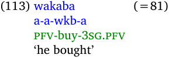

Recall that such Semitic languages often have roots composed of three consonants, as exemplified in the Silt'e data in (113), where ‘buy’ is the root _wkb_ . The aspect markers are composed of vowel patterns that fit between or around the root consonants, such as the _a-a_ vowel pattern indicating the perfective aspect. 

Recall that in order to model this using the default FieldWorks Language Explorer parser, we had to treat each vowel as a distinct infix. So the analysis would look like what is in (114), assuming the inflectional template given in table 19. 

(114) wakaba 

a-a-wkb-a pfv1-pfv2-buy-3.sg.pfv 

Table 19. Silt'e Template (repeated) 

| Aspect1 -a- pfv1 | Aspect2 -a- pfv2 | Stem | Subject -a 3sg.pfv |
|------------------|------------------|------|--------------------|
| etc.             | etc.             |      | etc.               |

What is bothersome about this analysis? It is that what is conceptually one morpheme had to be treated as two morphemes. That is, the _-a- -a-_ perfective aspect morpheme had to be split into two distinct entries. With the phonological rule-based parser, however, we can write an infix process rule for the single perfective aspect morpheme and our inflectional template can also include just a single slot for Aspect. 

What would the pattern be for this perfective aspect? We would need the three consonants of the root, plus “whatever else.” 

What would the result look like? It would be the first consonant, then the first _a_ , the second consonant, the second _a_ , the third consonant, and “whatever else.” So one way to do it would be like this: 

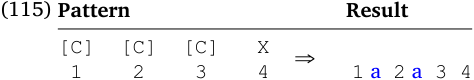

We could also simplify the inflectional template to look like this: 

_“Regular” phonological rules_ 

Table 20. Silt'e Template with Phonological Rule-based Parser 

**Aspect Stem Subject** -a- -a- pfv -a 3sg.pfv etc. etc. 

#### _6.1.1.3 Circumfixation as a process_

Yet another use of a process affix rule is with circumfixes. Recall from section 4.3 the following data: 

(116) kebangunan (=95) ke-bangun-an nmlz-wake.up-nmlz ‘awakening’ 

To model this, we can use an affix process rule as in (117). The pattern is just whatever material is currently present (the X). The result is the prefix phonemes, the 1 and then the suffix phonemes. 

| \(117\) Pattern |     | Result    |
|-----------------|-----|-----------|
| X 1             | ⇒   | k e 1 a n |

#### 6.1.2 Phonological rules

Turning now to phonological processes, this section discusses how to write phonological rules using the phonological rule-based parser. The basic capabilities of phonological rules are very similar to what are given in the classic generative phonology textbook Kenstowicz and Kisseberth (1979). Since it is not really appropriate to review all of that material here, I will be assuming that you are familiar with the basic concepts. I will primarily illustrate such rules using several examples below. 

Note that “regular” phonological rules used in the phonological rule-based parser follow the classic rule formula that describes the rule as a change from _this_ to _that_ when _this_ occurs after _C_ and before _D_ . The basic formula is given in (118): 

(118) _this_ → _that_ / C _ D 

where each of _this_ , _that_ , C, and D are either natural classes, segments or phonological feature structures. The first two are empty or a single natural class, single segment or single feature structure,66 whereas the latter two may contain more than one of these in a sequence. The latter two may also be word boundary symbols. Neither C nor D are required. For deletion rules, _that_ is empty. Similarly, for insertion rules, _this_ is empty. 

Another major characteristic of these rules is that they are ordered. That is, the output of rulei becomes the input to rulei+1. 

#### _6.1.2.1 “Regular” phonological rules_

This section provides several examples of how one might write non-metathesis or regular phonological rules. Section 6.1.2.3 discusses an example of a metathesis rule. For how to add phonological features to FieldWorks Language Explorer, see section 3.1.1.1. 

> 66 Using two or more items in either the _this_ or the _that_ portion will not do what you hope it will. Each _this_ and _that_ must be empty or a single item. 

_Parsing Conceptual Introduction_ 

76 

#### 6.1.2.1.1 Epenthesis

One of the issues mentioned in section 1.1.4 was epenthesis. We can handle this as allomorphy (as in section 3.4) or as a phonological rule. One case where a phonological rule is appropriate is in Selaru [slu]. Consider the following data:67 

- (119) a. roban r-oban 3pl-hit ‘they hit’ 

   - b. raknam r-knam 3pl-eat ‘they eat’ 

   - c. rba r-ba 3pl-go ‘they go’ 

Notice that the underlying form of the ‘3pl’ prefix is _r_ -. Where does the first _a_ come from in (119b), then? Under at least one analysis, we can say that the _a_ is inserted or epenthesized as a default vowel in order to break up an unacceptable consonant cluster. If the _a_ were not there, then the word would begin as _rkn_ which is an invalid sequence of consonants in Selaru. So to make this word legitimate, we can say that there is a phonological rule that inserts the default vowel _a_ after the first of three consecutive consonants. It might be written as shown in figure 45. 

#### Figure 45. Selaru Epenthesis Rule.

That is, when there are three consonants in a row, an epenthetic _a_ is inserted between the first two consonants. (I use the empty set symbol here to indicate that this is an insertion process; the user interface of FieldWorks Language Explorer uses a blank to indicate an insertion site.) 

If you have an insertion rule and you need to indicate a morpheme boundary in the immediate context, then where should the morpheme boundary go? Should it be immediately before the underscore or immediately after the underscore? The way the phonological rule-based parser works, it depends on the direction of the rule. If the direction is “left-to-right iterative” or “simultaneous,” then put the morpheme boundary at the beginning of the right-hand context. Alternatively, if the direction is “right-to-left iterative,” then put the morpheme boundary at the end of the left-hand context. 

#### 6.1.2.1.2 Glide becomes a vowel

Here is some more data from Selaru. Notice what happens to the underlying glides _w_ and _y_ . 

- (120) a. mwohut mw-ohut 2sg-discern ‘you discern’ 

> 67 The data presented here are from Coward & Coward (2000) and Coward (2005). 

_Tone processing_ 

   - b. muknam mw-knam 2sg-eat ‘you eat’ 

- (121) a. yoban y-oban 3sg-hit ‘he hit’ 

   - b. iknam y-knam 3sg-eat ‘he eats’ 

These glides will sometimes surface as a vowel and sometimes as a glide. What are the conditioning factors for when they are a vowel and when they are a glide? Under at least one analysis, the glide becomes a vowel when it is followed by a consonant in a following morpheme. We can write a phonological rule to perform this process. It might look like what is in figure 46. 

#### Figure 46. Selaru Glide Vowel Rule.

That is, a glide becomes a vowel when it is followed by a morpheme boundary and another consonant. 

In section 6.1.2.1.1 there was a rule for epenthesizing an _a_ after the first of three consonants (see figure 45). What would happen with (120b) and (121b) if the epenthesis rule applied before the rule in figure 46? We would get * _mawaknam_ and * _yaknam_ , respectively. Therefore, we either must be careful to order the rule in figure 46 before the epenthesis rule or else we need to exclude the glides from the class of consonants. 

#### 6.1.2.1.3 Tone processing

Another potential use of phonological rules is for handling tone changes. Here is one simple illustration. Consider the following word from Awngi [awn]:68 

(122) ɨskɨ́ɣwa 

ɨsk↗-ɨɣwa be.there-pst.pfv ‘I was there’ or ‘he was there’ 

The root _ɨsk_ has a final floating high tone (or, if you prefer to think of it in a different way, it causes a following tone to be raised). This is indicated here by the _↗_ symbol. The suffix then gets the floating high tone (or it has the tone of its initial vowel raised). 

How do we handle something like this with the phonological rule-based parser? One way is to do what is shown in figure 47. 

> 68 The Awngi data comes from Andreas Joswig, personal communication (emails of November 19, 2008 and May 12, 2009). 

The _ɨsk↗_ root is actually the allomorph for first person singular or third person masculine or plural. The _-ɨɣwa_ suffix is the past perfective form for all persons except second person plural and third person plural. 

_Parsing Conceptual Introduction_ 

78 

1. Create a custom tone phonological feature that has three values: high, low, and floating high. See section 3.1.1.1 for how to do this. 

2. Create distinct phonemes for each low-tone vowel and each high-tone vowel. (I assume Awngi marks high tone vowel with an acute accent and leaves low tone vowels unmarked.) 

3. Give each low tone vowel a tone feature with a value of low. 

4. Give each high tone vowel a tone feature with a value of high. 

5. Also add a phoneme for the floating high tone (the _↗_ symbol). 

6. For the _↗_ phoneme, give it a tone feature with a value of floating high. 

7. Write two phonological rules and order them as follows: 

   - a. Dock the floating high tone. 

   - b. Delete the floating high tone. 

#### Figure 47. How to Handle Awngi Tone.

Here is how the docking rule might look: 

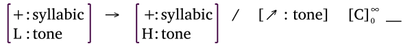

#### Figure 48. Awngi Docking Rule.

This rule uses [+:syllabic] to indicate a vowel (or tone bearing unit). It means a low tone vowel becomes a high tone vowel when the low tone vowel is preceded by a floating high tone and where there may be zero or more consonants in between. The use of the subscript 0 and the superscript∞ after the consonant class [C] follows a standard notational device used in these kinds of phonological rules (see Kenstowicz and Kisseberth (1979:64) and Halle & Clements (1983:93)). The subscript indicates the minimum number of occurrences and the superscript indicates the maximum number.69 

Here is how the deletion rule might look: 

#### Figure 49. Awngi Deletion Rule.

That is, delete a floating high tone. (I use the empty set symbol here to indicate deletion; the user interface of FLEx uses a blank to indicate a deleted item.) Normally, deletion rules only apply once. If you find that you need a deletion rule to apply more than once, you will need to set the DelReapps Parser Parameter to more than zero. You will want to make this parameter be small or else the parser will run very slowly. 

Note that it is crucial for the docking rule to be ordered before the deletion rule. If we ordered them the other way around, then the docking rule would never apply because the floating high tone would have already been deleted. 

> 69 Note that in order to create the iteration (zero or more) on the consonant class in the FieldWorks Language Explorer user interface for phonological rules, you may need to select the consonant class and then perform a right click. Please see the Help files on setting occurrence values (min. and max.) for how to add these to a rule. 

_Unspecified nasal in Bahasa Indonesia_ 

#### 6.1.2.1.4 Nasal assimilation

Now let's look at some Bahasa Indonesia data for one of its “voice” or “focus” morphemes.70 Consider the following forms, where the first line is the orthographic form and the second line is the underlying form. 

- (123) a. membantu məⁿ-bantu av-help 

   - b. mendengar məⁿ-deŋar av-hear 

   - c. menggambar məⁿ-gambar av-draw.a.picture 

What is the shape of the Actor Voice prefix? It appears that the final nasal assimilates to the point of articulation of the following voiced stop. We could write a rule for this as shown in figure 50. 

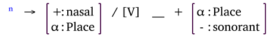

Figure 50. Indonesian Nasal Assimilation Rule. 

That is, a nasal unspecified for place of articulation will assimilate to the place of articulation of a following obstruent (when the nasal follows a vowel).71 The rule in figure 50 exemplifies a process that happens in a number of languages. 

_6.1.2.1.4.1 Unspecified nasal in Bahasa Indonesia_ 

The situation in Bahasa Indonesia, however, is actually much more complicated. For example, consider what happens with alveo-palatal affricates: 

> 70 The data presented here are from Halle & Clements (1983:125) and Sneddon (1996). Since the latter does not always include stem glosses, some stem glosses were obtained via <u>http://www.babylon.com/ define/108/Indonesian-English-Dictionary.html</u> from May 21-28, 2009. The gloss for _pijit_ was gleaned from <u>http://www.kamus.net/result.php?w=id-indonesia&q=pijit&submit=Search&e=0</u> on May 26, 2009. Any errors in assigning glosses are mine. 

> We also use _ⁿ_ for the unspecified nasal instead of the more normal _N_ . See section 6.2.5 for an explanation. 71 Please see the Help files to learn how to create these “feature variables” (also known as “alpha variables” since the first such variable is commonly represented by the Greek letter alpha α). 

_Parsing Conceptual Introduction_ 

(124) a. menjahit məⁿ-dʒahit av-sew 

- b. mencatat məⁿ-tʃatat av-write 

Notice that while one might expect a palatal nasal _ɲ_ here, at least orthographically an alveolar _n_ is used. There are some other possibly orthographic conventions that appear to apply as well. Notice how things are written for a voiceless palatal fricative and a voiceless glottal fricative: 

(125) a. mensyaratkan məⁿ-ʃarat-kan av-condition-caus 

- b. menghitung məⁿ-hituŋ av-count 

The palatal fricative uses the alveolar nasal _n_ where the glottal fricative uses the velar nasal _ŋ_ . That the glottal fricative takes the back-most nasal should not be surprising. There is no such thing as a glottal nasal, of course. It is surprising, however, that the palatal fricative does not use a palatal nasal when the orthography does have one ( _ny_ ). 

We are not done with the interesting things that happen here. Consider what happens when a stem begins with a vowel: 

(126) a. mengambil məⁿ-ambil av-take 

- b. mengerang məⁿ-eraŋ av-groan 

- c. mengisi məⁿ-isi av-fill.up 

- d. mengolah məⁿ-olah av-process 

- e. mengundang məⁿ-undaŋ av-invite 

Notice how vowel-initial stems all take the velar nasal _ng_ . There is more. Consider the data below: 

_Unspecified nasal in Bahasa Indonesia_ 

- (127) a. melempar məⁿ-lempar av-throw 

   - b. menikah məⁿ-nikah av-marry 

   - c. mengaco məⁿ-ŋatʃo av-chat 

   - d. menyanyi məⁿ-ɲaɲi av-sing 

   - e. merasa məⁿ-rasa av-feel 

   - f. mewakili məⁿ-wakil-i av-proxy-appl 

   - g. meyakini məⁿ-yakin-i av-certain-caus.i 

Notice how the _məⁿ_ - prefix surfaces as just _me_ . What is common among the initial segments of all the stems in (127)? These are all sonorant consonants, so it appears that this affix loses its final nasal when it is followed by a sonorant consonant. 

There is even more. Look at the following data: 

- (128) a. memukul məⁿ-pukul av-hit 

   - b. menulis məⁿ-tulis av-write 

   - c. mengirim məⁿ-kirim av-send 

What is unusual here? Notice that while the unspecified nasal assimilates to the point of articulation of the following voiceless stop in (128a)-(128c), that stop does not surface. So we might suppose that the nasal assimilates and then the voiceless stop deletes. What happens with other voiceless obstruents? Look at the following to see: 

_Parsing Conceptual Introduction_ 

82 (129) a. memfitnah məⁿ-fitnah av-slander 

- b. mengkhawatirkan məⁿ-xawatir-kan av-worry-caus 

- c. menyewa məⁿ-sewa av-lease 

- d. mensyaratkan (=125a) məⁿ-ʃarat-kan av-condition-caus 

e. menziarahi məⁿ-ziarah-i av-make.a.pilgrimage-loc 

- f. menghitung (=125b) məⁿ-hituŋ av-count 

Notice that there is only one fricative that deletes: _s_ . None of the other fricatives delete, even the voiceless ones like _f_ , _sy_ , and _h_ . Further, _s_ not only deletes, the nasal that is written in the practical orthography is palatal _ny_ instead of the expected _n_ . 

To summarize, this is what we have seen: 

(130) 1. The unspecified nasal becomes ng before a vowel. 

2. The unspecified nasal deletes before a sonorant consonant. 

3. The unspecified nasal assimilates to the point of articulation of a following obstruent with the following exceptions: 

   - a. h takes ng. 

   - b. s takes ny. 

   - c. sy takes n. 

4. The following phonemes assimilate and then delete: p, t, k, and s. 

How might we deal with such an intricate combination of arguably unexpected factors and successfully implement them in FieldWorks Language Explorer using the phonological rule-based parser? One possible way is shown in figure 51. 

How might we do the first step? Given that there appear to be some orthographic conventions employed in the practical orthography, one way to deal with some of the unusual assimilations is to create a special “orthographic place” feature and assign the phonemes to use the place involved in the practical orthography. 

_Unspecified nasal in Bahasa Indonesia_ 

83 

1. Create the phonological features to use. See section 3.1.1.1. 

2. Make sure every phoneme is defined. 

3. Assign these features to each phoneme. 

4. Write a number of ordered phonological rules to deal with each case. 

#### Figure 51. How to Handle the Unspecified Nasal in Indonesian.

In addition, there is the problem with the segments that delete as illustrated above in (128) and (129c). To my knowledge, there is no true natural set of features that can encompass _p_ , _t_ , _k_ , and _s_ without also including some of the other voiceless fricatives. So one way to deal with this is to create a custom feature where _p_ , _t_ , _k_ , and _s_ have the + value and all other segments have the - value. 

Table 21. Phonological Features for Bahasa Indonesian Implementation 

| approx | back | cons | cont | dr  | high | lat | low | nas | NO→N | OrthPlace | son | syl | voice |
|--------|------|------|------|-----|------|-----|-----|-----|------|-----------|-----|-----|-------|
| \- +   | \+   | \+   | \-   | \-  | \-   | \-  | \-  | \-  | \-   | \-        | \-  | \-  | \-    |
| a +    | \-   | \-   | \+   | \+  | \-   | \-  | \+  | \-  | \-   | \-        | \+  | \+  | \+    |
| b -    | \-   | \+   | \-   | \-  | \-   | \-  | \-  | \-  | \-   | labial    | \-  | \-  | \+    |
| c -    | \-   | \+   | \-   | \+  | \+   | \-  | \-  | \-  | \-   | alveolar  | \-  | \-  | \-    |
| d -    | \-   | \+   | \-   | \-  | \-   | \-  | \-  | \-  | \-   | alveolar  | \-  | \-  | \+    |
| e +    | \-   | \-   | \+   | \-  | \-   | \-  | \-  | \-  | \-   | \-        | \+  | \+  | \+    |
| f -    | \-   | \+   | \+   | \-  | \-   | \-  | \-  | \-  | \-   | labial    | \-  | \-  | \-    |
| g -    | \+   | \+   | \-   | \-  | \+   | \-  | \-  | \-  | \-   | velar     | \-  | \-  | \+    |
| h -    | \+   | \+   | \+   | \-  | \-   | \-  | \-  | \-  | \-   | velar     | \-  | \-  | \-    |
| i +    | \-   | \-   | \+   | \-  | \+   | \-  | \-  | \-  | \-   | \-        | \+  | \+  | \+    |
| j -    | \-   | \+   | \+   | \+  | \+   | \-  | \-  | \-  | \-   | alveolar  | \-  | \-  | \+    |
| k -    | \-   | \+   | \-   | \-  | \-   | \-  | \-  | \-  | \+   | velar     | \-  | \-  | \-    |
| kh -   | \+   | \+   | \+   | \-  | \+   | \-  | \-  | \-  | \-   | velar     | \-  | \-  | \-    |
| l +    | \-   | \+   | \+   | \-  | \-   | \+  | \-  | \-  | \-   | alveolar  | \+  | \-  | \+    |
| m -    | \-   | \+   | \-   | \-  | \-   | \-  | \-  | \+  | \-   | labial    | \+  | \-  | \+    |
| n -    | \-   | \+   | \-   | \-  | \-   | \-  | \-  | \+  | \-   | alveolar  | \+  | \-  | \+    |
| ⁿ -    | \-   | \+   | \-   | \-  | \-   | \-  | \-  | \+  | \-   | ?         | \+  | \-  | \+    |
| ng -   | \-   | \+   | \-   | \-  | \-   | \-  | \-  | \+  | \-   | velar     | \+  | \-  | \+    |
| ny -   | \-   | \+   | \-   | \-  | \-   | \-  | \-  | \+  | \-   | palatal   | \+  | \-  | \+    |
| o +    | \+   | \-   | \+   | \-  | \-   | \-  | \-  | \-  | \-   | \-        | \+  | \+  | \+    |
| p -    | \-   | \+   | \-   | \-  | \-   | \-  | \-  | \-  | \+   | labial    | \-  | \-  | \-    |
| r +    | \-   | \+   | \+   | \-  | \-   | \-  | \-  | \-  | \-   | alveolar  | \+  | \-  | \+    |
| s -    | \-   | \+   | \+   | \-  | \-   | \-  | \-  | \-  | \+   | palatal   | \-  | \-  | \-    |
| sy -   | \-   | \+   | \+   | \-  | \-   | \-  | \-  | \-  | \-   | alveolar  | \-  | \-  | \-    |
| t -    | \-   | \+   | \-   | \-  | \-   | \-  | \-  | \-  | \+   | alveolar  | \-  | \-  | \-    |
| u +    | \+   | \-   | \+   | \-  | \+   | \-  | \-  | \-  | \-   | \-        | \+  | \+  | \+    |
| w +    | \+   | \+   | \+   | \-  | \+   | \-  | \-  | \-  | \-   | velar     | \+  | \-  | \+    |
| y +    | \-   | \+   | \+   | \-  | \+   | \-  | \-  | \-  | \-   | palatal   | \+  | \-  | \+    |
| z -    | \-   | \+   | \+   | \-  | \-   | \-  | \-  | \-  | \-   | alveolar  | \-  | \-  | \+    |

_Parsing Conceptual Introduction_ 

84 

The phoneme-feature matrix shown in table 21 above illustrates one way that the first three steps of figure 51 could be done (see the OrthPlace feature for the assimilation place and the custom NO→N feature for the four segments which delete).72 

Having devised a phonological feature system and assigned the appropriate feature values to the phonemes, the next step from figure 51 is to write the phonological rules. What should they be? One way is to write rules for each of the four items given in (130) above. 

The rule in figure 52 addresses the case for the vowels: 

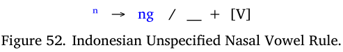

That is, an unspecified nasal becomes a velar nasal before a vowel-initial morpheme. 

The next rule handles the case for the sonorant consonants: 

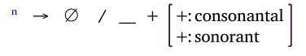

Figure 53. Indonesian Unspecified Nasal Sonorant Consonant Rule. 

That is, an unspecified nasal deletes before a morpheme-initial sonorant consonant. 

The third rule does the nasal assimilation. Note how it is similar to the rule in figure 50 above. 

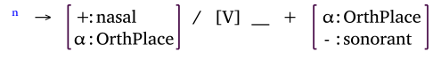

Figure 54. Indonesian Unspecified Nasal Assimilation Rule. 

That is, an unspecified nasal assimilates to the place of articulation of a following obstruent when that obstruent begins another morpheme within the word. Note that by using the special OrthPlace feature and by setting its values to the implied place of articulation used in the orthography for segments like _c_ , _j, s_ , _sy_ , and _h_ that orthographically assimilate to unexpected values, we avoid having to write special exception rules. The rule in figure 54 will take care of these cases, too. 

The fourth and final rule is the one that takes care of the special case of the four segments that delete after assimilation. 

Figure 55. Indonesian Unspecified Voiceless Obstruent Deletion Rule. 

That is, delete a voiceless obstruent with the special [+:NO→N] feature when it occurs after the unspecified nasal across a morpheme boundary. Since my understanding is that the only time Bahasa Indonesia has an 

> 72 The first “phoneme” is a hyphen which is used in full reduplicated forms. See section 6.1.1.1.1. Note that its features uniquely identify it so that it cannot be confused with any other phoneme. Another way to deal with this would be to create a custom feature for which the hyphen is the only phoneme that has a + value; all other phonemes would have a - value for this custom feature. (See section 6.2.2.) The OrthPlace feature is a custom feature whose possible values indicate the place of articulation (labial, alveolar, palatal, velar, and glottal) or that the segment is unspecified for place (?). (The name reflects the observation that how this works seems to be more orthographic conventions than true place of articulation.) The NO→N feature's name is an attempt to imply that these segments (the O) delete after an unspecified nasal (the N). 

_Unspecified nasal and full reduplication in Bahasa Indonesia_ 

unspecified nasal, that unspecified nasal is preceded by the vowel _e_ , I've added this to the environment. It may make the phonological rule-based parser run a bit more efficiently. 

What would happen if we reversed the order of the last two rules of figures 54 and 55? The _p_ , _t_ , _k_ , and _s_ would all delete before there was an opportunity for the unspecified nasal to assimilate. Therefore, it is crucial that we order these rules correctly. 

_6.1.2.1.4.2 Unspecified nasal and full reduplication in Bahasa Indonesia_ 

There is actually yet another complication in Bahasa Indonesia with the four segments that can assimilate and then delete. Consider the following forms where the verb stem is fully reduplicated as the continuative morpheme.73 

- (131) a. mengurut-urut məⁿ-urut-R av-stroke-cont 

   - b. menanti-nanti məⁿ-nanti-R av-wait-cont 

   - c. membagi-bagi məⁿ-bagi-R av-divide-cont 

   - d. memijit-mijit məⁿ-pijit-R av-massage-cont 

   - e. menulis-nulis məⁿ-tulis-R av-write-cont 

   - f. mengayuh-ngayuh məⁿ-kayuh-R av-pedal-cont 

What material is actually reduplicated? In (131a-c) it is clear that the original verb stem is reduplicated. In (131d-f), however, what is reduplicated is the result of the assimilation rule as well as the deletion rule. For example, while one might expect to get * _memijit-pijit_ for (131d); instead the assimilated _m_ is what is actually reduplicated. 

Using the phonological rule-based parser, it is possible to write a phonological rule that will handle this complex situation. Let's assume that we have created a reduplication entry for the continuative suffix which uses an affix process rule identical to what we had in (101). Also recall that when using the phonological rule-based parser we need to think generatively. For the case of (131d-f), this means that we need to assume that the continuative suffix process rule will apply to the verb stem, resulting in the reduplication of the underlying form of the verb stem. After this process, the _meⁿ_ - prefix will attach. Finally, we apply our phonological rules to the result. Thus, for the case of (131d), the input to the phonological rules would be 

> 73 Thanks to Jonathan Coombs (personal communication, email of May 30, 2012) for pointing out that the form in (131b) in earlier versions of this document ( _menunda-nunda_ ) is actually from the root _tunda_ , not the root * _nunda_ . He also suggested using _menanti-nanti_ whose root is indeed _nanti_ . 

_Parsing Conceptual Introduction_ 

86 

(132) meⁿ+pijit+pijit 

We then need a phonological rule that will match the “deletable” voiceless obstruent at the beginning of the reduplication suffix and change it to its corresponding nasal, when somewhere to the left of it, there is an unspecified nasal followed by the same “deletable” voiceless obstruent. In the case of (132), we need to match the _p_ just after the reduplication hyphen and change it to an _m_ . Here is a rule that will do this: 

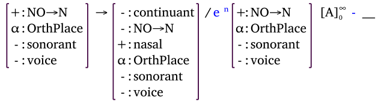

Figure 56. Indonesian Unspecified Nasal Full Reduplication Rule. 

What does all this mean? Remember that all phonological rules follow the basic formula of (118). The _this_ of (118) is the first feature structure. The _that_ is the second feature structure. In addition, there is only the left environment (the C of (118)). 

One way to read this is that when there is a voiceless obstruent (indicated by [-:voice] and [- :sonorant]) which can undergo the special deletion (indicated by [+:NO→N]), change this voiceless obstruent to a nasal (indicated by [+:nasal]) at the same place of articulation (indicated by [α:OrthPlace] in both the first and second features).74 Two of the other four features mentioned in the _that_ part of the rule ([+:sonorant] and [+:voice]) are needed because nasals have these features while the obstruents involved have their opposite values. Also, since the nasals do not undergo the special deletion, we need to include the feature [-:NO→N]. We need to overtly mention these nasal-oriented values in order for the parser to correctly identify the nasal segment. If we left these out, then the parser would have a set of features that did not match any known phoneme and therefore, the rule would not work for us. The reason that the [-:continuant] feature is also used in the _that_ part of the rule is that while the _p_ , _t_ , and _k_ segments already have the [-:continuant] feature (since they are stops), the _s_ segment does not (because it is a fricative and fricatives are [+:continuant]). 

Turning now to the context of this rule, first note that it uses a natural class [A]. This is a custom natural class I added to this language project that consists of all the phonemes in the language (except for the orthographic hyphen). Having noted this, what does this context mean? I'll explain it working from where the _this_ is found back to the left toward the front of the word: there must be an orthographic hyphen immediately before the _this_ . To the left of this there must be zero or more segments, indicated by the custom natural class [A] demarcated by the subscript 0 along with the superscript∞ . This follows a standard notational device used in these kinds of phonological rules (see Kenstowicz and Kisseberth (1979:64) and Halle & Clements (1983:93)). The subscript indicates the minimum number of occurrences and the superscript indicates the maximum number.75 In this case, we do not know how many there may be so we use any possible number (we could be more specific, especially at the maximum, but using infinity means that we never need to worry about what that maximum might be). So we use this special natural class with this notational device to indicate the “somewhere to the left of the hyphen.” What we want to find is the exact same segment that is in the _this_ match. So note that to the immediate left of the [A] natural class is the same set of features used for the _this_ match. Since we do not want to match just 

74 Please see the Help files to learn how to create these “feature variables” (also known as “alpha variables” since the first such variable is commonly represented by the Greek letter alpha α). 75 Note that in order to create the iteration (zero or more) on the consonant class in the FieldWorks Language Explorer user interface for phonological rules, you may need to select the consonant class and then perform a right click. Please see the Help files on setting occurrence values (min. and max.) for how to add these to a rule. 

_Unspecified nasal exceptions in Bahasa Indonesia_ 

87 

any such segment, but only the one that immediately follows the unspecified nasal, we put the unspecified nasal _ⁿ_ just before it. Finally, since it just so happens that all instances of the unspecified nasal in Bahasa Indonesia (as far as I know) are preceded by the vowel _e_ , we include that vowel, too. 

_6.1.2.1.4.3 Unspecified nasal exceptions in Bahasa Indonesia_ 

Having addressed how to model most of the complications of the unspecified nasal in Bahasa Indonesia, it should be noted that there are at least three exceptional cases where the _p_ , _t_ , _k_ , and _s_ segments do not delete. 

First, when the _meⁿ_ - prefix is followed immediately by the derivational _per_ - prefix, the _p_ of the _per_ - prefix does not delete as illustrated in (133). 

- (133) a. memperlebar məⁿ-per-lebar av-caus-wide 

   - b. memperoleh məⁿ-per-oleh av-caus-by 

We can use an exception “feature” to handle this exception. We do the steps shown in figure 57. 

1. Create the exception “feature” per figure 17. We could call it ‘Does not undergo voiceless obstruent deletion” because this is the rule that does not apply (see figure 55). 

2. Create or find the _per_ - entry. 

3. Mark it as having this exception "feature” in its list of To Exception “Features.” 

4. Find the phonological rule which deletes a voiceless obstruent (see figure 55) and add this exception “feature” to its list of excluded properties. 

   - a. Use Grammar / Phonological Rules. 

   - b. Select the rule you need in the middle pane. 

   - c. Click in the Excluded Properties field. 

   - d. Click on the chooser button. 

   - e. In the ensuing dialog box, check the exception “feature.” 

#### Figure 57. How to Use an Exception “Feature” for Unspecified Nasal in Indonesian.

When the phonological rule-based parser finds the _per_ - morpheme, it will no longer try to apply the delete voiceless obstruent rule because it will be excluded. (Please note that you will only see that this rule is not applied during the synthesis process; during analysis, the rule will still be “unapplied.”) 

The second exception is for loan words. Consider the following words: 

- (134) a. memproklamasikan məⁿ-proklamasi-kan av-proclamation-caus 

   - b. mentraktir məⁿ-traktir av-treat.someone 

_Parsing Conceptual Introduction_ 

88 

- c. menswadayakan məⁿ-swadaya-kan av-self.supporting-caus 

- d. mengklasifikasikan məⁿ-klasifikasi-kan av-classification-caus 

The crucial thing to notice here is that in none of these does the initial consonant of the stem delete. To handle these, add the exception “feature” created above to each stem entry. Sneddon (1996:12) notes that as a loan word ceases to be considered as foreign and becomes thought of as part of the native vocabulary, the expected deletion will occur. If you find that happening for some word, merely remove the exception “feature” from it and the deletion rule will then apply. 

The third exception is for monosyllabic stems, which Sneddon (1996:13) says are all loan words. These, too, can be handled via our exception “feature” by marking these stems as having this exception "feature.” 

#### _6.1.2.2 Constraining application of “regular” phonological rules_

There are times when the application of a “regular” rule needs to be limited to a set of categories or to some other properties of the word. 

#### 6.1.2.2.1 Rule applies only with certain categories

Consider the following data from Payne (1981:108). 

- (135) a. iNkomataati 

      - i-N-koma-aa-i 3pl.m-fut-paddle-rep-fut ‘he will paddle again’ 

   - b. iNtʃʰikaati i-N-tʃʰik-aa-i 3pl.m-fut-cut-rep-fut ‘he will cut again’ 

Notice that when two vowels occur across morpheme boundaries, an epenthetic / _t_ / is inserted. That is not the entire story, however. Consider what happens in the data in example (136) (also from Payne (1981:110)): 

(136) a. hitoiriki hito-iriki spider-dim ‘small spiders’ 

- b. mapiiriki mapi-iriki rock-dim ‘small rocks’ 

In these words, even though two vowels occur across a morpheme boundary, no epenthetic / _t_ / is inserted. What is the difference between the data in (135) and (136)? Notice that all the forms in (135) are verbs while the ones in (136) are nouns. So if we had a way to say that the phonological rule which inserts the epenthetic / _t_ / only applies on verbs, then we can deal with this kind of data. 

_Phonological metathesis rules_ 

89 

With the phonological rule-based parser, it is possible to constrain a phonological rule so that it will apply only when certain categories are present in the word. Like many other situations involving categories in the FieldWorks Language Explorer parsers, the category hierarchy is respected. That is, if you specify that a particular phonological rule should only apply when a particular category is present, then that rule will only apply if that category or any of its subcategories (or their subcategories) are present. 

#### 6.1.2.2.2 Rule applies only with certain properties

The phonological rule-based parser also allows one to constrain the application of a given phonological rule by limiting its application to when specified exception “features” or inflection classes are present or are not present. If one says that this set of exception “features” and/or inflection classes are required, then every one of them must be present before the phonological rule will be applied. If one says that this set of exception “features” and/or inflection classes are excluded, then the phonological rule will be applied only if none of these are present. 

See section 6.1.2.1.4.3 for an example of using an exception “feature” which must not be present in order for a phonological rule to apply. 

#### _6.1.2.3 Phonological metathesis rules_

Now let's look at an example of phonological metathesis. Consider the following data from Selaru,76 paying special attention to the position of the glides in the underlying form (second line) versus the surface form (first line). 

(137) a. sit cat b. sitke sit-ke cat-art (138) a. sihy chicken b. sihkye sihy-ke chicken-art (139) a. asw dog b. askwe asw-ke dog-art (140) mtwaklulw mw-taklulw 2sg-sit 

What happens to the glides _w_ and _y_ ? They exchange places with a following consonant whenever the consonant comes before a vowel. (More data would show that this only happens with obstruent consonants.) This kind of exchange of segments is known as metathesis. 

> 76 The Selaru data is from David Coward, personal communication (emails of November 15, 2008, November 17, 2008, and January 12, 2009). 

_Parsing Conceptual Introduction_ 

90 

How do we model this metathesis using the phonological rule-based parser? Since this kind of a change is not possible to write using the standard rule notation of (118), we need to create a special metathesis rule. These rules can be described very much like what we saw above for affix processes (e.g., see Kenstowicz and Kisseberth (1979:371)). The user interface of FieldWorks Language Explorer, however, follows a different notation that we think is clearer. It might look like what is in figure 58 for the Selaru metathesis case: 

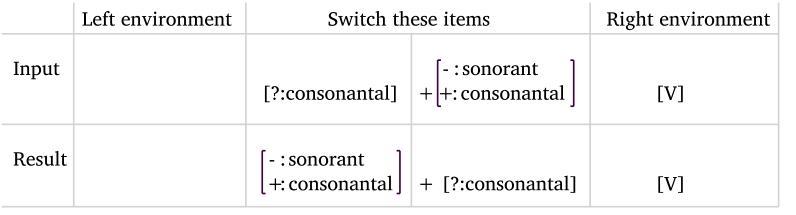

Figure 58. Selaru Metathesis Rule. 

The row labeled Input indicates the pattern of the input. Glides are indicated by the [? : consonantal] feature.77 Obstruents are indicated by the combination of [+ : consonantal] and [- : sonorant] features. The following vowel is indicated by the V in the right environment. Notice how the two middle column contents are switched in the final row (the result). 

Table 22 below shows a phoneme-feature matrix one might use for Selaru. 

Table 22. Phonological Features for Selaru Implementation 

|     | back | cg  | cons | cont | cor | front | high | lat | nas | rnd | son | voice |
|-----|------|-----|------|------|-----|-------|------|-----|-----|-----|-----|-------|
| a   | \+   | \-  | \-   | \-   | \-  | \-    | \-   | \-  | \-  | \-  | \+  | \+    |
| b   | \-   | \-  | \+   | \-   | \-  | \-    | \-   | \-  | \-  | \-  | \-  | \+    |
| d   | \-   | \-  | \+   | \-   | \+  | \-    | \-   | \-  | \-  | \-  | \-  | \+    |
| e   | \-   | \-  | \-   | \-   | \-  | \+    | \-   | \-  | \-  | \-  | \+  | \+    |
| f   | \-   | \-  | \+   | \+   | \-  | \-    | \-   | \-  | \-  | \-  | \-  | \-    |
| h   | \+   | \-  | \+   | \+   | \-  | \-    | \-   | \-  | \-  | \-  | \-  | \-    |
| i   | \-   | \-  | \-   | \-   | \-  | \+    | \+   | \-  | \-  | \-  | \+  | \+    |
| j   | \-   | \-  | ?    | \-   | \+  | \+    | \+   | \-  | \-  | \-  | \+  | \+    |
| k   | \+   | \-  | \+   | \-   | \-  | \-    | \+   | \-  | \-  | \-  | \-  | \-    |
| l   | \-   | \-  | \+   | \-   | \-  | \-    | \-   | \+  | \-  | \-  | \+  | \+    |
| m   | \-   | \-  | \+   | \-   | \-  | \-    | \-   | \-  | \+  | \-  | \+  | \+    |
| n   | \-   | \-  | \+   | \-   | \+  | \-    | \-   | \-  | \+  | \-  | \+  | \+    |
| o   | \+   | \-  | \-   | \-   | \-  | \-    | \-   | \-  | \-  | \+  | \+  | \+    |
| r   | \-   | \-  | \+   | \-   | \-  | \-    | \-   | \-  | \-  | \-  | \+  | \+    |
| s   | \-   | \-  | \+   | \+   | \+  | \-    | \-   | \-  | \-  | \-  | \-  | \-    |
| t   | \-   | \-  | \+   | \-   | \+  | \-    | \-   | \-  | \-  | \-  | \-  | \-    |
| u   | \+   | \-  | \-   | \-   | \-  | \-    | \+   | \-  | \-  | \+  | \+  | \+    |
| w   | \+   | \-  | ?    | \-   | \-  | \-    | \+   | \-  | \-  | \+  | \+  | \+    |
| ʔ   | \+   | \+  | \+   | \-   | \-  | \-    | \-   | \-  | \-  | \-  | \-  | \-    |

> 77 In the analysis used, glides are unspecified for the consonantal feature, indicated by the question mark. If the glide occurs between consonants and ends a morpheme, then the glide becomes a vowel. 

_Features used in a rule should be explicit_ 

91 

### 6.2 Tips for making the phonological rule-based parser work effectively.

When using the phonological rule-based parser, there are several key things one should keep in mind. These are given here. 

#### 6.2.1 Every phoneme used in the orthography must be defined as a phoneme

The first thing to keep in mind when you use the phonological rule-based parser is that every phoneme used in the orthography must be listed among the phonemes in your language project.78 If a word or an affix or a phonological rule has even just one phoneme that is not listed in the list of phonemes, then the phonological rule-based parser is guaranteed to not give an analysis for any word containing that phoneme. This is because this parser crucially depends on phonemes being defined. This should not be surprising, really, for a parser that is able to handle phonological rules: it simply must know what the phonemes are in order to deal with such rules. 

#### 6.2.2 The phonological features need to uniquely identify each phoneme

Whenever you use phonological features with the phonological rule-based parser, it is very important that each phoneme have distinct values for its phonological features. If two or more phonemes share the exact same set of phonological feature-value pairs, then the parser may not be able to correctly determine the morphemes involved. You may want to double check that every phoneme has a unique set of feature-value pairs. One way to do this is via the “Bulk Edit Phoneme Features” tool; another is via the “Grammar Sketch.” Both of these tools are in the Grammar area. 

#### 6.2.3 Fully specify each phoneme

While some phonological theories promote feature underspecification and while some theories also consider it to be good form to minimally specify features in a phonological rule, the way the phonological rule-based parser works, you really need to be as specific as practical. So if a rule is not working, try to be more specific about the features. 

#### 6.2.4 Features used in a rule should be explicit

Whenever you use a phonological feature structure in a phonological rule, be sure to use as many features as necessary to correctly identify the phonemes involved. If you are not explicit enough, the parser will not be able to identify the correct phonemes and your rule may well not work as you expect. 

For example, in working on the Bahasa Indonesia data, I wrote a complicated rule (see figure 56) where I wanted to change certain voiceless obstruents to their co-articulated nasal. Since these particular obstruents all shared a common feature value, I thought I could just use that feature and the place feature. That did not work. I had to be sure to include all features that differ between the phonemes involved. In particular, I needed to include sonorant, voice, and nasal feature values. 

The lesson here is that while we humans may easily make correct assumptions about the sound system of a language, the parser cannot. 

> 78 The default FieldWorks Language Explorer parser does not require this. For the default parser, you only need to define phonemes that are used in natural classes or in environments. 

_Parsing Conceptual Introduction_ 

92 

#### 6.2.5 Avoid using archiphonemes that are uppercase equivalents of a character in your orthography

In testing the Bahasa Indonesia data, I had an affix that ended with an unspecified nasal (this affix has nasal assimilation to the point of articulation of a following obstruent as explained in section 6.1.2.1.4). So I wrote a phonological rule to do the assimilation. To represent this affix, I used an archiphoneme of capital N. That is, I made it have the form _meN_ -. I also added a new phoneme whose representation was also this archiphoneme _N_ . Since the language already had an alveolar nasal ( _n_ ), it turned out that the phonological rule-based parser did not successfully apply the rule. 

The reason is that the phonological rule-based parser automatically treated _N_ as the uppercase equivalent of the alveolar nasal _n_ . The solution I used was to change the representation of the unspecified nasal phoneme to a superscript n ( _ⁿ_ ). So while I could continue to use the N for the name of the unspecified nasal phoneme, I did need to be careful to change the representation/grapheme and all lexical forms to use the superscript n. For example, the affix I mentioned above became _meⁿ_ -. Once I made these changes, the phonological rule-based parser was able to correctly parse words containing this morpheme. Note that it is not a problem to type forms such as _meN_ - into the Citation Form field of an affix's entry for publication purposes, since the parser does not look at the Citation Form at all. 

#### 6.2.6 Make sure every affix process rule is complete

Whenever you create an affix process rule, be sure to fill in the morph type field and also put something in the form field. If the morph type field is empty, the rule may not work. The reason for putting something in the form field is so you will not just get “???” for the shape of the morpheme. If there are several affix process rules in a lexical entry, you can make the form field be slightly different for each one. This can make it easier to know which form/affix process rule was actually tried. 

#### 6.2.7 Natural classes defined by phonemes may not work as expected

This one is a bit tricky and not easy to explain. 

When you have phonological features defined and have fully and uniquely specified each phoneme, you may still run into some odd behaviors with natural classes. Consider the set of phonemes and features shown in table 23 below. 

One would expect that while these are not fully specified, they are unique. The problem came when a consonant natural class was defined as consisting of the following phonemes 

(141) b,  c,  ç,  ch,  d,  f,  g,  ğ,  h,  k,  l,  m,  n,  ñ,  p,  q,  r,  s,  ş,  sh,  t,  v,  x,  y,  z,  zh 

and there was an affix process rule whose match portion ended in two consonants. One naturally would expect that only those phonemes defined in the consonant natural class would be considered. But this is not how the phonological rule-based parser works during its synthesis process. During synthesis, it uses only phonological features. When it was attempting to see if a sequence like _madi_ ended in two consonants, it said “yes, it does.” How did this happen? How could it think that the final _i_ was a consonant? 

The answer is primarily related to the multi-valued nature of the art feature. Since the various phonemes that are part of the consonant natural class (see (141)) have different values for the art feature, the phonological rule-based parser has to ignore this feature when considering phonological features. Looking at the feature chart in table 23 and ignoring the art column, notice that the / _i_ / phoneme and the / _l_ / phoneme have compatible phonological features. Because of this, the phonological rule-based parser said that the final _i_ of the base _madi_ matched the consonant natural class. 

The solution was to add a binary feature of ±consonantal. This was + for all consonants and - for all vowels. 

The moral of this story, then, is to make sure that the phonological feature system is such that each natural class, when defined via features, contains just the phonemes you want. Using binary features can certainly make this easier. 

_Known limitations_ 

93 

Table 23. Phonological Features for Salar Implementation 

|     | \*\*\* | art   | cont | cor | front | high | rnd | son | str | voice |
|-----|--------|-------|------|-----|-------|------|-----|-----|-----|-------|
| \-  | \+     |       | \-   | \-  | \-    | \-   | \-  | \-  | \-  | \-    |
| a   |        | vowel |      |     | \-    | \-   | \-  | \+  |     |       |
| b   |        | lab   | \-   | \-  | \+    | \-   |     | \-  | \-  | \+    |
| c   |        | pal   | \-   | \+  | \-    | \+   |     | \+  | \+  | \+    |
| ç   |        | pal   | \-   | \+  | \-    | \+   |     | \-  | \+  | \-    |
| ch  |        | ret   | \-   | \+  | \-    | \-   |     | \-  | \+  | \-    |
| d   |        | alv   | \-   | \+  | \+    | \+   |     | \-  | \-  | \+    |
| e   |        | vowel |      |     | \+    | \-   | \-  | \+  |     |       |
| f   |        | lab   | \+   | \-  | \+    | \-   |     | \-  | \+  | \-    |
| g   |        | vel   | \-   | \-  | \-    | \+   |     | \-  | \-  | \+    |
| ğ   |        | vel   | \+   | \-  | \-    | \+   |     | \-  | \+  | \+    |
| h   |        | uvu   | \+   | \-  | \-    | \-   |     | \-  | \-  | \-    |
| i   |        | vowel |      |     | \+    | \+   | \-  | \+  |     |       |
| ı   |        | vowel |      |     | \-    | \+   | \-  | \+  |     |       |
| k   |        | vel   | \-   | \-  | \-    | \+   |     | \-  | \-  | \-    |
| l   |        | alv   | \+   | \+  | \+    | \+   |     | \+  | \-  | \+    |
| m   |        | lab   | \+   | \-  | \+    | \-   |     | \-  | \-  | \+    |
| n   |        | alv   | \+   | \+  | \+    | \+   |     | \-  | \-  | \+    |
| ñ   |        | vel   | \+   | \-  | \-    | \+   |     | \-  | \-  | \+    |
| o   |        | vowel |      |     | \-    | \-   | \+  | \+  |     |       |
| ö   |        | vowel |      |     | \+    | \-   | \+  | \+  |     |       |
| p   |        | lab   | \-   | \-  | \+    | \-   |     | \-  | \-  | \-    |
| q   |        | uvu   | \-   | \-  | \-    | \-   |     | \-  | \-  |       |
| r   |        | alv   | \-   | \+  | \+    | \+   |     | \+  | \-  | \+    |
| s   |        | alv   | \+   | \+  | \+    | \+   |     | \-  | \+  | \-    |
| ş   |        | pal   | \+   | \+  | \-    | \+   |     | \-  | \+  | \-    |
| sh  |        | ret   | \+   | \+  | \-    | \-   |     | \-  | \+  | \-    |
| t   |        | alv   | \-   | \+  | \+    | \+   |     | \-  | \-  | \-    |
| u   |        | vowel |      |     | \-    | \+   | \+  | \+  |     |       |
| ü   |        | vowel |      |     | \+    | \+   | \+  | \+  |     |       |
| v   |        | lab   | \+   | \-  | \+    | \-   |     | \-  | \+  | \+    |
| x   |        | vel   | \+   | \-  | \-    |      |     | \-  | \+  | \-    |
| y   |        | pal   | \+   | \+  | \-    | \+   |     | \+  | \-  | \+    |
| z   |        | alv   | \+   | \+  | \+    | \+   |     | \-  | \+  | \+    |
| zh  |        | ret   | \+   | \+  | \-    | \-   |     | \-  | \+  | \+    |

We have added warning messages about this situation in the Try-A-Word tool. The message tells you what the natural class is, what the implied phonological features are, what the predicted phonemes are and what the actual phonemes in the class are. We hope this helps you figure out how to avoid this potential problem. 

### 6.3 Known limitations

There are several known limitations of the current implementation of the phonological rule-based parser. 

#### 6.3.1 Affixes are tried only once per word

While the default FieldWorks Language Explorer parser will try a given affix as many times as its form is found within a single word, the phonological rule-based parser tries a given form (or affix process rule) only once per word. This is normally not an issue since it is quite rare for an affix to be repeated several times within a word. There are cases, however, where this is an issue. For example, Coward & Coward (2000) note that in Selaru, “It is possible to reduplicate _/nini/_ , _/soso/_ and others basically without limit. As many as eight reduplication levels have been encountered in natural text.” 

If you run into this limitation, a possible work-around is to add extra allomorphs for the affix involved or to add the form as a distinct lexical entry. You also, of course, have the option of just allowing this parser to fail to parse such words and then parsing them by hand. 

#### 6.3.2 Natural classes defined by segments may or may not work as expected

When you define a natural class by listing the segments (as opposed to using phonological features), the phonological rule-based parser may not treat this natural class exactly as you expect (see section 6.2.7 for an example). If you do not have any phonological features defined, then this parser will treat the class as consisting solely of the segments listed in the class. 

If, on the other hand, you have defined phonological features, then the phonological rule-based parser converts all the segments listed in the natural class into their respective feature sets. It then takes the set intersection of all those features and uses that to determine if a given segment is in that natural class. Normally, this is not an issue. In one case, however, when I was trying to deal with the recalcitrant case of the _meN_ - prefix in Bahasa Indonesia (see section 6.1.2.1.4) where a following _p_ , _t_ , _k_ , or _s_ , deletes, I knew that I was not aware of a real natural class that would cover these segments and not also include the other voiceless obstruents that do not delete. So I tried to by-pass this by creating a segment-based natural class that just included these four segments. Since I had also defined phonological features, this approach did not work for me. I had to create a special phonological feature whose value was + for these four segments and - for all other segments. 

We have added warning messages about this situation in the Try-A-Word tool. The message tells you what the natural class is, what the implied phonological features are, what the predicted phonemes are and what the actual phonemes in the class are. We hope this helps you figure out how to avoid this potential problem. 

#### 6.3.3 Ambiguous digraphs and multigraphs may not work as expected

When an orthography contains ambiguous sequences for phonemes, the phonological rule-based parser may not parse the sequence the way you expect. 

For example, suppose your orthography includes the orthographic sequences shown in example (142). 

| \(142\) Grapheme | Phoneme                          |
|------------------|----------------------------------|
| i                | high front vowel                 |
| u                | high back rounded vowel          |
| k                | voiceless velar stop             |
| ki               | palatalized voiceless velar stop |
| ku               | labialized voiceless velar stop  |

When there are a sequences like _kut_ and _kuat_ , what will happen? The first should find _k_ , _u_ , and _t_ . The second should find _ku_ , _a_ and _t_ . The problem is that currently the phonological rule-based parser determines what the phonemes are by finding the longest match first. This means whenever it finds _ku_ , it will **always** treat it as the _ku_ phoneme. Thus, it thinks that _kut_ consists of two phonemes: _ku_ and _t_ , which is incorrect in this orthography. 

_References_ 

95 

Unfortunately, the only currently available solution is to change the orthography to remove the ambiguity (such as using _kʷ_ instead of _ku_ and using _kʲ_ instead of _ki_ ). 

## References

- Aronoff, Mark. 1994. _Morphology by Itself._ Linguistic Inquiry Monograph Twenty-Two. Cambridge, Massachusetts: The MIT Press. 

- Austin Krumholz, Jeanne, Marjorie Kalstrom Dolson, and Miguel Hernández Ayuso. 1995. _Diccionario poploca de San Juan Atzingo Puebla._ Tucson, AZ: Instituto Lingüístico de Verano, A.C. 

Bickford, J. Albert. 1998. _Tools for Analyzing the World's Languages._ Dallas: The Summer Institute of Linguistics. 

- Black, H. Andrew. 1992. South American Verb Second Phenomena: Evidence from Shipibo. _Syntax at Santa Cruz_ 1:35-63. 

Bonami, Olivier and Gilles Boyé. 2002. Suppletion and dependency in inflectional morphology. Frank van Eynde, Lars Hellan and Dorothee Beermann, , eds. _Proceedings of the 8th International HPSG Conference, Norwegian University of Scie 10,nce and Technology (3-5 August 2001)._ 51-70. CSLI Publications. <u>https://www.researchgate.net/publication/2949350_Suppletion_and_Dependency_in_ Inflectional_Morphology, accessed May 10, 2024.</u> 

Coward, David Forrest. 2005. An Introduction to the Grammar of Selaru. SIL International. Manuscript. Coward, David and Naomi Coward. 2000. A phonological sketch of the Selaru language. In Charles E. 

Grimes, ed. _Spices from the east: papers in languages of eastern Indonesia.,_ Pacific Linguistics, 503:9-54. Canberra: Research School of Pacific and Asian Studies, Australian National University. 

Gardner, Simon. 1994. A Problem in Boundary Morphophonemics for Computer Analysis. _Notes on Computing_ 13.6:44-48. 

Halle, Morris and G.N.Clements. 1983. _Problem Book in Phonology: A Workbook for Introductory Courses in Linguistics and Modern Phonology._ Cambridge, Massachusetts: Bradford. 

Hippisley, Andrew, Marina Chumakina, Greville Corbett, and Dunstan Brown. 2004. Suppletion: 

Frequency, categories and distribution of stems. _Studies in Language_ 28(2). 

<u>https://www.researchgate.net/publication/228916973_Suppletion_Frequency_categories_and_ distribution_of_stems, accessed May 10, 2024.</u> 

Hockett, Charles. 1954. Two models of grammatical description. _Word_ 10:210-231. 

Inkelas, Sharon. 2001. Derivational Morphology Handout. 

<u>http://ist-socrates.berkeley.edu/~aclyu/ling115/handout07.pdf, accessed ca.</u> 2004. 

Itô, Junko. 1989. A prosodic theory of epenthesis. _Natural Language and Linguistic Theory_ 7:217-259. Kenstowicz, Michael and Charles Kisseberth. 1979. _Generative Phonology: Description and Theory._ Orlando, Florida: Academic Press, Inc. 

- López L., Filemón y Ronaldo Newberg Y. 1990. _La Conjugación del Verbo Zapoteco; Zapoteco de Yalálag._ México, D.F: Instituto Lingüístico de Verano, A.C. 

Maxwell, Mike. 1998. Two Theories of Morphology, One Implementation. _SIL Electronic Working Papers_ 1998-001. <u>https://www.sil.org/system/files/reapdata/12/92/93/ 129293197146083661515535735515235171004/SILEWP1998_001.pdf, accessed December 26,</u> 2023. 

Payne, David L. 1981. _The Phonology and Morphology of Axininca Campa._ Summer Institute of Linguistics Publications in Linguistics, 66. Texas: Summer Institute of Linguistics and the University of Texas at Arlington. 

Payne, Thomas E. 1997. _Describing morphosyntax: a guide for field linguists._ New York: Cambridge University Press. 

Pickett, Velma B., Cheryl Black and Vicente Marcial Cerqueda. 2001. _Grammatica Popular del Zapoteco del_ 

_Istmo._ 2nd Edition Edition. Juchitán, Oaxaca, Mexico and Tucson, Arizona: Centro de Investigación y 

Desarrollo Binnizá A.C. and Instituto Lingüístico de Verano A.C. <u>https://www.sil.org/resources/archives/35304, accessed December 19, 2023.</u> 

Principia Cybernetica Web. 1997. Occam's Razor. <u>http://pespmc1.vub.ac.be/OCCAMRAZ.html, accessed</u> December 19, 2023. 

Sneddon, James Neil. 1996. _Indonesian: A Comprehensive Grammar._ New York: Routledge. Spencer, Andrew. 1991. _Morphological Theory._ Cambridge: Basil Blackwell. 

Swift, Kenneth. 1988. _Morfología del Caquinte._ Serie Lingüística Peruana, No. 25. Yarinacocha, Péru: Instituto Lingüístico de Verano. 

Tuggy T., David. 1991. _Curso del Nájuatl Moderno._ Puebla, México: Universidad de las Américas. 

Velásquez de la Cadena, Marciano, Edward Gray, Juan L. Iriba, Ida Navarro Hinojosa, Manuel Blanco-González, and Richard John Wiezell. 1974. _New Revised Velásquez Spanish and English Dictionary._ Chicago: Follett Publishing Company. 

Weber, David John. 1989. _A Grammar of Huallaga (Huánuco) Quechua._ Linguistics Volume 112. Berkeley: University of California Press. 

Weber, David J., H. Andrew Black, and Stephen R. McConnel. 1988. _AMPLE: A Tool for Exploring Morphology._ Occasional Publications in Academic Computing No. 12. Dallas, Texas: Summer Institute of Linguistics. 

Whitehead, Carl R. 2004. _A reference grammar of Menya, an Angan language of Papua New Guinea._ Ph.D. dissertation. University of Manitoba. <u>https://www.sil.org/resources/archives/9799, accessed</u> December 19, 2023. 

Yu, Alan C. L. 2007. _A Natural History of Infixation._ New York: Oxford University Press.